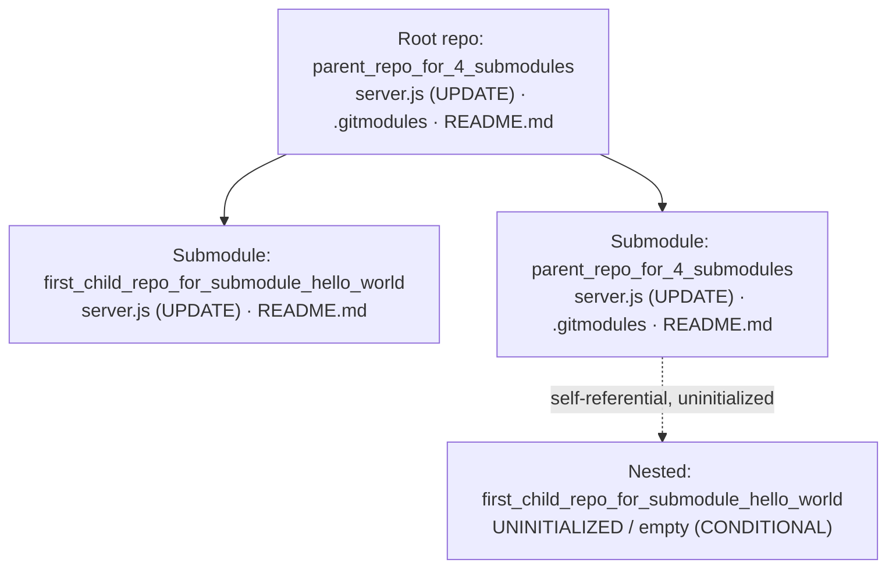

# Technical Specification

# 0. Agent Action Plan

## 0.1 Intent Clarification

This Agent Action Plan is the authoritative interpretation layer between the user's request and the implementation the Blitzy platform will perform. It restates the request in precise technical language, maps every requirement to concrete files and components, and defines exhaustive scope boundaries for a feature addition to an existing Node.js reference server.

### 0.1.1 Core Feature Objective

Based on the prompt, the Blitzy platform understands that the new feature requirement is to introduce the Express.js web framework into an existing minimal Node.js HTTP server and to expose an additional endpoint that returns the response "Good evening", while preserving the server's current "Hello, World!" behavior.

The user's request is preserved verbatim for fidelity:

> User Example: "this is a tutorial of node js server hosting one endpoint that returns the response 'Hello world'. Could you add expressjs into the project and add another endpoint that return the response of 'Good evening'?"
>
> User Example (special instruction): "Go through each submodule, don't skip anything."

Restated with technical precision, the request decomposes into the following discrete objectives:

- Introduce Express.js (`express@5.2.1`, the current latest stable release) as the project's first managed third-party dependency, replacing the Node.js core `http` module currently used to construct the server [server.js:L1].
- Preserve the existing root endpoint so that `GET /` continues to return the existing response. The current code returns the literal `"Hello, World!\n"` [server.js:L9]; the user's phrasing "Hello world" refers to this same existing endpoint, and the current literal is retained to avoid an unintended behavioral change.
- Add a new, distinct endpoint that returns the response `"Good evening"`. The exact path is unspecified by the user; the Blitzy platform adopts `GET /good-evening` as the default, validated in a throwaway proof-of-concept.

Implicit requirements and prerequisites surfaced during analysis:

- **Dependency-management bootstrap.** The repository currently contains no `package.json`, lockfile, or `node_modules/` anywhere (verified absent). Adding Express therefore requires creating a `package.json` and running `npm install`, which generates `node_modules/` and `package-lock.json`. This deliberately departs from the system's documented "zero installation footprint" success criterion and its "Dependency Count = Zero" KPI [1.2 SYSTEM OVERVIEW].
- **Routing layer introduction.** The existing handler returns an identical response for every method and path, performing no inspection of `req.url` or `req.method` [2.1 FEATURE CATALOG, F-002]. Express introduces explicit route dispatch via `app.get(...)` — a capability not present today.
- **Runtime contract preservation.** Host `127.0.0.1` and port `3000` [server.js:L3-L4] and the startup confirmation log line [server.js:L12-L14] are retained so the runtime contract is unchanged.
- **Runtime compatibility.** Express 5.2.1 declares `engines: { node: ">= 18" }`, which is satisfied by the installed Node.js v22.22.2.

### 0.1.2 Special Instructions and Constraints

- **Exhaustive submodule traversal (explicit user directive).** "Go through each submodule, don't skip anything." The repository is both a Hello-World server artifact and a Git-submodule study artifact, containing three byte-identical `server.js` files across three filesystem locations [1.2 SYSTEM OVERVIEW]. The feature must be applied consistently to all three locations (root, `parent_repo_for_4_submodules/`, and `first_child_repo_for_submodule_hello_world/`), and this plan enumerates every file and module without omission. The uninitialized nested submodule `parent_repo_for_4_submodules/first_child_repo_for_submodule_hello_world/` (an empty directory) is explicitly acknowledged and handled.
- **Backward-compatibility consideration.** The native server returns HTTP 200 with `"Hello, World!\n"` for every path, whereas an Express application with explicit routes returns HTTP 404 for unmatched paths (both behaviors confirmed empirically). This narrowing is the expected, idiomatic behavior for a routed application; an optional fallback handler (`app.use(...)`) can restore catch-all behavior if exact parity is required.
- **Response format.** Plain text is retained to match the literal strings supplied by the user, rather than JSON.
- **Architectural reversal note.** The technical specification records that Express, Koa, Fastify, Hapi, and NestJS were previously considered and deliberately rejected in favor of the Node core `http` module [3.3 FRAMEWORKS & LIBRARIES, §3.3.2]. This feature intentionally reverses that decision for Express only; no other framework is introduced.

### 0.1.3 Technical Interpretation

These feature requirements translate to the following technical implementation strategy:

- To add Express.js, we will **create** a `package.json` in each Express-enabled location declaring `"express": "^5.2.1"` and install the dependency, generating `node_modules/` and `package-lock.json`.
- To preserve the existing endpoint, we will **refactor** each `server.js` from the native `http.createServer` handler [server.js:L6-L10] to an Express application and register `app.get('/', ...)` returning `"Hello, World!\n"` with `Content-Type: text/plain`.
- To add the new endpoint, we will register `app.get('/good-evening', ...)` returning `"Good evening"` on each server.
- To honor the submodule directive, we will apply the identical transformation across all three `server.js` files and flag the uninitialized nested submodule for initialization before its edits can be applied.

The following table maps each requirement to its concrete technical action:

| Requirement | Technical Action | Target Component |
|-------------|------------------|------------------|
| Add Express.js dependency | CREATE manifest + install `express@^5.2.1` | `package.json` (×3), generated `node_modules/`, `package-lock.json` |
| Preserve "Hello world" endpoint | UPDATE: migrate `http` handler to `app.get('/')` | `server.js` (×3) |
| Add "Good evening" endpoint | UPDATE: add `app.get('/good-evening')` | `server.js` (×3) |
| "Go through each submodule" | Apply transformation across all locations; flag uninitialized nested submodule | root, `parent_repo_for_4_submodules/`, `first_child_repo_for_submodule_hello_world/` |
| Preserve runtime contract | Reuse `127.0.0.1:3000` + startup log in `app.listen(...)` | `server.js` (×3) [server.js:L3-L4,L12-L14] |

## 0.2 Repository Scope Discovery

This sub-section catalogs every file and module in the repository, the integration points the feature touches, the research performed to select the dependency, and the new files the feature requires.

### 0.2.1 Comprehensive File Analysis

The repository contains ten working-tree entries (excluding `.git` internals) spread across three initialized Git repositories plus one uninitialized nested submodule. All three `server.js` files are byte-identical native-`http` servers. The complete inventory and disposition follows:

| Path | Type | Current State | Disposition |
|------|------|---------------|-------------|
| `./server.js` | Node.js `http` server [server.js:L1-L14] | Returns `200` `text/plain` `"Hello, World!\n"` for every path | **UPDATE** → Express |
| `./.gitmodules` | Git submodule config | Declares 2 submodules to `github.com/lakshya-blitzy` remotes | REFERENCE (unchanged) |
| `./README.md` | Markdown | Title-only `# parent_repo_for_4_submodules` | REFERENCE (optional) |
| `./first_child_repo_for_submodule_hello_world/server.js` | Node.js `http` server | Identical to root | **UPDATE** → Express |
| `./first_child_repo_for_submodule_hello_world/README.md` | Markdown | Title-only | REFERENCE (optional) |
| `./parent_repo_for_4_submodules/server.js` | Node.js `http` server | Identical to root | **UPDATE** → Express |
| `./parent_repo_for_4_submodules/.gitmodules` | Git submodule config | Self-referential (same 2 declarations) | REFERENCE (unchanged) |
| `./parent_repo_for_4_submodules/README.md` | Markdown | Title-only | REFERENCE (optional) |
| `./parent_repo_for_4_submodules/first_child_repo_for_submodule_hello_world/` | Directory | **Empty — uninitialized** nested submodule | CONDITIONAL (init, then UPDATE) |

The submodule topology that the "go through each submodule" directive requires us to traverse is shown below:



**Integration-point discovery.** Because the codebase is intentionally framework-free with no router, controllers, models, middleware, or database [1.2 SYSTEM OVERVIEW; 3.3 FRAMEWORKS & LIBRARIES, §3.3.3], there are no separate route or controller files to modify. Every integration point is contained inside each `server.js`:

- **Request listener** — `http.createServer((req, res) => { ... })` [server.js:L6-L10] is replaced by an Express `app` and route handlers.
- **Host/port binding** — `hostname = '127.0.0.1'` [server.js:L3] and `port = 3000` [server.js:L4] are reused in `app.listen(port, hostname, cb)`.
- **Startup logging** — `console.log(\`Server running at http://${hostname}:${port}/\`)` [server.js:L12-L14] is preserved inside the `app.listen` callback (feature F-003) [2.1 FEATURE CATALOG].
- **Module system** — CommonJS `require('http')` [server.js:L1] gains `const express = require('express')`; the `http` import is dropped once migration is complete.

### 0.2.2 Research Conducted

Dependency selection was verified against the authoritative npm registry (reachable from the build environment); external web search returned no results in this environment, so the registry served as the source of truth:

- **Version selection.** `express` dist-tags resolve to `latest = 5.2.1` and `latest-4 = 4.22.2`. The Blitzy platform selects **`express@5.2.1`** (current latest stable); `4.22.2` is recorded as the latest-v4 fallback.
- **Runtime compatibility.** `express@5.2.1` declares `engines: { node: ">= 18" }`, satisfied by the installed Node.js v22.22.2.
- **License & footprint.** `express@5.2.1` is MIT-licensed with 28 direct dependencies; a clean install resolves to approximately 67 total packages including transitive dependencies (validated in a throwaway proof-of-concept).
- **Behavioral validation.** A proof-of-concept confirmed `GET /` → `"Hello, World!"`, `GET /good-evening` → `"Good evening"`, and `GET /<unknown>` → HTTP 404 on `127.0.0.1:3000`.
- **Content-Type fidelity finding.** Express `res.send(string)` defaults to `Content-Type: text/html; charset=utf-8`, whereas the existing server sets `text/plain` explicitly [server.js:L8]. The implementation must call `res.type('text/plain')` (or equivalent) to preserve the current content-type contract.

### 0.2.3 New File Requirements

The feature introduces dependency management where none previously existed. The following new files are required in **each** of the three Express-enabled locations (root, `parent_repo_for_4_submodules/`, `first_child_repo_for_submodule_hello_world/`):

- **`package.json`** — CREATE. Minimal manifest declaring `"express": "^5.2.1"`, `"main": "server.js"`, and a `"start": "node server.js"` script. Required because npm cannot record a dependency without it.
- **`package-lock.json`** — GENERATED by `npm install`; pins the deterministic dependency tree.
- **`node_modules/`** — GENERATED install tree; not committed to version control.
- **`.gitignore`** — CREATE. A single-line ignore (`node_modules/`) to keep the install tree out of version control (best practice; no `.gitignore` currently exists anywhere).

## 0.3 Dependency Inventory

This feature changes the project's dependency posture from zero managed dependencies to exactly one. All changes are additions; there are no dependency updates or removals because the project previously declared no dependencies [1.2 SYSTEM OVERVIEW].

### 0.3.1 Package Registry

| Package | Registry | Version | License | Purpose |
|---------|----------|---------|---------|---------|
| `express` | npm (`https://registry.npmjs.org/`) | `5.2.1` (declared as `^5.2.1`) | MIT | Web framework providing the routing layer and the new `GET /good-evening` endpoint; replaces the native `http` server construction |

Supporting facts for the selected version:

- **`express@5.2.1`** is the current `latest` dist-tag; `4.22.2` is the `latest-4` fallback.
- Declares `engines: { node: ">= 18" }` — satisfied by the installed Node.js v22.22.2.
- Resolves to 28 direct dependencies (~67 total including transitive dependencies). All transitive packages are pinned by the generated `package-lock.json`.
- No additional packages are required: Express 5 ships built-in `express.json()` / `express.urlencoded()` body parsers, and the two plain-text `GET` routes need neither body parsing nor any logging, validation, or configuration library.

### 0.3.2 Dependency and Reference Updates

**Import updates.** The repository's source files are self-contained — each `server.js` performs a single `require('http')` [server.js:L1] and contains no inter-module imports — so there are no cross-file import paths to rewrite. The only import change is additive:

- Old: `const http = require('http');`
- New: `const express = require('express');`
- Apply to: `**/server.js` (all three locations). The `http` import is removed once the migration to Express is complete.

**External reference updates.** No configuration, build, or CI/CD files exist in the repository to update (no `*.config.*`, `*.json`, `setup.py`, `pyproject.toml`, `.github/workflows/*.yml`, or `.gitlab-ci.yml` were found). Reference changes are limited to the newly created manifest and ignore files:

- `**/package.json` — CREATE (declares the `express` dependency and the `start` script).
- `**/.gitignore` — CREATE (excludes `node_modules/`).
- `**/README.md` — OPTIONAL documentation update to mention the new endpoint; the existing READMEs are title-only [2.1 FEATURE CATALOG, F-006] and a content update is not required by the request.

## 0.4 Integration Analysis

Because the system is intentionally framework-free with no separate routing, controller, model, middleware, or persistence layers [3.3 FRAMEWORKS & LIBRARIES, §3.3.3], every integration point is local to each `server.js`. There are no external modules to wire, no dependency-injection container to register, and no database or schema to migrate.

### 0.4.1 Existing Code Touchpoints

**Direct modifications required (per `server.js`, applied to all three locations).** The native `http` construction is replaced statement-for-statement with its Express equivalent, preserving the host, port, response body, content type, and startup log:

| Native `http` (current) | Locator | Express (target) | Note |
|-------------------------|---------|------------------|------|
| `const http = require('http')` | [server.js:L1] | `const express = require('express')` | Add framework import; drop `http` |
| `http.createServer((req, res) => {...})` | [server.js:L6] | `const app = express()` | Application construction |
| Single fixed handler, no dispatch | [server.js:L6-L9] | `app.get('/', ...)` and `app.get('/good-evening', ...)` | **New routing layer** |
| `res.statusCode = 200` | [server.js:L7] | Implicit `200` (Express default) | No explicit status needed |
| `res.setHeader('Content-Type', 'text/plain')` | [server.js:L8] | `res.type('text/plain')` | **Preserves content-type contract** |
| `res.end('Hello, World!\n')` | [server.js:L9] | `res.send('Hello, World!\n')` | Response body unchanged for `/` |
| `server.listen(port, hostname, cb)` | [server.js:L11] | `app.listen(port, hostname, cb)` | Bind `127.0.0.1:3000` + startup log preserved |

**Dependency injection / service registration.** Not applicable — there is no service container or dependency-wiring module in the repository.

**Database / schema updates.** Not applicable — there is no database, ORM, or migration directory in the repository.

**Git-submodule integration mechanics ("go through each submodule").** Each submodule is an independent Git repository referenced by a gitlink:

- The two top-level submodules — `first_child_repo_for_submodule_hello_world` (initialized at `13a738a`) and `parent_repo_for_4_submodules` (initialized at `28242ca`) — each contain their own `server.js` to be modified. Editing files inside a submodule entails committing within that submodule repository and advancing the parent's gitlink pointer; this is a Git mechanic, not a source-file edit, and the in-scope work is the `server.js` code transformation itself.
- The `.gitmodules` declarations [.gitmodules; parent_repo_for_4_submodules/.gitmodules] are **not modified** — submodule paths and URLs remain unchanged (features F-004 and F-005 are preserved) [2.1 FEATURE CATALOG].
- The nested submodule `parent_repo_for_4_submodules/first_child_repo_for_submodule_hello_world/` is **uninitialized** (an empty directory). It must be populated via `git submodule update --init --recursive` before the same `server.js` transformation can be applied there. It shares its upstream with the top-level `first_child_repo_for_submodule_hello_world` submodule, so the identical change applies once initialized.

## 0.5 Technical Implementation

This sub-section provides the executable, file-by-file plan. Every file listed under CREATE or UPDATE must be created or modified; GENERATED files are produced by `npm install`; REFERENCE files are read for context but not edited.

### 0.5.1 File-by-File Execution Plan

**Group 1 — Core Server Files (UPDATE).** Refactor the native `http` server to an Express application, preserving `GET /` and adding `GET /good-evening`:

- **UPDATE** `./server.js` [server.js:L1-L14]
- **UPDATE** `./first_child_repo_for_submodule_hello_world/server.js`
- **UPDATE** `./parent_repo_for_4_submodules/server.js`

**Group 2 — Dependency Manifests (CREATE / GENERATED).** One manifest per Express-enabled location; lockfile and install tree are produced by `npm install`:

- **CREATE** `./package.json`, `./first_child_repo_for_submodule_hello_world/package.json`, `./parent_repo_for_4_submodules/package.json`
- **GENERATED** `package-lock.json` and `node_modules/` in each of the three locations

**Group 3 — Supporting Files (CREATE).**

- **CREATE** `./.gitignore`, `./first_child_repo_for_submodule_hello_world/.gitignore`, `./parent_repo_for_4_submodules/.gitignore` (each containing `node_modules/`)

**Group 4 — Conditional and Reference.**

- **CONDITIONAL UPDATE** `./parent_repo_for_4_submodules/first_child_repo_for_submodule_hello_world/server.js` — requires `git submodule update --init --recursive` first (currently an empty, uninitialized submodule)
- **REFERENCE (no edit)** `./.gitmodules`, `./parent_repo_for_4_submodules/.gitmodules`, and the three `README.md` files (READMEs are an optional documentation update only)

### 0.5.2 Implementation Approach per File

**`server.js` (each location).** Replace the `http.createServer` block with an Express application while retaining `hostname = '127.0.0.1'` and `port = 3000`. Register the two routes, using `res.type('text/plain')` to preserve the existing content-type contract [server.js:L8], and keep the startup log inside the `app.listen` callback [server.js:L12-L14]. The two route handlers are the essence of the change:

```javascript
app.get('/', (req, res) => res.type('text/plain').send('Hello, World!\n'));
app.get('/good-evening', (req, res) => res.type('text/plain').send('Good evening\n'));
```

**`package.json` (each location).** A minimal manifest declaring the dependency and a start script:

```json
{ "name": "hello-world-express", "version": "1.0.0", "main": "server.js",
  "scripts": { "start": "node server.js" }, "dependencies": { "express": "^5.2.1" } }
```

**`.gitignore` (each location).** A single ignore rule so the generated install tree is not committed:

```text
node_modules/
```

**Establishment order.** Within each location: create `package.json`, run `npm install` (generating `node_modules/` and `package-lock.json`), refactor `server.js`, add `.gitignore`, then verify with `node server.js` and `curl`.

### 0.5.3 User Interface and Design System Applicability

User Interface Design is **not applicable**: the deliverable is a backend HTTP server that returns plain-text responses with no rendered views, frontend, or client. The Design System Compliance protocol is likewise **not applicable** — no component library or design system is specified in the request, none is present in the repository (the specification confirms the absence of any UI or supporting libraries) [3.3 FRAMEWORKS & LIBRARIES, §3.3.3], and no Figma attachments were provided. No files reference any Figma URLs.

## 0.6 Scope Boundaries

The boundaries below make the feature's reach unambiguous. Trailing wildcards denote that the pattern applies to every matching location across the root repository and its submodules.

### 0.6.1 Exhaustively In Scope

- **Core servers:** `**/server.js` — explicitly `./server.js`, `./first_child_repo_for_submodule_hello_world/server.js`, and `./parent_repo_for_4_submodules/server.js` (UPDATE: migrate to Express, preserve `GET /`, add `GET /good-evening`).
- **Dependency manifests:** `**/package.json` — one CREATE per Express-enabled location declaring `express@^5.2.1`.
- **Lockfiles:** `**/package-lock.json` — GENERATED by `npm install`.
- **Install trees:** `**/node_modules/**` — GENERATED; excluded from version control.
- **Ignore files:** `**/.gitignore` — CREATE (`node_modules/`).
- **Conditional:** `./parent_repo_for_4_submodules/first_child_repo_for_submodule_hello_world/server.js` — in scope contingent on initializing the nested submodule (`git submodule update --init --recursive`).

### 0.6.2 Explicitly Out of Scope

- **`.gitmodules` edits** — submodule paths and URLs are unchanged; these files are REFERENCE only (features F-004/F-005 preserved) [2.1 FEATURE CATALOG].
- **README content rewrites** — the title-only READMEs may optionally gain an endpoint note, but no content rewrite is required.
- **Automated test suites / test frameworks** — not requested, and no test harness exists in the repository; validation is performed via runtime `curl` checks rather than introducing a test framework.
- **Port/host configurability** — the documented hardcoded-port limitation [1.2 SYSTEM OVERVIEW] is retained; no environment-variable, CLI, or config-loader support is added.
- **Additional frameworks or libraries** — no middleware, body parser, logger, validation library, dependency-injection container, or database is introduced beyond Express itself [3.3 FRAMEWORKS & LIBRARIES, §3.3.3].
- **HTTPS/TLS, authentication, graceful shutdown and signal handlers, structured logging, metrics, and tracing** — all beyond the feature request.
- **CI/CD pipelines, Dockerfiles, and deployment infrastructure** — none exist and none are added.
- **Refactoring unrelated to the `http` → Express migration.**

### 0.6.3 Implementation Validation Criteria

The implementation is complete and correct when, in each in-scope location:

- `npm install` succeeds and `express@5.2.1` is present under `node_modules/`, with `package.json` declaring `"express": "^5.2.1"`.
- `node server.js` starts and logs `Server running at http://127.0.0.1:3000/` [server.js:L12-L14].
- `GET http://127.0.0.1:3000/` returns HTTP `200` with body `"Hello, World!\n"` and `Content-Type: text/plain` [server.js:L8-L9].
- `GET http://127.0.0.1:3000/good-evening` returns HTTP `200` with body `"Good evening"`.
- The above behavior is reproduced across all three `server.js` locations, satisfying the "go through each submodule" directive.

## 0.7 Rules for Feature Addition

No formal user-specified implementation rules were supplied (the project's rules list is empty and no setup instructions were attached). The following feature-specific rules are therefore derived from the user's prompt and the repository's established conventions, and govern downstream code generation:

- **Exhaustive submodule coverage (explicit user directive).** Apply the Express migration and the new endpoint to every `server.js` location without skipping any — root, `parent_repo_for_4_submodules/`, and `first_child_repo_for_submodule_hello_world/` — and explicitly account for the uninitialized nested submodule.
- **Preserve existing behavior and runtime contract.** `GET /` must continue to return `"Hello, World!\n"` [server.js:L9]; the server must continue to bind `127.0.0.1:3000` [server.js:L3-L4] and emit the same startup log line [server.js:L12-L14].
- **Maintain content-type fidelity.** Responses must remain `text/plain` [server.js:L8]; because Express `res.send(string)` defaults to `text/html`, use `res.type('text/plain')` (or equivalent) explicitly.
- **Respect existing code conventions.** Retain the CommonJS module system (`require(...)`, not ES modules) and the existing variable naming (`hostname`, `port`) and code style observed in `server.js`.
- **Plain-text responses, not JSON.** Match the literal strings supplied by the user (`"Hello, World!\n"` and `"Good evening"`).
- **Pin the dependency precisely.** Use `express@5.2.1` (current latest stable), declared as `"express": "^5.2.1"`; do not substitute placeholder versions.
- **Introduce no unrequested dependencies.** Express is the only package added; no middleware, logger, validation, or configuration library is introduced [3.3 FRAMEWORKS & LIBRARIES, §3.3.3].
- **Acknowledge the backward-compatibility delta.** Routed Express returns HTTP 404 for unmatched paths (versus the native catch-all 200); treat this as the expected behavior and add a fallback handler only if exact parity is explicitly required.

## 0.8 Attachments

No attachments were provided with this request. The `review_attachments` check returned "No attachments found for this project."

- **File attachments:** None. No PDFs, images, documents, or code files were supplied as references or instructions.
- **Figma frames:** None. No Figma URLs, frames, or design files were provided; consequently there is no design analysis, token manifest, or design-to-system mapping for this feature.

The sole authoritative input for this Agent Action Plan is the user's natural-language prompt, restated and analyzed in the preceding sub-sections.

