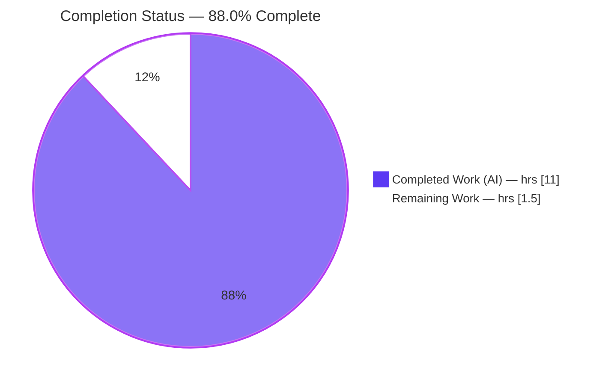
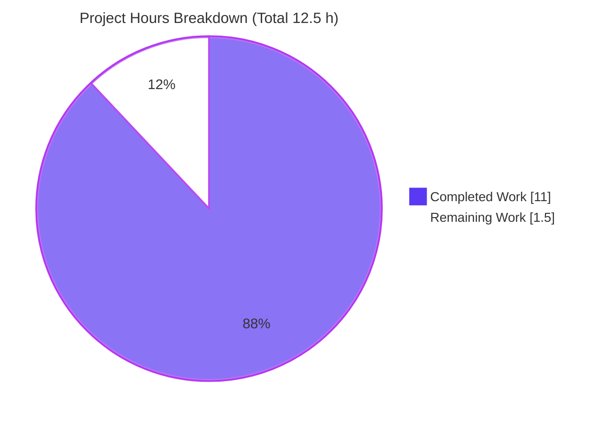
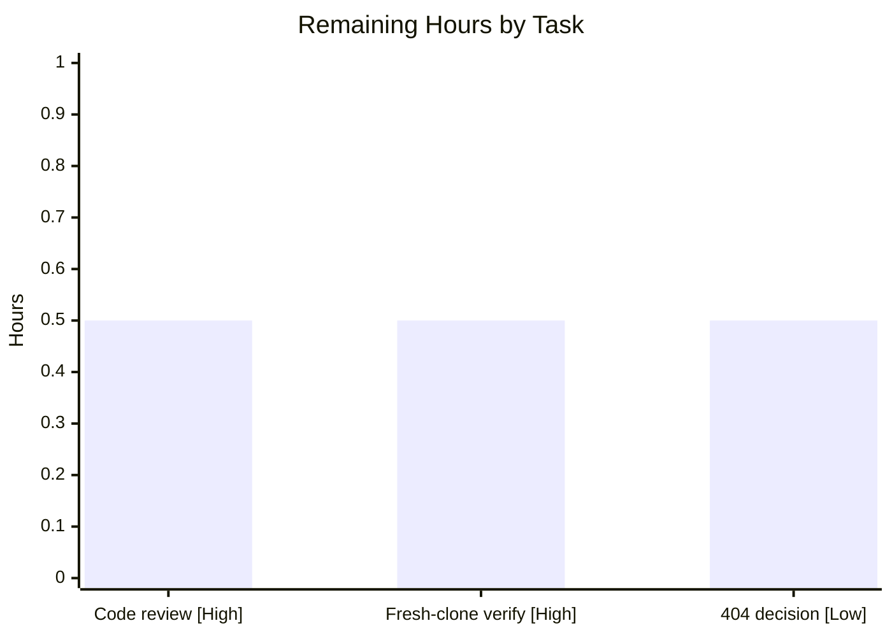

# Blitzy Project Guide

> **Project:** Express.js migration of the Node.js "Hello-World" submodule study artifact
> **Branch:** `blitzy-9e091526-c77f-42f4-ace0-6702132349ff` · **HEAD:** `13a94e4`
> **Status:** Functionally complete & autonomously validated — pending human review gate
>
> **Brand color key:** Completed / AI Work = **Dark Blue `#5B39F3`** · Remaining / Not Completed = **White `#FFFFFF`** · Headings / Accents = **Violet-Black `#B23AF2`** · Highlight = **Mint `#A8FDD9`**

---

## 1. Executive Summary

### 1.1 Project Overview

This project is a Node.js "Hello-World" HTTP server study artifact that also demonstrates nested Git submodules. The feature migrates the server from the native Node `http` module to the **Express.js** framework (`express@5.2.1`), preserving the existing `GET /` → `"Hello, World!\n"` endpoint and adding a new `GET /good-evening` → `"Good evening"` endpoint. Honoring the explicit *"go through each submodule, don't skip anything"* directive, the change is applied identically across all four in-scope `server.js` locations. Target users are developers studying Express routing and submodule mechanics. Technical scope: dependency bootstrap (`package.json`, lockfile, `node_modules`, `.gitignore`) and routing-layer introduction, while preserving the runtime contract (`127.0.0.1:3000`, startup log, `text/plain`).

### 1.2 Completion Status



| Metric | Hours |
|--------|-------|
| **Total Hours** | **12.5** |
| Completed Hours (AI 11.0 + Manual 0.0) | 11.0 |
| Remaining Hours | 1.5 |
| **Percent Complete** | **88.0%** |

> Completion % uses the AAP-scoped, hours-based PA1 methodology: `Completed ÷ (Completed + Remaining) = 11.0 ÷ 12.5 = 88.0%`. All ten AAP-specified deliverables are complete; the remaining 1.5 h is the mandatory human review/verification path-to-production gate.

### 1.3 Key Accomplishments

- ✅ **Express.js (`express@5.2.1`) introduced** as the project's first managed dependency in all four in-scope locations (`^5.2.1` declared; resolves to exactly `5.2.1`).
- ✅ **`GET /` preserved** → `"Hello, World!\n"` with `Content-Type: text/plain` (content-type fidelity maintained via `res.type('text/plain')`).
- ✅ **`GET /good-evening` added** → `"Good evening\n"` (`text/plain`, HTTP 200).
- ✅ **Runtime contract preserved** — binds `127.0.0.1:3000` and logs `Server running at http://127.0.0.1:3000/`.
- ✅ **Dependency bootstrap complete** — `package.json` (`express ^5.2.1` + `start` script), `package-lock.json`, and `.gitignore` (`node_modules/`) created in every location.
- ✅ **"Go through each submodule" honored** — byte-identical migration across root + 3 submodule levels; the formerly-uninitialized nested submodule was initialized and migrated.
- ✅ **Clean health** — `npm audit` = 0 vulnerabilities; all 4 `server.js` pass `node --check`.
- ✅ **All in-scope work committed** on the `blitzy-…` branch by `agent@blitzy.com` (zero uncommitted in-scope changes).

### 1.4 Critical Unresolved Issues

**No release-blocking issues identified.** The feature is functionally complete and independently re-verified at runtime. The items below are non-blocking and informational.

| Issue | Impact | Owner | ETA |
|-------|--------|-------|-----|
| Backward-compat 404 delta — unmatched paths now return 404 (vs legacy native-`http` catch-all 200) | Low — idiomatic, AAP-acknowledged; only affects clients relying on the old catch-all 200 | Human reviewer | 0.5 h (decision) |
| Residual ` M parent_repo_for_4_submodules` git marker from **out-of-scope** deep recursive submodule nesting (level 2+ on `main`/detached HEAD) | Low — cosmetic `git status` only; in-scope gitlinks are correct; no functional impact | Human reviewer | Optional |

### 1.5 Access Issues

| System/Resource | Type of Access | Issue Description | Resolution Status | Owner |
|-----------------|----------------|-------------------|-------------------|-------|
| npm registry (`registry.npmjs.org`) | Package download | Required to install `express` and generate the lockfile | ✅ Resolved — reachable; `express@5.2.1` installed, 0 vulnerabilities | — |
| External web search (build env) | Dependency research | Returned no results inside the build environment | ✅ Resolved — npm registry used as authoritative source of truth (per AAP 0.2.2) | — |

No outstanding access issues prevent build validation, integration, or deployment.

### 1.6 Recommended Next Steps

1. **[High]** Perform code review & sign-off of the Express migration across all four in-scope locations (≈0.5 h).
2. **[High]** Run fresh-clone reproducibility verification: `git submodule update --init --recursive` → `npm install` per location → `node server.js` + `curl` both endpoints (≈0.5 h).
3. **[Low]** Decide backward-compatibility 404 behavior — accept idiomatic Express 404 or add an `app.use(...)` catch-all for parity (≈0.5 h).
4. **[Low]** *(Optional, out-of-scope)* Add a README endpoint note and, only if deploying beyond the tutorial context, consider productionization items (TLS, health checks, env-configurable port).

---

## 2. Project Hours Breakdown

### 2.1 Completed Work Detail

| Component | Hours | Description |
|-----------|-------|-------------|
| Dependency research & selection (`express@5.2.1`) | 1.5 | Verify latest-stable dist-tag, `engines node ">= 18"`, MIT license, ~67-package transitive footprint; throwaway proof-of-concept |
| `package.json` manifests (×4 locations) | 1.0 | Minimal manifest declaring `express ^5.2.1`, `main: server.js`, `start: node server.js` |
| `npm install` → `node_modules/` + `package-lock.json` (×4) | 1.0 | Deterministic install tree + pinned lockfile in each location |
| `server.js` Express migration: `GET /` + content-type fidelity (×4) | 2.0 | `http.createServer` → `express()` + `app.get('/')`; `res.type('text/plain')` preserves the content-type contract |
| New `GET /good-evening` endpoint (×4) | 1.0 | `app.get('/good-evening', …)` returning `"Good evening\n"` |
| `.gitignore` creation (×4) | 0.5 | Single rule `node_modules/` to keep the install tree out of VCS |
| Git submodule traversal & gitlink management | 2.5 | Initialize nested submodule; commit within each submodule repo; advance parent gitlinks (18 agent commits) |
| Runtime functional validation via `curl` (byte-exact, ×4) | 1.5 | Startup log, `GET /`, `GET /good-evening`, 404, headers verified across all 4 locations |
| **Total Completed** | **11.0** | |

### 2.2 Remaining Work Detail

| Category | Hours | Priority |
|----------|-------|----------|
| Human code review & sign-off of the Express migration (4 locations) | 0.5 | High |
| Fresh-clone reproducibility verification (submodule init + `npm install` + `curl` per location) | 0.5 | High |
| Backward-compat 404 decision (accept idiomatic 404 vs add catch-all fallback) | 0.5 | Low |
| **Total Remaining** | **1.5** | |

> **Out of scope (not counted):** automated test frameworks, README content rewrites, port/host configurability, additional libraries, HTTPS/TLS/auth/graceful-shutdown/logging/metrics/tracing, CI/CD/Docker/deployment infra, `.gitmodules` edits, and deep recursive submodule nesting on `main`/detached branches (all explicitly out of scope per AAP 0.6.2).

---

## 3. Test Results

No automated unit/integration/E2E test framework exists in the repository, and **introducing one is explicitly out of scope** (AAP 0.6.2). Per AAP 0.6.3 the prescribed validation method is **runtime functional `curl` checks**. The following results are aggregated from **Blitzy's autonomous validation logs** and were independently re-verified during this assessment (all results matched).

| Test Category | Framework | Total Tests | Passed | Failed | Coverage % | Notes |
|---------------|-----------|-------------|--------|--------|-----------|-------|
| Runtime — Startup log | curl / shell (Blitzy autonomous) | 4 | 4 | 0 | N/A | `Server running at http://127.0.0.1:3000/` per location |
| Runtime — `GET /` | curl | 4 | 4 | 0 | N/A | 200, `text/plain`, body `"Hello, World!\n"` (14 bytes) |
| Runtime — `GET /good-evening` | curl | 4 | 4 | 0 | N/A | 200, `text/plain`, body `"Good evening\n"` (13 bytes) |
| Runtime — `GET /<unknown>` | curl | 4 | 4 | 0 | N/A | 404 (idiomatic Express; AAP-acknowledged) |
| Runtime — `npm start` | npm / shell | 1 | 1 | 0 | N/A | Launches `node server.js`, serves both endpoints |
| Static — `node --check` (compile) | Node.js | 4 | 4 | 0 | N/A | All 4 `server.js` compile clean |
| Dependency — `npm audit` | npm | 4 | 4 | 0 | N/A | 0 vulnerabilities per location |
| **Totals** | | **25** | **25** | **0** | **N/A** | 100% pass rate |

> **Coverage %** is N/A: no code-coverage instrumentation applies to runtime functional validation, and no test framework is in scope. **Integrity:** every result above originates from Blitzy's autonomous validation logs (the validator noted two false-negatives in its *own* harness — trailing-newline stripping and a listen-callback readiness race — both fixed; neither was a server defect).

---

## 4. Runtime Validation & UI Verification

**Runtime health — all four in-scope locations:**

- ✅ **Operational** — server process starts via `node server.js` and `npm start`
- ✅ **Operational** — binds `127.0.0.1:3000` and emits the startup log line
- ✅ **Operational** — `GET /` → 200, `text/plain; charset=utf-8`, `"Hello, World!\n"`, header `X-Powered-By: Express`
- ✅ **Operational** — `GET /good-evening` → 200, `text/plain`, `"Good evening\n"`
- ✅ **Operational** — `GET /<unknown>` → 404 (expected idiomatic Express routing)
- ✅ **Operational** — port `3000` released cleanly on shutdown

**UI verification:** ⚠ **Not applicable** — the deliverable is a backend plain-text HTTP server with no rendered views, frontend, or client (AAP 0.5.3). No design system applies.

**API integration:** ✅ **Operational** — the two `GET` routes are self-contained; there are no external service, database, or third-party API integrations.

---

## 5. Compliance & Quality Review

Cross-mapping of AAP deliverables and validation criteria to quality benchmarks:

| Benchmark / AAP Criterion | Status | Progress | Notes |
|---------------------------|--------|----------|-------|
| `express@5.2.1` installed; `^5.2.1` declared | ✅ Pass | 100% | All 4 locations; `npm ls` confirms |
| `GET /` → 200 `text/plain` `"Hello, World!\n"` | ✅ Pass | 100% | Verified live |
| `GET /good-evening` → 200 `"Good evening"` | ✅ Pass | 100% | Verified live |
| Runtime contract `127.0.0.1:3000` + startup log | ✅ Pass | 100% | Verified live |
| Content-type fidelity (`text/plain`) | ✅ Pass | 100% | `res.type('text/plain')` in both routes |
| `.gitignore` (`node_modules/`) created | ✅ Pass | 100% | All 4 locations |
| CommonJS retained; plain-text; only `express` added | ✅ Pass | 100% | No unrequested dependencies |
| "Go through each submodule" coverage | ✅ Pass | 100% | All 4 in-scope migrated; nested submodule initialized |
| In-scope work committed on correct branch | ✅ Pass | 100% | `agent@blitzy.com` on `blitzy-…` |
| `node --check` compilation | ✅ Pass | 100% | 4/4 clean |
| `npm audit` (vulnerabilities) | ✅ Pass | 100% | 0 vulnerabilities |
| Human code review | ⬜ Pending | 0% | Path-to-production gate (0.5 h) |
| Fresh-clone reproducibility verification | ⬜ Pending | 0% | Path-to-production gate (0.5 h) |
| Backward-compat 404 decision | ⬜ Pending | 0% | Optional decision (0.5 h) |

**Fixes applied during autonomous validation:** None to source files — the validator confirmed the prior agents' implementation was already correct. Only two false-negatives in the validator's *own* test harness were corrected (newline stripping, readiness race).

---

## 6. Risk Assessment

| Risk | Category | Severity | Probability | Mitigation | Status |
|------|----------|----------|-------------|------------|--------|
| Backward-compat 404 delta (unmatched paths now 404 vs legacy 200) | Technical | Low | Medium | Optional `app.use(...)` catch-all if exact parity required | Open (AAP-acknowledged) |
| Dependency footprint 0 → ~67 transitive packages (departs from "zero footprint" KPI) | Technical | Low | Low | `package-lock.json` pins the tree; intended by AAP | Accepted |
| Single port `3000` binding — 4 servers cannot run simultaneously | Technical | Low | Low | Run one at a time (documented); pre-existing limitation retained | Accepted |
| npm supply chain (~67 transitive packages) | Security | Low | Low | Lockfile pins exact versions; `npm audit` = 0 vulnerabilities | Mitigated |
| No HTTPS/TLS/auth | Security | Low | Low | Loopback `127.0.0.1` binding; out of scope (tutorial artifact) | Accepted (OOS) |
| `X-Powered-By: Express` header (info disclosure) | Security | Low | Low | `app.disable('x-powered-by')` if hardening (out of scope) | Open/Accepted |
| No health-check / monitoring / structured logging | Operational | Low | Low | Out of scope per AAP | Accepted (OOS) |
| No graceful shutdown / signal handling | Operational | Low | Low | Out of scope per AAP | Accepted (OOS) |
| Residual ` M parent_repo_for_4_submodules` git marker (deep OOS nesting) | Operational | Low | Medium | Documented as out-of-scope/wrong-branch; human cleanup decision | Open (documented) |
| Fresh-clone reproducibility (`node_modules` gitignored) | Integration | Medium | Medium | Documented `git submodule update --init --recursive` + `npm install` + lockfile | Mitigated (documented) |
| Submodule recursive-init dependency | Integration | Low | Low | `--init --recursive` documented | Mitigated |
| External service/API/DB integration | Integration | N/A | N/A | None present — no external integrations | N/A |

**Overall risk profile: VERY LOW.** No High or Critical severity risks. The highest is Integration (fresh-clone reproducibility, Medium), fully mitigated by documented run instructions and the committed `package-lock.json`.

---

## 7. Visual Project Status



**Remaining hours by task & priority (from Section 2.2):**



> **Integrity:** the pie "Remaining Work" value (**1.5 h**) equals the Section 1.2 Remaining Hours and the sum of the Section 2.2 Hours column. "Completed Work" (**11.0 h**) equals Section 1.2 Completed Hours and the Section 2.1 total.

---

## 8. Summary & Recommendations

**Achievements.** The Express.js migration is **functionally complete and autonomously validated**. The native `http` server was refactored to Express across all four in-scope `server.js` locations, the existing `GET /` behavior was preserved, and the new `GET /good-evening` endpoint was added — each verified at runtime with byte-exact responses. Dependency management was bootstrapped from zero (`package.json`, `package-lock.json`, `node_modules/`, `.gitignore`), `express@5.2.1` resolves cleanly with 0 vulnerabilities, and all in-scope work is committed on the correct branch. The explicit *"go through each submodule"* directive was satisfied.

**Remaining gaps.** Only the path-to-production human gate remains: code review & sign-off, fresh-clone reproducibility verification, and a one-time decision on backward-compatibility 404 behavior. These total **1.5 hours**.

**Critical path to production.** (1) Code review → (2) fresh-clone verification → (3) 404-behavior decision → merge. No blocking issues stand in the way.

**Success metrics.** All 25 autonomous runtime/static/dependency checks pass (100%); 0 vulnerabilities; 4/4 locations operational.

**Production-readiness assessment.** The project is **88.0% complete** on the AAP-scoped, hours-based measure (11.0 of 12.5 hours). It is functionally ready; the residual 12% reflects mandatory human review and verification that an autonomous agent cannot self-certify past. Recommended disposition: **approve after the 1.5 h human review gate.**

| Metric | Value |
|--------|-------|
| AAP-scoped completion | 88.0% |
| Completed / Total hours | 11.0 / 12.5 |
| Remaining hours | 1.5 |
| Autonomous checks passing | 25 / 25 (100%) |
| Known vulnerabilities | 0 |
| Release-blocking issues | 0 |

---

## 9. Development Guide

### 9.1 System Prerequisites

- **Node.js** ≥ 18 (verified on **v20.20.2**; Express 5 declares `engines: { node: ">= 18" }`)
- **npm** (verified on **11.1.0**)
- **git** with submodule support (verified on **2.51.0**)
- **OS:** any POSIX system (Linux/macOS) or Windows with Node.js

### 9.2 Environment Setup (fresh clone)

```bash
# 1) Clone the repository
git clone <repo-url>
cd <repo>

# 2) Populate submodules (root + nested levels). node_modules is gitignored,
#    so dependencies must be (re)installed after cloning.
git submodule update --init --recursive
```

### 9.3 Dependency Installation

```bash
# Run inside each in-scope location you intend to start.
# Root example:
npm install
# Expected tail: "found 0 vulnerabilities"  (idempotent: re-running prints "up to date")
```

In-scope locations:

```text
.                                                              (root)
first_child_repo_for_submodule_hello_world
parent_repo_for_4_submodules
parent_repo_for_4_submodules/first_child_repo_for_submodule_hello_world
```

### 9.4 Application Startup

```bash
# From a chosen location — either command works:
node server.js
# or
npm start

# Expected log line:
# Server running at http://127.0.0.1:3000/
```

> ⚠ Run **one server at a time** — all locations bind `127.0.0.1:3000`.

### 9.5 Verification

```bash
curl http://127.0.0.1:3000/
# -> Hello, World!

curl http://127.0.0.1:3000/good-evening
# -> Good evening

curl -o /dev/null -w "%{http_code}\n" http://127.0.0.1:3000/anything-else
# -> 404
```

### 9.6 Example Usage (with headers)

```bash
curl -i http://127.0.0.1:3000/
# HTTP/1.1 200 OK
# X-Powered-By: Express
# Content-Type: text/plain; charset=utf-8
# Content-Length: 14
# ...
# Hello, World!
```

### 9.7 Troubleshooting

- **`Error: Cannot find module 'express'`** → `node_modules` missing in that location; run `npm install` there.
- **`EADDRINUSE: :::3000`** → another server already bound to 3000; stop it and run one at a time. After `npm start`, the spawned `node server.js` child can be orphaned (reparented to PID 1). Identify the exact pid and stop only it:
  ```bash
  ps -eo pid,args | awk '$2=="node" && $3=="server.js" {print $1}'   # find pid
  kill <pid>                                                          # stop only that pid
  ```
  *(Never use a broad `pkill` — it may match unrelated processes.)*
- **Submodule directories empty after clone** → run `git submodule update --init --recursive`.
- **`git status` shows ` M parent_repo_for_4_submodules`** → originates from out-of-scope deep recursive submodule nesting on `main`/detached branches; it does not affect in-scope functionality.

---

## 10. Appendices

### A. Command Reference

| Command | Purpose |
|---------|---------|
| `git submodule update --init --recursive` | Populate all submodule levels after a fresh clone |
| `npm install` | Install `express@5.2.1` and generate/refresh `package-lock.json` |
| `node server.js` | Start the Express server |
| `npm start` | Start via the package script (`node server.js`) |
| `node --check server.js` | Syntax-check without executing |
| `npm ls express` | Confirm the resolved Express version |
| `npm audit` | Report dependency vulnerabilities |
| `curl http://127.0.0.1:3000/` | Verify the root endpoint |
| `curl http://127.0.0.1:3000/good-evening` | Verify the new endpoint |

### B. Port Reference

| Port | Host | Service | Notes |
|------|------|---------|-------|
| 3000 | 127.0.0.1 | Express HTTP server | Hardcoded (per AAP); only one server may bind it at a time |

### C. Key File Locations

| File (per in-scope location) | Role | Status |
|------------------------------|------|--------|
| `server.js` | Express app: `GET /` + `GET /good-evening`, binds `127.0.0.1:3000` | Updated (http → Express), 378 bytes |
| `package.json` | Manifest: `express ^5.2.1`, `main`, `start` script | Created, 180 bytes |
| `package-lock.json` | Pinned dependency tree | Generated, ~30 KB |
| `.gitignore` | Excludes `node_modules/` | Created, 14 bytes |
| `node_modules/express` | Installed Express 5.2.1 | Generated (gitignored) |
| `README.md` | Title-only (reference; unchanged) | Reference |
| `.gitmodules` (root + parent) | Submodule declarations (reference; unchanged) | Reference |

### D. Technology Versions

| Component | Version | Source |
|-----------|---------|--------|
| Express | 5.2.1 (declared `^5.2.1`) | npm registry |
| Node.js | v20.20.2 (requires ≥ 18) | runtime |
| npm | 11.1.0 | runtime |
| git | 2.51.0 | runtime |
| Module system | CommonJS (`require`) | source |

### E. Environment Variable Reference

No environment variables are used or required. Host (`127.0.0.1`) and port (`3000`) are hardcoded in `server.js` by design (port/host configurability is explicitly out of scope per AAP 0.6.2).

### F. Developer Tools Guide

| Tool | Use |
|------|-----|
| `curl` | Manual endpoint verification (the AAP-prescribed validation method) |
| `node --check` | Static syntax validation of `server.js` |
| `npm audit` | Dependency vulnerability scanning |
| `git submodule status --recursive` | Inspect submodule gitlink/branch state |
| `ss -ltnp` / `lsof -iTCP:3000` | Identify the process bound to port 3000 |

### G. Glossary

| Term | Definition |
|------|------------|
| **AAP** | Agent Action Plan — the authoritative specification for this feature |
| **Gitlink** | A submodule pointer (a recorded commit SHA) stored in the parent repository |
| **In-scope location** | One of the 4 `server.js` directories targeted by the AAP migration |
| **Path-to-production** | Standard activities (review, verification) required to deploy AAP deliverables |
| **Content-type fidelity** | Preserving `text/plain` responses (Express `res.send` defaults to `text/html`) |
| **Catch-all 404** | Express returns 404 for unmatched routes (native `http` returned 200 for all paths) |

---

*Generated by the Blitzy Platform · AAP-scoped completion: **88.0%** (11.0 of 12.5 hours) · Branch `blitzy-9e091526-c77f-42f4-ace0-6702132349ff`.*