# Technical Specification

# 1. Introduction

## 1.1 EXECUTIVE SUMMARY

### 1.1.1 Project Overview

This project consists of a minimal Node.js HTTP server distributed across a parent Git repository and two Git submodules. The codebase comprises eight non-Git files in total, organized as three byte-identical Hello World HTTP server implementations linked together via Git submodule declarations. The system uses only the Node.js standard library—specifically the built-in `http` module—and carries zero third-party dependencies, no `package.json` manifest, and no `node_modules` directory.

The repository is structured as a demonstrative artifact illustrating two foundational concepts in tandem:

1. **Node.js HTTP Server Fundamentals** — Construction of an HTTP listener using the core `http` module with a single request handler.
2. **Git Submodule Composition** — Inclusion of external code via Git submodules rather than package management tooling, including a self-referential submodule topology where a parent submodule's `.gitmodules` file recursively declares the same submodule set as its containing repository.

### 1.1.2 Core Problem Statement

The system addresses two pedagogical and reference-implementation concerns rather than a commercial business problem:

| Concern | Description |
|---------|-------------|
| HTTP Server Bootstrap | Demonstrate the minimum viable Node.js code required to bind a TCP listener, accept HTTP connections, and return a deterministic plain-text response without external frameworks |
| Submodule Topology | Demonstrate how Git submodules link multiple repositories into a composite workspace, including the behavior of recursively declared submodule references |

The repository contains no business domain logic, no user-facing application, no persistence layer, and no commercial product context. The README files at all three locations consist solely of a single H1 heading bearing the repository's name, providing no descriptive narrative.

### 1.1.3 Key Stakeholders and Users

Because the artifact lacks commercial domain framing, stakeholders are inferred from the technical character of the codebase:

| Stakeholder Category | Primary Interest | Engagement Mode |
|----------------------|------------------|-----------------|
| Repository Author (`lakshya-blitzy`) | Maintenance of demonstration code across linked GitHub repositories | Direct authorship and submodule orchestration |
| Developers Learning Node.js | Understanding the minimal HTTP server pattern using only standard library APIs | Read source, execute locally, observe response |
| Developers Learning Git Submodules | Understanding submodule declarations, gitfile linkage, and recursive submodule patterns | Clone with `--recurse-submodules`, inspect `.gitmodules` topology |
| Tooling/Automation Systems | Validation of build and clone workflows against multi-repository submodule layouts | Automated cloning and discovery |

### 1.1.4 Value Proposition

The value delivered by this repository is instructional and architectural rather than transactional:

- **Bare-minimum reference implementation** of a Node.js HTTP server that can be executed without any installation step beyond having Node.js available on the host machine.
- **Concrete example of Git submodule mechanics**, including the linkage between a containing repository and its dependent repositories via the `.gitmodules` configuration file and gitfile pointers under `.git/modules/`.
- **Zero-dependency footprint**, eliminating supply-chain considerations, lockfile management, and package registry interactions during study or demonstration.

---

## 1.2 SYSTEM OVERVIEW

### 1.2.1 Project Context

#### 1.2.1.1 Technical Context and Positioning

The system occupies the position of a "Hello World" reference artifact within the Node.js ecosystem. It deliberately avoids the architectural complexity introduced by HTTP frameworks (such as Express, Koa, Fastify, Hapi, or NestJS), routing libraries, middleware pipelines, configuration loaders, and dependency injection containers. Instead, it relies exclusively on the Node.js core `http` module to demonstrate the smallest possible end-to-end HTTP request/response cycle.

In parallel, the system positions itself as a study artifact for Git's submodule feature. The repository owner `lakshya-blitzy` maintains the submodule remotes on GitHub, and the local checkout reproduces a tree where the parent repository and its submodules contain byte-identical `server.js` content.

#### 1.2.1.2 Current System Limitations

The repository is a self-contained demonstration and is not replacing or upgrading a prior system. Operational limitations inherent to the current implementation include:

| Limitation | Detail |
|------------|--------|
| Network Reach | The listener binds to `127.0.0.1` (loopback) only; external hosts cannot reach the server without code modification |
| Port Configurability | The port `3000` is hardcoded as a constant; there is no environment variable, CLI flag, or configuration file override |
| Request Handling | All requests receive the same response regardless of method, path, headers, or body; no routing or dispatch exists |
| Error Resilience | The server has no error handlers, no signal handlers, and no graceful shutdown path |
| Observability | The only log line emitted is the startup confirmation `Server running at http://127.0.0.1:3000/`; there are no request logs, metrics, or tracing |

#### 1.2.1.3 Integration with Existing Enterprise Landscape

The repository does not integrate with any enterprise systems. There are no database connectors, message brokers, authentication providers, external HTTP clients, configuration services, secret stores, or telemetry backends declared in source or configuration. The only external integration points are:

- **GitHub** (`github.com/lakshya-blitzy`) for hosting the submodule remote repositories declared in `.gitmodules`.
- **The host operating system's TCP stack**, used implicitly by Node.js when binding to port 3000.

### 1.2.2 High-Level Description

#### 1.2.2.1 Primary System Capabilities

The deployable behavior of the system is intentionally minimal and fully enumerated by the contents of `server.js`:

| Capability | Behavior |
|------------|----------|
| TCP Listener | Binds to `127.0.0.1:3000` using the Node.js `http.createServer` API |
| HTTP Response | Returns HTTP `200 OK` with `Content-Type: text/plain` and the body `Hello, World!\n` for every request |
| Startup Logging | Writes `Server running at http://127.0.0.1:3000/` to standard output after `listen()` succeeds |

#### 1.2.2.2 Major System Components

The repository's components are organized across three filesystem locations that together form the deployable artifact:

| Component | Location | Role |
|-----------|----------|------|
| Root HTTP Server | `server.js` | Executable Node.js entry point implementing the HTTP server |
| Submodule Configuration | `.gitmodules` | Declares two Git submodules and their GitHub remote URLs |
| Parent Submodule | `parent_repo_for_4_submodules/` | Self-referential submodule containing an identical `server.js`, `README.md`, and `.gitmodules` |
| Child Submodule | `first_child_repo_for_submodule_hello_world/` | Submodule containing an identical `server.js` and `README.md` |

The repository topology is illustrated below:

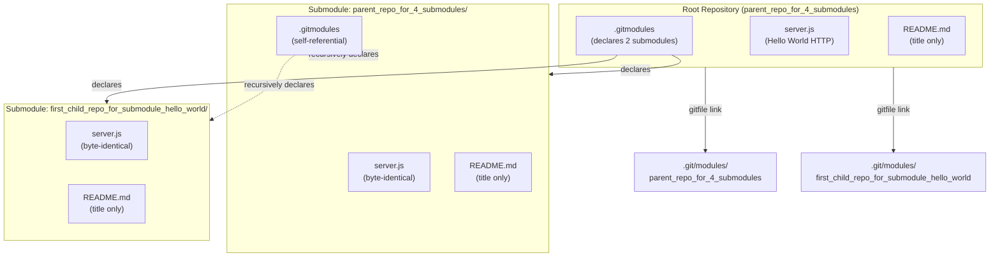

#### 1.2.2.3 Core Technical Approach

The technical approach is characterized by deliberate minimalism:

| Aspect | Choice | Rationale |
|--------|--------|-----------|
| Language Runtime | Node.js (version unspecified) | Standard library coverage is sufficient; no engines field declared |
| Module System | CommonJS (`require`) | Compatible with all Node.js versions without ESM configuration |
| Web Framework | None — direct use of `http` module | Eliminates dependency surface and exposes raw HTTP semantics |
| Dependency Management | None — no `package.json` | Repository is intentionally manifest-free |
| Code Composition | Git submodules with self-referential declarations | Demonstrates submodule topology rather than module-level reuse |
| Documentation | Title-only Markdown READMEs | Indicates pedagogical or scaffold status |

### 1.2.3 Success Criteria

#### 1.2.3.1 Measurable Objectives

Given the repository's character, success is measured by deterministic functional behavior rather than business outcomes:

| Objective | Verification |
|-----------|--------------|
| Server binds to port 3000 on loopback | `netstat`/`lsof` confirms a listening socket at `127.0.0.1:3000` after process start |
| HTTP response correctness | An HTTP `GET /` request returns status `200`, header `Content-Type: text/plain`, body `Hello, World!\n` |
| Submodule resolution | `git clone --recurse-submodules` populates both submodule directories with their declared remote contents |
| Zero installation footprint | The server executes successfully without `npm install` or any package fetch step |

#### 1.2.3.2 Critical Success Factors

| Factor | Description |
|--------|-------------|
| Node.js Availability | A Node.js runtime must be present on the host; the repository does not bundle or pin a runtime version |
| Port 3000 Availability | No other process must occupy TCP port 3000 on the loopback interface at startup |
| Git Submodule Awareness | Consumers must invoke Git with submodule-aware commands to retrieve the complete code tree |
| Network Access to GitHub | Initial submodule resolution requires HTTPS access to `github.com/lakshya-blitzy/...` |

#### 1.2.3.3 Key Performance Indicators (KPIs)

The repository does not declare or measure runtime performance characteristics. The observable indicators that apply at this scope are:

| KPI | Expected Value |
|-----|----------------|
| Startup Time | Sub-second to bind the listener and print the startup log (single synchronous `http.createServer` and `listen` call) |
| Response Status Rate | 100% of requests receive `200 OK` (no conditional logic branches in the handler) |
| Memory Footprint | Bounded by the default Node.js process baseline; no in-memory state is allocated by the application |
| Dependency Count | Zero third-party packages (verified by the absence of `package.json` and `node_modules/`) |

---

## 1.3 SCOPE

### 1.3.1 In-Scope Elements

#### 1.3.1.1 Core Features and Functionalities

The following capabilities are implemented and therefore in scope for this technical specification:

| Capability | Scope Detail |
|------------|--------------|
| HTTP Listener Creation | Use of `http.createServer` to construct a server instance bound to `127.0.0.1:3000` |
| Static Response Handler | An inline request handler that sets status code 200, the `Content-Type: text/plain` header, and ends the response with `Hello, World!\n` |
| Startup Logging | A single `console.log` call inside the `listen` callback emitting the bind URL |
| Git Submodule Declaration | Declaration of two submodules in `.gitmodules` with `path` and `url` keys pointing to GitHub remotes |
| Submodule Gitfile Linkage | Local checkout linkage via gitfile pointers from each submodule directory to `.git/modules/<name>` |
| README Identification | Single-line title READMEs at the root and within each submodule identifying the repository name |

#### 1.3.1.2 Primary User Workflows

The end-to-end workflows that the system supports are:

| Workflow | Steps |
|----------|-------|
| Clone with Submodules | `git clone --recurse-submodules <repo-url>` populates the root and both submodule directories |
| Local Execution | Run `node server.js` to start the HTTP listener on `127.0.0.1:3000` |
| Functional Verification | Issue an HTTP request to `http://127.0.0.1:3000/` and verify the returned status, content-type, and body |
| Submodule Inspection | Read `.gitmodules` to observe the declared submodule paths and URLs |

#### 1.3.1.3 Essential Integrations

| Integration | Purpose | Mechanism |
|-------------|---------|-----------|
| Node.js Core `http` Module | HTTP server implementation | `require('http')` in `server.js` |
| Operating System TCP Stack | Loopback socket binding | Implicit via `server.listen(3000, '127.0.0.1', ...)` |
| GitHub Remote Repositories | Submodule source resolution | HTTPS URLs declared in `.gitmodules` |

#### 1.3.1.4 Key Technical Requirements

| Requirement | Specification |
|-------------|---------------|
| Runtime | Node.js with `http` module available (all maintained Node.js versions satisfy this) |
| Module System | CommonJS support (`require()` resolution) |
| Network | Ability to bind a listening socket on `127.0.0.1:3000` |
| Git | Git client with submodule support for full source acquisition |

#### 1.3.1.5 Implementation Boundaries

| Boundary | Definition |
|----------|------------|
| System Boundary | The Node.js process executing `server.js`, plus the Git submodule metadata governing source composition |
| User Groups Covered | Developers and automation systems that execute the server locally and clone the repository tree |
| Geographic/Market Coverage | None — the listener binds to loopback only, making the running server reachable only from the host that started it |
| Data Domains Included | None — the system processes no user data, persists no records, and reads no inbound payloads |

### 1.3.2 Out-of-Scope Elements

#### 1.3.2.1 Explicitly Excluded Features and Capabilities

Based on direct verification of the repository's contents, the following capabilities are absent from the codebase and therefore explicitly out of scope:

| Excluded Capability | Evidence of Exclusion |
|---------------------|------------------------|
| HTTP Routing / Path Dispatch | The request handler ignores `req.url` and `req.method` |
| Authentication and Authorization | No headers are inspected; no auth libraries are present |
| Request Body Parsing | The handler does not read `req` as a stream |
| Persistent Storage | No database driver, file I/O, or cache library is imported |
| HTTPS / TLS | `http.createServer` is used; `https` module is not imported and no certificates are present |
| Environment-Based Configuration | No `process.env` references; no `.env` file present |
| Logging Beyond Startup | Only a single `console.log` exists, executed once at bind time |
| Metrics, Tracing, or Health Endpoints | No observability libraries; no `/health` or `/metrics` paths |
| Graceful Shutdown / Signal Handling | No `process.on('SIGTERM'/'SIGINT')` handlers; no `server.close()` calls |
| Clustering or Multi-Process Scaling | No `cluster` module usage; no worker thread orchestration |
| Test Suites | No test files, no testing framework, no test runner configuration |
| Build / Bundling / Transpilation | No build script, no bundler config, no TypeScript or Babel configuration |
| Linting and Formatting | No `.eslintrc`, `.prettierrc`, or equivalent configuration files |
| Containerization | No `Dockerfile` or `docker-compose.yml` |
| CI/CD Pipelines | No `.github/`, `.gitlab-ci.yml`, or equivalent workflow directories |
| Package Management | No `package.json`, `package-lock.json`, `yarn.lock`, or `node_modules/` |

#### 1.3.2.2 Future Phase Considerations

The repository declares no roadmap, milestone, or phased delivery plan. The three READMEs contain only title headings and no forward-looking statements. Any extension to this scope—such as adding routing, persistence, configuration, or productionization features—would constitute a new phase outside the bounds of this specification.

#### 1.3.2.3 Integration Points Not Covered

| Integration Category | Status |
|----------------------|--------|
| Databases (SQL/NoSQL) | Not integrated; no drivers present |
| Message Queues / Event Brokers | Not integrated; no client libraries present |
| External APIs (REST/GraphQL/SOAP) | Not integrated; no HTTP client used outside the inbound server |
| Identity Providers (OAuth/OIDC/SAML) | Not integrated; no authentication flow exists |
| Secret Management Services | Not integrated; no secrets are read or stored |
| Container Orchestrators (Kubernetes/Nomad) | Not integrated; no manifests or charts present |
| Service Meshes | Not integrated |
| Observability Backends (Prometheus/OpenTelemetry/ELK) | Not integrated |

#### 1.3.2.4 Unsupported Use Cases

| Use Case | Rationale for Non-Support |
|----------|---------------------------|
| Serving External Traffic | Binding to `127.0.0.1` prevents external network access without code changes |
| Multi-Endpoint APIs | The single inline handler returns the same response for all requests |
| Concurrent Port Use | Port `3000` is hardcoded; running multiple instances on the same host will fail with `EADDRINUSE` |
| User Authentication Flows | No identity, session, or token machinery is implemented |
| Data Persistence and Retrieval | No storage layer is present |
| Production Deployment | The codebase lacks the operational scaffolding (process manager configuration, health checks, signal handling, structured logging) typical of production services |
| Library Consumption | `server.js` performs no `module.exports`; it is exclusively an executable script |

---

## 1.4 REFERENCES

### 1.4.1 Files Examined

- `server.js` — Root Node.js HTTP server source; established the application's runtime behavior, network binding (`127.0.0.1:3000`), and response format (`200 OK` / `text/plain` / `Hello, World!\n`).
- `.gitmodules` — Root Git submodule declarations; established the two declared submodules (`parent_repo_for_4_submodules`, `first_child_repo_for_submodule_hello_world`) and their GitHub remote URLs under `lakshya-blitzy`.
- `README.md` — Root README; established the title-only nature of the repository's documentation.
- `parent_repo_for_4_submodules/server.js` — First submodule's HTTP server source; verified byte-identical content to the root `server.js`.
- `parent_repo_for_4_submodules/.gitmodules` — First submodule's submodule configuration; established the self-referential submodule topology by replicating the root's `.gitmodules` declarations.
- `parent_repo_for_4_submodules/README.md` — First submodule's README; confirmed title-only documentation.
- `first_child_repo_for_submodule_hello_world/server.js` — Second submodule's HTTP server source; verified byte-identical content to the root `server.js`.
- `first_child_repo_for_submodule_hello_world/README.md` — Second submodule's README; established its title `first_child_repo_for_submodule_hello_world`.

### 1.4.2 Folders Explored

- `/` (root) — Top-level directory containing `server.js`, `.gitmodules`, `README.md`, and the two submodule directories.
- `parent_repo_for_4_submodules/` — First submodule directory containing `server.js`, `.gitmodules`, and `README.md`.
- `first_child_repo_for_submodule_hello_world/` — Second submodule directory containing `server.js` and `README.md` (no nested `.gitmodules`).

### 1.4.3 Specification Sections Consulted

- No related Technical Specification sections were available for cross-reference at the time of authoring this section; the section was composed solely from direct repository evidence.

### 1.4.4 Web Searches Performed

- None. This section was composed exclusively from repository-internal evidence, as the codebase is fully self-contained and does not reference external standards beyond the Node.js `http` module documentation (which is canonical and well-established).

# 2. Product Requirements

This section enumerates the discrete, testable features of the repository derived from direct inspection of the codebase. The repository is a minimalist Node.js HTTP "Hello, World!" demonstration distributed across a parent repository and two Git submodules, comprising eight non-Git files in total. Because the system is intentionally manifest-free and framework-free, the feature set is small, self-contained, and fully observable through filesystem and runtime inspection. All requirements documented below are traceable to specific files referenced in Section 1.4 and align with the scope boundaries defined in Section 1.3.

## 2.1 FEATURE CATALOG

The repository exposes six discrete features that span two domains: runtime HTTP behavior (Features F-001, F-002, F-003) and source-composition mechanics (Features F-004, F-005, F-006). Each feature is documented below with full metadata, description, and dependency information.

### 2.1.1 F-001: HTTP Server Listener Binding

#### 2.1.1.1 Feature Metadata

| Attribute | Value |
|-----------|-------|
| Unique ID | F-001 |
| Feature Name | HTTP Server Listener Binding |
| Feature Category | Runtime / Network Transport |
| Priority Level | Critical |
| Status | Completed |

#### 2.1.1.2 Description

**Overview:** The feature creates an HTTP server instance using the Node.js core `http` module and binds it to TCP port 3000 on the loopback interface (`127.0.0.1`). The bind action is initiated by a single `server.listen` invocation within `server.js`.

**Business Value:** Provides the foundational transport plane upon which all HTTP behavior is exercised; without this feature the repository's runtime demonstration cannot be observed.

**User Benefits:** Enables developers learning Node.js to inspect the minimum viable code path required to accept inbound HTTP connections without intervening framework layers or middleware abstractions.

**Technical Context:** The system uses CommonJS module resolution (`require('http')`) and the core API surface only; no HTTP framework (Express, Koa, Fastify, Hapi, NestJS) is involved. The bind target is hardcoded as two top-level constants (`hostname` and `port`) inside `server.js`.

#### 2.1.1.3 Dependencies

| Dependency Category | Detail |
|---------------------|--------|
| Prerequisite Features | None — F-001 is the root runtime feature |
| System Dependencies | Node.js runtime providing the core `http` module; host operating system TCP/IP stack |
| External Dependencies | None |
| Integration Requirements | Port 3000 on the loopback interface must be unoccupied at process start |

---

### 2.1.2 F-002: Static HTTP Response Handler

#### 2.1.2.1 Feature Metadata

| Attribute | Value |
|-----------|-------|
| Unique ID | F-002 |
| Feature Name | Static HTTP Response Handler |
| Feature Category | Runtime / Application Logic |
| Priority Level | Critical |
| Status | Completed |

#### 2.1.2.2 Description

**Overview:** The feature registers an inline request handler with the HTTP server that returns an identical plain-text response for every inbound request. The handler sets `res.statusCode` to `200`, applies the `Content-Type: text/plain` response header, and terminates the response with the body `Hello, World!\n`.

**Business Value:** Demonstrates the smallest possible end-to-end HTTP request/response cycle, exposing raw HTTP semantics without routing or content-negotiation indirection.

**User Benefits:** Provides a deterministic reference output that simplifies functional verification — any request, regardless of method, path, headers, or body, will return the same response.

**Technical Context:** The handler is supplied as an arrow-function callback to `http.createServer`. It performs no inspection of `req.url` or `req.method`, no body parsing, and no header-based dispatch. It exclusively writes to the `res` object and ends the response immediately.

#### 2.1.2.3 Dependencies

| Dependency Category | Detail |
|---------------------|--------|
| Prerequisite Features | F-001 (handler is registered with the server instance created by F-001) |
| System Dependencies | Node.js `http` module response API (`res.statusCode`, `res.setHeader`, `res.end`) |
| External Dependencies | None |
| Integration Requirements | None |

---

### 2.1.3 F-003: Startup Confirmation Logging

#### 2.1.3.1 Feature Metadata

| Attribute | Value |
|-----------|-------|
| Unique ID | F-003 |
| Feature Name | Startup Confirmation Logging |
| Feature Category | Observability (Bootstrap) |
| Priority Level | Medium |
| Status | Completed |

#### 2.1.3.2 Description

**Overview:** Upon successful binding of the listener, a single `console.log` invocation inside the `listen` callback emits the message `Server running at http://127.0.0.1:3000/` to standard output. The message is composed via a JavaScript template literal that interpolates the `hostname` and `port` constants declared at module scope.

**Business Value:** Provides positive confirmation that the server has completed asynchronous binding, allowing scripted harnesses and human operators to know when the listener is ready to accept connections.

**User Benefits:** Eliminates ambiguity about whether the process has started successfully versus silently failing.

**Technical Context:** This is the **only** log line emitted by the application. There is no request-level logging, error logging, or shutdown logging. The log is emitted exactly once per process lifetime.

#### 2.1.3.3 Dependencies

| Dependency Category | Detail |
|---------------------|--------|
| Prerequisite Features | F-001 (the log statement resides inside the `listen` callback registered by F-001) |
| System Dependencies | Standard output stream (`process.stdout`) |
| External Dependencies | None |
| Integration Requirements | None |

---

### 2.1.4 F-004: Git Submodule Declaration

#### 2.1.4.1 Feature Metadata

| Attribute | Value |
|-----------|-------|
| Unique ID | F-004 |
| Feature Name | Git Submodule Declaration (Root) |
| Feature Category | Source Composition / Build-Time |
| Priority Level | High |
| Status | Completed |

#### 2.1.4.2 Description

**Overview:** The root `.gitmodules` file declares two Git submodules with `path` and `url` keys pointing to GitHub remotes under the `lakshya-blitzy` namespace. The first declaration targets `parent_repo_for_4_submodules`, and the second targets `first_child_repo_for_submodule_hello_world`. Both URLs are HTTPS endpoints on `github.com`.

**Business Value:** Demonstrates Git submodule composition as an alternative to package-manager-based code reuse, illustrating how multiple repositories are stitched into a single workspace.

**User Benefits:** Allows learners to observe the precise file format used by Git to record submodule paths and remotes, and to practice `git clone --recurse-submodules` workflows against a real example.

**Technical Context:** The `.gitmodules` file uses the INI-like Git configuration syntax with named `[submodule "<name>"]` sections. No branch tracking, update policy, shallow-clone hints, or fetch refspecs are declared.

#### 2.1.4.3 Dependencies

| Dependency Category | Detail |
|---------------------|--------|
| Prerequisite Features | None |
| System Dependencies | Git client with submodule support |
| External Dependencies | GitHub HTTPS endpoints under `github.com/lakshya-blitzy/` |
| Integration Requirements | Network reachability to `github.com` during clone or `submodule update` |

---

### 2.1.5 F-005: Self-Referential Submodule Topology

#### 2.1.5.1 Feature Metadata

| Attribute | Value |
|-----------|-------|
| Unique ID | F-005 |
| Feature Name | Self-Referential Submodule Topology |
| Feature Category | Source Composition / Pedagogical |
| Priority Level | Medium |
| Status | Completed |

#### 2.1.5.2 Description

**Overview:** The `.gitmodules` file inside the `parent_repo_for_4_submodules/` submodule is byte-identical to the root `.gitmodules`, meaning the submodule re-declares itself as one of its own submodules. This produces a self-referential submodule topology one level deep.

**Business Value:** Demonstrates Git's behavior in the presence of recursive submodule references, which is a non-obvious aspect of submodule semantics that consumers should understand before deploying submodule-heavy repositories.

**User Benefits:** Provides a concrete artifact for studying how Git resolves (or refuses to recurse infinitely into) self-referential submodule graphs.

**Technical Context:** The `first_child_repo_for_submodule_hello_world/` submodule does **not** contain a nested `.gitmodules` file, making it a leaf node in the topology; the recursion is therefore bounded.

#### 2.1.5.3 Dependencies

| Dependency Category | Detail |
|---------------------|--------|
| Prerequisite Features | F-004 (this feature replicates F-004's declarations one level deeper) |
| System Dependencies | Git client capable of recursing into submodules |
| External Dependencies | Same GitHub remotes as F-004 |
| Integration Requirements | Same as F-004 |

---

### 2.1.6 F-006: Title-Only README Documentation

#### 2.1.6.1 Feature Metadata

| Attribute | Value |
|-----------|-------|
| Unique ID | F-006 |
| Feature Name | Title-Only README Documentation |
| Feature Category | Documentation |
| Priority Level | Low |
| Status | Completed |

#### 2.1.6.2 Description

**Overview:** Each of the three filesystem locations (root, parent submodule, child submodule) contains a `README.md` file consisting of a single H1 heading matching the repository's name. The root and parent-submodule READMEs read `# parent_repo_for_4_submodules`; the child-submodule README reads `# first_child_repo_for_submodule_hello_world`.

**Business Value:** Provides minimal identification of each repository when browsed through Git hosting interfaces or local file explorers.

**User Benefits:** Visually distinguishes the child submodule from the parent submodule when navigating the source tree.

**Technical Context:** No installation instructions, usage examples, architecture diagrams, contribution guidelines, license declarations, or forward-looking statements appear in any README. The documentation is therefore identification-only.

#### 2.1.6.3 Dependencies

| Dependency Category | Detail |
|---------------------|--------|
| Prerequisite Features | None |
| System Dependencies | Any Markdown-rendering surface (GitHub, IDE, file viewer) |
| External Dependencies | None |
| Integration Requirements | None |

---

## 2.2 FUNCTIONAL REQUIREMENTS TABLE

This subsection decomposes each feature into atomic, testable requirements with acceptance criteria. Requirement IDs follow the format `F-XXX-RQ-YYY`. Together these requirements form the verification basis for the success criteria defined in Section 1.2.3.

### 2.2.1 F-001 Requirements — HTTP Server Listener Binding

#### 2.2.1.1 Requirement Details

| Field | F-001-RQ-001 | F-001-RQ-002 |
|-------|--------------|--------------|
| Description | Create an HTTP server instance using the Node.js core `http` module | Bind the server to `127.0.0.1` on TCP port `3000` |
| Acceptance Criteria | `require('http')` and `http.createServer(...)` are invoked exactly once at module load | A listening socket exists on `127.0.0.1:3000` after process start, observable via `netstat`/`lsof` |
| Priority | Must-Have | Must-Have |
| Complexity | Low | Low |

#### 2.2.1.2 Technical Specifications

| Field | F-001-RQ-001 | F-001-RQ-002 |
|-------|--------------|--------------|
| Input Parameters | None (module load) | `port=3000`, `hostname='127.0.0.1'`, callback function |
| Output / Response | Server instance returned by `http.createServer` | Asynchronous bind completion; `listening` event fires |
| Performance Criteria | Synchronous construction, sub-millisecond | Sub-second bind completion |
| Data Requirements | None | None |

#### 2.2.1.3 Validation Rules

| Field | F-001-RQ-001 | F-001-RQ-002 |
|-------|--------------|--------------|
| Business Rules | Must rely solely on Node.js standard library | Bind must be loopback-only; the system MUST NOT expose itself on `0.0.0.0` or a public interface |
| Data Validation | N/A | Port value is a literal integer `3000` (no env override) |
| Security Requirements | No third-party packages may be introduced | Loopback restriction is a deliberate security boundary per Section 1.3.1.5 |
| Compliance Requirements | None declared | None declared |

---

### 2.2.2 F-002 Requirements — Static HTTP Response Handler

#### 2.2.2.1 Requirement Details

| Field | F-002-RQ-001 | F-002-RQ-002 | F-002-RQ-003 |
|-------|--------------|--------------|--------------|
| Description | Set HTTP status code to `200` for every request | Set response header `Content-Type` to `text/plain` | Terminate response with body `Hello, World!\n` |
| Acceptance Criteria | `res.statusCode === 200` for any inbound request | Response includes `Content-Type: text/plain` header | Response body equals `Hello, World!\n` (literal, including trailing newline) |
| Priority | Must-Have | Must-Have | Must-Have |
| Complexity | Low | Low | Low |

#### 2.2.2.2 Technical Specifications

| Field | F-002-RQ-001 | F-002-RQ-002 | F-002-RQ-003 |
|-------|--------------|--------------|--------------|
| Input Parameters | Any HTTP request (method, path, headers, body all ignored) | Same as RQ-001 | Same as RQ-001 |
| Output / Response | HTTP status line `200 OK` | `Content-Type: text/plain` header | 14-byte body `Hello, World!\n` |
| Performance Criteria | Constant-time handler with no I/O or computation | Same | Same |
| Data Requirements | No request body is read | No request headers are read | No state is persisted |

#### 2.2.2.3 Validation Rules

| Field | F-002-RQ-001 | F-002-RQ-002 | F-002-RQ-003 |
|-------|--------------|--------------|--------------|
| Business Rules | Response MUST be deterministic and stateless | Content type MUST NOT advertise HTML, JSON, or any structured format | Body MUST include the trailing newline character |
| Data Validation | No conditional branches based on request data | No content negotiation logic | No template substitution; body is a literal string |
| Security Requirements | Handler MUST NOT reflect user input | Handler MUST NOT expose framework or runtime version headers | Body MUST NOT include any sensitive identifiers |
| Compliance Requirements | None declared | None declared | None declared |

---

### 2.2.3 F-003 Requirements — Startup Confirmation Logging

#### 2.2.3.1 Requirement Details

| Field | F-003-RQ-001 |
|-------|--------------|
| Description | Emit a single startup confirmation log line after the listener binds successfully |
| Acceptance Criteria | Standard output contains exactly the line `Server running at http://127.0.0.1:3000/` once per process lifetime |
| Priority | Should-Have |
| Complexity | Low |

#### 2.2.3.2 Technical Specifications

| Field | F-003-RQ-001 |
|-------|--------------|
| Input Parameters | The `hostname` and `port` module-scope constants, interpolated via a template literal |
| Output / Response | One line written to `process.stdout` |
| Performance Criteria | Sub-millisecond synchronous write following the asynchronous bind |
| Data Requirements | None |

#### 2.2.3.3 Validation Rules

| Field | F-003-RQ-001 |
|-------|--------------|
| Business Rules | Log MUST execute only after `listen` succeeds (inside the callback) |
| Data Validation | Log content MUST match the interpolated hostname and port values |
| Security Requirements | Log MUST NOT contain secrets, tokens, or environmental identifiers |
| Compliance Requirements | None declared |

---

### 2.2.4 F-004 Requirements — Git Submodule Declaration

#### 2.2.4.1 Requirement Details

| Field | F-004-RQ-001 | F-004-RQ-002 |
|-------|--------------|--------------|
| Description | Declare two named Git submodules in the root `.gitmodules` file | Enable submodule resolution via standard Git submodule-aware commands |
| Acceptance Criteria | `.gitmodules` parses successfully and lists exactly two `[submodule "<name>"]` sections | `git clone --recurse-submodules <repo-url>` populates both submodule directories with the declared remote contents |
| Priority | Must-Have | Must-Have |
| Complexity | Low | Low |

#### 2.2.4.2 Technical Specifications

| Field | F-004-RQ-001 | F-004-RQ-002 |
|-------|--------------|--------------|
| Input Parameters | None (static file) | Repository URL supplied to `git clone` |
| Output / Response | Two declarations with `path` and `url` keys each | Two populated submodule directories |
| Performance Criteria | File parsing by Git is instantaneous | Bounded by network throughput to GitHub |
| Data Requirements | Submodule names: `parent_repo_for_4_submodules`, `first_child_repo_for_submodule_hello_world`; URLs: HTTPS endpoints under `github.com/lakshya-blitzy/` | Recursive clone fetches both submodule remotes |

#### 2.2.4.3 Validation Rules

| Field | F-004-RQ-001 | F-004-RQ-002 |
|-------|--------------|--------------|
| Business Rules | Submodule URLs MUST target the `lakshya-blitzy` GitHub organization | The submodule directory names MUST match the `path` keys |
| Data Validation | URLs MUST use HTTPS (no SSH variants declared) | Submodule directory contents MUST match the remote HEAD commit |
| Security Requirements | URLs MUST point to canonical hosts (no IP-based or shortened URLs) | HTTPS transport ensures integrity during fetch |
| Compliance Requirements | None declared | None declared |

---

### 2.2.5 F-005 Requirements — Self-Referential Submodule Topology

#### 2.2.5.1 Requirement Details

| Field | F-005-RQ-001 |
|-------|--------------|
| Description | The `parent_repo_for_4_submodules/.gitmodules` file MUST replicate the root `.gitmodules` declarations byte-for-byte, producing a self-referential topology |
| Acceptance Criteria | A byte-level comparison (e.g., `diff`) between root `.gitmodules` and `parent_repo_for_4_submodules/.gitmodules` returns zero differences |
| Priority | Should-Have |
| Complexity | Low |

#### 2.2.5.2 Technical Specifications

| Field | F-005-RQ-001 |
|-------|--------------|
| Input Parameters | None (static file) |
| Output / Response | Identical submodule declarations at the next nesting level |
| Performance Criteria | N/A (static file) |
| Data Requirements | Both files contain identical 7-line content declaring the same two submodules |

#### 2.2.5.3 Validation Rules

| Field | F-005-RQ-001 |
|-------|--------------|
| Business Rules | The leaf submodule (`first_child_repo_for_submodule_hello_world`) MUST NOT contain a nested `.gitmodules`, bounding recursion at depth 1 |
| Data Validation | Submodule names and URLs MUST be identical to those declared at the root |
| Security Requirements | Same as F-004 |
| Compliance Requirements | None declared |

---

### 2.2.6 F-006 Requirements — Title-Only README Documentation

#### 2.2.6.1 Requirement Details

| Field | F-006-RQ-001 |
|-------|--------------|
| Description | Each filesystem location MUST contain a `README.md` consisting of a single H1 heading matching the repository name |
| Acceptance Criteria | Each `README.md` file contains exactly one line of Markdown beginning with `# ` and matching the repository's directory or remote name |
| Priority | Could-Have |
| Complexity | Low |

#### 2.2.6.2 Technical Specifications

| Field | F-006-RQ-001 |
|-------|--------------|
| Input Parameters | None (static file) |
| Output / Response | A rendered H1 heading in any Markdown viewer |
| Performance Criteria | N/A (static file) |
| Data Requirements | Root and parent submodule: `# parent_repo_for_4_submodules`; child submodule: `# first_child_repo_for_submodule_hello_world` |

#### 2.2.6.3 Validation Rules

| Field | F-006-RQ-001 |
|-------|--------------|
| Business Rules | READMEs MUST NOT contain installation, usage, architecture, or contribution narrative (consistent with the title-only scope) |
| Data Validation | Heading text MUST match the repository name exactly |
| Security Requirements | READMEs MUST NOT include URLs to untrusted resources |
| Compliance Requirements | None declared |

---

## 2.3 FEATURE RELATIONSHIPS

This subsection documents the dependencies and shared elements among the six features. Only relationships explicitly evident in source files (`server.js`, `.gitmodules`, `README.md`) are documented; no notional integrations are inferred.

### 2.3.1 Feature Dependency Map

The dependency graph below shows the directed relationships among the features. Runtime features (F-001 through F-003) form a single chain rooted at the listener binding. Source-composition features (F-004 through F-006) form a separate, independent cluster.

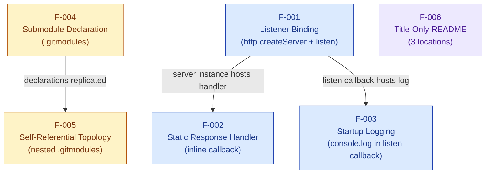

### 2.3.2 Integration Points

| Integration Point | Features Involved | Mechanism |
|-------------------|-------------------|-----------|
| Node.js `http` core module | F-001, F-002, F-003 | `require('http')` in `server.js`; consumed for server creation, response API, and event-driven `listen` callback |
| OS TCP/IP stack (loopback) | F-001 | Implicit binding via `server.listen(3000, '127.0.0.1', ...)` |
| Standard output stream | F-003 | `console.log` writes to `process.stdout` |
| Git client | F-004, F-005 | Reads `.gitmodules` during `clone`, `submodule init`, `submodule update` |
| GitHub HTTPS endpoints | F-004, F-005 | Remote fetch from `github.com/lakshya-blitzy/...` |

### 2.3.3 Shared Components

| Shared Component | Sharing Scope | Description |
|------------------|---------------|-------------|
| `server.js` source file | F-001, F-002, F-003 (all three together) | The 15-line script implements the listener bind, the response handler, and the startup log inline; the same file is byte-identically replicated across the root, `parent_repo_for_4_submodules/`, and `first_child_repo_for_submodule_hello_world/` |
| `hostname` and `port` constants | F-001, F-003 | Declared once at module scope; consumed by `listen` (F-001) and interpolated into the startup log (F-003) |
| `.gitmodules` declarations | F-004, F-005 | The same 7-line declaration block appears in the root and in the parent submodule |
| Title-only README pattern | F-006 (root, parent, child) | Same single-H1 structure applied across all three locations, with the heading text adjusted per repository |

### 2.3.4 Common Services

The system exposes no internal services to other modules (the `server.js` script performs no `module.exports`). External services consumed are limited to:

| Service | Consumer Features | Service Type |
|---------|-------------------|--------------|
| Node.js standard library | F-001, F-002, F-003 | Runtime API |
| Host OS networking | F-001 | Operating-system service |
| Git submodule resolution | F-004, F-005 | Source-control service |
| GitHub remote hosting | F-004, F-005 | External SCM service |

---

## 2.4 IMPLEMENTATION CONSIDERATIONS

This subsection enumerates the technical, performance, scalability, security, and maintenance considerations that apply to each feature. Considerations are derived from observed code patterns and the scope boundaries defined in Section 1.3.

### 2.4.1 Technical Constraints

| Feature | Constraints |
|---------|-------------|
| F-001 | Bind target is hardcoded; no environment variable, CLI flag, or configuration file override exists per Section 1.2.1.2. Loopback-only binding precludes external network reach. |
| F-002 | Single inline handler cannot dispatch by route or method; no body parsing exists. Response body is a literal string with no template substitution. |
| F-003 | Only one log line is emitted per process lifetime; no request, error, or shutdown logs. No log level, structured format, or destination configuration exists. |
| F-004 | URLs target a specific GitHub user namespace (`lakshya-blitzy`); no branch tracking, shallow-clone hints, or update policies are declared. |
| F-005 | Recursion is bounded at depth 1 because the child submodule lacks a nested `.gitmodules`; deeper nesting would require additional files. |
| F-006 | READMEs are identification-only; no rendered tooling, badges, or cross-links are present. |

### 2.4.2 Performance Requirements

| Feature | Requirements |
|---------|--------------|
| F-001 | Sub-second startup time for the synchronous `http.createServer` and `listen` calls, per Section 1.2.3.3 KPIs |
| F-002 | 100% response status rate of `200 OK` due to absence of conditional logic branches; constant-time, allocation-light response path |
| F-003 | Synchronous write to stdout immediately after asynchronous bind completion |
| F-004 | Bounded by network throughput to GitHub during initial clone |
| F-005 | No additional runtime impact; static file inspected only by Git tooling |
| F-006 | No runtime impact |

### 2.4.3 Scalability Considerations

The repository is explicitly **not** designed for horizontal or vertical scaling. The following scalability boundaries apply:

| Concern | Status |
|---------|--------|
| Multi-process scaling | Out of scope — no `cluster` module usage per Section 1.3.2.1 |
| Concurrent port use | A single instance per host is the maximum, since port `3000` is hardcoded; additional instances on the same host will fail with `EADDRINUSE` per Section 1.3.2.4 |
| Memory growth under load | Bounded by Node.js process baseline; no in-memory state is allocated by the application per Section 1.2.3.3 |
| Connection backlog | Default Node.js `listen()` backlog applies; no tuning is configured |

### 2.4.4 Security Implications

| Feature | Security Implications |
|---------|------------------------|
| F-001 | Loopback-only binding acts as a deliberate security boundary, preventing external reachability without code modification. No TLS/HTTPS termination exists; the `https` module is not imported per Section 1.3.2.1. |
| F-002 | Response is fully static and contains no reflected user input, eliminating classic injection vectors at the application layer. No request body parsing exists, preventing parser-class vulnerabilities. |
| F-003 | The single log line contains no secrets, identifiers, or environmental data beyond the bind URL. |
| F-004 | Reliance on HTTPS URLs to GitHub provides transport integrity during clone. No GPG signing of submodule commits is declared. |
| F-005 | Recursive submodule references inherit the security posture of F-004; the bounded recursion mitigates infinite-loop denial-of-service risks during clone. |
| F-006 | No security implications; READMEs contain no executable content or external links. |

Additional cross-cutting security exclusions (per Section 1.3.2.1) that apply to **all** features:

| Excluded Capability | Implication |
|---------------------|-------------|
| Authentication and authorization | No identity, session, or token machinery exists |
| Secret management | No secrets are read, stored, or referenced |
| Environment-based configuration | No `process.env` references; no `.env` file present |

### 2.4.5 Maintenance Requirements

| Feature | Maintenance Considerations |
|---------|---------------------------|
| F-001 | Hardcoded constants (`hostname`, `port`) require code edits to change; no externalized configuration exists |
| F-002 | Any modification to status, headers, or body requires editing the inline handler in `server.js` |
| F-003 | Modifying the log message requires editing the `console.log` template literal in `server.js` |
| F-004 | Adding or removing submodules requires editing `.gitmodules` and running `git submodule add`/`deinit` commands |
| F-005 | Maintaining byte-identical content between root and parent-submodule `.gitmodules` requires synchronized commits to two GitHub repositories |
| F-006 | Updates to README content require commits to each of the three independent repositories |

Across all features, the absence of test suites, lint/format configuration, build pipelines, CI/CD workflows, and containerization (all confirmed in Section 1.3.2.1) means that maintenance relies entirely on manual inspection and ad-hoc execution.

---

## 2.5 TRACEABILITY MATRIX

### 2.5.1 Feature-to-Requirement Mapping

| Feature ID | Feature Name | Requirement IDs | Source Evidence |
|------------|--------------|-----------------|-----------------|
| F-001 | HTTP Server Listener Binding | F-001-RQ-001, F-001-RQ-002 | `server.js` (lines invoking `require('http')`, `http.createServer`, `server.listen`) |
| F-002 | Static HTTP Response Handler | F-002-RQ-001, F-002-RQ-002, F-002-RQ-003 | `server.js` (inline handler setting `res.statusCode`, `res.setHeader`, `res.end`) |
| F-003 | Startup Confirmation Logging | F-003-RQ-001 | `server.js` (`console.log` inside `listen` callback) |
| F-004 | Git Submodule Declaration | F-004-RQ-001, F-004-RQ-002 | Root `.gitmodules` |
| F-005 | Self-Referential Submodule Topology | F-005-RQ-001 | `parent_repo_for_4_submodules/.gitmodules` |
| F-006 | Title-Only README Documentation | F-006-RQ-001 | All three `README.md` files |

### 2.5.2 Requirement-to-Specification-Section Mapping

| Requirement ID | Related Tech Spec Section | Cross-Reference Purpose |
|----------------|---------------------------|--------------------------|
| F-001-RQ-001, F-001-RQ-002 | Section 1.2.2.1 (Primary System Capabilities); Section 1.3.1.1 (In-Scope Core Features) | Confirms bind target and use of `http.createServer` |
| F-002-RQ-001, F-002-RQ-002, F-002-RQ-003 | Section 1.2.2.1; Section 1.3.1.1 | Confirms `200 OK` / `text/plain` / `Hello, World!\n` response contract |
| F-003-RQ-001 | Section 1.2.1.2 (Observability limitation); Section 1.2.2.1 | Confirms the single startup log line |
| F-004-RQ-001, F-004-RQ-002 | Section 1.2.2.2 (Major System Components); Section 1.3.1.1; Section 1.3.1.3 | Confirms two submodule declarations and clone workflow |
| F-005-RQ-001 | Section 1.1.1 (Project Overview); Section 1.2.2.2 | Confirms self-referential submodule topology |
| F-006-RQ-001 | Section 1.1.2 (Core Problem Statement); Section 1.2.2.3 (Core Technical Approach) | Confirms title-only README convention |

### 2.5.3 Feature-to-Workflow Mapping

This matrix links features to the primary user workflows enumerated in Section 1.3.1.2.

| Workflow (from Section 1.3.1.2) | Features Exercised |
|---------------------------------|---------------------|
| Clone with Submodules — `git clone --recurse-submodules <repo-url>` | F-004, F-005, F-006 |
| Local Execution — `node server.js` | F-001, F-003 |
| Functional Verification — HTTP request to `http://127.0.0.1:3000/` | F-001, F-002 |
| Submodule Inspection — read `.gitmodules` | F-004, F-005 |

### 2.5.4 Feature-to-Success-Criteria Mapping

This matrix links features to the measurable objectives defined in Section 1.2.3.1.

| Success Objective (from Section 1.2.3.1) | Verifying Features |
|------------------------------------------|---------------------|
| Server binds to port 3000 on loopback | F-001 |
| HTTP response correctness | F-002 |
| Submodule resolution | F-004, F-005 |
| Zero installation footprint | F-001 (no `package.json`), F-004 (no third-party dependencies declared) |

---

## 2.6 ASSUMPTIONS AND CONSTRAINTS

### 2.6.1 Assumptions

The product requirements above assume:

| Assumption | Basis |
|------------|-------|
| A Node.js runtime is present on the host with the core `http` module available | Stated in Section 1.2.3.2 (Critical Success Factors) |
| Port 3000 on the loopback interface is unoccupied at startup | Stated in Section 1.2.3.2 |
| The consumer has network access to `github.com/lakshya-blitzy` during initial clone | Stated in Section 1.2.3.2 |
| The consumer invokes Git with submodule-aware commands when complete source acquisition is desired | Stated in Section 1.2.3.2 |
| The pedagogical/demonstrative purpose of the artifact is acceptable to all stakeholders | Stated in Section 1.1.2 (Core Problem Statement) |

### 2.6.2 Constraints

| Constraint | Origin |
|------------|--------|
| Loopback-only network reach | Hardcoded `127.0.0.1` in `server.js` |
| Hardcoded port `3000` | Hardcoded constant in `server.js` |
| Single static response for all requests | Inline handler with no `req` inspection |
| No graceful shutdown or signal handling | Absence of `process.on('SIGTERM'/'SIGINT')` per Section 1.3.2.1 |
| Zero third-party dependencies | Absence of `package.json` and `node_modules/` per Section 1.2.1 |
| No automated test coverage | Absence of test framework per Section 1.3.2.1 |
| No build, lint, or CI/CD pipeline | Absence of corresponding configuration files per Section 1.3.2.1 |

### 2.6.3 Requirement Versioning

The repository declares no version metadata: there is no `version` field (since no `package.json` exists), no `CHANGELOG.md`, no Git tags referenced in source, and no release manifest. All requirements documented here correspond to the current HEAD of each repository as inspected. Future revisions to this specification should be tracked alongside Git commits to the source repositories.

---

## 2.7 REFERENCES

### 2.7.1 Files Examined

- `server.js` — Root Node.js HTTP server (15 lines); primary evidence for features F-001, F-002, and F-003.
- `.gitmodules` — Root Git submodule declarations (7 lines); primary evidence for feature F-004.
- `README.md` — Root title-only README (1 line); primary evidence for feature F-006 at the root.
- `parent_repo_for_4_submodules/server.js` — Byte-identical replica of root `server.js`; supports F-001, F-002, F-003 within the parent submodule.
- `parent_repo_for_4_submodules/.gitmodules` — Byte-identical replica of root `.gitmodules`; primary evidence for feature F-005 (self-referential topology).
- `parent_repo_for_4_submodules/README.md` — Title-only README (1 line); supports F-006 within the parent submodule.
- `first_child_repo_for_submodule_hello_world/server.js` — Byte-identical replica of root `server.js`; supports F-001, F-002, F-003 within the child submodule.
- `first_child_repo_for_submodule_hello_world/README.md` — Title-only README (1 line); supports F-006 within the child submodule.

### 2.7.2 Folders Explored

- `/` (root) — Top-level directory containing `server.js`, `.gitmodules`, `README.md`, and the two submodule directories.
- `parent_repo_for_4_submodules/` — First submodule directory containing `server.js`, `.gitmodules`, `README.md`.
- `first_child_repo_for_submodule_hello_world/` — Second submodule directory containing `server.js`, `README.md` (no nested `.gitmodules`; leaf node).

### 2.7.3 Technical Specification Sections Cross-Referenced

- Section 1.1 EXECUTIVE SUMMARY — Project overview, problem statement, stakeholders, and value proposition.
- Section 1.2 SYSTEM OVERVIEW — System capabilities, limitations, components, success criteria, and KPIs.
- Section 1.3 SCOPE — In-scope features, primary workflows, out-of-scope capabilities, and unsupported use cases.
- Section 1.4 REFERENCES — Complete file and folder inventory used as evidentiary baseline.

### 2.7.4 Web Searches Performed

- None. This section was composed exclusively from repository-internal evidence and from the cross-referenced sections of the existing Technical Specification.

# 3. Technology Stack

## 3.1 OVERVIEW AND GUIDING PRINCIPLES

### 3.1.1 Minimalism as an Architectural Choice

The technology stack for this system is defined by its conspicuous brevity. The repository implements a "Hello, World!" HTTP server whose stated architectural posture is to demonstrate the smallest possible end-to-end HTTP request/response cycle using only Node.js standard-library primitives. Per the System Overview, the system *"relies exclusively on the Node.js core `http` module to demonstrate the smallest possible end-to-end HTTP request/response cycle"* and *"deliberately avoids the architectural complexity introduced by HTTP frameworks (such as Express, Koa, Fastify, Hapi, or NestJS), routing libraries, middleware pipelines, configuration loaders, and dependency injection containers."*

Consequently, this section documents what *is* present in the stack and—equally important—explicitly enumerates what is *not* present, since absence is a deliberate engineering choice rather than an oversight.

### 3.1.2 Technology Stack Topology

The end-to-end stack consists of three runtime layers and one source-composition layer. The diagram below captures the complete dependency graph for executing and acquiring the system:

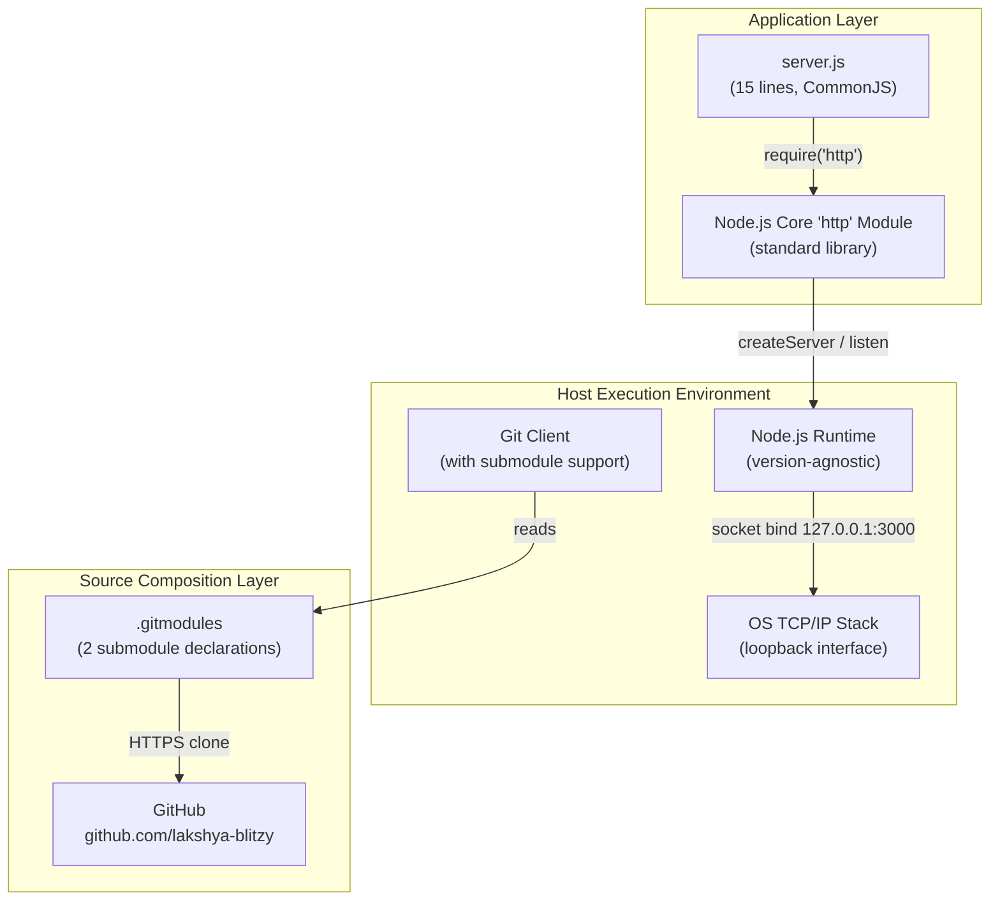

### 3.1.3 Default Stack Deviation Statement

This system does not adopt any element of a conventional enterprise default stack. There is no cloud platform, no container runtime, no Infrastructure-as-Code definition, no managed CI/CD, no relational or NoSQL data tier, no authentication provider, no front-end framework, and no native application toolchain. Each of these absences is justified in its respective subsection below.

---

## 3.2 PROGRAMMING LANGUAGES

### 3.2.1 Application Language: JavaScript (Node.js, CommonJS)

JavaScript executed under the Node.js runtime is the sole application programming language. The entirety of the runtime behavior is contained in a 15-line `server.js` file at the root, with byte-identical copies in each submodule (`parent_repo_for_4_submodules/server.js` and `first_child_repo_for_submodule_hello_world/server.js`).

| Attribute | Value | Source of Truth |
|-----------|-------|-----------------|
| Language | JavaScript | `server.js` |
| Runtime | Node.js (version unspecified) | No `engines` field; no `.nvmrc` |
| Module System | CommonJS (`require`) | `const http = require('http');` in `server.js` |
| Source Files Using the Language | 3 (one root + one per submodule, byte-identical) | Repository listing |

**Selection Rationale:**

- **Runtime ubiquity** — Node.js with the `http` module is available on every maintained Node.js distribution; per the In-Scope Requirements, *"all maintained Node.js versions satisfy this."*
- **Single-language footprint** — Using only JavaScript eliminates polyglot tooling and keeps the cognitive surface of the artifact aligned with its pedagogical intent.
- **No transpilation overhead** — Plain CommonJS JavaScript executes directly under `node server.js` with no build step, matching the documented success criterion that *"the server executes successfully without `npm install` or any package fetch step."*

**Compatibility Constraint:**

The choice of CommonJS (`require`) over ESM (`import`) is intentional. As recorded in the Core Technical Approach, this is *"compatible with all Node.js versions without ESM configuration,"* avoiding the need for `"type": "module"` in a manifest that does not exist or `.mjs` file-extension gymnastics.

### 3.2.2 Configuration and Metadata Languages

| Language / Format | Files | Purpose |
|-------------------|-------|---------|
| Git configuration syntax (INI-like) | `.gitmodules` (root and `parent_repo_for_4_submodules/.gitmodules`, byte-identical) | Declares submodule paths and HTTPS remote URLs |
| Markdown (CommonMark) | `README.md` at root and within each submodule | Title-only identification headings |

These are inert metadata formats rather than executable code; they impose no runtime dependency on the host.

### 3.2.3 Languages Explicitly Not Used

To prevent any ambiguity, the following languages and dialects have been verified absent from the repository:

| Language / Dialect | Evidence of Absence |
|--------------------|---------------------|
| TypeScript | No `tsconfig.json`; no `.ts` / `.tsx` files |
| Python, Go, Rust, Java, C/C++ | No corresponding source files or build manifests |
| Swift, Kotlin, Objective-C | No native-platform source trees |
| HTML, CSS, JSX/TSX | No client-side assets; the server serves `text/plain` only |
| Shell scripts | No `.sh` files; no `scripts` section (since no `package.json`) |

---

## 3.3 FRAMEWORKS & LIBRARIES

### 3.3.1 Node.js Core `http` Module

The only "framework-like" abstraction used is the Node.js Core `http` module, which ships as part of the standard library and is therefore not a third-party dependency.

| Attribute | Value |
|-----------|-------|
| Module | `http` (Node.js standard library) |
| Import Mechanism | `require('http')` (CommonJS) |
| APIs Consumed | `http.createServer(requestListener)`, `server.listen(port, hostname, callback)`, `res.statusCode`, `res.setHeader(name, value)`, `res.end(body)` |
| Version Pinning | None — uses whichever version ships with the host Node.js runtime |
| License | Node.js core license (MIT) — inherited from the runtime |

**Justification:**

- **Zero install surface** — Per the Core Technical Approach, this choice *"eliminates dependency surface and exposes raw HTTP semantics."*
- **Educational fidelity** — Exposing `createServer`, `statusCode`, `setHeader`, and `end` directly is the goal of the artifact; wrapping these in a framework would obscure the demonstration.
- **Operational predictability** — Behavior is determined by the Node.js version on the host, with no transitive package surface.

### 3.3.2 Absence of HTTP Frameworks

No HTTP framework is present. The frameworks explicitly considered and rejected by this architecture (as named in the System Overview) include **Express**, **Koa**, **Fastify**, **Hapi**, and **NestJS**. The repository contains no `require()` call resolving to any such package, and no manifest entry that would install one.

### 3.3.3 Absence of Supporting Libraries

The following library categories—standard in production-grade Node.js services—are absent:

| Library Category | Status | Verification |
|------------------|--------|--------------|
| Routing libraries | Not used | Single inline handler; `req.url` and `req.method` are ignored |
| Middleware pipelines | Not used | No chain or `next()` semantics |
| Configuration loaders (dotenv, convict, nconf) | Not used | No `process.env` references in `server.js`; no `.env` file present |
| Validation libraries (Joi, Zod, Yup) | Not used | No inbound payload is read |
| Logging libraries (pino, winston, bunyan) | Not used | Single `console.log` call at startup only |
| Dependency injection containers (Awilix, InversifyJS) | Not used | No DI patterns; single top-level module |
| Body parsers (body-parser, multer) | Not used | Request body is not read as a stream |

---

## 3.4 OPEN SOURCE DEPENDENCIES

### 3.4.1 Dependency Inventory

**The dependency inventory is empty.** The repository declares and contains zero third-party open-source packages.

### 3.4.2 Absence of Package Manifest

There is no Node.js package manifest of any kind. The following manifest and lockfile artifacts have all been verified absent:

| Artifact | Status |
|----------|--------|
| `package.json` | Not present |
| `package-lock.json` | Not present |
| `yarn.lock` | Not present |
| `pnpm-lock.yaml` | Not present |
| `node_modules/` | Not present |
| `npm-shrinkwrap.json` | Not present |

This is consistent with the documented Key Performance Indicator: *"Dependency Count: Zero third-party packages (verified by the absence of `package.json` and `node_modules/`)."*

### 3.4.3 Registry, Versioning, and Supply-Chain Implications

| Concern | Implication |
|---------|-------------|
| Package Registry Interactions | None — no `npm install`, `yarn install`, or `pnpm install` is required, performed, or possible |
| Version Pinning | Not applicable — there are no package versions to pin |
| Lockfile Management | Not applicable — there is no lockfile |
| Transitive Dependency Tree | Empty — the only "dependency" is the Node.js runtime itself |
| Supply-Chain Attack Surface | None within the application — the artifact carries no third-party code that could be compromised upstream |

**Justification:**

Per the documented Value Proposition, the system seeks a *"zero-dependency footprint, eliminating supply-chain considerations, lockfile management, and package registry interactions during study or demonstration."* This is enforced by the deliberate absence of a manifest rather than by explicit allow-listing.

---

## 3.5 THIRD-PARTY SERVICES

### 3.5.1 GitHub (Source Hosting)

The only third-party network service that the system interacts with is **GitHub**, used solely for Git submodule source resolution.

| Attribute | Value |
|-----------|-------|
| Service | GitHub (`github.com`) |
| Namespace / Organization | `lakshya-blitzy` |
| Transport Protocol | HTTPS (no SSH or git:// variants declared) |
| Number of Remote Repositories | 2 |
| Repository 1 | `https://github.com/lakshya-blitzy/parent_repo_for_4_submodules.git` |
| Repository 2 | `https://github.com/lakshya-blitzy/first_child_repo_for_submodule_hello_world.git` |
| Source of Declaration | `.gitmodules` (root and `parent_repo_for_4_submodules/.gitmodules`, byte-identical) |
| Lifecycle Phase Used | Initial source acquisition only (`git clone --recurse-submodules`); not used at runtime |

**Justification:**

- **De-facto industry standard** — GitHub is the host of record for the submodule remotes maintained by the repository owner.
- **HTTPS transport** — Provides transport integrity during clone without requiring an SSH key infrastructure on the consumer's host.
- **Public access pattern** — No authentication is required for cloning these public repositories, consistent with the artifact's pedagogical purpose.

### 3.5.2 Operating System TCP Stack (Implicit Integration)

Although not a "third-party service" in the network sense, the host operating system's TCP stack is the only other integration point. It is engaged implicitly when `server.listen(3000, '127.0.0.1', ...)` requests a listening socket on the loopback interface.

### 3.5.3 Services Explicitly Not Used

The following categories of third-party services—often present in modern application stacks—have been verified absent from this system's integration surface:

| Service Category | Status |
|------------------|--------|
| Cloud Platforms (AWS, GCP, Azure) | Not integrated; no SDKs, manifests, or credentials present |
| Authentication / Identity Providers (Auth0, Okta, OAuth/OIDC/SAML) | Not integrated; no authentication flow exists |
| External APIs (REST, GraphQL, SOAP) | Not integrated; no HTTP client is used outside the inbound server |
| Monitoring / Observability Backends (Prometheus, OpenTelemetry, ELK, Datadog) | Not integrated; no observability libraries are imported |
| Message Queues / Event Brokers (Kafka, RabbitMQ, SQS) | Not integrated; no client libraries present |
| Secret Management Services (Vault, AWS Secrets Manager) | Not integrated; no secrets are read or stored |
| Container Orchestrators (Kubernetes, Nomad) | Not integrated; no manifests or charts present |
| Service Meshes (Istio, Linkerd) | Not integrated |
| Feature Flag Services (LaunchDarkly, Unleash) | Not integrated |

---

## 3.6 DATABASES & STORAGE

### 3.6.1 No Persistent Storage

The system has **no data persistence layer of any kind**. The Implementation Boundaries explicitly state: *"Data Domains Included: None — the system processes no user data, persists no records, and reads no inbound payloads."*

| Storage Category | Status | Evidence |
|------------------|--------|----------|
| Relational Databases (PostgreSQL, MySQL, SQLite) | Not used | No drivers (`pg`, `mysql2`, `better-sqlite3`) imported; no `package.json` to declare them |
| Document Databases (MongoDB, DynamoDB, CouchDB) | Not used | No drivers imported; no connection strings |
| Key-Value Stores (Redis, Memcached, etcd) | Not used | No clients imported; no cache invocations |
| Search Engines (Elasticsearch, OpenSearch) | Not used | No clients imported |
| Object Storage (S3, GCS, Azure Blob) | Not used | No SDKs imported |
| Time-Series Databases (InfluxDB, TimescaleDB) | Not used | No clients imported |
| Graph Databases (Neo4j, ArangoDB) | Not used | No clients imported |

### 3.6.2 No Caching Layer

There is no in-process cache (no LRU, no memoization), no distributed cache (no Redis, no Memcached), and no HTTP cache control. The single static response is regenerated by the inline handler for each request because no caching is required given the response is a literal string constant.

### 3.6.3 No In-Memory or File-Based State

| Storage Form | Status |
|--------------|--------|
| In-Memory Application State | None — per the documented KPI: *"Memory Footprint: Bounded by the default Node.js process baseline; no in-memory state is allocated by the application."* |
| File I/O | None — `fs` module is not imported in `server.js` |
| Process Environment Variables | None — `process.env` is not referenced |
| Temporary Files | None — no temp directory usage |

**Justification:**

The stateless, response-constant design of the handler eliminates the need for any storage tier. Adding a storage layer would directly conflict with the documented architectural goal of being a *"bare-minimum reference implementation."*

---

## 3.7 DEVELOPMENT & DEPLOYMENT

### 3.7.1 Required Development Tools

The development and execution toolchain consists of two host-level utilities. Neither is bundled with the repository:

| Tool | Minimum Capability Required | Purpose |
|------|------------------------------|---------|
| Node.js runtime | Any version with the core `http` module available (all maintained Node.js versions satisfy this) | Executes `server.js` |
| Git client | Submodule support (i.e., `git clone --recurse-submodules`) | Full source-tree acquisition including both submodules |

**Execution workflow** (from the In-Scope Workflows):

| Step | Command / Action |
|------|------------------|
| Acquire source | `git clone --recurse-submodules <repo-url>` |
| Start server | `node server.js` |
| Verify | Issue an HTTP request to `http://127.0.0.1:3000/` and confirm `200 OK`, `Content-Type: text/plain`, body `Hello, World!\n` |

### 3.7.2 Build System (Absent)

There is **no build system**. The following build-related artifacts have been verified absent:

| Artifact | Status |
|----------|--------|
| Build scripts (npm scripts, `make`, `gulp`, `grunt`) | Not present |
| Bundlers (Webpack, Rollup, Parcel, esbuild, Vite) | Not configured |
| Transpilers (TypeScript compiler, Babel, SWC) | Not configured |
| Asset pipelines (PostCSS, Sass) | Not applicable — no client assets |

**Justification:** Plain CommonJS JavaScript executes natively under `node server.js`. There is no syntactic or modular construct in the source that requires translation. Adding a build step would violate the zero-installation-footprint objective.

### 3.7.3 Containerization (Absent)

There is **no container-based packaging**. The following containerization artifacts have been verified absent:

| Artifact | Status |
|----------|--------|
| `Dockerfile` | Not present |
| `docker-compose.yml` / `compose.yaml` | Not present |
| `.dockerignore` | Not present |
| OCI image manifest | Not present |
| Helm chart / Kustomize overlay | Not present |

**Justification:** Containerization would impose a Docker (or equivalent) runtime requirement, contradicting the documented success criterion that the artifact must run *"without any installation step beyond having Node.js available on the host machine."*

### 3.7.4 CI/CD Pipeline (Absent)

There is **no Continuous Integration or Continuous Deployment configuration**. The following CI/CD artifacts have been verified absent:

| Artifact | Status |
|----------|--------|
| `.github/workflows/` (GitHub Actions) | Not present |
| `.gitlab-ci.yml` (GitLab CI) | Not present |
| `Jenkinsfile` (Jenkins) | Not present |
| `.circleci/config.yml` (CircleCI) | Not present |
| `azure-pipelines.yml` (Azure DevOps) | Not present |
| Any equivalent workflow directory | Not present |

**Justification:** Per the documented constraint, the system has *"no build, lint, or CI/CD pipeline"*; this is recorded as an accepted constraint of the pedagogical artifact rather than a deficiency.

### 3.7.5 Testing, Linting, and Formatting (Absent)

| Concern | Status | Evidence |
|---------|--------|----------|
| Test suite | None | No test files (`*.test.js`, `*.spec.js`); no `test/` or `__tests__/` directory |
| Test framework (Jest, Mocha, Vitest, Tap, AVA) | Not installed | No `package.json` to declare them |
| Coverage tooling (Istanbul, c8, nyc) | Not configured | No coverage configuration files |
| Linter (ESLint, JSHint, StandardJS) | Not configured | No `.eslintrc.*` |
| Formatter (Prettier, dprint) | Not configured | No `.prettierrc.*` |
| Editor configuration (`.editorconfig`) | Not present | None observed |
| Type checker (TypeScript, Flow) | Not configured | No `tsconfig.json`, no `.flowconfig` |

### 3.7.6 Version Control and Source Composition

Git is the version-control technology, augmented by Git's submodule feature for source composition:

| Aspect | Detail |
|--------|--------|
| VCS | Git (any version with submodule support) |
| Submodule Count | 2 declared in root `.gitmodules` |
| Submodule Topology | Self-referential — `parent_repo_for_4_submodules/.gitmodules` is byte-identical to the root `.gitmodules` |
| Recursion Boundary | The leaf submodule `first_child_repo_for_submodule_hello_world/` contains no `.gitmodules`, bounding recursion at depth 1 |
| Submodule Linkage | Each submodule directory is connected to its repository via gitfile pointers under `.git/modules/<name>` |

**Justification for Submodule Composition (instead of npm packages):** Per the Core Technical Approach, the submodule pattern *"demonstrates submodule topology rather than module-level reuse,"* which is one of the explicit pedagogical aims of the repository. Submodules also pair naturally with the zero-dependency posture because they require no package registry.

The deployment workflow is captured below:

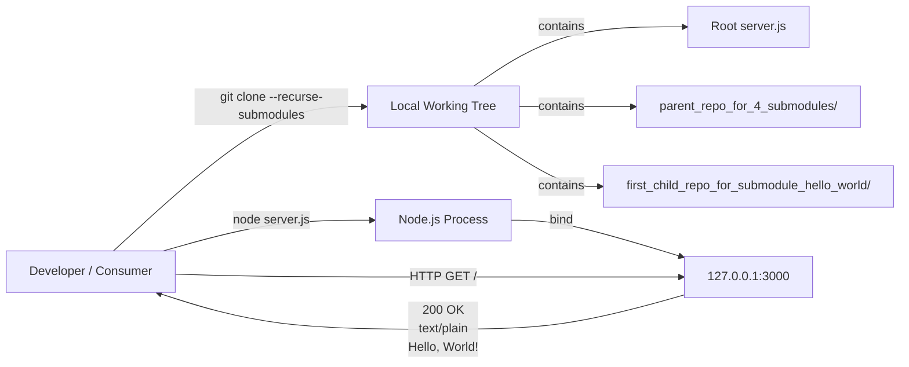

---

## 3.8 SECURITY POSTURE OF TECHNOLOGY CHOICES

### 3.8.1 Security Implications Matrix

Each technology choice (or deliberate non-choice) carries security implications that are documented as constraints rather than vulnerabilities:

| Technology Choice | Security Implication |
|-------------------|----------------------|
| Loopback-only binding (`127.0.0.1`) | Acts as a deliberate security boundary, preventing external reachability without code modification |
| `http` module (not `https`) | No TLS/HTTPS termination exists; the `https` module is not imported and no certificate material is present |
| Static response | No reflected user input, eliminating classic injection vectors (XSS, SQLi, log injection) |
| No request body parsing | Prevents parser-class vulnerabilities (prototype pollution via JSON, XML entity expansion, multipart attacks) |
| HTTPS submodule URLs | Provides transport integrity during initial Git clone from GitHub |
| Zero third-party dependencies | No supply-chain attack surface within the application layer |
| No `process.env` references | No environment-based configuration; no `.env` file exists to leak secrets |
| No authentication | No identity, session, or token machinery exists, so there are no credential-handling primitives to misconfigure |

### 3.8.2 Attack Surface Analysis

| Surface | Exposure |
|---------|----------|
| Network | Limited to the loopback interface; not reachable from external hosts |
| Application Code | 15 lines of JavaScript with no branching on user input |
| Dependency Graph | Empty (no third-party code) |
| Configuration | None (no externalized configuration to misconfigure) |
| Persistent State | None (no data at rest) |

**Caveat:** The minimal security posture is appropriate for the artifact's stated pedagogical role. Any extension toward production usage (e.g., external binding, request body handling, authentication, persistence) would re-introduce conventional attack surfaces and necessitate corresponding controls outside the scope of this specification.

---

## 3.9 TECHNOLOGY VERSION POLICY

### 3.9.1 Absence of Version Declarations

The repository declares no version metadata for any technology component. Specifically:

| Version Source | Status |
|----------------|--------|
| `package.json` `version` field | Not present (no manifest) |
| `package.json` `engines.node` field | Not present (no manifest) |
| `.nvmrc` / `.node-version` | Not present |
| `CHANGELOG.md` | Not present |
| Git tags referenced in source | None |
| Release manifest | None |

### 3.9.2 Implications for Operability

Per the Requirements Versioning record, *"All requirements documented here correspond to the current HEAD of each repository as inspected."* The operational consequence is:

- The system runs on whatever Node.js version the host provides, provided that version exposes the `http` module (a stable API across all maintained Node.js major versions).
- There is no upgrade procedure for application dependencies because there are no application dependencies.
- The submodule remotes are referenced by commit SHA in the parent repository's tree, which is Git's standard pin-by-content mechanism; this provides reproducibility for source acquisition without requiring an external semantic version scheme.

---

## 3.10 SUMMARY OF TECHNOLOGY CHOICES

The following table consolidates every technology decision documented above into a single reference:

| Category | Choice | Status |
|----------|--------|--------|
| Programming Language (application) | JavaScript on Node.js (CommonJS) | In use |
| Programming Language (metadata) | Git config syntax, Markdown | In use |
| Runtime | Node.js (version-agnostic) | In use |
| HTTP Server | Node.js core `http` module | In use |
| HTTP Framework | None (Express/Koa/Fastify/Hapi/NestJS rejected) | Deliberately absent |
| Third-Party Libraries | None | Deliberately absent |
| Package Manifest | None (no `package.json`) | Deliberately absent |
| Third-Party Services | GitHub (source hosting via HTTPS only) | In use for source acquisition only |
| Authentication Provider | None | Deliberately absent |
| Database / Storage | None (no SQL, NoSQL, cache, file I/O) | Deliberately absent |
| Build System | None | Deliberately absent |
| Containerization | None (no Dockerfile) | Deliberately absent |
| CI/CD Pipeline | None | Deliberately absent |
| Test Framework | None | Deliberately absent |
| Linter / Formatter | None | Deliberately absent |
| Version Control | Git with submodule support | In use |
| Source Composition | Git submodules (self-referential topology, depth-1 bounded) | In use |

---

## 3.11 REFERENCES

### 3.11.1 Files Examined

- `server.js` — Verified the 15-line CommonJS HTTP server source; confirmed Node.js `http` module usage, hardcoded `127.0.0.1:3000`, static response handler, no imports beyond `http`
- `.gitmodules` — Confirmed two HTTPS submodule declarations to the `github.com/lakshya-blitzy/` namespace
- `README.md` (root) — Confirmed title-only content
- `parent_repo_for_4_submodules/server.js` — Verified byte-identical to root `server.js`
- `parent_repo_for_4_submodules/.gitmodules` — Verified byte-identical to root `.gitmodules` (self-referential topology evidence)
- `parent_repo_for_4_submodules/README.md` — Confirmed title-only content
- `first_child_repo_for_submodule_hello_world/server.js` — Verified byte-identical to root `server.js`
- `first_child_repo_for_submodule_hello_world/README.md` — Confirmed title-only content

### 3.11.2 Folders Explored

- `/` (repository root) — Top-level directory; confirmed absence of `package.json`, `Dockerfile`, CI/CD configurations, test directories, lint configs
- `parent_repo_for_4_submodules/` — First submodule containing `server.js`, `.gitmodules`, `README.md`
- `first_child_repo_for_submodule_hello_world/` — Leaf submodule containing only `server.js` and `README.md` (no nested `.gitmodules`)

### 3.11.3 Technical Specification Sections Consulted

- **1.1 EXECUTIVE SUMMARY** — Established zero-dependency baseline, pedagogical nature, and value-proposition rationale used to justify technology choices
- **1.2 SYSTEM OVERVIEW** — Established technical context (no frameworks), language runtime, module system (CommonJS), KPIs (zero dependency count), and integration scope
- **1.3 SCOPE** — Provided definitive evidence-of-absence inventory for build, container, CI/CD, package management, testing, and database integrations
- **2.4 IMPLEMENTATION CONSIDERATIONS** — Source of the security implications matrix in Section 3.8
- **2.6 ASSUMPTIONS AND CONSTRAINTS** — Source of the constraint enumeration (loopback-only, hardcoded port, zero dependencies, no CI/CD) and version policy (no `version` field, no `CHANGELOG.md`, no Git tags)

# 4. Process Flowchart

## 4.1 INTRODUCTION AND SCOPE OF FLOWCHARTS

This section documents the complete set of process flows that the repository genuinely supports. Because the codebase is a deliberately minimal pedagogical artifact comprising eight non-Git files (three byte-identical `server.js` scripts, two byte-identical `.gitmodules` declaration files, and three title-only `README.md` files), the workflow surface is correspondingly narrow. All flowcharts below are grounded in the actual source files and the workflow inventory established in Section 1.3.1.2 and the traceability matrix in Section 2.5.3.

### 4.1.1 Documented Workflow Inventory

Exactly four end-to-end workflows are in scope for this specification. Every flowchart, sequence diagram, and state transition in this section corresponds to one or more of these workflows.

| Workflow ID | Workflow Name | Command / Action | Features Exercised |
|-------------|---------------|------------------|---------------------|
| W1 | Clone with Submodules | `git clone --recurse-submodules <repo-url>` | F-004, F-005, F-006 |
| W2 | Local Execution | `node server.js` | F-001, F-003 |
| W3 | Functional Verification | HTTP request to `http://127.0.0.1:3000/` | F-001, F-002 |
| W4 | Submodule Inspection | Read `.gitmodules` | F-004, F-005 |

### 4.1.2 Workflow Elements Explicitly Absent

The Process Flowchart prompt enumerates several conventional concerns (authentication checkpoints, transaction boundaries, retry mechanisms, regulatory compliance checks, batch processing, event processing, caching layers) that are typically present in enterprise systems. The repository under specification contains **none** of these. Per Section 1.3.2.1 and Section 2.4, the following workflow elements are absent and are therefore not represented in any flowchart in this section:

| Absent Workflow Element | Reason for Absence |
|------------------------|--------------------|
| Authentication / authorization flows | No identity, session, or token machinery exists; no headers are inspected |
| Request body parsing flows | Handler does not read `req` as a stream |
| Persistent storage transactions | No database driver, file I/O, or cache library is imported |
| HTTPS/TLS termination flows | `http.createServer` is used; the `https` module is not imported |
| Environment-based configuration flows | No `process.env` references; no `.env` file present |
| Health/metrics endpoints | No observability libraries; no `/health` or `/metrics` paths exist |
| Graceful shutdown sequences | No `process.on('SIGTERM'/'SIGINT')` handlers; no `server.close()` calls |
| Retry mechanisms / fallback processes | No code paths implement retries or fallback logic |
| Batch processing sequences | No batch job code exists |
| Event processing flows | No event broker; no event emitter beyond the `http` module's built-ins |
| Caching layers | No cache library imported |
| Regulatory compliance checks | None declared in any functional requirement table in Section 2.2 |
| Multi-process scaling flows | No `cluster` module usage |

This explicit enumeration prevents readers from assuming any of these flows exist by omission.

### 4.1.3 Swim Lane Actor Catalog

All flowcharts and sequence diagrams in this section use the following actors and systems as swim lanes. Each is grounded in either a literal source-file reference (`server.js`, `.gitmodules`) or an integration point documented in Section 2.3.2.

| Actor / System | Role | Evidence |
|----------------|------|----------|
| Developer / Consumer | Initiates clone, execution, and HTTP requests | User-facing workflows W1, W2, W3 |
| Git Client | Processes `.gitmodules`, fetches submodules | Section 2.3.2 — reads `.gitmodules` during `clone`, `submodule init`, `submodule update` |
| GitHub (HTTPS) | Source-hosting service for submodule remotes | URLs declared in `.gitmodules` target `github.com/lakshya-blitzy/...` |
| Node.js Runtime | Executes `server.js` | Section 3.3 — Node.js is the execution environment |
| Node.js `http` Core Module | Provides `createServer`, `listen`, response API | `require('http')` invoked at line 1 of `server.js` |
| OS TCP/IP Stack | Binds the loopback socket and accepts connections | Implicit via `server.listen(3000, '127.0.0.1', ...)` |
| HTTP Client | Sends requests to verify the response (curl, browser, etc.) | Workflow W3 |
| `process.stdout` | Receives the single startup log line | Section 2.3.2 — `console.log` writes to `process.stdout` |

---

## 4.2 HIGH-LEVEL SYSTEM WORKFLOW

### 4.2.1 End-to-End User Journey

The complete user journey traverses all four workflows in a typical first-time consumption pattern: a developer clones the repository tree (W1), inspects the submodule declarations (W4), executes the server (W2), and verifies the response (W3). The high-level sequence diagram below captures this journey across all swim lane actors.

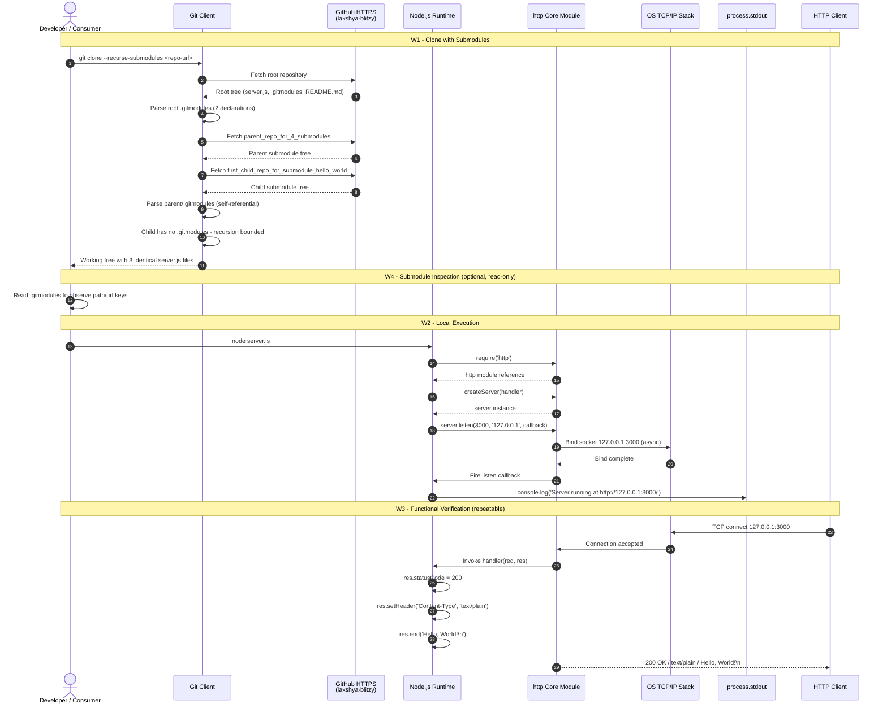

### 4.2.2 Workflow-to-Feature Cross-Reference

The high-level workflow above traverses the entire feature catalog defined in Section 2.1. The mapping below ensures every implemented feature is exercised by at least one workflow.

| Feature ID | Feature Name | Exercised By |
|------------|--------------|--------------|
| F-001 | HTTP Server Listener Binding | W2, W3 |
| F-002 | Static HTTP Response Handler | W3 |
| F-003 | Startup Confirmation Logging | W2 |
| F-004 | Git Submodule Declaration | W1, W4 |
| F-005 | Self-Referential Submodule Topology | W1, W4 |
| F-006 | Title-Only README Documentation | W1 |

### 4.2.3 System Boundary Overview

Each workflow crosses a well-defined system boundary. The diagram below positions every actor relative to the boundaries enumerated in Section 1.3.1.5.

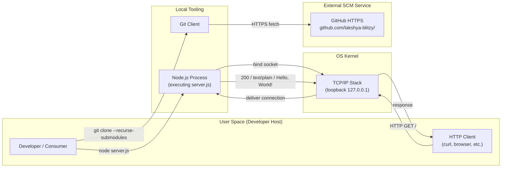

---

## 4.3 CORE BUSINESS PROCESS FLOWS

Each of the four documented workflows is decomposed below into its sequential process steps, decision points, validation rules, and error paths. Note that "business processes" in the conventional sense (e.g., order fulfillment, payment processing) do not exist in this repository; the term is therefore interpreted as the deterministic operational processes the artifact supports.

### 4.3.1 Workflow W1: Clone with Submodules

#### 4.3.1.1 Process Steps

This workflow is initiated by a developer issuing `git clone --recurse-submodules <repo-url>` against the root repository URL. The Git client performs the following sequence:

1. The developer invokes `git clone --recurse-submodules` against `github.com/lakshya-blitzy/parent_repo_for_4_submodules`.
2. The Git client establishes an HTTPS connection to GitHub and fetches the root repository tree.
3. The Git client parses `.gitmodules` and identifies the two `[submodule "<name>"]` sections.
4. For each declaration, the Git client validates the `path` and `url` keys.
5. The Git client fetches `parent_repo_for_4_submodules` via HTTPS from `github.com/lakshya-blitzy/parent_repo_for_4_submodules.git`.
6. The Git client fetches `first_child_repo_for_submodule_hello_world` via HTTPS from `github.com/lakshya-blitzy/first_child_repo_for_submodule_hello_world.git`.
7. The Git client inspects `parent_repo_for_4_submodules/.gitmodules`, which contains byte-identical declarations (the self-referential topology in F-005).
8. The Git client checks `first_child_repo_for_submodule_hello_world/` for a nested `.gitmodules`; finding none, recursion is bounded at depth 1.
9. Each submodule directory is linked to the parent repository via a gitfile pointer under `.git/modules/<name>`.
10. The working tree is populated with three byte-identical `server.js` files at the root, parent submodule, and child submodule locations.

#### 4.3.1.2 Decision Points and Validation Rules

The clone workflow contains the following decision diamonds and validation checkpoints, all grounded in the validation rules of Section 2.2.4.3 and Section 2.2.5.3:

| Decision Point | Validation Rule | Source |
|----------------|-----------------|--------|
| Is the network reachable to `github.com`? | HTTPS transport must be available | Section 1.2.3.2 — critical success factor |
| Are submodule declarations present in `.gitmodules`? | Root `.gitmodules` MUST list exactly two `[submodule "<name>"]` sections | F-004-RQ-001 |
| Do submodule URLs target the `lakshya-blitzy` organization? | URLs MUST target the `lakshya-blitzy` GitHub organization | F-004-RQ-001 validation rule |
| Are submodule URLs HTTPS? | URLs MUST use HTTPS (no SSH variants declared) | F-004-RQ-001 data validation rule |
| Is there a nested `.gitmodules` in the child submodule? | Leaf submodule MUST NOT contain a nested `.gitmodules`, bounding recursion at depth 1 | F-005-RQ-001 business rule |

#### 4.3.1.3 Error and Recovery Paths

Per Section 1.2.3.2 and Section 2.4, the following failure modes apply. The repository implements no automated recovery for any of them; remediation is fully manual.

| Failure Mode | Effect | Recovery |
|--------------|--------|----------|
| Network unavailable to `github.com/lakshya-blitzy` | Git client surfaces clone failure | Developer retries after restoring connectivity |
| Git client lacks submodule support | Submodule directories remain empty | Developer upgrades Git client |
| Developer omits `--recurse-submodules` | Root tree present; submodule directories empty | Developer runs `git submodule update --init --recursive` |

#### 4.3.1.4 Flowchart — Clone with Submodules

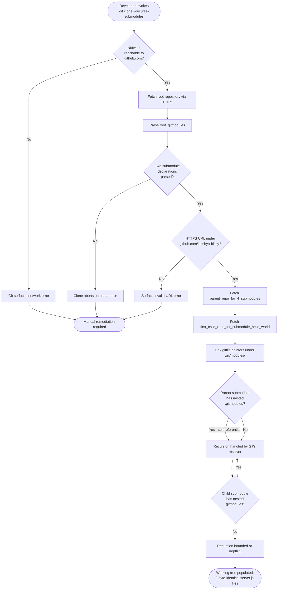

### 4.3.2 Workflow W2: Local Execution

#### 4.3.2.1 Process Steps

This workflow is initiated by a developer issuing `node server.js`. The Node.js runtime executes the 15-line script in the following sequence:

1. The developer invokes `node server.js`.
2. The Node.js process starts.
3. Line 1 of `server.js` calls `require('http')` to load the core HTTP module via CommonJS resolution.
4. Lines 3–4 initialize the module-scope constants `hostname = '127.0.0.1'` and `port = 3000`.
5. Lines 6–10 invoke `http.createServer(callback)`, where the callback is the inline static-response handler.
6. Line 12 invokes `server.listen(port, hostname, callback)`, beginning an asynchronous bind.
7. The OS TCP/IP stack performs the bind operation against `127.0.0.1:3000`.
8. On successful bind, the `listen` callback fires.
9. Line 13 executes `console.log` to write the single startup log line to `process.stdout`.
10. The process remains alive in the LISTENING state, awaiting HTTP connections.

#### 4.3.2.2 Decision Points

Per Section 2.4.1 and Section 1.2.1.2, the execution path contains the following implicit decision points. The script itself contains no conditional logic; all decisions occur in the runtime or OS layer.

| Decision Point | Outcome on Success | Outcome on Failure |
|----------------|--------------------|--------------------|
| Is Node.js installed on the host? | Process starts | Shell reports "command not found"; no further execution |
| Is TCP port 3000 available on loopback? | `listen` callback fires | `EADDRINUSE` thrown; process crashes (no handler exists per Section 1.3.2.1) |
| Did the `listen()` async bind complete? | Callback proceeds to log emission | Process terminates without emitting the log line |

#### 4.3.2.3 Error States

Per Section 1.3.2.4, the system supports no error-recovery flow during local execution. The script registers no `.on('error')` listeners on the server instance, no `process.on('uncaughtException')` handler, and no signal handlers. All errors propagate to the runtime and result in abrupt process termination.

#### 4.3.2.4 Flowchart — Local Execution

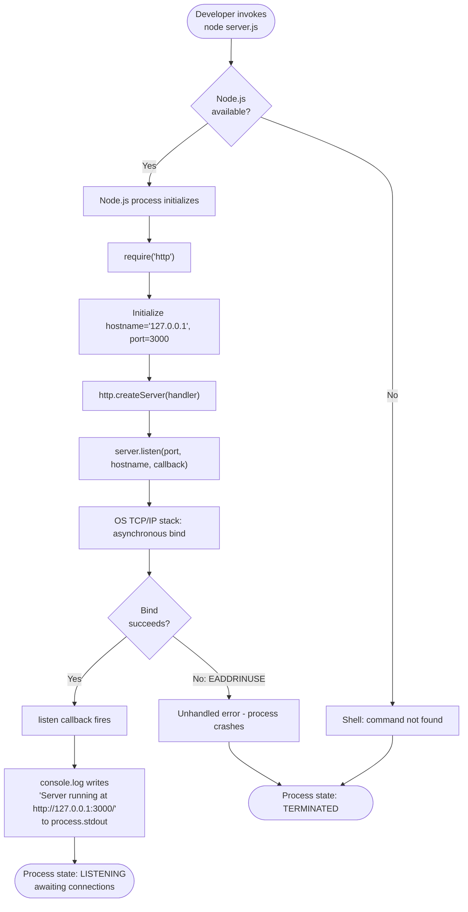

### 4.3.3 Workflow W3: Functional Verification

#### 4.3.3.1 Process Steps

This workflow is initiated by any HTTP client issuing a request to `http://127.0.0.1:3000/`. Per Section 2.2.2, every request — regardless of method, path, headers, or body — receives the identical response.

1. The HTTP client sends an HTTP request (method, path, headers, and body are all ignored).
2. The OS TCP/IP stack delivers the connection to the listening socket on `127.0.0.1:3000`.
3. The Node.js `http` module parses the incoming request.
4. The inline request handler is invoked with `(req, res)` parameters.
5. The handler does **not** inspect `req.url`, `req.method`, headers, or body.
6. Line 7 sets `res.statusCode = 200`.
7. Line 8 sets the `Content-Type: text/plain` header via `res.setHeader`.
8. Line 9 invokes `res.end('Hello, World!\n')`, terminating the response with a literal 14-byte body.
9. The response is transmitted back to the client.
10. The connection closes per standard HTTP semantics, and the process returns to the LISTENING state.

#### 4.3.3.2 Validation Rules

Per Section 2.2.2.3, the static response handler enforces a strict set of business and security rules. These rules represent the totality of validation in the workflow.

| Validation Rule | Specification | Source |
|-----------------|---------------|--------|
| Determinism | Response MUST be deterministic and stateless | F-002-RQ-001 business rule |
| Content-Type | Header MUST NOT advertise HTML, JSON, or any structured format | F-002-RQ-002 business rule |
| Body content | Body MUST include the trailing newline character | F-002-RQ-003 business rule |
| No user reflection | Handler MUST NOT reflect user input | F-002-RQ-001 security requirement |
| No framework exposure | Handler MUST NOT expose framework or runtime version headers | F-002-RQ-002 security requirement |
| No sensitive data | Body MUST NOT include any sensitive identifiers | F-002-RQ-003 security requirement |
| No conditional branches | No conditional branches based on request data | F-002-RQ-001 data validation |
| No content negotiation | No content negotiation logic | F-002-RQ-002 data validation |
| Literal body | No template substitution; body is a literal string | F-002-RQ-003 data validation |

#### 4.3.3.3 Performance Characteristics and Determinism

Per Section 2.4.2, the handler exhibits the following deterministic performance characteristics:

| Metric | Value |
|--------|-------|
| Response status rate | 100% of requests receive `200 OK` |
| Handler execution time | Constant-time, allocation-light response path |
| I/O or computation in handler | None |
| Conditional logic branches | Zero |

Because zero conditional branches exist in the handler, the workflow contains no decision diamonds at the application layer. The only branching occurs at the OS-level TCP accept stage, which is outside the scope of the application logic.

#### 4.3.3.4 Flowchart — Request/Response Lifecycle

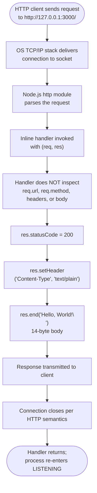

### 4.3.4 Workflow W4: Submodule Inspection

#### 4.3.4.1 Process Steps

This workflow is a read-only inspection workflow. It supports developers who wish to understand the submodule topology without performing any clone or execution.

1. The developer opens the `.gitmodules` file at either the root location or within `parent_repo_for_4_submodules/`.
2. The developer parses the INI-like Git configuration syntax.
3. The developer identifies the two `[submodule "<name>"]` sections.
4. Each section contains a `path` key and a `url` key.
5. The URLs are observed to be HTTPS endpoints under `github.com/lakshya-blitzy/`.

#### 4.3.4.2 Validation of the Self-Referential Topology

Per F-005-RQ-001, a byte-level comparison (e.g., `diff`) between the root `.gitmodules` and `parent_repo_for_4_submodules/.gitmodules` must return zero differences. This is the acceptance criterion for the self-referential topology feature.

#### 4.3.4.3 Flowchart — Submodule Inspection

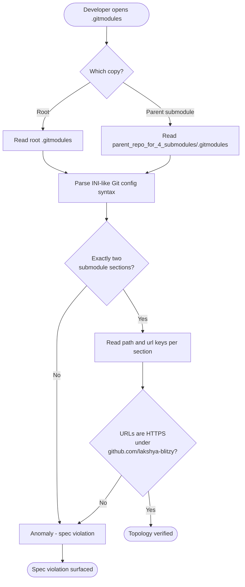

---

## 4.4 INTEGRATION WORKFLOWS

Per Section 2.3.2, the system has exactly five integration points. There are no databases, message queues, external APIs, identity providers, secret managers, container orchestrators, service meshes, or observability backends (per Section 1.3.2.3). The integration workflows below cover only the genuine integration surface.

### 4.4.1 Integration Sequence — Source Acquisition

The source-acquisition integration involves the Git client, the GitHub HTTPS endpoints, and the local filesystem. The sequence diagram below represents the actor-to-actor exchanges during workflow W1.

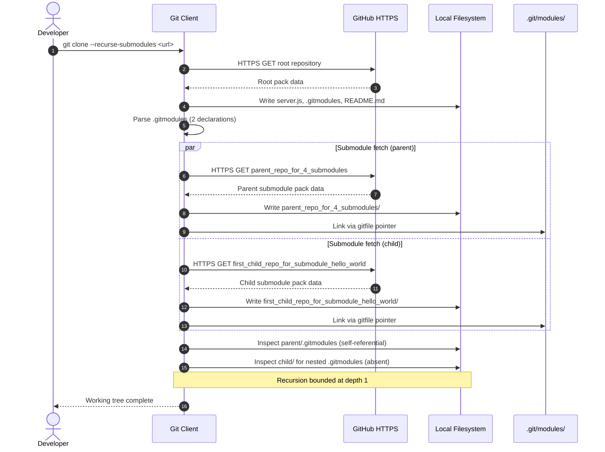

### 4.4.2 Integration Sequence — HTTP Request Lifecycle

The HTTP integration spans the HTTP client, the OS TCP/IP stack, the Node.js `http` core module, and the inline handler. There are no upstream integrations during request processing because the handler performs no I/O, no database calls, no external API calls, and no event emission beyond the `http` module's built-ins.

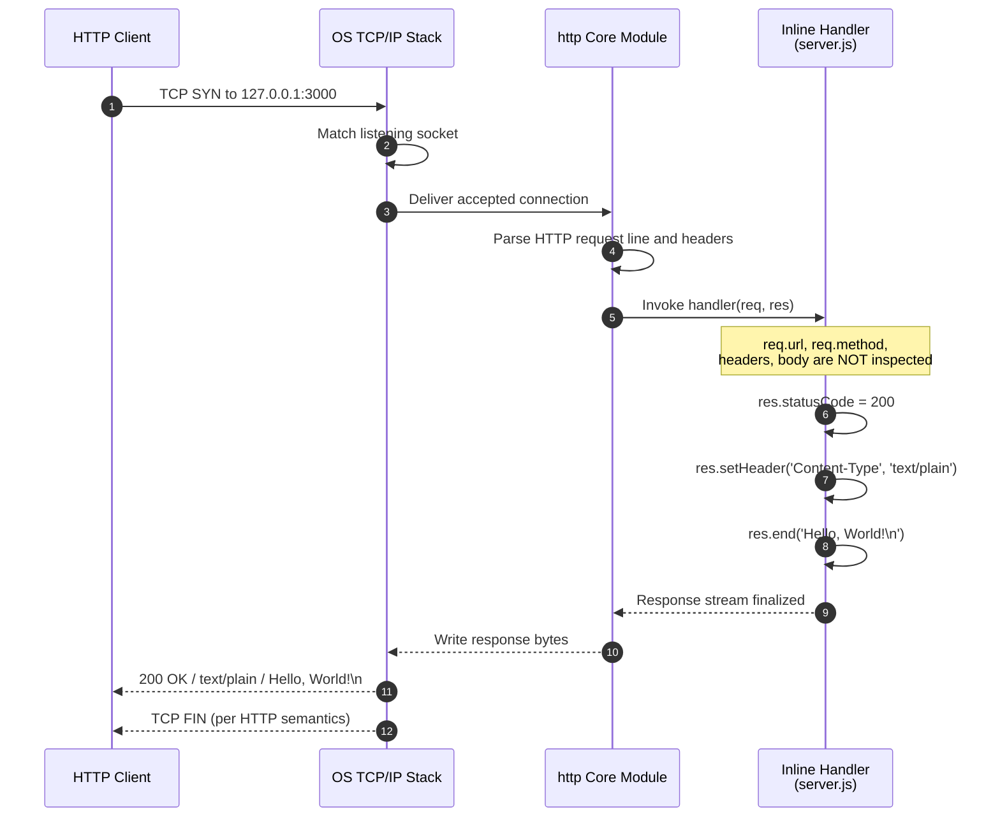

### 4.4.3 Integration Sequence — Startup Logging

The single startup log line is the system's only observability touchpoint. The sequence below captures its emission relative to the bind completion.

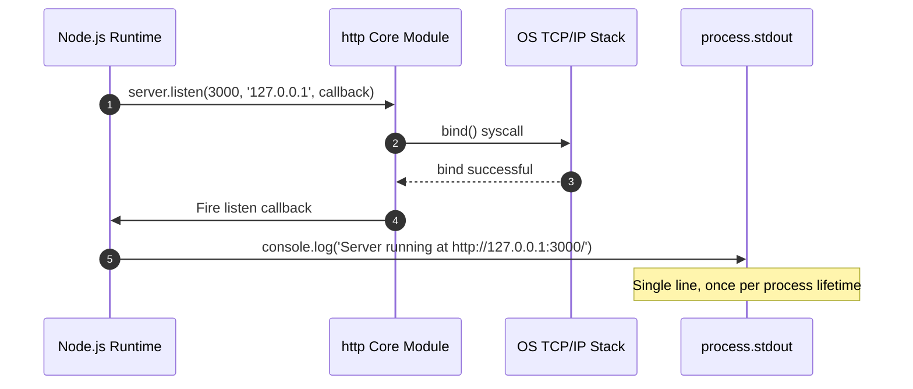

### 4.4.4 Out-of-Scope Integration Patterns

Per Section 1.3.2.3, the following integration patterns commonly found in production systems are explicitly absent. They are listed here to clarify what the flowcharts above do **not** include.

| Integration Pattern | Status |
|---------------------|--------|
| API calls to external REST/GraphQL/SOAP services | Not integrated; no HTTP client used outside the inbound server |
| Database queries (SQL/NoSQL) | Not integrated; no drivers present |
| Message queue publish/subscribe | Not integrated; no client libraries present |
| Identity provider exchanges (OAuth/OIDC/SAML) | Not integrated; no authentication flow exists |
| Secret manager retrieval | Not integrated; no secrets are read or stored |
| Telemetry export (Prometheus / OpenTelemetry / ELK) | Not integrated |
| Batch processing job submission | No batch jobs exist |
| Event broker publish/consume | No event broker beyond the `http` module's built-in event emitters |

---

## 4.5 STATE MANAGEMENT FLOWS

### 4.5.1 State Management Reality

Per Section 2.4.1 and Section 1.3.2.1, the system manages **no persistent state, no in-memory application state, no session state, no cache, and no transaction boundaries**. The only state that exists is the implicit lifecycle state of the Node.js process itself.

| State Concern | Verified Status | Evidence |
|---------------|-----------------|----------|
| Persistent storage | NONE | No database driver, file I/O, or cache library imported |
| In-memory application state | NONE | No state allocation in `server.js`; handler is stateless |
| Request body parsing / buffering | NONE | Handler does not read `req` as a stream |
| Routing / dispatch table | NONE | `req.url` and `req.method` are ignored |
| Session state | NONE | No auth, no cookies, no token machinery |
| Cache layer | NONE | No caching libraries imported |
| Transaction boundaries | NONE | No DB, no transactional API |

### 4.5.2 Process Lifecycle States

The only "states" that exist are the lifecycle states of the Node.js process. These are derived directly from the execution sequence of `server.js`.

| State | Trigger | Observable Indicator |
|-------|---------|----------------------|
| STARTING | `node server.js` invoked | Process exists; `http.createServer` returning a server instance |
| BINDING | `server.listen(3000, '127.0.0.1', cb)` called | Asynchronous OS bind in progress |
| LISTENING | OS bind succeeded, `listen` callback fired | Startup log line emitted to `process.stdout`; `netstat`/`lsof` shows the listening socket |
| HANDLING | TCP connection accepted; handler invoked | Sub-millisecond transient state during response generation |
| TERMINATED | Process killed externally (SIGINT, SIGKILL, etc.) | Process exit; no graceful shutdown path |

### 4.5.3 State Transition Diagram

```mermaid
stateDiagram-v2
    [*] --> STARTING : node server.js invoked
    STARTING --> BINDING : http.createServer returns;<br/>listen() called
    BINDING --> LISTENING : OS bind succeeds;<br/>listen callback fires;<br/>startup log emitted
    BINDING --> TERMINATED : EADDRINUSE<br/>(unhandled - process crashes)
    LISTENING --> HANDLING : TCP connection accepted;<br/>handler invoked
    HANDLING --> LISTENING : res.end() completes;<br/>connection closes
    LISTENING --> TERMINATED : SIGINT / SIGKILL<br/>(abrupt - no signal handler)
    HANDLING --> TERMINATED : SIGINT / SIGKILL<br/>(abrupt - no signal handler)
    TERMINATED --> [*]
```

### 4.5.4 Data Persistence Points

There are zero data persistence points in the system. No data is written to disk by the application logic, no data is stored in memory across requests, and no data is cached. The only filesystem interaction is the read-side activity of the Node.js runtime loading `server.js` and the `http` core module at startup.

### 4.5.5 Caching and Transaction Boundaries

No caching layer exists in the application. No transaction boundaries are defined because no transactional API is consumed. These concerns are explicitly out of scope per Section 1.3.2.3.

---

## 4.6 ERROR HANDLING FLOWS

### 4.6.1 Error Handling Reality

Per Section 1.2.1.2 and Section 1.3.2.1, the system implements no automated error handling. Every failure mode results in either process crash or user-visible tooling error. The flowchart below captures the complete error surface.

| Absent Error-Handling Capability | Reason |
|----------------------------------|--------|
| Retry mechanisms | No code paths implement retries |
| Fallback processes | No fallback logic present |
| Error notification flows | No notification channels are configured |
| Recovery procedures | No recovery code paths exist |
| `.on('error')` listeners on server instance | None registered |
| `process.on('uncaughtException')` handler | Not registered |
| Signal handlers (SIGTERM/SIGINT) | Not registered |
| Graceful shutdown (`server.close()`) | Not invoked |
| Request-level error logging | Only a single `console.log` exists, executed once at bind time |

### 4.6.2 Observed Error Surfaces

The following error surfaces exist but are not handled by application code. The "Outcome" column documents what actually happens in the absence of handlers.

| Error Surface | Trigger | Outcome (Unhandled) |
|---------------|---------|---------------------|
| `EADDRINUSE` on bind | Port 3000 already in use | Process crashes; no automated recovery (per Section 1.3.2.4) |
| Network error during clone | GitHub unreachable | Git client surfaces network error to the developer |
| Node.js missing | `node` binary absent | Shell reports command not found |
| SIGINT / SIGKILL received | User or supervisor signals | Abrupt termination; no `server.close()` invoked |
| Malformed HTTP request | Client error at parse stage | Handled internally by the `http` core module; handler never invoked |
| Request body too large / malformed | Stream events emitted | Not observed by the handler (body is never read) |

### 4.6.3 Error Handling Flowchart

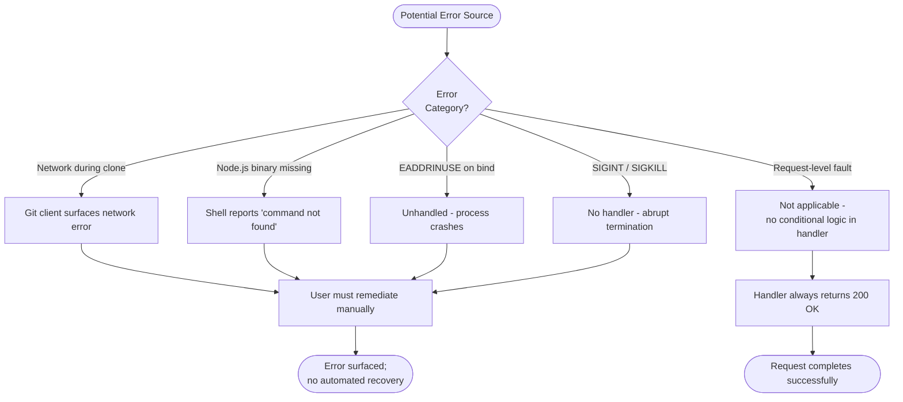

### 4.6.4 Recovery Procedures

Because no automated recovery is implemented, recovery is exclusively a manual developer action. The procedures below summarize the expected manual remediation for each error class:

| Error | Manual Recovery |
|-------|-----------------|
| `EADDRINUSE` | Identify the process occupying port 3000 (e.g., `lsof -i :3000`), terminate it, then re-run `node server.js` |
| Network error during clone | Restore network connectivity to `github.com`, then re-issue `git clone --recurse-submodules` |
| Node.js missing | Install a Node.js runtime; any maintained version satisfies the `http` module requirement (per Section 3.7.1) |
| Process killed externally | Re-invoke `node server.js`; no state is persisted, so re-execution is idempotent |
| Submodule directories empty (forgot `--recurse-submodules`) | Run `git submodule update --init --recursive` |

---

## 4.7 TIMING AND SLA CONSIDERATIONS

### 4.7.1 No Declared SLAs

Per Section 1.2.3.3, the repository does not declare or measure runtime performance characteristics. There are no formal Service Level Agreements, Service Level Objectives, or response time targets. The indicators below are the observable performance characteristics of the system in its current form, not contractual commitments.

### 4.7.2 Observable Performance Indicators

| Indicator | Expected Value | Source |
|-----------|----------------|--------|
| Startup time (synchronous construction) | Sub-millisecond for `http.createServer` | Section 2.2.1.2 |
| Startup time (asynchronous bind) | Sub-second for `listen()` bind completion | Section 2.2.1.2 |
| Startup log emission | Sub-millisecond synchronous write after bind completion | Section 2.2.3.2 |
| Response status rate | 100% of requests receive `200 OK` | Section 2.4.2 |
| Handler execution time | Constant-time, allocation-light response path | Section 2.4.2 |
| Memory footprint | Bounded by the default Node.js process baseline; no in-memory state allocated | Section 1.2.3.3 |
| Dependency count | Zero third-party packages | Section 1.2.3.3 |

### 4.7.3 Timing Constraints on Workflow Transitions

The diagram below visualizes the relative timing of state transitions during W2 (Local Execution).

```mermaid
flowchart LR
    T0([t=0:<br/>node server.js]) -->|sub-ms| T1([t<1ms:<br/>http.createServer returns])
    T1 -->|sub-ms| T2([t<1ms:<br/>listen() called])
    T2 -->|sub-second async| T3([t<1s:<br/>OS bind completes])
    T3 -->|sub-ms| T4([t<1s+:<br/>callback fires;<br/>console.log emits])
    T4 --> T5([LISTENING<br/>indefinitely])
```

### 4.7.4 Scalability and Concurrency Boundaries

Per Section 2.4.3, the following concurrency boundaries apply to the runtime workflow:

| Concern | Boundary |
|---------|----------|
| Concurrent port use | A single instance per host is the maximum; port 3000 is hardcoded |
| Connection backlog | Default Node.js `listen()` backlog applies; no tuning configured |
| Multi-process scaling | Out of scope; no `cluster` module usage |
| Memory growth under load | Bounded by Node.js baseline; no state allocated by the application |

---

## 4.8 CONSOLIDATED PROCESS FLOW SUMMARY

### 4.8.1 Cross-Workflow Process Map

The diagram below ties together all four workflows into a single end-to-end view, illustrating how source acquisition (W1, W4), execution (W2), and verification (W3) compose.

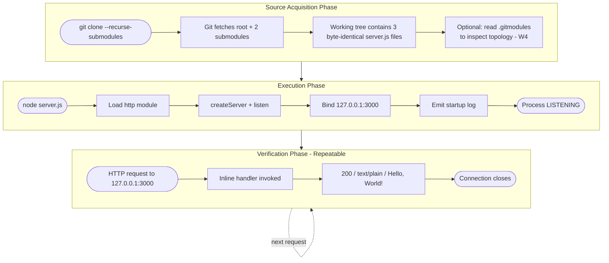

### 4.8.2 Authoritative Sources for Each Diagram

| Diagram | Authoritative Source |
|---------|----------------------|
| High-level sequence (Section 4.2.1) | `server.js` lines 1–14; `.gitmodules` content; Section 1.3.1.2 workflow inventory |
| System boundary (Section 4.2.3) | Section 1.3.1.5 boundaries; Section 2.3.2 integration points |
| W1 clone flowchart (Section 4.3.1.4) | Root `.gitmodules`; Section 1.3.1.2; Section 2.2.4.3 validation rules |
| W2 execution flowchart (Section 4.3.2.4) | `server.js` lines 1–14; Section 1.2.1.2; Section 2.2.1 |
| W3 request/response flowchart (Section 4.3.3.4) | `server.js` lines 6–10; Section 2.2.2 |
| W4 submodule inspection flowchart (Section 4.3.4.3) | `.gitmodules` content; Section 2.2.5 |
| Source acquisition sequence (Section 4.4.1) | Section 2.3.2; root `.gitmodules` |
| HTTP request lifecycle sequence (Section 4.4.2) | `server.js` lines 6–10; Section 2.2.2 |
| Startup logging sequence (Section 4.4.3) | `server.js` lines 12–14; Section 2.2.3 |
| State transition diagram (Section 4.5.3) | Section 2.4 process lifecycle; Section 1.3.2.1 |
| Error handling flowchart (Section 4.6.3) | Section 1.3.2.1 absent capabilities; Section 1.3.2.4 |
| Timing sequence (Section 4.7.3) | Section 2.4.2 performance requirements |
| Cross-workflow process map (Section 4.8.1) | All four workflows from Section 1.3.1.2 |

---

## 4.9 REFERENCES

### 4.9.1 Files Examined

- `server.js` — 15-line root HTTP server implementation; primary source for W2 execution flowchart, W3 request/response flowchart, integration sequence diagrams, and the state transition diagram. Byte-identical copies exist at `parent_repo_for_4_submodules/server.js` and `first_child_repo_for_submodule_hello_world/server.js`.
- `.gitmodules` — 7-line root submodule declaration; primary source for the W1 clone workflow flowchart and the source-acquisition integration sequence. A byte-identical copy exists at `parent_repo_for_4_submodules/.gitmodules` (the self-referential topology).
- `README.md` (root) — Title-only documentation; referenced for the F-006 feature exercised by W1.
- `parent_repo_for_4_submodules/` — Submodule directory; documented as the self-referential layer in W1 and W4.
- `first_child_repo_for_submodule_hello_world/` — Submodule directory; documented as the recursion-boundary layer (no nested `.gitmodules`) in W1 and W4.

### 4.9.2 Technical Specification Sections Cross-Referenced

- **Section 1.2 SYSTEM OVERVIEW** — Project context, current system limitations (no error handlers, no signal handlers, no observability beyond startup log), primary system capabilities, success criteria, and KPIs informing Section 4.7 timing considerations.
- **Section 1.3 SCOPE** — Authoritative inventory of in-scope workflows (Section 1.3.1.2), implementation boundaries (Section 1.3.1.5), and explicitly excluded capabilities (Section 1.3.2.1) informing Section 4.1.2.
- **Section 2.1 FEATURE CATALOG** — Six discrete features (F-001 through F-006) mapped to workflows in Section 4.2.2.
- **Section 2.2 FUNCTIONAL REQUIREMENTS TABLE** — Source of validation rules in Sections 4.3.1.2 (clone validation), 4.3.2.2 (execution decision points), 4.3.3.2 (request/response validation), and 4.3.4.2 (submodule topology validation).
- **Section 2.3 FEATURE RELATIONSHIPS** — Integration points enumerated in Section 2.3.2, informing the integration sequence diagrams in Section 4.4.
- **Section 2.4 IMPLEMENTATION CONSIDERATIONS** — Technical constraints, performance requirements, scalability boundaries, and security implications informing Sections 4.5 (state management), 4.6 (error handling), and 4.7 (timing).
- **Section 2.5 TRACEABILITY MATRIX** — Feature-to-workflow mapping (Section 2.5.3) as the authoritative source for the four documented workflows.
- **Section 2.6 ASSUMPTIONS AND CONSTRAINTS** — Operating assumptions and verified constraints informing the boundary diagrams.
- **Section 3.1 OVERVIEW AND GUIDING PRINCIPLES** — Stack topology informing the system boundary diagram in Section 4.2.3.
- **Section 3.7 DEVELOPMENT & DEPLOYMENT** — Development tools, version control, and the deployment workflow diagram (Section 3.7.6) as a precedent for the cross-workflow process map in Section 4.8.1.

# 5. System Architecture

## 5.1 HIGH-LEVEL ARCHITECTURE

### 5.1.1 System Overview

#### 5.1.1.1 Architecture Style and Rationale

The system implements a **single-process, single-file, monolithic Node.js HTTP server** built exclusively on the Node.js core `http` module. The entire runtime behavior is encapsulated in a 15-line CommonJS script (`server.js`) that creates an HTTP listener bound to the loopback interface and returns a deterministic static response to every request.

The architectural style is intentionally **framework-less and dependency-less**. The repository carries no `package.json`, no lockfile, no third-party libraries, and no transitive supply chain. This zero-dependency posture is a deliberate architectural choice that eliminates supply-chain considerations, lockfile management, and package registry interactions entirely, exposing raw HTTP semantics through Node.js's built-in standard library.

The codebase is composed via **Git submodules** rather than module-level reuse. Two submodules are declared: a self-referential `parent_repo_for_4_submodules` and a leaf `first_child_repo_for_submodule_hello_world`. The submodule topology is bounded at depth 1 because the child submodule contains no nested `.gitmodules` file. The result is a working tree containing **three byte-identical copies of `server.js`** — these are not logically distinct components but rather replicated artifacts of the source-composition topology.

#### 5.1.1.2 Key Architectural Principles

- **Minimalism as Architecture**: Every architectural element not strictly required to satisfy the "Hello, World!" contract is omitted by design — no routing, no middleware, no content negotiation, no persistence, no observability beyond a single startup log.
- **Standard Library Sufficiency**: The Node.js core `http` module provides all required HTTP semantics. Frameworks such as Express, Koa, Fastify, Hapi, and NestJS are explicitly rejected.
- **Deterministic Stateless Response**: The request handler ignores all properties of the incoming request — `req.url`, `req.method`, headers, and body are not inspected. The same response is returned to every request.
- **Hardcoded Configuration**: Hostname (`127.0.0.1`) and port (`3000`) are inline constants. No `process.env`, no `.env`, no CLI flags, no configuration file.
- **CommonJS Module System**: `require('http')` is used in lieu of ESM `import`, maximizing compatibility across all Node.js versions without configuration.
- **Loopback as Security Boundary**: Binding exclusively to `127.0.0.1` is itself the network security control — the server is not addressable from external hosts.

#### 5.1.1.3 System Boundaries and Major Interfaces

The system spans four boundary zones, each crossed by exactly one type of interaction:


Key interfaces are limited to:

- **Outbound HTTPS to GitHub** (clone time only) for source acquisition
- **Inbound TCP on loopback `127.0.0.1:3000`** for HTTP requests
- **In-process `require()`** of the Node.js `http` core module
- **`process.stdout`** for the single startup log line

### 5.1.2 Core Components

The system contains a small set of physical and logical components. Three logical features inside `server.js` (F-001, F-002, F-003) are paired with the source-composition artifacts (`.gitmodules`, submodule directories).

| Component | Primary Responsibility | Key Dependencies |
|-----------|------------------------|------------------|
| HTTP Listener Binding (F-001) | Create the HTTP server instance and bind to `127.0.0.1:3000` via `http.createServer()` and `server.listen()` | Node.js `http` core module; OS TCP/IP stack |
| Static Response Handler (F-002) | Set status 200, `Content-Type: text/plain`, write body `Hello, World!\n` for every request | Node.js `http` `res` object methods |
| Startup Confirmation Logging (F-003) | Emit a single `console.log` line after successful bind | `process.stdout` |
| Submodule Configuration (`.gitmodules`) | Declare two Git submodules with `path` and HTTPS `url` keys | Git client; HTTPS access to GitHub |
| Parent Submodule (self-referential) | Replicate root tree (including its own `.gitmodules`) under `parent_repo_for_4_submodules/` | Git submodule recursion |
| Child Submodule (leaf) | Replicate `server.js` under `first_child_repo_for_submodule_hello_world/`; terminates recursion (no nested `.gitmodules`) | Git submodule resolution |

#### 5.1.2.1 Critical Considerations Per Component

| Component | Critical Considerations |
|-----------|-------------------------|
| HTTP Listener Binding | Hardcoded port → `EADDRINUSE` is fatal; single-instance-per-host limit; default `listen()` backlog with no tuning |
| Static Response Handler | Constant-time, allocation-light; ignores all request data; no exception paths exercised |
| Startup Confirmation Logging | Fires exactly once per process lifetime; only observability signal in the system |
| `.gitmodules` | INI-like syntax; HTTPS-only transport; no branch tracking or shallow-clone hints |
| Parent Submodule | Recursion terminates at depth 1; produces a byte-identical copy of `server.js` |
| Child Submodule | Leaf node in submodule graph; absence of nested `.gitmodules` is a structural invariant |

### 5.1.3 Data Flow Description

The system has two distinct data flow regimes: a **source-composition flow** executed once at clone time, and a **runtime HTTP request flow** executed per request.

#### 5.1.3.1 Source-Composition Data Flow (Clone Time)

When a developer invokes `git clone --recurse-submodules`, the Git client establishes an HTTPS connection to `github.com/lakshya-blitzy/` and fetches the root tree. It then parses the root `.gitmodules`, identifies two submodule declarations, and fetches each by HTTPS. Upon recursing into `parent_repo_for_4_submodules`, Git inspects its (byte-identical) nested `.gitmodules` and continues; recursion terminates when the child submodule is found to lack any `.gitmodules`. The resulting working tree contains three byte-identical `server.js` files. This flow is fully described by Workflow W1 and traverses no application logic.

#### 5.1.3.2 Runtime HTTP Request Data Flow

The runtime path is event-driven and stateless. A client establishes a TCP connection to `127.0.0.1:3000`; the OS TCP/IP stack delivers the accepted connection to the listening socket; the Node.js `http` module parses the HTTP envelope and invokes the registered inline arrow-function handler. The handler **does not read `req.url`, `req.method`, headers, or body**. It synchronously sets `res.statusCode = 200`, sets `Content-Type: text/plain` via `res.setHeader`, and calls `res.end('Hello, World!\n')`. The Node.js `http` module serializes the response over the TCP socket, the connection closes per HTTP semantics, and the process re-enters the LISTENING state.

#### 5.1.3.3 Data Transformation Points

There are **no data transformation points in application code**. No template substitution, no JSON serialization, no parsing of request bodies, no content negotiation, no encoding conversion. The only "transformation" is whatever framing the Node.js `http` module performs internally to convert handler-side `res` API calls into wire-format HTTP/1.1 bytes.

#### 5.1.3.4 Data Stores and Caches

There are **no data stores and no caches** in the system. There is no database driver, file I/O, or cache library imported; the handler is stateless; no caching libraries are present; no session state, no cookies, no token machinery exist. The only filesystem interaction is the read-side activity of Node.js loading `server.js` and the `http` core module at startup.

### 5.1.4 External Integration Points

The system's external integration surface is intentionally narrow. The table below enumerates every external integration and its operational characteristics.

| System Name | Integration Type | Data Exchange Pattern | Protocol / Format |
|-------------|------------------|------------------------|-------------------|
| GitHub (`github.com/lakshya-blitzy`) | SCM source hosting | Pull (HTTPS fetch at clone time only) | HTTPS / Git pack |
| OS TCP/IP Stack (loopback) | Network socket | Bind & listen / per-connection accept | TCP on `127.0.0.1:3000` |
| `process.stdout` | OS standard stream | Write-once on startup | UTF-8 text |
| Node.js `http` Core Module | In-process library | `require()` (CommonJS) | CommonJS module |
| Git Client | Local tooling | Configuration file parse (`.gitmodules`) | INI-like Git config |

#### 5.1.4.1 SLA Requirements

**No Service Level Agreements, Service Level Objectives, or response time targets are declared or measured.** The repository does not declare runtime performance characteristics. The table below lists *observable, non-contractual* performance indicators only:

| Indicator | Expected Behavior |
|-----------|-------------------|
| Startup (synchronous construction) | Sub-millisecond for `http.createServer` |
| Startup (asynchronous bind) | Sub-second for `listen()` |
| Response status rate | 100% return 200 OK |
| Handler execution time | Constant-time, allocation-light |
| Memory footprint | Bounded by Node.js process baseline; no per-request growth |
| Availability target | Not declared; depends on host process supervision (none provided) |

---

## 5.2 COMPONENT DETAILS

### 5.2.1 HTTP Server Component (`server.js`)

#### 5.2.1.1 Purpose and Responsibilities

The HTTP server component is the singular runtime artifact of the system. Its responsibilities are:

- Construct an HTTP server instance using `http.createServer()` with an inline arrow-function handler
- Bind to TCP port 3000 on the loopback interface `127.0.0.1`
- Return HTTP 200 with `Content-Type: text/plain` and body `Hello, World!\n` to every request, regardless of method, path, headers, or body
- Emit a single startup log line (`Server running at http://127.0.0.1:3000/`) after a successful bind

#### 5.2.1.2 Technologies and Frameworks

| Layer | Technology |
|-------|------------|
| Language | JavaScript (CommonJS) |
| Runtime | Node.js (version-agnostic; no `engines` field declared) |
| HTTP Engine | Node.js core `http` module |
| Frameworks | None — Express, Koa, Fastify, Hapi, and NestJS are explicitly rejected |
| Third-Party Libraries | None — repository has no `package.json` |

#### 5.2.1.3 Key Interfaces and APIs

The component exclusively consumes the following Node.js core APIs:

- `http.createServer(callback)` — constructs the server instance
- `server.listen(port, hostname, callback)` — binds to a socket and registers a one-shot startup callback
- `res.statusCode` (setter) — sets HTTP response status
- `res.setHeader(name, value)` — sets a response header
- `res.end(body)` — finalizes and transmits the response
- `console.log()` — writes the startup line to `process.stdout`

#### 5.2.1.4 Data Persistence Requirements

**None.** No in-memory state is allocated across requests; no session state, cache, or transaction boundaries exist. Re-execution of the process is fully idempotent because no state must be recovered.

#### 5.2.1.5 Scaling Considerations

| Concern | Boundary |
|---------|----------|
| Concurrent port use | Single instance per host (port 3000 is hardcoded; second instance fails with `EADDRINUSE`) |
| Connection backlog | Default Node.js `listen()` backlog; no tuning applied |
| Multi-process scaling | Out of scope — no `cluster` module usage, no process manager configuration |
| Memory growth under load | Bounded by Node.js baseline; the handler allocates no per-request state |
| Horizontal scaling | Not applicable — no load balancer, no service discovery, no health endpoint |

### 5.2.2 Submodule Configuration Component (`.gitmodules`)

#### 5.2.2.1 Purpose and Responsibilities

The `.gitmodules` file (present at both the root and inside the parent submodule as byte-identical copies) declares two Git submodules and enables `git clone --recurse-submodules` workflows. It is the sole artifact responsible for the source-composition topology of the repository.

#### 5.2.2.2 Technologies and Format

- **Syntax**: Git configuration (INI-like), with named sections `[submodule "<name>"]`
- **Keys**: Only `path` and `url` are declared for each submodule
- **Transport**: HTTPS only (no SSH, no `git://`)
- **Absent Keys**: No `branch`, `update`, `shallow`, or `ignore` directives — Git default behavior governs all aspects of submodule resolution

#### 5.2.2.3 Topology

The parent submodule's `.gitmodules` is byte-identical to the root's, producing a self-referential declaration. Recursion terminates at depth 1 because `first_child_repo_for_submodule_hello_world/` contains no nested `.gitmodules`.

### 5.2.3 Process Lifecycle Component

#### 5.2.3.1 Purpose and Responsibilities

The Node.js process executing `server.js` has an implicit lifecycle that constitutes the only "state" in the system. There is no explicit state machine — the lifecycle is derived from the linear execution of the script and the runtime behavior of the `http` module.

#### 5.2.3.2 Process Lifecycle States

| State | Trigger | Observable Indicator |
|-------|---------|----------------------|
| STARTING | `node server.js` invoked | Process exists; `http.createServer` returns instance |
| BINDING | `server.listen(3000, '127.0.0.1', cb)` called | Asynchronous OS bind in progress |
| LISTENING | OS bind succeeds; `listen` callback fires | Startup log emitted; socket visible to `lsof`/`netstat` |
| HANDLING | TCP connection accepted; handler invoked | Sub-millisecond transient state |
| TERMINATED | External signal (SIGINT, SIGKILL, etc.) | Process exit; no graceful shutdown |

### 5.2.4 Component Interaction Diagram

The diagram below depicts the relationships among the source-composition artifacts, the runtime features, and the external interfaces.

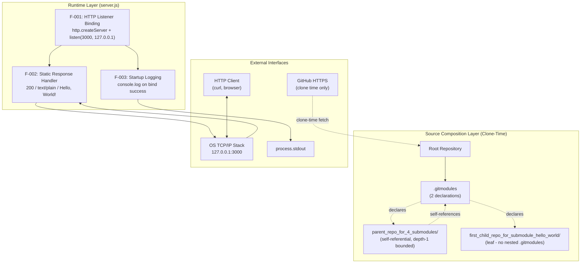

### 5.2.5 State Transition Diagram

The Node.js process traverses a deterministic lifecycle. All abnormal terminations are unhandled and represented as transitions to TERMINATED.


### 5.2.6 HTTP Request Sequence Diagram

The end-to-end request lifecycle is fully synchronous from the handler's perspective. The handler never reads `req`, so no asynchronous body events are observed.

```mermaid
sequenceDiagram
    autonumber
    participant Client as HTTP Client
    participant TCP as OS TCP/IP Stack
    participant HTTP as Node.js http Module
    participant Handler as Inline Arrow Handler

    Client->>TCP: TCP SYN to 127.0.0.1:3000
    TCP->>HTTP: Accept connection
    Client->>HTTP: HTTP Request (any method, any path)
    HTTP->>HTTP: Parse HTTP envelope
    HTTP->>Handler: invoke(req, res)
    Note over Handler: req contents IGNORED -<br/>url, method, headers, body unread
    Handler->>Handler: res.statusCode = 200
    Handler->>Handler: res.setHeader('Content-Type', 'text/plain')
    Handler->>HTTP: res.end('Hello, World!\n')
    HTTP->>TCP: Write 200 OK + 14-byte body
    TCP->>Client: HTTP/1.1 200 OK / text/plain / Hello, World!
    TCP->>TCP: Close connection
    Note over HTTP: Server re-enters LISTENING state
```

---

## 5.3 TECHNICAL DECISIONS

### 5.3.1 Architecture Style Decision

#### 5.3.1.1 Decision Statement

Adopt a **single-file, single-process, framework-less Node.js HTTP server** using only the core `http` module, with source composition expressed through Git submodules rather than module-level reuse.

#### 5.3.1.2 Tradeoff Analysis

| Aspect | Choice | Rationale |
|--------|--------|-----------|
| Runtime | Node.js (version-agnostic) | Core `http` API has been stable across all maintained Node.js versions |
| Module System | CommonJS (`require`) | Works in all Node.js versions without ESM-specific configuration |
| Web Framework | None — direct `http` module | Eliminates dependency surface; exposes raw HTTP semantics |
| Dependency Management | None — no `package.json` | Intentionally manifest-free; eliminates supply chain |
| Code Composition | Git submodules (self-referential) | Demonstrates submodule topology rather than module-level reuse |
| Documentation | Title-only Markdown READMEs | Indicates pedagogical/scaffold status |

#### 5.3.1.3 Tradeoffs Accepted

- **No middleware/routing extensibility** → acceptable because the system has no routing requirement
- **Single point of failure (single process)** → acceptable because no availability SLA is declared
- **No multi-process scaling** → acceptable because no concurrent-load requirement exists
- **No configuration injection** → acceptable because the application has no environment-specific behavior

### 5.3.2 Communication Pattern Decision

#### 5.3.2.1 Decision Statement

Use a **synchronous-style request/response handler** executed inside the Node.js event loop, with an inline arrow-function callback registered via `http.createServer`. No middleware pipeline, no routing layer, no content negotiation.

#### 5.3.2.2 Rationale

The handler is constant-time, allocates no per-request state, and ignores all request data. A middleware pipeline would add complexity without functional benefit. Routing is unnecessary because the response is identical for every URL.

### 5.3.3 Data Storage Decision

#### 5.3.3.1 Decision Statement

**No storage layer is implemented.** No SQL database, NoSQL store, cache, or file I/O.

#### 5.3.3.2 Rationale

The response payload is a 14-byte literal embedded in source. There is no user data to persist, no configuration to externalize, no audit trail to record. Adding a storage layer would expand the dependency surface without functional benefit.

### 5.3.4 Caching Strategy Decision

#### 5.3.4.1 Decision Statement

**No caching layer is implemented** — neither in-process, distributed, nor HTTP-level (no `Cache-Control`, `ETag`, or `Last-Modified` headers).

#### 5.3.4.2 Rationale

The handler is already stateless and deterministic; the response is computed in constant time. A cache would consume memory and add invalidation complexity for no measurable benefit.

### 5.3.5 Security Mechanism Decision

#### 5.3.5.1 Decision Statement

Rely on **loopback-only binding as the sole network access control**. Implement no application-level authentication, authorization, TLS, request parsing, or input validation.

#### 5.3.5.2 Security Implications by Choice

| Choice | Security Implication |
|--------|----------------------|
| Loopback-only binding (`127.0.0.1`) | Server not reachable from external hosts; the network is the boundary |
| `http` module (not `https`) | No TLS termination; not required on loopback |
| Static response, no user reflection | Eliminates XSS, SQL injection, log-injection vectors |
| No request body parsing | Prevents parser-class vulnerabilities (Content-Type confusion, prototype pollution) |
| HTTPS submodule URLs | Provides transport integrity during initial clone |
| Zero third-party dependencies | No transitive supply-chain attack surface |
| No `process.env` references | No `.env` file to leak; no secrets in scope |
| No authentication primitives | No credential-handling code to misconfigure |

### 5.3.6 Architecture Decision Records (ADRs)

#### 5.3.6.1 ADR-001: Reject HTTP Framework, Use Core Module

| Field | Value |
|-------|-------|
| Status | Accepted |
| Context | A "Hello, World!" response could be served by Express, Koa, Fastify, etc. |
| Decision | Use Node.js core `http` module directly |
| Consequence | Zero dependencies, no `package.json`, no supply chain; less ergonomic for future routing (not required) |

#### 5.3.6.2 ADR-002: Hardcoded `127.0.0.1:3000`

| Field | Value |
|-------|-------|
| Status | Accepted |
| Context | Bind address and port could be sourced from `process.env` or CLI |
| Decision | Inline constants for hostname and port |
| Consequence | Predictable behavior; single-instance-per-host limit; not deployable to environments with port conflicts without source modification |

#### 5.3.6.3 ADR-003: Git Submodules for Source Composition

| Field | Value |
|-------|-------|
| Status | Accepted |
| Context | Code reuse could be implemented via npm packages, monorepos, or submodules |
| Decision | Use Git submodules with self-referential topology bounded at depth 1 |
| Consequence | Three byte-identical `server.js` files in the working tree; consumers must use `--recurse-submodules` |

#### 5.3.6.4 ADR-004: No Automated Error Handling

| Field | Value |
|-------|-------|
| Status | Accepted |
| Context | Node.js supports `.on('error')`, `process.on('uncaughtException')`, signal handlers, `server.close()` |
| Decision | Register no error handlers; allow all unhandled errors to crash the process |
| Consequence | `EADDRINUSE` and signals terminate the process abruptly; recovery is exclusively manual |

#### 5.3.6.5 Decision Tree Diagram

The diagram below summarizes the decision path that produced the current architecture.

```mermaid
flowchart TD
    Start{Architecture<br/>Decision}
    Start --> Q1{Production<br/>System?}
    Q1 -->|No - Pedagogical| Q2{Minimize<br/>Dependencies?}
    Q1 -->|Yes| OutOfScope[Out of Scope<br/>for this repository]
    Q2 -->|Yes - Zero deps target| Q3{Framework<br/>Needed?}
    Q3 -->|No - Core http sufficient| D1[Use Node.js http module]
    Q3 -->|Yes| Express[Adopt Express/Koa/Fastify<br/>- Rejected]
    D1 --> Q4{Network<br/>Exposure?}
    Q4 -->|Loopback only| D2[Bind 127.0.0.1<br/>No TLS]
    Q4 -->|External| TLS[Require TLS<br/>- Rejected]
    D2 --> Q5{Persistence<br/>Required?}
    Q5 -->|No - Static response| D3[No DB, no cache]
    Q5 -->|Yes| DB[Add storage layer<br/>- Rejected]
    D3 --> Q6{Error<br/>Recovery?}
    Q6 -->|Manual acceptable| D4[No handlers<br/>Crash on error]
    Q6 -->|Automated| Handlers[Add signal/error handlers<br/>- Rejected]
    D4 --> Final[Final: Single-file,<br/>single-process, framework-less<br/>monolithic CommonJS]
```

---

## 5.4 CROSS-CUTTING CONCERNS

### 5.4.1 Monitoring and Observability Approach

The system implements **no monitoring or observability beyond a single startup log line**. The table below enumerates each observability concern and its status.

| Observability Concern | Status |
|-----------------------|--------|
| Metrics collection (Prometheus, OpenTelemetry) | Not implemented |
| Distributed tracing | Not implemented |
| Health endpoints (`/health`, `/readiness`, `/liveness`) | Not implemented |
| Request-level logging | Not implemented |
| Error logging | Not implemented (no `.on('error')` listeners registered) |
| Shutdown logging | Not implemented (no signal handlers) |
| Instrumented dependencies | Not applicable (zero dependencies) |

The sole observability signal is the line `Server running at http://127.0.0.1:3000/` written to `process.stdout` once after a successful bind.

### 5.4.2 Logging and Tracing Strategy

#### 5.4.2.1 Existing Logging Surface

The entire logging surface consists of a single `console.log()` call inside the `listen()` callback:

- **Message**: `Server running at http://127.0.0.1:3000/`
- **Destination**: `process.stdout`
- **Frequency**: Exactly once per process lifetime
- **Format**: Plain text via template literal interpolation of the `hostname` and `port` constants

#### 5.4.2.2 Explicitly Absent Logging Features

- Log levels (no `debug`, `info`, `warn`, `error` distinction)
- Structured logging (no JSON, no key-value formats)
- Multiple log destinations (no file, no network sink)
- Request-correlation IDs or trace IDs
- Performance counters or request duration timing
- Log rotation, retention, or shipping

#### 5.4.2.3 Tracing Strategy

No distributed tracing is implemented. There are no trace contexts, span correlation, or propagation headers. Because the system has no downstream calls and no measurable internal stages beyond the constant-time handler, tracing would yield no diagnostic value.

### 5.4.3 Error Handling Patterns

#### 5.4.3.1 Error Handling Reality

The system implements no automated error handling. Every failure mode results in either a process crash or a user-visible tooling error. The table below enumerates each absent error-handling capability.

| Absent Capability | Reason |
|-------------------|--------|
| Retry mechanisms | No code paths implement retries |
| Fallback processes | No fallback logic is present |
| Error notification flows | No notification channels are configured |
| Recovery procedures | No recovery code paths exist |
| `.on('error')` listeners on server | None registered |
| `process.on('uncaughtException')` | Not registered |
| Signal handlers (SIGTERM/SIGINT) | Not registered |
| Graceful shutdown (`server.close()`) | Not invoked |

#### 5.4.3.2 Observed Error Surfaces

| Error Surface | Trigger | Outcome (Unhandled) |
|---------------|---------|---------------------|
| `EADDRINUSE` on bind | Port 3000 already in use | Process crashes; manual remediation required |
| Network error during clone | GitHub unreachable | Git client surfaces error to the developer |
| Node.js missing | `node` binary absent | Shell reports "command not found" |
| SIGINT / SIGKILL received | User or supervisor signal | Abrupt termination; no `server.close()` invoked |
| Malformed HTTP request | Client error at parse stage | Handled internally by `http` core module; handler never invoked |

#### 5.4.3.3 Manual Recovery Procedures

| Error | Manual Recovery |
|-------|-----------------|
| `EADDRINUSE` | Identify the process occupying port 3000 (e.g., `lsof -i :3000`), terminate it, re-run `node server.js` |
| Network error during clone | Restore connectivity to `github.com`, re-issue `git clone --recurse-submodules` |
| Node.js missing | Install a Node.js runtime (any maintained version) |
| Process killed externally | Re-invoke `node server.js` — re-execution is idempotent (no state to recover) |
| Submodule directories empty | Run `git submodule update --init --recursive` |

#### 5.4.3.4 Error Handling Flow Diagram

The flow below documents the complete error surface and the (manual) remediation path for each class.

```mermaid
flowchart TD
    Start([Potential Error Source]) --> Category{Error<br/>Category?}
    Category -->|Network during clone| NetErr[Git client surfaces network error]
    Category -->|Node.js binary missing| RtErr[Shell reports 'command not found']
    Category -->|EADDRINUSE on bind| BindErr[Unhandled - process crashes]
    Category -->|SIGINT / SIGKILL| Signal[No handler - abrupt termination]
    Category -->|Request-level fault| Req[Not applicable -<br/>no conditional logic in handler]

    NetErr --> Manual[User must remediate manually]
    RtErr --> Manual
    BindErr --> Manual
    Signal --> Manual
    Req --> NoErr[Handler always returns 200 OK]

    Manual --> EndMan([Error surfaced;<br/>no automated recovery])
    NoErr --> EndOk([Request completes successfully])
```

### 5.4.4 Authentication and Authorization Framework

**Authentication and authorization are explicitly absent.** The system implements no identity, session, token, or credential machinery.

| Concern | Status |
|---------|--------|
| User authentication (OAuth, OIDC, SAML, Basic Auth, JWT) | Not implemented |
| Session management | Not implemented (no cookies, no session store) |
| Authorization (RBAC, ABAC, policy engines) | Not implemented |
| Credential storage | Not implemented (no `.env`, no secret manager integration) |
| Request inspection | Not performed (handler ignores all headers and body) |

Because no headers or request bodies are inspected, the handler provides no surface for authentication mechanisms. Network-level isolation via loopback binding is the only access-control mechanism in the system.

### 5.4.5 Performance Requirements and SLAs

The repository **does not declare or measure runtime performance characteristics**. No formal Service Level Agreements, Service Level Objectives, or response time targets exist. The indicators below are observable behavioral characteristics, not contractual commitments.

| Indicator | Expected Value |
|-----------|----------------|
| Startup time (synchronous construction) | Sub-millisecond for `http.createServer` |
| Startup time (asynchronous bind) | Sub-second for `listen()` |
| Response status rate | 100% return 200 OK |
| Handler execution time | Constant-time; allocation-light |
| Memory footprint | Bounded by Node.js process baseline (no per-request growth) |
| Dependency count | Zero |

#### 5.4.5.1 Scalability Boundaries

| Concern | Boundary |
|---------|----------|
| Concurrent port use | Single instance per host (port 3000 hardcoded) |
| Connection backlog | Default Node.js `listen()` backlog (no tuning) |
| Multi-process scaling | Out of scope (no `cluster` module) |
| Memory growth under load | Bounded by Node.js baseline (no state allocated) |

### 5.4.6 Disaster Recovery Procedures

#### 5.4.6.1 Recovery Posture

No automated disaster recovery exists. The system implements no automated error handling, no replication, no failover, no backup, no snapshot, and no health-probe-driven restart logic.

#### 5.4.6.2 Recovery Strategy

Because the system has no persistent state, no data recovery is required. Re-execution of `node server.js` after any failure is fully idempotent: the same constant response is produced from the same source bytes.

| Recovery Concern | Approach |
|------------------|----------|
| State recovery | Not applicable — no state is persisted |
| Replication | Not applicable — single process per host |
| Failover | Not applicable — no secondary instance |
| Backup procedures | Not applicable — no data domain |
| Restart strategy | Manual: re-invoke `node server.js` after fixing root cause |

---

## 5.5 ARCHITECTURAL ASSUMPTIONS AND CONSTRAINTS

The architecture rests on a small set of explicit assumptions, derived from the source code and the technical specification. Documenting these assumptions ensures that future modifications respect the original design intent.

### 5.5.1 Critical Assumptions

- Node.js runtime is available on the host with the core `http` module present (any maintained version satisfies the requirement; no version is pinned).
- TCP port 3000 is unoccupied on the loopback interface at process start.
- The Git client supports submodules and can perform recursive clones over HTTPS.
- HTTPS access to `github.com/lakshya-blitzy/` is available at clone time (no other external endpoints are contacted at runtime).
- The system is operated in a pedagogical or demonstration context where the absence of authentication, persistence, observability, and error handling is acceptable by design.

### 5.5.2 Absent-by-Design Items (Out of Scope)

The following items are deliberately absent and must not be introduced without explicitly revisiting the architectural intent:

- HTTP routing, path dispatch, middleware, content negotiation, request body parsing
- HTTPS/TLS, environment-based configuration, authentication, authorization
- Logging beyond the startup line, metrics, tracing, health endpoints
- Graceful shutdown, signal handling, clustering, process supervision
- Test suites, build pipelines, bundling, linting, formatting
- Containerization, CI/CD pipelines, package management
- Databases, message queues, external service integrations, identity providers, secret managers, observability backends

---

## 5.6 REFERENCES

### 5.6.1 Files Examined

- `server.js` (root, 15 lines) — Sole runtime artifact: `require('http')`, `http.createServer()` with inline static handler, `server.listen(3000, '127.0.0.1', ...)`, single startup `console.log`
- `.gitmodules` (root, 7 lines) — Two submodule declarations with `path` and HTTPS `url` keys under `github.com/lakshya-blitzy/`
- `README.md` (root, 1 line) — Title-only Markdown heading
- `parent_repo_for_4_submodules/server.js` (15 lines) — Byte-identical copy of root `server.js`
- `parent_repo_for_4_submodules/.gitmodules` (7 lines) — Byte-identical copy of root `.gitmodules`, establishing self-referential topology
- `parent_repo_for_4_submodules/README.md` (1 line) — Title-only Markdown heading
- `first_child_repo_for_submodule_hello_world/server.js` (15 lines) — Byte-identical copy of root `server.js`
- `first_child_repo_for_submodule_hello_world/README.md` (1 line) — Title-only Markdown heading

### 5.6.2 Folders Explored

- `/` (root) — Discovered `server.js`, `.gitmodules`, `README.md`, two submodule directories
- `parent_repo_for_4_submodules/` — Discovered byte-identical `server.js`, self-referential `.gitmodules`, title-only `README.md`
- `first_child_repo_for_submodule_hello_world/` — Discovered byte-identical `server.js`, title-only `README.md`, no nested `.gitmodules` (terminates submodule recursion at depth 1)

### 5.6.3 Technical Specification Sections Cross-Referenced

- Section 1.2 SYSTEM OVERVIEW — Project context, minimalism rationale, KPIs
- Section 1.3 SCOPE — In-scope features, primary workflows, integration boundaries, explicit exclusions
- Section 2.1 FEATURE CATALOG — Features F-001 (HTTP Listener), F-002 (Static Handler), F-003 (Startup Log), F-004/F-005 (Submodules), F-006 (READMEs)
- Section 2.3 FEATURE RELATIONSHIPS — Dependency graph informing the component interaction diagram
- Section 2.4 IMPLEMENTATION CONSIDERATIONS — Technical constraints, security implications, scalability boundaries
- Section 3.1 OVERVIEW AND GUIDING PRINCIPLES — Minimalism, default-stack deviation
- Section 3.4 OPEN SOURCE DEPENDENCIES — Empty inventory, absence of `package.json`
- Section 3.5 THIRD-PARTY SERVICES — GitHub HTTPS as sole external service
- Section 3.8 SECURITY POSTURE OF TECHNOLOGY CHOICES — Security implications matrix
- Section 3.10 SUMMARY OF TECHNOLOGY CHOICES — Consolidated technology decision table
- Section 4.2 HIGH-LEVEL SYSTEM WORKFLOW — End-to-end journey, system boundary diagram
- Section 4.4 INTEGRATION WORKFLOWS — Source acquisition, HTTP request lifecycle, startup logging
- Section 4.5 STATE MANAGEMENT FLOWS — Process lifecycle states and state transition diagram
- Section 4.6 ERROR HANDLING FLOWS — Error surfaces, manual recovery procedures, error flowchart
- Section 4.7 TIMING AND SLA CONSIDERATIONS — Absence of declared SLAs, observable indicators, scalability boundaries

# 6. SYSTEM COMPONENTS DESIGN

## 6.1 Core Services Architecture

### 6.1.1 Applicability Determination

#### 6.1.1.1 Determination Statement

**Core Services Architecture is not applicable for this system.**

The repository implements a single-file, single-process, framework-less Node.js HTTP server (`server.js`, 15 lines, CommonJS) constructed exclusively on the Node.js core `http` module. The system has no microservices, no distributed components, no distinct service runtimes, no inter-service communication, no service discovery, no load balancing, no circuit breakers, no horizontal or vertical scaling automation, no fault tolerance machinery, and no disaster recovery procedures. The architectural style is **monolithic by deliberate design** and is documented as such across Sections 5.1.1.1, 5.3.1, 5.3.6 (ADR-001 through ADR-004), and 5.5.

This section therefore documents *why* the system does not require a Core Services Architecture, enumerates the categorical absences that would normally populate this section, disambiguates the Git submodule topology (which a casual reader might mistake for a service decomposition), and provides reference diagrams that explicitly illustrate the monolithic posture.

#### 6.1.1.2 Architectural Justification

The non-applicability of Core Services Architecture is grounded in five reinforcing facts established elsewhere in this specification:

| Justification | Source | Implication |
|---------------|--------|-------------|
| Single 15-line CommonJS script with one inline handler | Section 5.1.1.1, `server.js` | No service decomposition exists |
| Zero third-party dependencies; no `package.json` | Section 5.1.1.1, Section 3.10 | No framework, middleware, or RPC client present |
| No outbound HTTP, RPC, or messaging client | Section 1.3.2.3, Section 4.4 | No inter-service communication possible |
| Hardcoded bind to `127.0.0.1:3000` (single-instance-per-host) | Section 5.2.1.5, ADR-002 | Concurrent service instances cannot coexist on one host |
| `server.js` performs no `module.exports` | Section 2.3 | The script exposes no internal service surface |

The ADRs in Section 5.3.6 explicitly record this choice as accepted, with full awareness of the tradeoffs:

- **ADR-001** rejects HTTP frameworks (Express, Koa, Fastify, Hapi, NestJS) in favor of the core `http` module.
- **ADR-002** accepts hardcoded `127.0.0.1:3000` and the single-instance-per-host limit it implies.
- **ADR-003** adopts Git submodules for *source* composition rather than module-level reuse or service-level decomposition.
- **ADR-004** accepts a no-automated-error-handling posture in which all failures terminate the process and recovery is manual.

#### 6.1.1.3 Git Submodules Are Not Services (Critical Disambiguation)

The repository contains two submodule directories — `parent_repo_for_4_submodules/` and `first_child_repo_for_submodule_hello_world/` — each carrying a copy of `server.js`. **These are not services.** They are Git source-composition artifacts resolved at clone time by the Git client, never by the Node.js runtime.

| Property | Evidence |
|----------|----------|
| Three `server.js` files exist in the working tree | Section 5.1.1.1 — "three byte-identical copies of `server.js`" |
| All three copies bind the same host and port | Section 5.2.1.5; `server.js` line 4 (port `3000`, host `127.0.0.1`) |
| Running more than one fails with `EADDRINUSE` | Section 5.4.3.2, Section 1.3.2.4 |
| Submodule resolution is performed by the Git client | Section 5.1.3.1 |
| The Node.js process never reads `.gitmodules` | Section 5.2.2, Section 5.1.4 |
| Recursion terminates at depth 1 (no nested `.gitmodules` in the leaf) | Section 5.1.1.1, Section 5.2.2.3 |

The submodule topology produces source replicas, not runtime services. There is exactly **one runtime artifact**: the Node.js process executing one of the byte-identical `server.js` files. The remaining two copies are dormant source artifacts on disk.

---

### 6.1.2 Monolithic Topology Reference Diagrams

The diagrams below replace the conventional service-interaction, scalability, and resilience diagrams that would otherwise populate this section. Their purpose is to make the monolithic posture explicit and to delineate clearly which architectural elements are present and which are absent by design.

#### 6.1.2.1 Single-Process Runtime Topology (Service Interaction Equivalent)

This diagram serves as the "service interaction diagram" required by the section prompt. It shows that there is exactly one runtime component, communicating only with the OS TCP/IP stack and an HTTP client — no service-to-service interactions exist.

```mermaid
flowchart LR
    subgraph ClientZone["Client Zone (Same Host Only)"]
        Client["HTTP Client<br/>curl / browser"]
    end

    subgraph KernelZone["OS Kernel"]
        Loopback["TCP/IP Loopback<br/>127.0.0.1:3000"]
    end

    subgraph RuntimeZone["Single Node.js Process (server.js)"]
        Listener["http.createServer<br/>listen(3000, 127.0.0.1)"]
        Handler["Inline Arrow Handler<br/>status=200, text/plain,<br/>body=Hello, World!"]
        StdOut["console.log<br/>once on bind success"]
        Listener --> Handler
        Listener --> StdOut
    end

    subgraph SourceLayer["Git Source-Composition Layer (Clone-Time Only)"]
        RootSrc["server.js (root)"]
        ParentSrc["parent_repo_for_4_submodules/<br/>server.js (byte-identical)"]
        ChildSrc["first_child_repo_for_submodule_hello_world/<br/>server.js (byte-identical)"]
    end

    Client -->|"HTTP GET any path"| Loopback
    Loopback -->|"accept TCP connection"| Listener
    Handler -->|"200 / text/plain / Hello, World!"| Loopback
    Loopback -->|"response"| Client

    RootSrc -.replicated by Git.-> ParentSrc
    RootSrc -.replicated by Git.-> ChildSrc
```

Note the deliberate absence of any of the following elements that a microservices diagram would contain: API gateway, reverse proxy, service mesh sidecar, message broker, service registry, internal RPC channels, or any second runtime component.

#### 6.1.2.2 Scalability Boundary Diagram

This diagram serves as the "scalability architecture" required by the section prompt. It illustrates the strict single-instance-per-host constraint imposed by the hardcoded bind point and the absence of any scaling apparatus.

```mermaid
flowchart TB
    subgraph PresentArch["Present Architecture (Single Host)"]
        Proc1["node server.js<br/>Process Instance 1"]
        Port["TCP Port 3000<br/>HARDCODED on 127.0.0.1"]
        Proc1 -->|"binds successfully"| Port
    end

    subgraph FailureCase["Concurrent Instance Attempt"]
        Proc2["node server.js<br/>Process Instance 2"]
        Bind2["server.listen 3000"]
        Crash["EADDRINUSE<br/>Process crashes<br/>no handler registered"]
        Proc2 --> Bind2
        Bind2 -->|"OS bind fails"| Crash
    end

    subgraph AbsentScaling["Absent Scaling Mechanisms (Out of Scope)"]
        LB["Load Balancer<br/>not deployed"]
        ClusterMod["Node.js cluster module<br/>not imported"]
        Workers["worker_threads<br/>not used"]
        PM["Process Manager<br/>pm2 / systemd / forever<br/>not configured"]
        AutoScale["Auto-Scaler<br/>no orchestrator"]
        HealthEP["Health Endpoint<br/>not implemented"]
        SvcDisc["Service Discovery<br/>not applicable"]
    end

    Port -. precludes .-> FailureCase
```

#### 6.1.2.3 Resilience Surface Diagram

This diagram serves as the "resilience pattern implementations" diagram required by the section prompt. It documents every failure mode and the (exclusively manual) recovery path for each, while explicitly enumerating the resilience patterns that are absent.

```mermaid
flowchart TD
    Start([Failure Event]) --> Type{Failure<br/>Category?}

    Type -->|"EADDRINUSE on bind"| Crash1["Process crashes<br/>no .on('error') listener"]
    Type -->|"SIGINT / SIGTERM / SIGKILL"| Crash2["Abrupt termination<br/>no signal handler<br/>no server.close()"]
    Type -->|"Uncaught exception"| Crash3["Default Node.js exit<br/>no process.on('uncaughtException')"]
    Type -->|"Network failure during clone"| GitErr["Git client surfaces error<br/>to developer"]
    Type -->|"Request-level fault"| NoFault["Not reachable<br/>handler has no conditionals"]

    Crash1 --> Manual([Manual Operator Action])
    Crash2 --> Manual
    Crash3 --> Manual
    GitErr --> Manual

    Manual --> Recover["Re-invoke node server.js<br/>idempotent re-execution<br/>no state to recover"]

    subgraph AbsentPatterns["Absent Resilience Patterns (Out of Scope)"]
        Retry["Retry Logic"]
        FallbackP["Fallback Handler"]
        Circuit["Circuit Breaker"]
        Bulkhead["Bulkhead Isolation"]
        Timeout["Timeout Control"]
        Replica["Replication"]
        Failover["Failover Promotion"]
        Backup["Backup / Snapshot"]
        DR["Disaster Recovery Runbook"]
    end
```

---

### 6.1.3 Absent Service Components

This subsection responds to the **SERVICE COMPONENTS** area of the section prompt by documenting that each requested concern is intentionally absent, the evidence for the absence, and the rationale.

#### 6.1.3.1 Service Boundaries and Communication

| Concern | Status | Evidence (Section / Artifact) |
|---------|--------|-------------------------------|
| Service boundaries / decomposition | None — single file, single inline handler | Section 5.1.1.1, Section 5.2.1.1 |
| Service responsibilities split across processes | None — one process owns all behavior | Section 5.2.1, `server.js` |
| Inter-service communication (HTTP/RPC/gRPC) | None — no outbound clients imported | Section 1.3.2.3 |
| Messaging / event bus | None — no broker clients present | Section 1.3.2.3, Section 5.5.2 |
| Internal API contracts | None — `server.js` has no `module.exports` | Section 2.3 |

The system's complete request lifecycle is contained within the one inline arrow-function handler. Because there is exactly one runtime component, no boundary needs to be drawn, no protocol needs to be selected, and no contract needs to be governed.

#### 6.1.3.2 Service Discovery and Load Balancing

| Concern | Status | Evidence (Section / Artifact) |
|---------|--------|-------------------------------|
| Service discovery (Consul, etcd, DNS-SD) | None — no registry client present | Section 5.5.2 |
| Reverse proxy / API gateway | None — clients connect directly to `127.0.0.1:3000` | Section 1.3.2.3 |
| Load balancing strategy | None — single instance per host | Section 5.2.1.5, Section 5.4.5.1 |
| Health probes (`/health`, `/readiness`, `/liveness`) | Not implemented | Section 5.4.1 |
| Static endpoint advertisement | Hardcoded inline constants only | ADR-002 (Section 5.3.6.2) |

A service registry presupposes more than one service instance to register. Because the hardcoded bind point allows exactly one instance per host, the discovery, registration, and balancing concerns are categorically inapplicable rather than merely unimplemented.

#### 6.1.3.3 Circuit Breakers, Retries, and Fallbacks

| Concern | Status | Evidence (Section / Artifact) |
|---------|--------|-------------------------------|
| Circuit breaker pattern | None — no resilience library present | Section 5.4.3.1, Section 3.10 |
| Retry mechanism | "No code paths implement retries" | Section 5.4.3.1 (explicit) |
| Fallback / degraded response logic | "No fallback logic is present" | Section 5.4.3.1 (explicit) |
| Bulkhead isolation | Not applicable — no downstream calls | Section 5.4.3.1 |
| Timeout control | Defaults from Node.js `http` module only | Section 5.2.1.3 |

These patterns govern interactions with downstream services. Because the handler performs no downstream calls (no database, no API, no queue), there is no failure surface for them to protect.

---

### 6.1.4 Absent Scalability Design

This subsection responds to the **SCALABILITY DESIGN** area of the section prompt.

#### 6.1.4.1 Horizontal and Vertical Scaling Posture

| Scaling Dimension | Status | Evidence (Section / Artifact) |
|-------------------|--------|-------------------------------|
| Horizontal scaling | "Not applicable — no load balancer, no service discovery, no health endpoint" | Section 5.2.1.5 |
| Vertical scaling | Not declared — no resource configuration | Section 5.4.5 |
| Multi-process scaling (`cluster` module) | "Out of scope — no `cluster` module usage" | Section 5.2.1.5, Section 5.4.5.1 |
| Worker threads | Not used | Section 5.5.2 |
| Process manager (pm2, systemd, forever) | Not configured | Section 5.5.2 |
| Single-instance-per-host limit | Enforced by hardcoded port `3000` | ADR-002 (Section 5.3.6.2), Section 5.2.1.5 |

#### 6.1.4.2 Auto-Scaling and Resource Allocation

| Concern | Status | Evidence (Section / Artifact) |
|---------|--------|-------------------------------|
| Auto-scaling triggers (CPU/memory/RPS) | Not applicable — no orchestrator | Section 1.3.2.3 |
| Container orchestrator (Kubernetes, Nomad) | Not integrated | Section 1.3.2.3, Section 3.10 |
| Horizontal Pod Autoscaler (HPA) rules | Not applicable | Section 3.7 |
| Resource limits / requests declarations | None — no manifests | Section 3.7, Section 5.5.2 |
| Auto-scaling cooldown / step policies | Not applicable | Section 5.5.2 |

There is no orchestrator in the deployment topology to react to load signals, and the source tree contains no manifests, charts, or compose files that would declare resource envelopes (see Section 3.7).

#### 6.1.4.3 Performance and Capacity Planning

| Concern | Status | Evidence (Section / Artifact) |
|---------|--------|-------------------------------|
| Performance SLAs / SLOs | "No declared SLAs" | Section 4.7, Section 5.4.5 |
| Handler execution profile | "Constant-time, allocation-light" | Section 5.4.5 |
| Memory growth under load | "Bounded by Node.js baseline (no state allocated)" | Section 5.4.5.1 |
| Connection backlog tuning | "Default Node.js `listen()` backlog; no tuning applied" | Section 5.2.1.5 |
| Capacity planning guidelines | Not declared | Section 5.4.5 |
| Load testing artifacts | None | Section 5.5.2 |

The handler is deliberately constant-time and allocation-light, but no formal performance contract is declared. Capacity planning is unnecessary because the system is operated as a pedagogical artifact rather than a production workload (Section 5.5.1).

---

### 6.1.5 Absent Resilience Patterns

This subsection responds to the **RESILIENCE PATTERNS** area of the section prompt.

#### 6.1.5.1 Fault Tolerance and Error Handling

| Mechanism | Status | Evidence (Section / Artifact) |
|-----------|--------|-------------------------------|
| `.on('error')` listener on server | "None registered" | Section 5.4.3.1 |
| `process.on('uncaughtException')` | "Not registered" | Section 5.4.3.1 |
| `process.on('unhandledRejection')` | Not registered | Section 5.4.3.1 |
| Signal handlers (`SIGTERM` / `SIGINT`) | "Not registered" | Section 5.4.3.1, Section 5.2.3.2 |
| Graceful shutdown (`server.close()`) | "Not invoked" | Section 5.4.3.1 |
| Try/catch in handler | Not present — handler has no conditionals | Section 5.3.2 |

ADR-004 (Section 5.3.6.4) records this posture as accepted: every failure mode terminates the process, and recovery is exclusively manual.

#### 6.1.5.2 Disaster Recovery and Data Redundancy

| Concern | Status | Evidence (Section / Artifact) |
|---------|--------|-------------------------------|
| Automated disaster recovery procedure | "No automated disaster recovery exists" | Section 5.4.6.1 |
| State recovery | "Not applicable — no state is persisted" | Section 5.4.6.2 |
| Backup / snapshot procedures | "Not applicable — no data domain" | Section 5.4.6.2 |
| Data replication | "Not applicable — single process per host" | Section 5.4.6.2 |
| Cross-region failover | Not applicable — no cloud deployment | Section 3.1, Section 3.7 |
| RPO / RTO targets | Not declared — no data to recover | Section 5.4.6 |

The disaster-recovery story is intrinsically simple: because the system has no persistent state, no data is ever lost, and idempotent re-invocation of `node server.js` restores full functionality from source bytes alone.

#### 6.1.5.3 Failover and Service Degradation

| Concern | Status | Evidence (Section / Artifact) |
|---------|--------|-------------------------------|
| Active/passive failover | "Not applicable — no secondary instance" | Section 5.4.6.2 |
| Active/active failover | Not applicable — single instance per host | Section 5.2.1.5 |
| DNS-level failover | Not applicable — loopback-only binding | Section 5.1.1.2 |
| Service degradation policies | Not applicable — static deterministic response only | Section 5.1.1.2 |
| Read-only / safe-mode toggle | Not implemented — no operational modes | Section 5.3.2 |
| Manual restart strategy | "Re-invoke `node server.js`" | Section 5.4.6.2 |

Service degradation is meaningless in a system whose only behavior is returning a constant 14-byte response: there is no richer mode to fall back from and no leaner mode to fall back to.

---

### 6.1.6 Design Intent and Cross-References

#### 6.1.6.1 Design Intent Statement

The absence of every Core Services Architecture concern in this system is a deliberate architectural choice, not an oversight or a deferred milestone. Section 5.5.1 records the operating assumption explicitly: the system is operated in a pedagogical or demonstration context in which the absence of authentication, persistence, observability, and error handling is acceptable by design. The repository's overall positioning — established in Section 1.1.1 as "a demonstrative artifact illustrating two foundational concepts in tandem: (1) Node.js HTTP Server Fundamentals, and (2) Git Submodule Composition" — implies and constrains the architectural surface this section would otherwise document.

Any future evolution that introduces a second service, an outbound dependency, a persistent state surface, or a deployment topology beyond a single host would require revisiting the architectural intent recorded in ADR-001 through ADR-004 (Section 5.3.6) and re-issuing a populated Core Services Architecture section accordingly.

#### 6.1.6.2 Cross-References to Related Sections

| Topic in This Section | Authoritative Section |
|-----------------------|------------------------|
| Architecture style and rationale | Section 5.1.1 (High-Level Architecture) |
| HTTP server component scaling boundaries | Section 5.2.1.5 (Component Details) |
| Process lifecycle and state transitions | Section 5.2.3 (Component Details) |
| ADRs justifying monolithic posture | Section 5.3.6 (Technical Decisions) |
| Error handling absence and recovery procedures | Section 5.4.3 (Cross-Cutting Concerns) |
| Performance and scalability boundaries | Section 5.4.5 (Cross-Cutting Concerns) |
| Disaster recovery posture | Section 5.4.6 (Cross-Cutting Concerns) |
| Absent-by-design item enumeration | Section 5.5.2 (Architectural Assumptions) |
| Out-of-scope integration points | Section 1.3.2.3 (Scope) |
| Consolidated technology choices | Section 3.10 (Summary of Technology Choices) |
| Timing and SLA considerations | Section 4.7 (Timing and SLA) |

#### 6.1.6.3 References

#### Files Examined

- `server.js` (root) — 15-line CommonJS Hello World HTTP server; sole runtime artifact; confirms single-process, framework-less, dependency-less posture
- `parent_repo_for_4_submodules/server.js` — Byte-identical replica of root `server.js`; confirms source-composition (not service) nature of parent submodule
- `first_child_repo_for_submodule_hello_world/server.js` — Byte-identical replica of root `server.js`; confirms source-composition (not service) nature of leaf submodule
- `.gitmodules` (root) — Declares two submodules with HTTPS URLs; consumed by Git client at clone time, not by Node.js at runtime
- `parent_repo_for_4_submodules/.gitmodules` — Byte-identical to root `.gitmodules`; demonstrates self-referential submodule topology bounded at depth 1
- `README.md` (root) — Title-only Markdown; no service-architecture content

#### Folders Explored

- `/` (repository root) — Confirmed absence of `package.json`, `Dockerfile`, `.github/`, Kubernetes manifests, service mesh manifests, or any other service-architecture scaffolding
- `parent_repo_for_4_submodules/` — Confirmed identical shape to root (server.js, .gitmodules, README.md); no service-distinct artifacts
- `first_child_repo_for_submodule_hello_world/` — Confirmed leaf submodule with only `server.js` and `README.md`; no nested `.gitmodules` (recursion terminator)

#### Technical Specification Sections Cross-Referenced

- Section 1.1 — Executive Summary (pedagogical positioning)
- Section 1.2 — System Overview (system composition)
- Section 1.3 — Scope (in-scope and explicitly out-of-scope items)
- Section 2.3 — Feature Relationships (no `module.exports`; no internal service surface)
- Section 3.1 — Overview and Guiding Principles (minimalism as architectural choice)
- Section 3.7 — Development & Deployment (absence of orchestrators, containers, CI/CD)
- Section 3.10 — Summary of Technology Choices (consolidated absence of service-architecture technologies)
- Section 4.4 — Integration Workflows (limited external integration surface)
- Section 4.7 — Timing and SLA Considerations (no declared SLAs)
- Section 5.1 — High-Level Architecture (monolithic style and rationale)
- Section 5.2 — Component Details (HTTP server, submodule, and process lifecycle components)
- Section 5.3 — Technical Decisions (ADR-001 through ADR-004)
- Section 5.4 — Cross-Cutting Concerns (error handling, scalability boundaries, disaster recovery)
- Section 5.5 — Architectural Assumptions and Constraints (absent-by-design enumeration)

## 6.2 Database Design

### 6.2.1 Applicability Determination

#### 6.2.1.1 Determination Statement

**Database Design is not applicable to this system.**

The repository implements a single-file, 15-line, framework-less Node.js HTTP server (`server.js`) whose sole behavior is to return a hardcoded 14-byte response (`Hello, World!\n`) to every incoming request, irrespective of method, path, headers, or body. The system has **no data persistence layer of any kind**: no relational database, no document store, no key-value cache, no search engine, no object storage, no time-series database, no graph database, no in-memory state, no file I/O, and no environment-variable-backed configuration. The absence of every persistence concern is a deliberate architectural choice documented and reinforced across Sections 1.3, 3.6, 5.2.1.4, 5.4.6, and 5.5.2 of this specification, and accepted in ADR-001 through ADR-004 (Section 5.3.6).

This section therefore documents *why* Database Design does not apply, enumerates each prompt-required concern (Schema Design, Data Management, Compliance Considerations, Performance Optimization) with explicit non-applicability evidence, and includes reference diagrams that depict the stateless data-flow topology and disambiguate Git source replication from runtime data replication.

#### 6.2.1.2 Architectural Justification

The non-applicability of Database Design is grounded in six reinforcing facts established elsewhere in this specification, each of which independently precludes a persistence tier:

| Justification | Authoritative Source | Implication |
|---------------|----------------------|-------------|
| No data persistence layer exists | Section 3.6.1 | No schema, indexes, or partitions exist |
| Handler ignores `req` (no body, no path, no headers parsed) | Section 5.2.6 | No inbound data to persist |
| Response is a literal string constant | Section 3.6.2, Section 5.2.1.1 | No outbound data is computed or retrieved |
| No `module.exports`; no `fs`; no `process.env` | Section 3.6.3 | No file-based or environment-based state |
| Zero third-party dependencies; no `package.json` | Section 5.2.1.2, Section 3.10 | No ORM, driver, or cache client present |
| Re-execution is fully idempotent | Section 5.2.1.4, Section 5.4.6.2 | No state must be recovered after failure |

#### 6.2.1.3 Pedagogical-Intent Context

Per Section 1.1 and Section 6.1.6.1, the repository is positioned as a demonstrative artifact illustrating two foundational concepts in tandem: Node.js HTTP Server Fundamentals and Git Submodule Composition. Introducing any persistence concern — a schema, an index, a cache, a migration, or a backup procedure — would directly conflict with the documented architectural goal of being a bare-minimum reference implementation and would invalidate the assumptions recorded in ADR-001 through ADR-004 (Section 5.3.6).

---

### 6.2.2 Stateless Data-Flow Topology

The diagrams below replace the conventional ERD, partitioning, and replication diagrams that would otherwise populate this section. Their purpose is to make the **absence of any persistence boundary** explicit and to delineate clearly which architectural elements are present and which are absent by design.

#### 6.2.2.1 End-to-End Data Flow Diagram (No Persistence Boundary Crossed)

This diagram serves as the "data flow diagram" required by the section prompt. It shows that every byte of inbound data is discarded at the handler and every byte of outbound data is sourced from a literal constant in `server.js`. **No persistence boundary is crossed at any point in the request lifecycle.**

```mermaid
flowchart LR
    subgraph ClientZone["Client Zone"]
        Client["HTTP Client<br/>curl / browser"]
    end

    subgraph KernelZone["OS Kernel"]
        TCP["TCP/IP Loopback<br/>127.0.0.1:3000"]
    end

    subgraph RuntimeZone["Node.js Process (server.js)"]
        HTTPCore["http core module<br/>parses HTTP envelope"]
        Handler["Inline Arrow Handler<br/>req IGNORED<br/>res.statusCode = 200<br/>Content-Type: text/plain<br/>body = 'Hello, World!\n'"]
        Constant["Literal String Constant<br/>'Hello, World!\n'<br/>(source-coded; 14 bytes)"]
    end

    subgraph AbsentTier["Absent Persistence Tier (Out of Scope)"]
        NoDB["No Database<br/>SQL / NoSQL / Graph"]
        NoCache["No Cache<br/>Redis / Memcached / LRU"]
        NoFile["No File I/O<br/>fs module not imported"]
        NoEnv["No Environment Config<br/>process.env not read"]
        NoMem["No In-Memory State<br/>no module-scope vars mutated"]
    end

    Client -->|"any HTTP request"| TCP
    TCP --> HTTPCore
    HTTPCore -->|"invoke(req, res)"| Handler
    Handler -.discards.- Inbound[/"req.url, req.method,<br/>req.headers, req.body<br/>NEVER READ"/]
    Constant -->|"sourced inline"| Handler
    Handler -->|"res.end(body)"| HTTPCore
    HTTPCore --> TCP
    TCP -->|"200 OK / 14 bytes"| Client

    Handler -. no read .-> NoDB
    Handler -. no write .-> NoDB
    Handler -. no read .-> NoCache
    Handler -. no write .-> NoCache
    Handler -. no access .-> NoFile
    Handler -. no access .-> NoEnv
    Handler -. no allocation .-> NoMem
```

The dashed lines from the handler to the **Absent Persistence Tier** indicate concerns that would normally exist in a database-backed system but are categorically absent here. The handler reads no data and writes no data: it is a pure function of the (ignored) request to a hardcoded response.

#### 6.2.2.2 Source-Composition Replication vs. Data Replication

This diagram serves as the "replication architecture" required by the section prompt. Because the repository contains three byte-identical copies of `server.js` (at the root and inside the two Git submodules), a casual reader might mistake this for a data-replication topology. **It is not.** The three copies are *source replicas* resolved by the Git client at clone time; they are dormant on-disk source artifacts and never participate in any runtime data path.

```mermaid
flowchart TB
    subgraph CloneTime["Git Clone-Time (Static; Pre-Runtime)"]
        GitHub["GitHub HTTPS Origin"]
        RootSrc["server.js (root)<br/>15 lines, CommonJS"]
        ParentSrc["parent_repo_for_4_submodules/<br/>server.js (byte-identical)"]
        ChildSrc["first_child_repo_for_submodule_hello_world/<br/>server.js (byte-identical)"]
        GitHub -.git clone --recurse-submodules.-> RootSrc
        RootSrc -.Git source replica.-> ParentSrc
        RootSrc -.Git source replica.-> ChildSrc
    end

    subgraph Runtime["Runtime (Single Node.js Process)"]
        OneProc["Exactly ONE node server.js process<br/>bound to 127.0.0.1:3000"]
        NoSync["No inter-replica synchronization<br/>No log shipping<br/>No quorum protocol<br/>No leader election"]
    end

    subgraph AbsentRepl["Absent Data Replication Patterns (Out of Scope)"]
        Primary["Primary / Read Replica"]
        Multi["Multi-Master"]
        Async["Asynchronous Replication"]
        Sync["Synchronous Replication"]
        Geo["Cross-Region Failover"]
    end

    RootSrc -->|"developer runs node server.js"| OneProc
    ParentSrc -.dormant.-> OneProc
    ChildSrc -.dormant.-> OneProc
    OneProc --- NoSync
```

The submodule topology produces **source replicas, not runtime data replicas**. Per Section 5.4.6.2, replication is "Not applicable — single process per host." Per Section 6.1.1.3, the Node.js process never reads `.gitmodules`, and recursion terminates at depth 1 because the leaf submodule contains no nested `.gitmodules`.

#### 6.2.2.3 Conceptual "Schema" Diagram (Empty by Design)

This diagram serves as the "database schema diagram" required by the section prompt. Because no schema exists, the diagram explicitly depicts the empty schema surface and the absence of all conventional schema elements.

```mermaid
erDiagram
    NO_ENTITIES {
        none no_attributes "The system defines no entities,<br/>no tables, no collections,<br/>no documents, and no relationships"
    }
    NO_INDEXES {
        none no_attributes "No primary keys, no secondary indexes,<br/>no composite indexes, no unique constraints,<br/>no foreign keys, no check constraints"
    }
    NO_PARTITIONS {
        none no_attributes "No horizontal partitioning,<br/>no vertical partitioning, no sharding,<br/>no time-based or hash-based distribution"
    }
    NO_ENTITIES ||--|| NO_INDEXES : "intentionally absent"
    NO_INDEXES ||--|| NO_PARTITIONS : "intentionally absent"
```

The conceptual schema for this system is the empty set. There are no entities to relate, no attributes to type, no keys to declare, and no relationships to model.

---

### 6.2.3 Absent Schema Design Concerns

This subsection responds to the **SCHEMA DESIGN** area of the section prompt by documenting that each requested concern is intentionally absent, the evidence for the absence, and the rationale.

#### 6.2.3.1 Entity Relationships and Data Models

| Concern | Status | Evidence (Section / Artifact) |
|---------|--------|-------------------------------|
| Entity-relationship model | None — no entities defined | Section 3.6.1, Section 1.3.1.5 |
| Logical data model | None — no domain objects | Section 5.2.1.4 |
| Physical data model | None — no DDL, no schema files | Section 3.6.1 |
| Reference / lookup tables | None — no static data tables | Section 3.6.1 |
| Foreign-key relationships | None — no tables exist | Section 3.6.1 |

Per Section 1.3.1.5, the Implementation Boundaries explicitly state: "Data Domains Included: None — the system processes no user data, persists no records, and reads no inbound payloads." There is no domain to model and no inbound payload to shape into entities.

#### 6.2.3.2 Indexing Strategy

| Concern | Status | Evidence (Section / Artifact) |
|---------|--------|-------------------------------|
| Primary indexes | Not applicable — no tables | Section 3.6.1 |
| Secondary / covering indexes | Not applicable — no tables | Section 3.6.1 |
| Composite indexes | Not applicable — no tables | Section 3.6.1 |
| Full-text search indexes | Not applicable — no search engine integrated | Section 3.6.1 |
| Index maintenance / rebuild jobs | Not applicable — no scheduler exists | Section 5.5.2 |

Because no tables, documents, or records exist, indexing is categorically inapplicable rather than merely unimplemented.

#### 6.2.3.3 Partitioning Approach

| Concern | Status | Evidence (Section / Artifact) |
|---------|--------|-------------------------------|
| Horizontal partitioning (sharding) | Not applicable — no data to shard | Section 3.6.1 |
| Vertical partitioning (column families) | Not applicable — no columns exist | Section 3.6.1 |
| Time-based partitioning | Not applicable — no time-series data | Section 3.6.1 |
| Hash-based partitioning | Not applicable — no partition keys | Section 3.6.1 |
| Geographic partitioning | Not applicable — loopback-only deployment | Section 5.1.1.2 |

#### 6.2.3.4 Replication Configuration

| Concern | Status | Evidence (Section / Artifact) |
|---------|--------|-------------------------------|
| Primary / replica topology | Not applicable — single process per host | Section 5.4.6.2 |
| Synchronous vs. asynchronous replication | Not applicable — no data to replicate | Section 5.4.6.2 |
| Quorum / consensus protocols (Raft, Paxos) | Not applicable — no distributed state | Section 5.5.2 |
| Read replicas | Not applicable — no read workload against storage | Section 3.6.1 |
| Cross-region replication | Not applicable — no cloud deployment | Section 3.7 |

Per Section 5.4.6.2, data replication is "Not applicable — single process per host." The three byte-identical `server.js` files in the working tree are *Git source replicas*, not runtime data replicas (see Section 6.2.2.2 above and Section 6.1.1.3).

#### 6.2.3.5 Backup Architecture

| Concern | Status | Evidence (Section / Artifact) |
|---------|--------|-------------------------------|
| Backup procedures | "Not applicable — no data domain" | Section 5.4.6.2 |
| Backup retention policy | Not applicable — nothing to retain | Section 5.4.6.2 |
| Point-in-time recovery (PITR) | Not applicable — no transactional log | Section 5.4.6.2 |
| Snapshot procedures | Not applicable — no state surface | Section 5.4.6.2 |
| Offsite / cross-region backup storage | Not applicable | Section 5.4.6.2 |

Per Section 5.4.6.2, the disaster-recovery posture is intrinsically simple: "Because the system has no persistent state, no data recovery is required. Re-execution of `node server.js` after any failure is fully idempotent: the same constant response is produced from the same source bytes."

---

### 6.2.4 Absent Data Management Concerns

This subsection responds to the **DATA MANAGEMENT** area of the section prompt.

#### 6.2.4.1 Migration Procedures and Versioning

| Concern | Status | Evidence (Section / Artifact) |
|---------|--------|-------------------------------|
| Schema migration tooling (Flyway, Liquibase, Alembic, Prisma Migrate) | Not present — no migration directory exists | Section 3.6.1 |
| Forward migration scripts | Not present — no SQL or migration files | Section 3.6.1 |
| Rollback / down-migration scripts | Not present — no migration files | Section 3.6.1 |
| Schema versioning strategy | Not applicable — no schema | Section 3.6.1 |
| Migration validation / dry-run pipelines | Not applicable — no migrations | Section 5.5.2 |

The repository contains no `migrations/`, `db/`, `prisma/`, `flyway/`, or analogous directory, and no `package.json` declares migration tooling.

#### 6.2.4.2 Archival Policies

| Concern | Status | Evidence (Section / Artifact) |
|---------|--------|-------------------------------|
| Hot / warm / cold tiering | Not applicable — no data tiers | Section 3.6.1 |
| Time-to-live (TTL) policies | Not applicable — no records | Section 3.6.1 |
| Soft-delete vs. hard-delete patterns | Not applicable — no delete operations exist | Section 3.6.1 |
| Archival destinations (cold storage, tape, S3 Glacier) | Not applicable — no object storage | Section 3.6.1 |
| Archive retrieval SLAs | Not applicable | Section 5.4.5 |

#### 6.2.4.3 Data Storage and Retrieval Mechanisms

| Concern | Status | Evidence (Section / Artifact) |
|---------|--------|-------------------------------|
| Storage write path | None — no `INSERT`, no `db.save()`, no `fs.write()` | Section 3.6.3 |
| Storage read path | None — no `SELECT`, no `db.find()`, no `fs.read()` | Section 3.6.3 |
| Transaction boundaries | "no session state, cache, or transaction boundaries exist" | Section 5.2.1.4 |
| Atomic operations (`BEGIN`/`COMMIT`/`ROLLBACK`) | Not applicable — no transactional substrate | Section 5.2.1.4 |
| Consistency model (strong, eventual, causal) | Not applicable — no replicated data | Section 5.4.6.2 |
| Query language(s) used (SQL, GraphQL, Cypher) | None | Section 3.10 |

The only "data" in the runtime is the hardcoded literal string `'Hello, World!\n'` written via `res.end()` to the response stream. This is a source-coded constant, not a stored value, and no query or retrieval primitive is invoked to produce it.

#### 6.2.4.4 Caching Policies

| Concern | Status | Evidence (Section / Artifact) |
|---------|--------|-------------------------------|
| In-process cache (LRU, memoization) | "no in-process cache" | Section 3.6.2 |
| Distributed cache (Redis, Memcached) | "no distributed cache" | Section 3.6.2 |
| HTTP cache control (`Cache-Control`, `ETag`, `Last-Modified`) | "no HTTP cache control" | Section 3.6.2 |
| CDN / edge caching | Not applicable — loopback-only deployment | Section 5.1.1.2 |
| Cache invalidation strategy | Not applicable — no cache exists | Section 3.6.2 |
| Cache warming procedures | Not applicable — no cache exists | Section 3.6.2 |

Per Section 3.6.2, the single static response is regenerated by the inline handler for each request because no caching is required given the response is a literal string constant.

---

### 6.2.5 Absent Compliance Considerations

This subsection responds to the **COMPLIANCE CONSIDERATIONS** area of the section prompt.

#### 6.2.5.1 Data Retention Rules

| Concern | Status | Evidence (Section / Artifact) |
|---------|--------|-------------------------------|
| Retention period definitions | Not applicable — no records to retain | Section 3.6.1 |
| Regulatory retention mandates (HIPAA, SOX, GDPR Article 5(1)(e)) | Not applicable — no data domain | Section 1.3.1.5 |
| Right-to-erasure (GDPR Article 17) workflows | Not applicable — no personal data stored | Section 5.4.4 |
| Legal hold mechanisms | Not applicable — no data domain | Section 1.3.1.5 |
| Retention enforcement automation | Not applicable | Section 5.5.2 |

Per Section 1.3.1.5, "the system processes no user data, persists no records, and reads no inbound payloads," removing the entire surface to which retention rules would otherwise apply.

#### 6.2.5.2 Backup and Fault Tolerance Policies

| Concern | Status | Evidence (Section / Artifact) |
|---------|--------|-------------------------------|
| Backup frequency (RPO targets) | Not applicable — no data to back up | Section 5.4.6.2 |
| Recovery time (RTO targets) | "no data to recover" | Section 6.1.5.2 |
| Backup verification / restore drills | Not applicable — no backups | Section 5.4.6.2 |
| Geographic redundancy | Not applicable — loopback-only deployment | Section 5.1.1.2 |
| Fault-tolerance machinery | "No automated disaster recovery exists" | Section 5.4.6.1 |

Per Section 5.4.6.2, recovery from any failure is achieved by manual re-invocation of `node server.js`, which is fully idempotent because there is no state to recover.

#### 6.2.5.3 Privacy Controls

| Concern | Status | Evidence (Section / Artifact) |
|---------|--------|-------------------------------|
| Personally identifiable information (PII) handling | Not applicable — no PII collected | Section 1.3.1.5 |
| Field-level encryption at rest | Not applicable — no fields, no rest state | Section 3.6.1 |
| Tokenization / pseudonymization | Not applicable — no identifiers stored | Section 3.6.1 |
| Data subject access request (DSAR) workflows | Not applicable — no subject records | Section 5.4.4 |
| Cross-border data transfer controls | Not applicable — no data transferred | Section 5.1.1.2 |

The handler reads no request data per Section 5.2.6 ("req contents IGNORED — url, method, headers, body unread"), so no privacy surface exists to control.

#### 6.2.5.4 Audit Mechanisms

| Concern | Status | Evidence (Section / Artifact) |
|---------|--------|-------------------------------|
| Audit log tables (`audit_log`, `change_log`) | Not present — no tables exist | Section 3.6.1 |
| Change Data Capture (CDC) streams | Not present — no source-of-truth database | Section 3.6.1 |
| Database access logs | Not applicable — no database | Section 5.4.1 |
| Application-level audit trail | Not implemented — "Request-level logging: Not implemented" | Section 5.4.1 |
| Tamper-evident audit storage | Not applicable | Section 3.6.1 |

Per Section 5.4.1, the entire observability surface consists of a single startup log line; no request-level or data-access auditing is performed.

#### 6.2.5.5 Access Controls

| Concern | Status | Evidence (Section / Artifact) |
|---------|--------|-------------------------------|
| Database user / role definitions | Not applicable — no database | Section 5.4.4 |
| Grant / revoke privilege management | Not applicable — no database | Section 5.4.4 |
| Row-level security (RLS) policies | Not applicable — no rows | Section 3.6.1 |
| Column-level access masking | Not applicable — no columns | Section 3.6.1 |
| Connection-string secret management | Not applicable — "No `.env`, no secret manager integration" | Section 5.4.4 |
| Network-level isolation | Loopback binding (`127.0.0.1`) is the sole access control | Section 5.4.4, ADR-002 |

Per Section 5.4.4, "Network-level isolation via loopback binding is the only access-control mechanism in the system." This is a transport-tier control, not a data-tier control, and no data-tier control surface exists.

---

### 6.2.6 Absent Performance Optimization Concerns

This subsection responds to the **PERFORMANCE OPTIMIZATION** area of the section prompt.

#### 6.2.6.1 Query Optimization Patterns

| Concern | Status | Evidence (Section / Artifact) |
|---------|--------|-------------------------------|
| Query planner / EXPLAIN analysis | Not applicable — no queries exist | Section 3.6.1 |
| Prepared statements / parameterized queries | Not applicable — no SQL surface | Section 3.6.1 |
| Materialized views | Not applicable — no view surface | Section 3.6.1 |
| Denormalization for read performance | Not applicable — no schema | Section 3.6.1 |
| Index hints / forced index selection | Not applicable — no indexes | Section 3.6.1 |
| N+1 query mitigation | Not applicable — no queries are issued | Section 3.6.1 |

Because the handler issues no queries against any datastore, query optimization is categorically inapplicable.

#### 6.2.6.2 Caching Strategy

| Concern | Status | Evidence (Section / Artifact) |
|---------|--------|-------------------------------|
| Read-through / write-through cache | Not applicable — no cache exists | Section 3.6.2 |
| Cache-aside (lazy loading) pattern | Not applicable — no cache exists | Section 3.6.2 |
| Refresh-ahead cache warming | Not applicable — no cache exists | Section 3.6.2 |
| Cache TTL tuning | Not applicable — no cache exists | Section 3.6.2 |
| Cache hit-rate observability | Not applicable — no cache, no observability backend | Section 3.6.2, Section 5.4.1 |

Per Section 3.6.2, no caching is required given the response is a literal string constant. The response generation cost is bounded by `res.setHeader()` and `res.end()` calls only, with no upstream dependency to amortize.

#### 6.2.6.3 Connection Pooling

| Concern | Status | Evidence (Section / Artifact) |
|---------|--------|-------------------------------|
| Database connection pool (HikariCP, pg-pool, generic-pool) | Not applicable — no database driver imported | Section 3.6.1 |
| Pool size tuning (`min`, `max`, `idleTimeout`) | Not applicable — no pool | Section 3.6.1 |
| Connection lifecycle hooks (acquire/release) | Not applicable — no pool | Section 3.6.1 |
| Pool exhaustion / queueing behavior | Not applicable — no pool | Section 3.6.1 |
| Statement-level / connection-level caching | Not applicable — no driver | Section 3.6.1 |

The only "connection pool" in the system is the OS-level TCP accept queue managed by Node.js's default `listen()` backlog (Section 5.2.1.5), which is unrelated to data-tier connections.

#### 6.2.6.4 Read/Write Splitting

| Concern | Status | Evidence (Section / Artifact) |
|---------|--------|-------------------------------|
| Read-replica routing | Not applicable — no replicas, no router | Section 5.4.6.2 |
| Write-master designation | Not applicable — no master | Section 5.4.6.2 |
| Read-after-write consistency handling | Not applicable — no writes exist | Section 5.2.1.4 |
| Eventual consistency mitigation | Not applicable — no distributed state | Section 5.4.6.2 |
| Replication lag monitoring | Not applicable — no replication | Section 5.4.1 |

#### 6.2.6.5 Batch Processing Approach

| Concern | Status | Evidence (Section / Artifact) |
|---------|--------|-------------------------------|
| Bulk insert / bulk update operations | Not applicable — no write surface | Section 3.6.1 |
| ETL / ELT pipelines | Not applicable — no source or sink | Section 1.3.2.3 |
| Scheduled batch jobs (cron, queue workers) | Not applicable — no scheduler, no workers | Section 5.5.2 |
| Streaming ingestion (Kafka, Kinesis) | Not applicable — no broker client | Section 1.3.2.3 |
| Backpressure / rate-limit primitives | Not applicable — no batch surface | Section 5.5.2 |

---

### 6.2.7 Boundary Disambiguation and Common Misinterpretations

This subsection preemptively addresses readers who may infer the presence of data-tier concerns from artifacts that resemble — but are not — persistence mechanisms.

#### 6.2.7.1 Git Submodules Are Not a Data Layer

The repository's three byte-identical `server.js` files (root, `parent_repo_for_4_submodules/`, `first_child_repo_for_submodule_hello_world/`) and the two `.gitmodules` files constitute a **source-composition topology**, not a data-replication topology.

| Property | Source Composition (Present) | Data Replication (Absent) |
|----------|------------------------------|---------------------------|
| Resolved by | Git client at clone time | Database replicator at runtime |
| Synchronization protocol | Git pull / submodule update | Async log shipping / sync quorum |
| Consistency guarantees | Commit-hash equality | Read-your-writes, monotonic reads |
| Failure mode | Network error to developer | Replica lag, split-brain |
| Runtime relevance | None — `server.js` never reads `.gitmodules` | N/A — does not exist |

Per Section 6.1.1.3, the Node.js process never reads `.gitmodules`; recursion terminates at depth 1; and exactly one runtime artifact exists regardless of how many `server.js` source replicas are on disk.

#### 6.2.7.2 The Hardcoded Response String Is Not Cached Data

The literal string `'Hello, World!\n'` is a source-coded constant inside the handler, not a cached value. It has no TTL, no invalidation path, and no upstream source to be refreshed from. Per Section 3.6.2, "The single static response is regenerated by the inline handler for each request because no caching is required given the response is a literal string constant."

#### 6.2.7.3 The Startup Log Line Is Not an Audit Record

Per Section 5.4.1 and Section 5.4.2.1, the system emits exactly one log line — `Server running at http://127.0.0.1:3000/` — once per process lifetime to `process.stdout`. This is a one-shot operational signal, not a request audit log, a change-data-capture stream, or a security audit trail.

---

### 6.2.8 Future Evolution Considerations

If a future change introduces any of the following, this section must be revisited and re-issued with substantive Database Design content:

| Future Change | Triggers Re-issuance Because |
|---------------|------------------------------|
| Introduction of a database driver in `package.json` | A persistence tier would exist requiring schema and indexing design |
| Introduction of `fs` module usage | File-based persistence would create a data domain |
| Introduction of `process.env` reading | Configuration state would require versioning and access controls |
| Introduction of an outbound cache or message-broker client | A data egress surface would require consistency and replication design |
| Reading or parsing `req.body`, `req.headers`, or `req.url` | A data ingress surface would require validation, retention, and privacy design |

Per Section 5.5.2, databases, message queues, and external service integrations are explicitly enumerated as "Absent-by-Design Items" that "must not be introduced without explicitly revisiting the architectural intent." Any such change requires re-evaluation of ADR-001 through ADR-004 (Section 5.3.6) before this section can be populated with substantive design content.

---

### 6.2.9 Cross-References to Authoritative Sections

| Topic in This Section | Authoritative Section |
|-----------------------|------------------------|
| Definitive declaration of no persistence layer | Section 3.6.1 |
| Definitive declaration of no caching layer | Section 3.6.2 |
| Definitive declaration of no in-memory or file-based state | Section 3.6.3 |
| Data persistence requirements for HTTP server component | Section 5.2.1.4 |
| Disaster recovery and replication non-applicability | Section 5.4.6 |
| Out-of-scope integration points (databases, queues) | Section 1.3.2.3 |
| Unsupported use cases (data persistence and retrieval) | Section 1.3.2.4 |
| Implementation Boundaries (Data Domains Included: None) | Section 1.3.1.5 |
| Consolidated technology choices ("Database / Storage: None") | Section 3.10 |
| Absent-by-design items enumeration | Section 5.5.2 |
| ADRs locking in the dependency-free posture | Section 5.3.6 (ADR-001 through ADR-004) |
| Disambiguation of Git submodules vs. services/data | Section 6.1.1.3 |
| Stateless handler behavior and `req` non-inspection | Section 5.2.6 |
| Authentication / authorization absence | Section 5.4.4 |

---

### 6.2.10 References

#### Files Examined

- `server.js` (root) — 15-line CommonJS Hello World HTTP server; sole runtime artifact; confirms no database driver, no `fs` usage, no `process.env` access, no `module.exports`, and only `http` core module imported
- `parent_repo_for_4_submodules/server.js` — Byte-identical replica of root `server.js`; confirms source-composition (not data-replication) topology
- `first_child_repo_for_submodule_hello_world/server.js` — Byte-identical replica of root `server.js`; confirms leaf submodule contains no data artifacts
- `.gitmodules` (root) — Declares two Git submodules via HTTPS; consumed by Git client at clone time, never by Node.js runtime
- `parent_repo_for_4_submodules/.gitmodules` — Byte-identical to root `.gitmodules`; self-referential declaration
- `README.md` (root) — Single H1 heading; no data-related content
- `parent_repo_for_4_submodules/README.md` — Title only; no data content
- `first_child_repo_for_submodule_hello_world/README.md` — Title only; no data content

#### Folders Explored

- `/` (repository root) — Confirmed absence of `package.json`, `node_modules/`, `migrations/`, `db/`, `prisma/`, `.env`, SQL files, schema files, or any ORM scaffolding
- `parent_repo_for_4_submodules/` — Confirmed identical shape to root (`server.js`, `.gitmodules`, `README.md`); no data-tier artifacts
- `first_child_repo_for_submodule_hello_world/` — Confirmed leaf with only `server.js` and `README.md`; no nested `.gitmodules`; no data-tier artifacts

#### Technical Specification Sections Cross-Referenced

- Section 1.1 — Executive Summary (pedagogical positioning establishing minimalism intent)
- Section 1.2 — System Overview (system composition; no data components)
- Section 1.3.1.5 — Implementation Boundaries (Data Domains Included: None)
- Section 1.3.2.3 — Integration Points Not Covered (databases, queues, secret managers — all not integrated)
- Section 1.3.2.4 — Unsupported Use Cases (Data Persistence and Retrieval)
- Section 3.6 — Databases & Storage (definitive non-applicability of every storage category)
- Section 3.7 — Development & Deployment (absence of orchestrators and cloud deployment)
- Section 3.10 — Summary of Technology Choices ("Database / Storage: None")
- Section 5.1 — High-Level Architecture (monolithic, stateless posture)
- Section 5.2.1.4 — Data Persistence Requirements ("None")
- Section 5.2.6 — HTTP Request Sequence Diagram (req contents IGNORED)
- Section 5.3.6 — ADR-001 through ADR-004 (architectural decisions locking in zero-dependency, no-state posture)
- Section 5.4.1 — Monitoring and Observability (no audit surface)
- Section 5.4.3 — Error Handling Patterns (no recovery code paths)
- Section 5.4.4 — Authentication and Authorization (loopback isolation only)
- Section 5.4.5 — Performance Requirements and SLAs (no declared SLAs)
- Section 5.4.6 — Disaster Recovery Procedures (no DR, no replication, no backup)
- Section 5.5.2 — Absent-by-Design Items (databases, queues, brokers)
- Section 6.1 — Core Services Architecture (monolithic posture; disambiguation of Git submodules)

## 6.3 Integration Architecture

### 6.3.1 Applicability Determination

#### 6.3.1.1 Determination Statement

**A detailed Integration Architecture is not applicable for this system.**

The repository implements a single-file, single-process, framework-less Node.js HTTP server (`server.js`, 15 lines, CommonJS) whose entire external integration surface consists of five narrowly scoped touchpoints, none of which exercise the API design, message processing, or external service integration concerns that this section would otherwise document. The system has **no published API, no message queue or event broker, no third-party API client, no identity provider integration, no API gateway, no secret manager binding, no observability backend, and no legacy system interface**. The only third-party network service that the system interacts with is GitHub, and that interaction occurs exclusively during Git submodule source acquisition at clone time — never at runtime.

This section therefore documents *why* the system does not require an Integration Architecture in the conventional sense, enumerates the categorical absences that would otherwise populate the API Design, Message Processing, and External Systems areas of the section prompt, catalogs the five genuine integration points that do exist, and provides reference diagrams that explicitly illustrate the narrow integration surface. This treatment mirrors the precedent established in Section 6.1 (Core Services Architecture) and Section 6.2 (Database Design), each of which records analogous "not applicable" determinations grounded in the same architectural minimalism.

#### 6.3.1.2 Architectural Justification

The non-applicability of Integration Architecture is grounded in five reinforcing facts established elsewhere in this specification:

| Justification | Source | Implication |
|---------------|--------|-------------|
| Zero third-party dependencies; no `package.json` | Section 3.4, Section 5.1.1.1 | No middleware, RPC client, queue client, or HTTP client library present |
| The handler ignores `req.url`, `req.method`, headers, and body | Section 5.1.1.2, Section 5.1.3.2 | No API design concerns (routing, content negotiation, auth) are exercised |
| No outbound HTTP, RPC, or messaging client | Section 1.3.2.3, Section 3.5.3 | No external system integration possible at runtime |
| Hardcoded bind to `127.0.0.1:3000` (loopback only) | Section 5.1.1.2, ADR-002 | The HTTP endpoint is unreachable from external hosts; it is not a published API |
| `.gitmodules` is consumed only by the Git client at clone time | Section 5.1.3.1, Section 5.1.4 | GitHub integration is a build-time concern, not a runtime integration |

Per Section 1.3.2.3 ("Integration Points Not Covered"), the entire conventional integration catalog — databases, message queues, event brokers, external APIs (REST/GraphQL/SOAP), identity providers, secret managers, container orchestrators, service meshes, and observability backends — is **explicitly out of scope and verified absent from the codebase**. Per Section 3.5.3 ("Services Explicitly Not Used"), the same exclusions are reaffirmed through the Third-Party Services chapter with concrete evidence (no SDKs, no manifests, no client libraries, no authentication flows, no observability libraries).

#### 6.3.1.3 The Five Genuine Integration Points

Per Section 5.1.4, the system's complete external integration surface comprises exactly five touchpoints. The table below enumerates them in full; the remainder of this section refers back to this catalog rather than introducing alternative enumerations.

| System Name | Integration Type | Data Exchange Pattern |
|-------------|------------------|------------------------|
| GitHub (`github.com/lakshya-blitzy`) | SCM source hosting | Pull (HTTPS fetch at clone time only) |
| OS TCP/IP Stack (loopback) | Network socket | Bind & listen / per-connection accept |
| `process.stdout` | OS standard stream | Write-once on startup |
| Node.js `http` Core Module | In-process library | `require()` (CommonJS) |
| Git Client | Local tooling | Configuration file parse (`.gitmodules`) |

Of these five, only **one is a third-party network service** (GitHub), and that service is engaged only during initial source acquisition — never by the Node.js runtime. Two are operating-system primitives (loopback TCP, standard output), one is an in-process library (Node.js `http` core module loaded via `require`), and one is a local development tool (the Git client itself).

#### 6.3.1.4 Disambiguation — Common Misreadings of the Integration Surface

The repository's structure can mislead casual review. The clarifications below pre-empt three common misreadings.

| Apparent "Integration" | Reality | Authoritative Reference |
|------------------------|---------|--------------------------|
| Git submodule URLs in `.gitmodules` | Build-time SCM resolution; never read by the Node.js process | Section 5.1.3.1, Section 5.2.2 |
| The inbound HTTP listener on port `3000` | Not a published API — no documentation, no versioning, no authentication, no SLA, no external addressability | Section 5.1.1.2, Section 5.4.4, Section 5.4.5 |
| The startup `console.log` line | Local diagnostic output, not a telemetry export to any observability backend | Section 5.4.1, Section 5.4.2.1 |

---

### 6.3.2 Integration Surface Reference Diagrams

The diagrams below replace the conventional integration-flow, API architecture, and message-flow diagrams that would otherwise populate this section. Their purpose is to make the narrow integration posture explicit and to delineate clearly which architectural elements are present and which are absent by design.

#### 6.3.2.1 Integration Flow Diagram

This diagram serves as the **integration flow diagram** required by the section prompt. It enumerates the five integration touchpoints across the two operational phases (clone time and runtime) and explicitly delineates the integration tiers that are absent.

```mermaid
flowchart LR
    subgraph CloneTime["Clone-Time Phase (One-Shot Source Acquisition)"]
        Dev["Developer"]
        GitCli["Git Client<br/>(Local Tooling)"]
        Gitmod[".gitmodules<br/>(2 declarations,<br/>HTTPS URLs)"]
        GH["GitHub HTTPS<br/>github.com/lakshya-blitzy"]
        FS["Local Filesystem<br/>(working tree)"]
    end

    subgraph Runtime["Runtime Phase (Per-Process Execution)"]
        Client["HTTP Client<br/>(curl / browser)"]
        TCP["OS TCP/IP Stack<br/>127.0.0.1:3000<br/>(loopback only)"]
        HTTPMod["Node.js http<br/>Core Module<br/>(in-process via require)"]
        Handler["Inline Handler<br/>(server.js)"]
        StdOut["process.stdout<br/>(write-once startup log)"]
    end

    subgraph Absent["Absent Integration Tiers (Out of Scope)"]
        DB["Databases<br/>(SQL/NoSQL)"]
        MQ["Message Queues<br/>Event Brokers"]
        ExtAPI["External APIs<br/>(REST/GraphQL/SOAP)"]
        IdP["Identity Providers<br/>(OAuth/OIDC/SAML)"]
        Secrets["Secret Managers"]
        Obs["Observability<br/>Backends"]
        Gateway["API Gateway /<br/>Reverse Proxy"]
        Mesh["Service Mesh"]
    end

    Dev -->|"git clone<br/>--recurse-submodules"| GitCli
    GitCli -->|"parse"| Gitmod
    GitCli -->|"HTTPS GET<br/>(pack data)"| GH
    GH -->|"submodule contents"| GitCli
    GitCli -->|"write tree"| FS

    Dev -->|"node server.js"| HTTPMod
    HTTPMod -->|"bind & listen"| TCP
    Client -->|"HTTP request"| TCP
    TCP -->|"accept connection"| HTTPMod
    HTTPMod -->|"invoke"| Handler
    Handler -->|"res.end<br/>Hello, World!"| HTTPMod
    HTTPMod -->|"response bytes"| TCP
    TCP -->|"response"| Client
    HTTPMod -->|"once on bind"| StdOut
```

Note the deliberate absence of any of the following elements that a conventional integration architecture diagram would contain: API gateway, reverse proxy, service mesh sidecar, message broker, event bus, identity provider, secret store, telemetry collector, downstream API consumer, or any second runtime component.

#### 6.3.2.2 API Architecture Diagram

This diagram serves as the **API architecture diagram** required by the section prompt. It illustrates the single inbound HTTP endpoint and demonstrates the complete absence of conventional API machinery (routing tables, version prefixes, auth middleware, rate limiters, request validation, content negotiation, API documentation).

```mermaid
flowchart TB
    subgraph ClientSide["Client (Same Host Only)"]
        Curl["HTTP Client<br/>any path, any method"]
    end

    subgraph Loopback["Network Boundary"]
        LB["127.0.0.1:3000<br/>Loopback only<br/>Not externally reachable"]
    end

    subgraph PresentMachinery["Present API Machinery (server.js)"]
        Listener["http.createServer()<br/>HTTP/1.1 via core module"]
        InlineHandler["Inline Arrow Handler<br/>req IGNORED entirely<br/>res.statusCode = 200<br/>Content-Type: text/plain<br/>body: Hello, World!\\n"]
        Listener -->|"every request"| InlineHandler
    end

    subgraph AbsentMachinery["Absent API Machinery (Out of Scope)"]
        Router["URL Router /<br/>Path Dispatcher"]
        MethodMux["HTTP Method<br/>Dispatcher"]
        Negotiation["Content<br/>Negotiation"]
        BodyParser["Request Body<br/>Parser"]
        Validator["Schema<br/>Validation"]
        AuthMW["Authentication<br/>Middleware"]
        AuthZ["Authorization<br/>Policy Engine"]
        RateLimit["Rate Limiter /<br/>Throttler"]
        Versioning["API Versioning<br/>(URL or header)"]
        OpenAPI["OpenAPI /<br/>Swagger Spec"]
        TLS["TLS / HTTPS<br/>Termination"]
        CORS["CORS<br/>Policy"]
    end

    Curl -->|"TCP connect"| LB
    LB -->|"accept"| Listener
    InlineHandler -->|"response"| LB
    LB -->|"response"| Curl
```

The inline handler's contract is fully specified by four facts: status `200 OK` for every request, `Content-Type: text/plain`, body `Hello, World!\n` (14 bytes literal), and a network security boundary of loopback binding only. None of the absent machinery exists in the codebase, and none is required to satisfy the handler's contract.

#### 6.3.2.3 Message Flow Diagram

This diagram serves as the **message flow diagram** required by the section prompt. The "message flow" of the system is a single synchronous request-response interaction with no asynchronous messaging, no queues, no events, no streams, and no batches.

```mermaid
flowchart LR
    subgraph SyncPath["Synchronous Request/Response (Only Message Flow)"]
        ReqIn["Inbound TCP<br/>Connection"]
        Parse["HTTP/1.1 Parse<br/>(by http core)"]
        Invoke["Handler Invocation<br/>(single function call)"]
        Respond["Synchronous Response<br/>(res.end)"]
        Serialize["HTTP/1.1 Serialize<br/>(by http core)"]
        Close["TCP Connection<br/>Close (per HTTP)"]
        ReqIn --> Parse
        Parse --> Invoke
        Invoke --> Respond
        Respond --> Serialize
        Serialize --> Close
    end

    subgraph AbsentMessaging["Absent Messaging Patterns (Out of Scope)"]
        QueuePub["Queue Producer<br/>(AMQP/Kafka/SQS)"]
        QueueSub["Queue Consumer<br/>(no broker client)"]
        EventEmit["Application-Level<br/>Event Emission"]
        StreamProc["Stream Processing<br/>(req body not consumed)"]
        BatchJob["Batch Job<br/>Scheduler"]
        PubSub["Pub/Sub Bus<br/>(no message bus)"]
        DLQ["Dead Letter Queue<br/>(no retry semantics)"]
        Outbox["Transactional<br/>Outbox Pattern"]
    end
```

There are no application-level events emitted, no messages published, no consumers subscribed, no streams processed, and no batch jobs scheduled. The only "events" in the system are the Node.js `http` module's internal event emitters (`request`, `connection`, `close`), which are framework-internal and not part of the application's integration surface.

#### 6.3.2.4 Source Acquisition Sequence (Clone-Time GitHub Integration)

The source-acquisition integration is the system's only interaction with a third-party network service. The sequence below (drawn from Section 4.4.1) documents the complete actor-to-actor exchanges during clone-time integration with GitHub.

```mermaid
sequenceDiagram
    autonumber
    actor Dev as Developer
    participant Git as Git Client
    participant Remote as GitHub HTTPS
    participant FS as Local Filesystem
    participant DotGit as .git/modules/

    Dev->>Git: git clone --recurse-submodules <url>
    Git->>Remote: HTTPS GET root repository
    Remote-->>Git: Root pack data
    Git->>FS: Write server.js, .gitmodules, README.md
    Git->>Git: Parse .gitmodules (2 declarations)

    par Submodule fetch (parent)
        Git->>Remote: HTTPS GET parent_repo_for_4_submodules
        Remote-->>Git: Parent submodule pack data
        Git->>FS: Write parent_repo_for_4_submodules/
        Git->>DotGit: Link via gitfile pointer
    and Submodule fetch (child)
        Git->>Remote: HTTPS GET first_child_repo_for_submodule_hello_world
        Remote-->>Git: Child submodule pack data
        Git->>FS: Write first_child_repo_for_submodule_hello_world/
        Git->>DotGit: Link via gitfile pointer
    end

    Git->>FS: Inspect parent/.gitmodules (self-referential)
    Git->>FS: Inspect child/ for nested .gitmodules (absent)
    Note over Git,FS: Recursion bounded at depth 1
    Git-->>Dev: Working tree complete
```

This sequence runs exactly once per consumer, against the public `github.com` endpoint, with no credentials, no authentication exchange, and no runtime coupling to GitHub thereafter.

#### 6.3.2.5 HTTP Request Lifecycle Sequence (Runtime Integration)

The runtime integration sequence (drawn from Section 4.4.2) documents the per-request exchanges between the HTTP client, the OS TCP/IP stack, the Node.js `http` core module, and the inline handler. There are no upstream integrations during request processing because the handler performs no I/O, no database calls, no external API calls, and no event emission beyond the `http` module's built-in event emitters.

```mermaid
sequenceDiagram
    autonumber
    participant Cli as HTTP Client
    participant OS as OS TCP/IP Stack
    participant HTTP as http Core Module
    participant Handler as Inline Handler<br/>(server.js)

    Cli->>OS: TCP SYN to 127.0.0.1:3000
    OS->>OS: Match listening socket
    OS->>HTTP: Deliver accepted connection
    HTTP->>HTTP: Parse HTTP request line and headers
    HTTP->>Handler: Invoke handler(req, res)
    Note over Handler: req.url, req.method,<br/>headers, body are NOT inspected
    Handler->>Handler: res.statusCode = 200
    Handler->>Handler: res.setHeader('Content-Type', 'text/plain')
    Handler->>Handler: res.end('Hello, World!\n')
    Handler-->>HTTP: Response stream finalized
    HTTP-->>OS: Write response bytes
    OS-->>Cli: 200 OK / text/plain / Hello, World!\n
    OS-->>Cli: TCP FIN (per HTTP semantics)
```

---

### 6.3.3 API Design — Absent by Design

This subsection responds to the **API DESIGN** area of the section prompt by documenting each requested concern, its status, and the supporting evidence. The inbound HTTP listener on `127.0.0.1:3000` is **not a published API**: it has no documentation, no versioning, no authentication, no SLA, and no external network reachability. The handler's behavior is fully captured by four facts (status `200`, `Content-Type: text/plain`, body `Hello, World!\n`, loopback-only binding), and no API-design machinery is needed to produce that contract.

#### 6.3.3.1 Endpoint Inventory

| Attribute | Value |
|-----------|-------|
| Number of endpoints | One (matched by every path and method due to the absence of routing) |
| Method matched | Any (`req.method` is not inspected) |
| Path matched | Any (`req.url` is not inspected) |
| Response (deterministic for every request) | Status `200`, Content-Type `text/plain`, body `Hello, World!\n` |
| Network reachability | Loopback only (`127.0.0.1:3000`); not externally addressable |

#### 6.3.3.2 Protocol Specifications

| Concern | Status | Evidence |
|---------|--------|----------|
| Application protocol | HTTP/1.1 via Node.js `http` core module defaults | `server.js` (`require('http')`); Section 3.3 |
| Transport security (TLS / HTTPS) | Not implemented — `http` module used, not `https`; no certificates present | Section 1.3.2.1, Section 3.8 |
| Binary protocols (gRPC, Thrift) | Not implemented — no protobuf, no IDL, no gRPC server | Section 3.4 |
| WebSocket / Server-Sent Events | Not implemented — no upgrade handler registered | `server.js` |
| GraphQL | Not implemented — no schema, no resolver | Section 1.3.2.3 |

The choice of HTTP/1.1 over loopback follows directly from ADR-001 (rejection of HTTP frameworks in favor of the Node.js core `http` module) and ADR-002 (hardcoded loopback bind).

#### 6.3.3.3 Authentication Methods

| Concern | Status | Evidence |
|---------|--------|----------|
| Authentication scheme | **None** — handler inspects no headers and no body | Section 5.4.4 |
| OAuth 2.0 / OIDC | Not integrated — no identity provider, no client library | Section 1.3.2.3, Section 3.5.3 |
| SAML / Federation | Not integrated | Section 1.3.2.3 |
| HTTP Basic / Digest | Not implemented — no `Authorization` header parsing | Section 5.4.4 |
| API keys / Bearer tokens / JWT | Not implemented — no token validation logic | Section 5.4.4 |
| mTLS / client certificate auth | Not implemented — no TLS surface | Section 3.8 |
| Credential storage | Not applicable — no secrets read or stored | Section 3.5.3, Section 1.3.2.3 |

Per Section 5.4.4, network-level isolation via loopback binding is the only access-control mechanism in the system.

#### 6.3.3.4 Authorization Framework

| Concern | Status | Evidence |
|---------|--------|----------|
| Authorization model (RBAC / ABAC / ReBAC) | None — handler has no conditional logic | Section 5.4.4 |
| Policy engine (OPA, Casbin) | Not integrated — no policy library imported | Section 3.4 |
| Per-route permissions | Not applicable — only one effective route | Section 2.4 |
| Resource-level ACLs | Not applicable — no resources modeled | Section 5.4.4 |
| Tenant isolation | Not applicable — no multi-tenancy concept | Section 1.3.1.5 |

#### 6.3.3.5 Rate Limiting Strategy

| Concern | Status | Evidence |
|---------|--------|----------|
| Per-client rate limits | None — no middleware, no rate-limit library | Section 3.3, Section 3.4 |
| Token bucket / leaky bucket implementation | Not present | Section 3.4 |
| 429 Too Many Requests response | Never returned — handler returns `200` for every request | Section 5.1.1.2 |
| Quota tracking | Not applicable — no per-client identity captured | Section 5.4.4 |
| Backpressure controls | None beyond Node.js `http` module defaults | Section 5.4.5.1 |
| DDoS mitigation | Not present — loopback binding is the only network boundary | Section 5.1.1.2 |

The system relies entirely on the loopback binding as a network boundary; external clients cannot reach the listener, eliminating the practical need for rate limiting in the as-built deployment posture.

#### 6.3.3.6 Versioning Approach

| Concern | Status | Evidence |
|---------|--------|----------|
| URL versioning (`/v1/`, `/v2/`) | None — `req.url` is ignored | Section 5.1.1.2 |
| Header-based versioning (`Accept` with media type) | None — `Accept` header is not parsed | Section 5.1.3.2 |
| Query-parameter versioning | None — query string not parsed | Section 5.1.3.2 |
| Schema versioning | Not applicable — no schemas exist | Section 5.1.3.3 |
| Deprecation / sunset policies | None declared | Section 1.3.2.2 |
| Backward compatibility commitments | None declared | Section 4.7 |

#### 6.3.3.7 Documentation Standards

| Concern | Status | Evidence |
|---------|--------|----------|
| OpenAPI / Swagger specification | None present | Section 1.3.2.1 |
| API reference (Markdown / generated) | None — README files are title-only | Section 1.3.2.1 |
| Postman / Bruno collections | None present | Section 3.7 |
| Example requests / responses | Implicit in this specification only | Section 5.1.1.2 |
| Changelog / release notes | None declared | Section 1.3.2.2 |
| Developer portal | None | Section 1.3.2.1 |

The repository contains three README files (root, parent submodule, child submodule), each consisting only of a single H1 title heading with no API documentation, installation instructions, or integration guidance.

---

### 6.3.4 Message Processing — Absent by Design

This subsection responds to the **MESSAGE PROCESSING** area of the section prompt. The system processes exactly one kind of "message" — an inbound HTTP request — through a single synchronous request/response path. No asynchronous messaging, no queues, no streams, and no batches exist in the codebase.

#### 6.3.4.1 Event Processing Patterns

| Concern | Status | Evidence |
|---------|--------|----------|
| Application-level event emission | None — `server.js` defines no `EventEmitter` instances | `server.js`; Section 2.3 |
| Event sourcing | Not implemented — no event store, no projections | Section 1.3.2.3 |
| CQRS (Command Query Responsibility Segregation) | Not implemented — no separate command/query pipelines | Section 5.1.3 |
| Event-driven choreography | Not implemented — no broker, no listeners | Section 1.3.2.3 |
| `http` module internal events (`request`, `connection`, `close`) | Used internally by Node.js core; not exposed as an application-level integration surface | Section 4.4.4 |

The only event emitters present are those built into the Node.js `http` module itself; the application code subscribes to none of them beyond the implicit handler registration via `http.createServer(handler)`.

#### 6.3.4.2 Message Queue Architecture

| Concern | Status | Evidence |
|---------|--------|----------|
| AMQP brokers (RabbitMQ, ActiveMQ) | Not integrated — no AMQP client library | Section 1.3.2.3, Section 3.5.3 |
| Kafka / Redpanda | Not integrated — no Kafka client | Section 3.5.3 |
| Cloud queues (SQS, Pub/Sub, Service Bus) | Not integrated — no cloud SDKs present | Section 3.5.3 |
| Redis Streams / NATS | Not integrated — no client libraries | Section 3.5.3 |
| Dead letter queues | Not applicable — no primary queue exists | Section 4.4.4 |
| Message acknowledgment / at-least-once semantics | Not applicable — no broker | Section 5.4.3.1 |

#### 6.3.4.3 Stream Processing Design

| Concern | Status | Evidence |
|---------|--------|----------|
| Request body stream consumption | None — `req` is never read as a stream | Section 1.3.2.1, Section 5.1.1.2 |
| Server-Sent Events / chunked streaming responses | Not used — `res.end()` is called synchronously with a fixed payload | `server.js` |
| Kafka Streams / Flink-style pipelines | Not implemented | Section 1.3.2.3 |
| Backpressure handling | Not implemented; defaults to Node.js `http` module behavior | Section 5.4.5.1 |
| Windowing / aggregation | Not applicable — no continuous data flow | Section 5.1.3 |

#### 6.3.4.4 Batch Processing Flows

| Concern | Status | Evidence |
|---------|--------|----------|
| Scheduled batch jobs | None — no cron, no scheduler, no job runner | Section 1.3.2.3, Section 4.4.4 |
| ETL pipelines | Not implemented — no data sources, no sinks | Section 5.1.3.4 |
| Bulk import / export endpoints | Not implemented | Section 1.3.2.1 |
| Workflow engines (Airflow, Temporal, Argo) | Not integrated | Section 3.5.3 |
| Batch idempotency keys | Not applicable | Section 4.4.4 |

#### 6.3.4.5 Error Handling Strategy

Per ADR-004 (Section 5.3.6.4) and Section 5.4.3, the system implements **no automated error handling**. Every failure mode results in either a process crash or a user-visible tooling error. There is no message-level retry, no dead-letter queue, no compensating transaction, and no error-notification flow.

| Failure Surface | Outcome | Manual Recovery |
|-----------------|---------|------------------|
| `EADDRINUSE` on bind | Process crashes — no `.on('error')` listener registered | Identify and stop the process occupying port `3000`; re-run `node server.js` |
| Network error during clone | Git client surfaces error to developer | Restore connectivity to `github.com`; re-issue `git clone --recurse-submodules` |
| `SIGINT` / `SIGTERM` / `SIGKILL` | Abrupt termination — no signal handler, no `server.close()` | Re-invoke `node server.js` (idempotent, no state to recover) |
| Uncaught exception | Default Node.js exit — no `process.on('uncaughtException')` | Diagnose root cause; re-invoke `node server.js` |
| Malformed HTTP request | Handled internally by Node.js `http` core module; handler never invoked | None required at application level |

Because the handler has no conditionals, no I/O, and no error-prone code paths, request-level faults do not arise at the application layer. All recovery is by manual operator action.

---

### 6.3.5 External Systems

This subsection responds to the **EXTERNAL SYSTEMS** area of the section prompt. The only third-party network service that the system interacts with is **GitHub**, and that interaction is bounded to clone-time source acquisition. No legacy interfaces, API gateways, or formal external service contracts exist.

#### 6.3.5.1 Third-Party Integration Patterns

The system's third-party integration pattern is singular: **HTTPS pull from GitHub at Git clone time only**. The table below (drawn from Section 3.5.1) records the complete attributes of this integration.

| Attribute | Value |
|-----------|-------|
| Service | GitHub (`github.com`) |
| Namespace / Organization | `lakshya-blitzy` |
| Transport Protocol | HTTPS (no SSH, no `git://`) |
| Number of Remote Repositories | 2 |
| Repository 1 | `https://github.com/lakshya-blitzy/parent_repo_for_4_submodules.git` |
| Repository 2 | `https://github.com/lakshya-blitzy/first_child_repo_for_submodule_hello_world.git` |
| Source of Declaration | `.gitmodules` (root and parent submodule, byte-identical) |
| Lifecycle Phase Used | Initial source acquisition only; not used at runtime |
| Authentication | None — public repositories, anonymous HTTPS access |

Per Section 3.5.1, HTTPS transport was selected to provide transport integrity during clone without requiring an SSH key infrastructure on the consumer's host, and the public access pattern aligns with the artifact's pedagogical purpose.

#### 6.3.5.2 Legacy System Interfaces

| Concern | Status |
|---------|--------|
| Mainframe connectors | None — no legacy systems exist in scope |
| SOAP / WSDL services | None — no SOAP client present |
| FTP / SFTP exchanges | None — no file transfer integration |
| EDI / X12 / EDIFACT translators | None |
| ESB / MOM bridges | None — no enterprise bus integrated |
| Adapter / facade layers | None — no legacy systems to wrap |

Per Section 1.2 ("Integration with Enterprise Landscape"), the system does not integrate with any enterprise systems and has no legacy-modernization scope.

#### 6.3.5.3 API Gateway Configuration

| Concern | Status |
|---------|--------|
| API gateway product (Kong, Apigee, AWS API Gateway, Tyk) | None — clients connect directly to `127.0.0.1:3000` |
| Reverse proxy (NGINX, HAProxy, Envoy, Caddy) | Not deployed |
| Ingress controller | Not applicable — no orchestrator |
| Service mesh sidecar (Istio, Linkerd, Consul Connect) | Not deployed |
| Edge authentication / WAF | Not deployed |
| Request/response transformation policies | None — no policy plane |

The absence of an API gateway is structurally inherent: with a single endpoint behind loopback binding, no gateway tier could meaningfully intermediate the connection.

#### 6.3.5.4 External Service Contracts

| Concern | Status |
|---------|--------|
| Formal API contracts (OpenAPI, AsyncAPI, Protobuf IDL) | None — no contract artifacts in the repository |
| Service Level Agreements with external providers | None — public GitHub access, no commercial agreement |
| Consumer-driven contract tests (Pact) | None — no test suite, no contract artifacts |
| `.gitmodules` as implicit contract | The only declared external dependency surface — two URLs and two paths, byte-identical between the root and the parent submodule |
| Webhook subscriptions | None — no inbound webhooks from third parties |
| Outbound notification contracts (SMTP, Twilio, SNS) | None — no notification clients |

The only "external service contract" that can be identified is the implicit dependency contract encoded in `.gitmodules`: two HTTPS URLs pointing to public GitHub repositories under the `lakshya-blitzy` namespace. There are no formal SLAs, no version constraints (no `branch`, no commit pinning beyond Git's normal submodule SHA tracking), no `shallow` directives, and no `update` strategy directives.

---

### 6.3.6 Consolidated Out-of-Scope Integration Patterns

Per Section 1.3.2.3 and Section 4.4.4, the following integration patterns commonly found in production systems are explicitly absent. This consolidated table is referenced from the API Design, Message Processing, and External Systems subsections above.

| Integration Pattern | Status |
|---------------------|--------|
| API calls to external REST/GraphQL/SOAP services | Not integrated; no HTTP client used outside the inbound server |
| Database queries (SQL/NoSQL) | Not integrated; no drivers present |
| Message queue publish/subscribe | Not integrated; no client libraries present |
| Identity provider exchanges (OAuth/OIDC/SAML) | Not integrated; no authentication flow exists |
| Secret manager retrieval | Not integrated; no secrets are read or stored |
| Telemetry export (Prometheus / OpenTelemetry / ELK) | Not integrated |
| Batch processing job submission | No batch jobs exist |
| Event broker publish/consume | No event broker beyond the `http` module's built-in event emitters |
| Container orchestrator integration (Kubernetes / Nomad) | Not integrated; no manifests or charts present |
| Service mesh integration (Istio / Linkerd / Consul Connect) | Not integrated |
| Feature flag services (LaunchDarkly / Unleash) | Not integrated |
| Cloud platform SDKs (AWS / GCP / Azure) | Not integrated; no SDKs, manifests, or credentials present |

---

### 6.3.7 Design Intent and Cross-References

#### 6.3.7.1 Design Intent Statement

The absence of every conventional Integration Architecture concern in this system is a deliberate architectural choice, not an oversight or a deferred milestone. The repository's overall positioning — established in Section 1.1 as a demonstrative artifact illustrating Node.js HTTP server fundamentals and Git submodule composition — implies and constrains the integration surface this section would otherwise document. The five genuine integration points (GitHub HTTPS at clone time, OS TCP loopback, `process.stdout`, the Node.js `http` core module, and the Git client) collectively constitute the system's integration architecture, and they are individually documented in Section 5.1.4 with sufficient precision that no further integration-architecture machinery is warranted.

Any future evolution that introduces an outbound HTTP client, a database driver, a message-queue client, an authentication library, an API gateway, or a service mesh would invalidate the assumptions recorded here and would require revisiting ADR-001 (framework rejection) and ADR-002 (loopback binding) in Section 5.3.6, with a correspondingly populated Integration Architecture section re-issued thereafter.

#### 6.3.7.2 Cross-References to Related Sections

| Topic in This Section | Authoritative Section |
|-----------------------|------------------------|
| Five integration points enumerated | Section 5.1.4 (External Integration Points) |
| GitHub source-hosting service attributes | Section 3.5.1 (Third-Party Services) |
| Services explicitly not used | Section 3.5.3 (Third-Party Services) |
| Out-of-scope integration categories | Section 1.3.2.3 (Scope) |
| Integration sequence diagrams (clone-time, runtime, startup) | Section 4.4.1, 4.4.2, 4.4.3 (Integration Workflows) |
| Out-of-scope integration patterns table | Section 4.4.4 (Integration Workflows) |
| ADRs governing the integration posture | Section 5.3.6 (Technical Decisions) |
| Authentication and authorization framework (absent) | Section 5.4.4 (Cross-Cutting Concerns) |
| Error handling patterns (absent) | Section 5.4.3 (Cross-Cutting Concerns) |
| Performance and SLA boundaries (none declared) | Section 4.7, Section 5.4.5 |
| Monolithic posture precedent | Section 6.1 (Core Services Architecture) |
| Persistence posture precedent | Section 6.2 (Database Design) |
| Architectural assumptions and absent-by-design enumeration | Section 5.5 (Architectural Assumptions and Constraints) |

#### 6.3.7.3 References

#### Files Examined

- `server.js` (root) — 15-line CommonJS HTTP server; confirmed sole `require` is for the Node.js core `http` module; confirmed no outbound clients; confirmed handler ignores `req.url`, `req.method`, headers, and body
- `.gitmodules` (root) — Confirmed exactly two submodule declarations using HTTPS URLs under the `lakshya-blitzy` GitHub namespace; only `path` and `url` keys present (no `branch`, `update`, `shallow`, or `ignore` directives)
- `parent_repo_for_4_submodules/server.js` — Confirmed byte-identical to root `server.js`; source-composition replica, not a service
- `parent_repo_for_4_submodules/.gitmodules` — Confirmed byte-identical to root `.gitmodules`; self-referential submodule declaration
- `first_child_repo_for_submodule_hello_world/server.js` — Confirmed byte-identical to root `server.js`; leaf submodule replica
- `README.md` (root, parent submodule, child submodule) — Confirmed single-line H1 title headings; no API documentation, installation instructions, or integration guidance

#### Folders Explored

- `/` (repository root) — Confirmed absence of `package.json`, `Dockerfile`, `.github/`, OpenAPI/Swagger specification files, Postman/Bruno collections, API gateway manifests, service mesh manifests, broker configuration files, or any other integration-architecture scaffolding
- `parent_repo_for_4_submodules/` — Confirmed identical shape to root (server.js, .gitmodules, README.md); no integration-distinct artifacts
- `first_child_repo_for_submodule_hello_world/` — Confirmed leaf submodule with only `server.js` and `README.md`; no nested `.gitmodules` (recursion terminator); no integration-architecture artifacts

#### Technical Specification Sections Cross-Referenced

- Section 1.1 — Executive Summary (pedagogical positioning)
- Section 1.2 — System Overview (no enterprise integration)
- Section 1.3 — Scope (in-scope integrations, out-of-scope categories, unsupported use cases)
- Section 2.3 — Feature Relationships (no `module.exports`; no internal service surface)
- Section 2.4 — Implementation Considerations (per-feature constraints)
- Section 3.3 — Frameworks & Libraries (Node.js core `http` module exclusively)
- Section 3.4 — Open Source Dependencies (zero dependencies confirmed)
- Section 3.5 — Third-Party Services (GitHub only; explicit list of services NOT used)
- Section 3.7 — Development & Deployment (no build system, no containerization, no CI/CD)
- Section 3.8 — Security Posture (HTTP without TLS; loopback as security boundary)
- Section 3.10 — Summary of Technology Choices (consolidated integration enumeration)
- Section 4.4 — Integration Workflows (source acquisition, HTTP request lifecycle, startup logging sequences; out-of-scope integration patterns table)
- Section 4.7 — Timing and SLA Considerations (no declared SLAs)
- Section 5.1 — High-Level Architecture (five integration points enumerated in Section 5.1.4)
- Section 5.2 — Component Details (HTTP server, submodule configuration, process lifecycle)
- Section 5.3 — Technical Decisions (ADR-001 through ADR-004)
- Section 5.4 — Cross-Cutting Concerns (auth, error handling, observability, performance — all absent or trivial)
- Section 5.5 — Architectural Assumptions and Constraints (absent-by-design enumeration)
- Section 6.1 — Core Services Architecture (precedent: "not applicable" determination)
- Section 6.2 — Database Design (precedent: "not applicable" determination)

## 6.4 Security Architecture

### 6.4.1 Applicability Determination

#### 6.4.1.1 Determination Statement

**Detailed Security Architecture is not applicable for this system.**

The repository implements a single-file, single-process, framework-less Node.js HTTP server (`server.js`, 15 lines, CommonJS) constructed exclusively on the Node.js core `http` module. The system implements **no identity management, no multi-factor authentication, no session management, no token handling, no password policies, no role-based access control, no permission management, no resource authorization, no policy enforcement points, no application-level audit logging, no encryption at rest or in transit (within the application), no key management, no data masking, and no regulated-data compliance controls**. Authentication and authorization are explicitly absent per Section 5.4.4: the system implements no identity, session, token, or credential machinery, and network-level isolation via loopback binding is the only access-control mechanism in the system.

Despite the absence of detailed application-level security architecture, the system **does follow a deliberate set of standard security practices** documented across Sections 3.8 (Security Posture of Technology Choices), 5.3.5 (Security Mechanism Decision), and 5.3.6.2 (ADR-002). These practices — loopback-only binding, HTTPS for source acquisition, zero supply-chain surface, complete input non-reflection, no request-body parsing, and absence of secret-handling code — are documented in Section 6.4.1.3 as the operative security posture.

This section therefore documents (a) *why* a detailed Security Architecture does not apply, (b) the standard security practices that nonetheless govern the system's posture, (c) per-prompt-area tables enumerating each authentication, authorization, and data-protection concern as absent with supporting evidence, (d) reference diagrams illustrating the security-zone topology and the absence of authentication/authorization flows, and (e) security control matrices and compliance determinations. This treatment mirrors the precedent established in Section 6.1 (Core Services Architecture), Section 6.2 (Database Design), and Section 6.3 (Integration Architecture), each of which records analogous "not applicable" determinations grounded in the same architectural minimalism.

#### 6.4.1.2 Architectural Justification

The non-applicability of detailed Security Architecture is grounded in seven reinforcing facts established elsewhere in this specification, each of which independently precludes one or more security architecture concerns:

| Justification | Authoritative Source | Implication |
|---------------|----------------------|-------------|
| Authentication and authorization are explicitly absent | Section 5.4.4 | No identity, session, token, or credential machinery exists |
| Handler ignores `req.url`, `req.method`, headers, and body | Section 5.1.1.2, Section 5.1.3.2 | No surface for authentication mechanisms or input validation |
| `http` module used, not `https`; no certificate material present | Section 1.3.2.1, Section 3.8.1 | No TLS termination; no cryptographic key surface |
| Hardcoded bind to `127.0.0.1:3000` (loopback only) | Section 5.1.1.2, ADR-002 (Section 5.3.6.2) | Server not externally reachable; loopback is the security boundary |
| No `process.env` references; no `.env` file present | Section 1.3.2.1, Section 3.8.1 | No secrets in scope; no credential storage to misconfigure |
| Zero third-party dependencies; no `package.json` | Section 3.4, Section 5.1.1.1 | No supply-chain attack surface within the application layer |
| Data Domains Included: None — no user data, no records, no inbound payloads | Section 1.3.1.5 | No regulated-data surface to which compliance controls would apply |

ADR-002 (Section 5.3.6.2) explicitly records the hardcoded loopback binding as accepted with full awareness of its consequences, and Section 5.3.5.1 codifies the overall security mechanism decision: "Rely on loopback-only binding as the sole network access control. Implement no application-level authentication, authorization, TLS, request parsing, or input validation."

#### 6.4.1.3 Standard Security Practices Followed

The following standard security practices are nonetheless followed by the system, as derived from architectural choices documented in Section 3.8.1 (Security Implications Matrix) and Section 5.3.5.2 (Security Implications by Choice). Each practice is intrinsic to the system's design rather than externally enforced.

| Standard Practice | Mechanism | Authoritative Source |
|-------------------|-----------|----------------------|
| Network-level isolation (defense in depth) | Loopback-only bind to `127.0.0.1:3000` acts as a deliberate security boundary preventing external reachability without code modification | Section 3.8.1, Section 5.1.1.2 |
| Transport integrity for source acquisition | HTTPS-only submodule URLs provide transport integrity during initial Git clone from GitHub | Section 3.8.1, Section 5.3.5.2 |
| Minimal supply-chain surface | Zero third-party dependencies eliminates the transitive supply-chain attack surface within the application layer | Section 3.8.1, Section 3.4 |
| Injection-vector elimination | Static response with no reflection of user input eliminates classic injection vectors (XSS, SQLi, log injection) | Section 3.8.1, Section 5.3.5.2 |
| Parser-class vulnerability avoidance | No request body parsing prevents prototype pollution via JSON, XML entity expansion, multipart, and Content-Type confusion attacks | Section 3.8.1, Section 5.3.5.2 |
| Secret-handling surface elimination | No environment-based configuration; no `.env` file exists to leak; no secret manager integration | Section 3.8.1, Section 5.4.4 |
| Auth-misconfiguration prevention | No identity, session, or token machinery exists, so there are no credential-handling primitives to misconfigure | Section 3.8.1, Section 5.4.4 |

Per Section 3.8 (caveat), this minimal security posture is appropriate for the artifact's stated pedagogical role; any extension toward production usage (external binding, request body handling, authentication, persistence) would re-introduce conventional attack surfaces and necessitate corresponding controls outside the scope of this specification.

---

### 6.4.2 Security Boundary Reference Diagrams

The diagrams below replace the conventional authentication-flow, authorization-flow, and security-zone diagrams that would otherwise populate this section. Their purpose is to make the loopback-as-sole-boundary posture explicit and to delineate clearly which security elements are present and which are absent by design.

#### 6.4.2.1 Security Zone Diagram

This diagram serves as the **security zone diagram** required by the section prompt. It depicts the four trust zones in scope (Local Client Zone, Host Boundary, Loopback Network Zone, and the Source Acquisition Boundary), and the External Zone that is **structurally unreachable** by virtue of the loopback binding.

```mermaid
flowchart TB
    subgraph ExternalZone["External Network Zone (UNREACHABLE by Design)"]
        ExtClient["Remote HTTP Client<br/>Any external host"]
        ExtAttacker["External Threat Actor<br/>Internet-side"]
    end

    subgraph SourceAcq["Source Acquisition Boundary (Clone-Time Only)"]
        GH["GitHub HTTPS<br/>github.com/lakshya-blitzy<br/>(public, anonymous)"]
        GitCli["Git Client<br/>(local tooling)"]
    end

    subgraph HostBoundary["Host Boundary (Single Developer Machine)"]
        subgraph LocalClient["Local Client Zone (Same Host)"]
            Curl["HTTP Client<br/>curl / browser"]
        end

        subgraph KernelZone["OS Kernel Zone"]
            Loopback["TCP/IP Loopback<br/>127.0.0.1:3000<br/>SOLE NETWORK BOUNDARY"]
        end

        subgraph ProcessZone["Node.js Process Zone (server.js)"]
            Listener["http.createServer<br/>HTTP/1.1 (no TLS)"]
            Handler["Inline Arrow Handler<br/>req IGNORED entirely<br/>200 / text/plain / Hello, World!"]
            Listener --> Handler
        end
    end

    subgraph AbsentControls["Absent Security Controls (Out of Scope)"]
        WAF["Web Application Firewall"]
        IDS["Intrusion Detection /<br/>Prevention System"]
        TLSterm["TLS Termination /<br/>Certificate Material"]
        IdP["Identity Provider<br/>(OAuth / OIDC / SAML)"]
        SecretMgr["Secret Manager"]
        Audit["Audit Log Sink"]
        SIEM["SIEM / Log Aggregator"]
    end

    GitCli -->|"HTTPS GET<br/>transport integrity"| GH
    GH -->|"submodule pack data"| GitCli
    Curl -->|"TCP connect<br/>same-host only"| Loopback
    Loopback -->|"accept connection"| Listener
    Handler -->|"static response"| Loopback
    Loopback -->|"200 OK"| Curl

    ExtClient -. blocked by loopback binding .- Loopback
    ExtAttacker -. structurally unreachable .- Loopback
```

The diagram makes explicit that the External Network Zone has no path into the Host Boundary at runtime: the only inbound network traffic that reaches the listener originates from the same host. The Source Acquisition Boundary is a one-shot, clone-time integration that runs before any application process starts and is not part of the runtime trust topology.

#### 6.4.2.2 Authentication Flow Diagram

This diagram serves as the **authentication flow diagram** required by the section prompt. Because no authentication is implemented, the diagram documents the actual request flow with explicit annotations marking the points where authentication challenges, credential exchanges, and identity assertions would conventionally occur — and confirms their absence.

```mermaid
sequenceDiagram
    autonumber
    participant Cli as HTTP Client<br/>(any identity, no credential needed)
    participant OS as OS TCP/IP Stack<br/>(loopback 127.0.0.1:3000)
    participant HTTP as Node.js http<br/>Core Module
    participant Handler as Inline Handler<br/>(server.js)

    Note over Cli,Handler: ABSENT: TLS handshake (no certificate, no SNI, no ALPN)
    Cli->>OS: TCP SYN to 127.0.0.1:3000
    OS->>HTTP: Deliver accepted connection
    HTTP->>HTTP: Parse HTTP request line and headers

    Note over HTTP,Handler: ABSENT: 401 Unauthorized challenge
    Note over HTTP,Handler: ABSENT: WWW-Authenticate header
    Note over HTTP,Handler: ABSENT: Authorization header parsing
    Note over HTTP,Handler: ABSENT: Session cookie inspection
    Note over HTTP,Handler: ABSENT: Bearer token / JWT validation
    Note over HTTP,Handler: ABSENT: MFA / step-up challenge

    HTTP->>Handler: invoke handler(req, res)
    Note over Handler: req.headers (including any<br/>Authorization, Cookie) IGNORED
    Handler->>Handler: res.statusCode = 200
    Handler->>Handler: res.setHeader('Content-Type','text/plain')
    Handler->>Handler: res.end('Hello, World!\n')
    Handler-->>HTTP: Response finalized

    Note over Handler,Cli: ABSENT: Set-Cookie (session establishment)
    Note over Handler,Cli: ABSENT: Token issuance (access / refresh)

    HTTP-->>OS: Write response bytes
    OS-->>Cli: 200 OK / text/plain / Hello, World!
    OS-->>Cli: TCP FIN
```

Every annotation marked **ABSENT** corresponds to a step that a conventionally authenticated HTTP service would perform. The handler's contract — `200 OK / text/plain / Hello, World!\n` for every request — is satisfied without any of these steps because the only access control in scope is the network-tier loopback boundary.

#### 6.4.2.3 Authorization Flow Diagram

This diagram serves as the **authorization flow diagram** required by the section prompt. Because no authorization is implemented, the diagram documents that every request follows the same unconditional path to a `200 OK` response, with no policy decision point (PDP), no policy enforcement point (PEP), no role lookup, no permission check, and no resource-level access evaluation.

```mermaid
flowchart TD
    Start([Inbound HTTP Request<br/>any method, any path, any headers]) --> Boundary{Network<br/>Boundary?}
    Boundary -->|"Loopback only<br/>same-host source"| Accept[Accept Connection]
    Boundary -->|"External source"| Unreachable[Structurally unreachable<br/>by binding to 127.0.0.1]

    Accept --> Parse[Node.js http core parses<br/>HTTP envelope]
    Parse --> Invoke[Invoke inline handler]

    Invoke --> NoIdentity{Identity<br/>Asserted?}
    NoIdentity -->|"No identity ever asserted"| Bypass1[NO IDENTITY CHECK]

    Bypass1 --> NoRole{Role / Group<br/>Evaluated?}
    NoRole -->|"No identity, no role"| Bypass2[NO ROLE CHECK<br/>RBAC absent]

    Bypass2 --> NoPerm{Permission<br/>Required?}
    NoPerm -->|"No permission model"| Bypass3[NO PERMISSION CHECK<br/>ACL / ABAC absent]

    Bypass3 --> NoResource{Resource-Level<br/>ACL?}
    NoResource -->|"No resources modeled"| Bypass4[NO RESOURCE CHECK]

    Bypass4 --> NoPolicy{Policy Decision<br/>Point Consulted?}
    NoPolicy -->|"No PDP, no OPA, no Casbin"| Bypass5[NO POLICY EVALUATION]

    Bypass5 --> Static[res.statusCode = 200<br/>res.setHeader text/plain<br/>res.end Hello, World]

    Static --> NoAudit{Audit Event<br/>Emitted?}
    NoAudit -->|"No audit sink, no event"| Bypass6[NO AUDIT RECORD<br/>per Section 5.4.1]

    Bypass6 --> Done([Response Returned<br/>200 OK to every caller])

    subgraph AbsentPEP["Absent Authorization Machinery (Out of Scope)"]
        PEP["Policy Enforcement Point"]
        PDP["Policy Decision Point"]
        PIP["Policy Information Point"]
        RBAC["RBAC Role Resolver"]
        ABAC["ABAC Attribute Engine"]
        OPA["OPA / Casbin Engine"]
        AuditSink["Audit Log Sink"]
    end
```

Every request — regardless of source, method, path, or headers — traces the same unconditional path from acceptance through the handler to a `200 OK` response. There is no fork in the diagram where an authorization decision could change the outcome.

---

### 6.4.3 Authentication Framework — Absent by Design

This subsection responds to the **AUTHENTICATION FRAMEWORK** area of the section prompt. Per Section 5.4.4, authentication is explicitly absent; the system implements no identity, session, token, or credential machinery. Each sub-area below is documented as absent with supporting evidence.

#### 6.4.3.1 Identity Management

| Concern | Status | Evidence (Section / Artifact) |
|---------|--------|-------------------------------|
| User identity model | None — no user concept exists in the codebase | Section 5.4.4, `server.js` |
| Identity provider integration (OAuth / OIDC / SAML) | Not integrated — no IdP client library present | Section 1.3.2.3, Section 3.5.3 |
| User directory (LDAP / Active Directory / SCIM) | Not integrated — no directory client | Section 3.5.3 |
| Federated identity (SSO) | Not implemented — no auth flow exists | Section 5.4.4 |
| Identity provisioning / deprovisioning workflows | Not applicable — no identities exist | Section 5.4.4 |

Per Section 1.3.1.5, the Implementation Boundaries explicitly state: "User Groups Covered: Developers and automation systems that execute the server locally and clone the repository tree." There is no end-user identity domain to manage.

#### 6.4.3.2 Multi-Factor Authentication

| Concern | Status | Evidence (Section / Artifact) |
|---------|--------|-------------------------------|
| MFA enforcement | Not implemented — no primary authentication exists to step up | Section 5.4.4 |
| TOTP / HOTP support | Not implemented — no OTP library imported | Section 3.4 |
| WebAuthn / FIDO2 | Not implemented — no WebAuthn surface | Section 3.4 |
| Push-based second factor | Not implemented — no IdP integration | Section 3.5.3 |
| MFA recovery / backup codes | Not applicable — no MFA primary | Section 5.4.4 |

Multi-factor authentication presupposes a primary authentication mechanism to augment. Because no primary authentication exists, MFA is categorically inapplicable rather than merely unimplemented.

#### 6.4.3.3 Session Management

| Concern | Status | Evidence (Section / Artifact) |
|---------|--------|-------------------------------|
| Server-side session store (in-memory, Redis, DB) | Not implemented — no session machinery present | Section 5.4.4 |
| Cookie-based sessions (`Set-Cookie`, `Cookie` parsing) | Not implemented — handler ignores all headers | Section 5.1.1.2, Section 5.4.4 |
| Session timeout / idle expiry policy | Not applicable — no sessions exist | Section 5.4.4 |
| Session fixation / hijacking mitigations | Not applicable — no sessions exist | Section 5.4.4 |
| Concurrent session limits | Not applicable — no sessions exist | Section 5.4.4 |

Per Section 5.4.4, the system implements no session management, no cookies, and no session store.

#### 6.4.3.4 Token Handling

| Concern | Status | Evidence (Section / Artifact) |
|---------|--------|-------------------------------|
| JWT (signed / encrypted access tokens) | Not implemented — no JWT library imported | Section 3.4, Section 6.3.3.3 |
| Bearer token validation | Not implemented — `Authorization` header not parsed | Section 5.4.4, Section 6.3.3.3 |
| API key handling | Not implemented — no API key store, no validation logic | Section 6.3.3.3 |
| OAuth refresh token rotation | Not applicable — no OAuth integration | Section 1.3.2.3 |
| Token revocation lists / introspection | Not applicable — no tokens issued | Section 5.4.4 |

Per Section 6.3.3.3, no token validation logic exists in the codebase; the handler returns the same response regardless of any token presented in the request.

#### 6.4.3.5 Password Policies

| Concern | Status | Evidence (Section / Artifact) |
|---------|--------|-------------------------------|
| Password storage (hashing with bcrypt / Argon2 / scrypt) | Not applicable — no credentials stored | Section 5.4.4 |
| Password complexity / length requirements | Not applicable — no passwords accepted | Section 5.4.4 |
| Password rotation / expiry policy | Not applicable — no passwords exist | Section 5.4.4 |
| Password reset flow | Not applicable — no user accounts | Section 5.4.4 |
| Credential breach detection (HIBP integration) | Not applicable — no credentials | Section 5.4.4 |

Per Section 5.4.4, credential storage is not implemented and there is no `.env` file or secret manager integration. Per Section 3.5.3 and Section 1.3.2.3, no secrets are read or stored anywhere in the system.

---

### 6.4.4 Authorization System — Absent by Design

This subsection responds to the **AUTHORIZATION SYSTEM** area of the section prompt. Per Section 5.4.4 and Section 6.3.3.4, no authorization model is implemented; the handler has no conditional logic and returns the same response to every request irrespective of identity, role, or permission.

#### 6.4.4.1 Role-Based Access Control

| Concern | Status | Evidence (Section / Artifact) |
|---------|--------|-------------------------------|
| Role definitions (administrator / user / guest) | None — no role concept exists | Section 5.4.4, Section 6.3.3.4 |
| Role assignment / role-membership management | Not applicable — no roles | Section 6.3.3.4 |
| Role hierarchy / inheritance | Not applicable — no roles | Section 6.3.3.4 |
| Group-based authorization | Not applicable — no groups | Section 6.3.3.4 |
| Role-to-permission mapping table | Not applicable — no permissions | Section 6.3.3.4 |

#### 6.4.4.2 Permission Management

| Concern | Status | Evidence (Section / Artifact) |
|---------|--------|-------------------------------|
| Permission model (action verbs, scopes) | None — handler has no conditional logic | Section 5.4.4 |
| Permission catalog / registry | None — no permissions defined | Section 6.3.3.4 |
| Per-endpoint permission requirements | Not applicable — only one effective route | Section 6.3.3.4 |
| Grant / revoke workflows | Not applicable — no permissions | Section 6.3.3.4 |
| Permission auditing / drift detection | Not applicable — no permissions | Section 5.4.1 |

#### 6.4.4.3 Resource Authorization

| Concern | Status | Evidence (Section / Artifact) |
|---------|--------|-------------------------------|
| Resource model (objects, owners, ACLs) | None — no resources modeled in the application | Section 6.3.3.4 |
| Row-level / record-level access control | Not applicable — no data records exist | Section 6.2.5.5 |
| Attribute-based access control (ABAC) | Not implemented — no attribute engine | Section 6.3.3.4 |
| Relationship-based access control (ReBAC) | Not implemented — no relationship graph | Section 6.3.3.4 |
| Tenant isolation / multi-tenancy | Not applicable — no multi-tenancy concept | Section 1.3.1.5, Section 6.3.3.4 |

Per Section 1.3.1.5, the system processes no user data, persists no records, and reads no inbound payloads. There are no resources to which authorization could apply.

#### 6.4.4.4 Policy Enforcement Points

| Concern | Status | Evidence (Section / Artifact) |
|---------|--------|-------------------------------|
| Policy Decision Point (PDP) | None — no policy engine present | Section 6.3.3.4 |
| Policy Enforcement Point (PEP) middleware | None — no middleware in handler | Section 5.3.2, Section 6.3.3.4 |
| Policy Information Point (PIP) | None — no attribute source | Section 6.3.3.4 |
| Policy engine integration (OPA, Casbin, Cedar) | Not integrated — no policy library imported | Section 6.3.3.4 |
| Centralized policy administration (PAP) | Not applicable — no policies | Section 6.3.3.4 |

The handler in `server.js` is a single inline arrow function with no conditional branches, no middleware pipeline, and no calls into any policy engine. There is no architectural seam at which a policy enforcement point could be inserted without changing the source.

#### 6.4.4.5 Audit Logging

| Concern | Status | Evidence (Section / Artifact) |
|---------|--------|-------------------------------|
| Authentication-event audit log | Not implemented — no authentication occurs | Section 5.4.1 |
| Authorization-decision audit log | Not implemented — no authorization decisions made | Section 5.4.1 |
| Request-level audit log | "Request-level logging: Not implemented" | Section 5.4.1 |
| Administrative-action audit log | Not implemented — no administrative interface exists | Section 5.4.1 |
| Tamper-evident audit storage (append-only, signed) | Not applicable — no audit records produced | Section 6.2.5.4 |

Per Section 5.4.1 and Section 5.4.2.1, the entire observability surface consists of a single startup log line (`Server running at http://127.0.0.1:3000/`) written once to `process.stdout`. This is an operational signal, not an audit record. Per Section 6.2.5.4, no audit log tables, change-data-capture streams, database access logs, application-level audit trail, or tamper-evident audit storage exist.

---

### 6.4.5 Data Protection — Loopback-Boundary Posture

This subsection responds to the **DATA PROTECTION** area of the section prompt. The system has no data domain (Section 1.3.1.5), no persistence layer (Section 3.6), and no TLS surface (Section 3.8). The only data-in-transit protection that does apply is HTTPS during clone-time source acquisition.

#### 6.4.5.1 Encryption Standards

| Concern | Status | Evidence (Section / Artifact) |
|---------|--------|-------------------------------|
| Encryption in transit (runtime HTTP) | None — `http` module used, not `https`; not required on loopback | Section 1.3.2.1, Section 3.8.1, Section 5.3.5.2 |
| Encryption in transit (clone time) | HTTPS submodule URLs provide transport integrity during initial Git clone | Section 3.5.1, Section 3.8.1 |
| Encryption at rest | Not applicable — no data stored | Section 6.2.5.3, Section 3.6 |
| Field-level / column-level encryption | Not applicable — no fields exist | Section 6.2.5.3 |
| Cipher suite policy (TLS 1.2 / 1.3, allowed ciphers) | Not applicable — no TLS surface in application | Section 3.8.1 |

Per Section 5.3.5.2, the use of `http` instead of `https` is justified because TLS termination "is not required on loopback." The only encryption in scope anywhere in the system is the TLS that GitHub provides for HTTPS submodule URLs at clone time.

#### 6.4.5.2 Key Management

| Concern | Status | Evidence (Section / Artifact) |
|---------|--------|-------------------------------|
| Server TLS private key | Not applicable — no certificates present in repository | Section 1.3.2.1, Section 3.8.1 |
| Client certificate / mTLS keys | Not applicable — no mTLS surface | Section 6.3.3.3 |
| Signing keys (JWT, message-authentication) | Not applicable — no tokens issued, no signing operations | Section 6.3.3.3 |
| Symmetric data-encryption keys | Not applicable — no data encrypted | Section 6.2.5.3 |
| Key rotation / hardware security module (HSM) integration | Not applicable — no keys to rotate | Section 3.5.3 |

Per Section 3.5.3 and Section 1.3.2.3, no secret management service is integrated and no secrets are read or stored anywhere in the system.

#### 6.4.5.3 Data Masking Rules

| Concern | Status | Evidence (Section / Artifact) |
|---------|--------|-------------------------------|
| PII redaction in logs | Not applicable — no PII processed; only one startup log line | Section 1.3.1.5, Section 6.2.5.3 |
| Response-payload masking | Not applicable — response is a fixed literal string | Section 6.2.7.2 |
| Tokenization / pseudonymization | Not applicable — no identifiers handled | Section 6.2.5.3 |
| Dynamic data masking at query time | Not applicable — no queries issued | Section 6.2.6.1 |
| Sensitive-field tagging / classification | Not applicable — no data classification | Section 6.2.5.3 |

Per Section 6.2.5.3, "the handler reads no request data, so no privacy surface exists to control." The response body — the literal string `Hello, World!\n` — contains no sensitive data and requires no masking.

#### 6.4.5.4 Secure Communication

| Concern | Status | Evidence (Section / Artifact) |
|---------|--------|-------------------------------|
| Application-layer TLS (HTTPS) | Not implemented — `https` module not imported, no certificates present | Section 1.3.2.1, Section 3.8.1 |
| Mutual TLS (mTLS) | Not implemented — no client certificate validation | Section 6.3.3.3 |
| HTTP Strict Transport Security (HSTS) | Not applicable — no HTTPS surface | Section 3.8.1 |
| Certificate pinning | Not applicable — no certificates used by application | Section 3.8.1 |
| Source acquisition transport (Git clone) | HTTPS to `github.com/lakshya-blitzy` — provides transport integrity | Section 3.5.1, Section 3.8.1 |

The only data-in-transit protection that applies is the HTTPS transport used by the Git client during clone-time source acquisition, per Section 3.8.1. At application runtime, communication is plaintext HTTP over loopback, which Section 5.3.5.2 justifies on the grounds that loopback traffic does not traverse any untrusted network segment.

#### 6.4.5.5 Compliance Controls

| Concern | Status | Evidence (Section / Artifact) |
|---------|--------|-------------------------------|
| GDPR (data subject rights, lawful basis, DPIA) | Not applicable — no personal data collected or processed | Section 1.3.1.5, Section 6.2.5.3 |
| HIPAA (PHI safeguards, BAA) | Not applicable — no health information processed | Section 1.3.1.5, Section 6.2.5.1 |
| PCI-DSS (cardholder data environment controls) | Not applicable — no payment data processed | Section 1.3.1.5 |
| SOX (financial reporting controls) | Not applicable — no financial data processed | Section 6.2.5.1 |
| Right-to-erasure / DSAR workflows | Not applicable — no subject records exist | Section 6.2.5.1, Section 6.2.5.3 |
| Cross-border data transfer controls | Not applicable — no data transferred | Section 6.2.5.3, Section 5.1.1.2 |

The full compliance determination is consolidated in Section 6.4.7 below.

---

### 6.4.6 Security Control Matrices

The matrices below consolidate the standard security practices that do apply (drawn from Section 3.8.1 and Section 5.3.5.2) and map each conventional security control category to its disposition in this system. Each matrix has at most four columns per the section's output requirements.

#### 6.4.6.1 Security Implications Matrix (Per Technology Choice)

This matrix is the authoritative summary of how each technology choice (or deliberate non-choice) contributes to the system's security posture. It is drawn directly from Section 3.8.1.

| Technology Choice | Security Implication | Practice Category |
|-------------------|----------------------|-------------------|
| Loopback-only binding (`127.0.0.1`) | Acts as a deliberate security boundary, preventing external reachability without code modification | Network Isolation |
| `http` module (not `https`) | No TLS/HTTPS termination exists; the `https` module is not imported and no certificate material is present | Transport Security |
| Static response | No reflected user input, eliminating classic injection vectors (XSS, SQLi, log injection) | Injection Prevention |
| No request body parsing | Prevents parser-class vulnerabilities (prototype pollution via JSON, XML entity expansion, multipart attacks) | Parser Hardening |
| HTTPS submodule URLs | Provides transport integrity during initial Git clone from GitHub | Source-Code Integrity |
| Zero third-party dependencies | No supply-chain attack surface within the application layer | Supply-Chain Defense |
| No `process.env` references | No environment-based configuration; no `.env` file exists to leak secrets | Secret Hygiene |
| No authentication | No identity, session, or token machinery exists, so there are no credential-handling primitives to misconfigure | Credential Surface Minimization |

#### 6.4.6.2 Attack Surface Matrix

This matrix enumerates each conventional attack surface and its scope in this system, drawn from Section 3.8.2.

| Attack Surface | Exposure | Mitigation in Effect |
|----------------|----------|----------------------|
| Network | Limited to the loopback interface; not reachable from external hosts | Loopback-only bind (ADR-002) |
| Application Code | 15 lines of JavaScript with no branching on user input | Static response, no `req` inspection |
| Dependency Graph | Empty (no third-party code) | Zero-dependency posture (ADR-001) |
| Configuration | None (no externalized configuration to misconfigure) | Inline constants only |
| Persistent State | None (no data at rest) | No storage layer (Section 3.6) |

#### 6.4.6.3 OWASP-Aligned Control Disposition Matrix

This matrix maps the system's posture against selected categories from the OWASP Top 10 (2021) to demonstrate how the loopback-boundary, no-reflection, no-parsing architecture indirectly addresses several common risk classes.

| OWASP Risk Category | System Disposition | Operative Practice |
|---------------------|--------------------|--------------------|
| A01 Broken Access Control | Not exposed — only access control is loopback binding | Network-level isolation |
| A02 Cryptographic Failures | Not applicable — no cryptographic primitives in use | No keys, no certs, no crypto code |
| A03 Injection | Not exposed — no reflection of user input | Static response only |
| A05 Security Misconfiguration | Surface minimized — no configuration to misconfigure | Inline constants; no `process.env` |
| A06 Vulnerable Components | Not exposed — zero third-party dependencies | No `package.json`, no `node_modules/` |
| A07 Identification & Authentication Failures | Not applicable — no authentication implemented | No credential-handling code to misconfigure |
| A08 Software & Data Integrity Failures | Mitigated at source acquisition by HTTPS | HTTPS submodule URLs |
| A09 Security Logging & Monitoring Failures | Documented absence — no audit trail exists | Operational signal only (Section 5.4.1) |

#### 6.4.6.4 Security Zone Trust Matrix

This matrix records the trust assumption applied to each zone in Section 6.4.2.1.

| Trust Zone | Reachability | Trust Assumption |
|------------|--------------|------------------|
| External Network Zone | Structurally unreachable by binding to `127.0.0.1` | Untrusted; precluded by binding |
| Source Acquisition Boundary | Reachable only at clone time via HTTPS | Trusted for source integrity via TLS |
| Local Client Zone (same host) | Reachable via loopback | Trusted equivalent to host owner |
| OS Kernel Zone | In-process via socket APIs | Trusted as part of the host TCB |
| Node.js Process Zone | In-process | Trusted as the application boundary |

---

### 6.4.7 Compliance Requirements

The system processes no regulated data and therefore has no compliance obligations under data-protection or financial-reporting regulations. This determination is grounded in Section 1.3.1.5 ("Data Domains Included: None — the system processes no user data, persists no records, and reads no inbound payloads") and Section 6.2.5.3 (Privacy Controls — all non-applicable).

#### 6.4.7.1 Regulatory Compliance Determination

| Regulation | Applicability | Basis for Determination |
|------------|---------------|--------------------------|
| GDPR (EU 2016/679) | Not applicable | No personal data collected, stored, or processed |
| CCPA / CPRA (California) | Not applicable | No consumer personal information processed |
| HIPAA (US 1996) | Not applicable | No protected health information processed |
| PCI-DSS v4.0 | Not applicable | No cardholder data environment exists |
| SOX (US 2002) | Not applicable | No financial reporting data processed |
| GLBA | Not applicable | No nonpublic personal financial information |
| FERPA | Not applicable | No educational records processed |
| ISO/IEC 27001 ISMS controls | Not certified; out of scope for pedagogical artifact | No information security management system in place |

#### 6.4.7.2 Compliance Control Areas — Disposition

| Control Area | Disposition | Authoritative Source |
|--------------|-------------|----------------------|
| Data retention rules | Not applicable — no records to retain | Section 6.2.5.1 |
| Backup / fault-tolerance policies | Not applicable — no data domain | Section 6.2.5.2 |
| Privacy controls (PII handling, DSAR) | Not applicable — no PII collected | Section 6.2.5.3 |
| Audit mechanisms (audit log tables, CDC, app audit trail) | Not implemented — only one startup log line | Section 6.2.5.4 |
| Access controls (DB users, RLS, secrets) | Not applicable; loopback binding is the sole access control | Section 6.2.5.5 |

#### 6.4.7.3 Pedagogical Context Caveat

Per Section 5.5.1, the system is operated in a pedagogical or demonstration context where the absence of authentication, persistence, observability, and error handling is acceptable by design. Per Section 3.8 (caveat), any extension toward production usage — external binding, request body handling, authentication, persistence — would re-introduce conventional attack surfaces and necessitate corresponding controls outside the scope of this specification. The compliance posture would also need re-evaluation under any such extension.

---

### 6.4.8 Design Intent and Cross-References

#### 6.4.8.1 Design Intent Statement

The absence of every conventional Security Architecture concern in this system is a deliberate architectural choice, not an oversight or a deferred milestone. Section 5.3.5.1 explicitly records the security mechanism decision as: "Rely on loopback-only binding as the sole network access control. Implement no application-level authentication, authorization, TLS, request parsing, or input validation." Section 5.5.2 enumerates HTTPS/TLS, authentication, authorization, environment-based configuration, secret managers, and identity providers among the absent-by-design items that "must not be introduced without explicitly revisiting the architectural intent."

The repository's overall positioning — established in Section 1.1 as a demonstrative artifact illustrating Node.js HTTP server fundamentals and Git submodule composition — implies and constrains the security surface this section would otherwise document. The seven standard security practices recorded in Section 6.4.1.3 (network isolation, source-acquisition transport integrity, zero supply chain, injection-vector elimination, parser-class vulnerability avoidance, no secret-handling surface, no auth-misconfiguration risk) collectively define the operative security posture and are sufficient for the artifact's stated purpose.

Any future evolution that introduces external binding, an outbound HTTP client, a database driver, a request-body parser, an authentication library, a TLS surface, a secret manager binding, or an audit log sink would invalidate the assumptions recorded here and would require revisiting ADR-001 (framework rejection), ADR-002 (loopback binding), ADR-003 (Git submodules for source composition), and ADR-004 (no automated error handling) in Section 5.3.6 — with a correspondingly populated Security Architecture section re-issued thereafter.

#### 6.4.8.2 Cross-References to Authoritative Sections

| Topic in This Section | Authoritative Section |
|-----------------------|------------------------|
| Authentication and authorization absence (definitive) | Section 5.4.4 (Cross-Cutting Concerns) |
| Security implications per technology choice | Section 3.8.1 (Security Posture of Technology Choices) |
| Attack surface analysis | Section 3.8.2 (Security Posture of Technology Choices) |
| Security mechanism decision (loopback as sole control) | Section 5.3.5 (Technical Decisions) |
| ADR-002 hardcoded loopback binding | Section 5.3.6.2 (Technical Decisions) |
| ADR-001 framework rejection | Section 5.3.6.1 (Technical Decisions) |
| ADR-003 Git submodules for source composition | Section 5.3.6.3 (Technical Decisions) |
| ADR-004 no automated error handling | Section 5.3.6.4 (Technical Decisions) |
| Loopback as security boundary principle | Section 5.1.1.2 (High-Level Architecture) |
| No persistent storage, no data domain | Section 3.6 (Databases & Storage), Section 1.3.1.5 (Scope) |
| Third-party services explicitly not used (IdP, secret managers) | Section 3.5.3 (Third-Party Services) |
| Out-of-scope integration points (auth, secrets) | Section 1.3.2.3 (Scope) |
| Privacy controls (absent) | Section 6.2.5.3 (Database Design) |
| Audit mechanisms (absent) | Section 6.2.5.4 (Database Design) |
| Access controls (network-tier only) | Section 6.2.5.5 (Database Design) |
| API authentication / authorization (absent) | Section 6.3.3.3, Section 6.3.3.4 (Integration Architecture) |
| Rate limiting strategy (absent) | Section 6.3.3.5 (Integration Architecture) |
| Pedagogical-context critical assumption | Section 5.5.1 (Architectural Assumptions) |
| Absent-by-design enumeration | Section 5.5.2 (Architectural Assumptions) |
| Monolithic posture precedent | Section 6.1 (Core Services Architecture) |
| Persistence non-applicability precedent | Section 6.2 (Database Design) |
| Integration non-applicability precedent | Section 6.3 (Integration Architecture) |

---

### 6.4.9 References

#### 6.4.9.1 Files Examined

- `server.js` (root) — 15-line CommonJS HTTP server; confirmed no authentication code paths, no `Authorization` header parsing, no `https` module import, no `process.env` references, no `module.exports`, no calls into any secret manager or identity provider; sole network exposure is the loopback bind on `127.0.0.1:3000`
- `parent_repo_for_4_submodules/server.js` — Byte-identical replica of root `server.js`; confirms no security-distinct content in the parent submodule
- `first_child_repo_for_submodule_hello_world/server.js` — Byte-identical replica of root `server.js`; confirms no security-distinct content in the leaf submodule
- `.gitmodules` (root) — Declares two Git submodules using HTTPS URLs (transport integrity at clone time); no `branch`, `update`, `shallow`, or `ignore` directives
- `parent_repo_for_4_submodules/.gitmodules` — Byte-identical to root `.gitmodules`; self-referential declaration with the same HTTPS URLs
- `README.md` (root, parent submodule, child submodule) — Title-only Markdown files; no security documentation, no integration guidance, no compliance attestations

#### 6.4.9.2 Folders Explored

- `/` (repository root) — Confirmed absence of `package.json`, `node_modules/`, `.env`, `.env.example`, TLS certificates, key material, security middleware, authentication modules, authorization libraries, audit log sinks, or any other security scaffolding
- `parent_repo_for_4_submodules/` — Confirmed identical shape to root (`server.js`, `.gitmodules`, `README.md`); no security-distinct artifacts
- `first_child_repo_for_submodule_hello_world/` — Confirmed leaf submodule with only `server.js` and `README.md`; no nested `.gitmodules` (recursion terminator); no security-distinct artifacts

#### 6.4.9.3 Technical Specification Sections Cross-Referenced

- Section 1.1 — Executive Summary (pedagogical positioning establishing minimalism intent)
- Section 1.2 — System Overview (no enterprise integration; loopback-only reach)
- Section 1.3.1.5 — Implementation Boundaries (Data Domains: None; loopback-only geography)
- Section 1.3.2.1 — Explicitly Excluded Features (Authentication, HTTPS/TLS, Environment-Based Configuration absent)
- Section 1.3.2.3 — Integration Points Not Covered (Identity Providers, Secret Managers, Observability Backends all absent)
- Section 1.3.2.4 — Unsupported Use Cases (User Authentication Flows not supported)
- Section 3.4 — Open Source Dependencies (zero dependencies; no supply-chain surface)
- Section 3.5 — Third-Party Services (GitHub HTTPS only; explicit "services not used" enumeration)
- Section 3.6 — Databases & Storage (no persistence; no data at rest)
- Section 3.8 — Security Posture of Technology Choices (PRIMARY SOURCE: Security Implications Matrix; Attack Surface Analysis; pedagogical-extension caveat)
- Section 3.10 — Summary of Technology Choices (consolidated absence enumeration)
- Section 4.4 — Integration Workflows (clone-time vs. runtime separation)
- Section 5.1.1 — High-Level Architecture (Loopback as Security Boundary principle)
- Section 5.1.3 — Data Flow Description (no data transformation points; no caches; no token machinery)
- Section 5.1.4 — External Integration Points (five touchpoints; GitHub via HTTPS at clone time only)
- Section 5.2.6 — HTTP Request Sequence (`req` ignored entirely)
- Section 5.3.5 — Security Mechanism Decision (PRIMARY SOURCE: loopback as sole network access control; Security Implications by Choice)
- Section 5.3.6 — Architecture Decision Records (ADR-001 through ADR-004; ADR-002 locks in loopback)
- Section 5.4.1 — Monitoring and Observability (single startup log line; no audit trail)
- Section 5.4.2 — Logging and Tracing Strategy (no request-level logging)
- Section 5.4.3 — Error Handling Patterns (no automated recovery; no `.on('error')` listeners)
- Section 5.4.4 — Authentication and Authorization Framework (PRIMARY SOURCE: explicit absence statement)
- Section 5.4.5 — Performance Requirements and SLAs (no declared SLAs)
- Section 5.5.1 — Critical Assumptions (pedagogical operating context)
- Section 5.5.2 — Absent-by-Design Items (HTTPS/TLS, authentication, authorization, secrets, identity providers, observability backends)
- Section 6.1 — Core Services Architecture ("not applicable" precedent pattern)
- Section 6.2 — Database Design ("not applicable" precedent; compliance, audit, access controls analyses)
- Section 6.3 — Integration Architecture ("not applicable" precedent; API authentication, authorization, rate-limiting analyses)

## 6.5 Monitoring and Observability

### 6.5.1 Applicability Determination

#### 6.5.1.1 Determination Statement

**Detailed Monitoring Architecture is not applicable for this system.**

The repository implements a single-file, single-process, framework-less Node.js HTTP server (`server.js`, 15 lines, CommonJS) constructed exclusively on the Node.js core `http` module. Per Section 5.4.1, the system implements **no monitoring or observability beyond a single startup log line**. The complete observability surface consists of one `console.log()` invocation inside the `listen()` callback emitting the message `Server running at http://127.0.0.1:3000/` to `process.stdout` exactly once per process lifetime. No metrics collection, no log aggregation, no distributed tracing, no alert management, no dashboards, no health endpoints, no request-level logging, no error logging, no shutdown logging, no audit trail, and no Service Level Agreement instrumentation exist anywhere in the codebase.

Despite the absence of detailed monitoring architecture, the system **does follow a deliberate set of basic monitoring practices** appropriate for its pedagogical positioning, documented across Sections 2.1.3 (F-003 Startup Logging), 5.4.2 (Logging and Tracing Strategy), and 5.2.3.2 (Process Lifecycle Observable Indicators). These practices — startup confirmation logging, indirect liveness verification via OS process inspection, functional verification via direct HTTP request, manual recovery runbooks, and idempotent re-execution — are documented in Section 6.5.1.3 as the operative monitoring posture.

This section therefore documents (a) *why* a detailed Monitoring and Observability architecture does not apply, (b) the basic monitoring practices that nonetheless govern the system's operational posture, (c) per-prompt-area subsections enumerating each monitoring concern as absent with supporting evidence, (d) reference diagrams illustrating the observability surface and the absence of monitoring infrastructure, and (e) control matrices for metrics, alerts, and SLA dispositions. This treatment mirrors the precedent established in Section 6.1 (Core Services Architecture), Section 6.2 (Database Design), Section 6.3 (Integration Architecture), and Section 6.4 (Security Architecture), each of which records analogous "not applicable" determinations grounded in the same architectural minimalism.

#### 6.5.1.2 Architectural Justification

The non-applicability of detailed Monitoring and Observability is grounded in seven reinforcing facts established elsewhere in this specification, each of which independently precludes one or more monitoring architecture concerns:

| Justification | Authoritative Source | Implication |
|---------------|----------------------|-------------|
| The sole observability signal is a single startup log line to `process.stdout` | Section 5.4.1, Section 5.4.2.1 | No telemetry pipeline to populate |
| Zero third-party dependencies; no `package.json`, no `node_modules/` | Section 3.4, Section 5.1.1.1 | No instrumentation libraries (Prometheus, OpenTelemetry, statsd, winston, pino) imported |
| Handler has no conditional logic, no error paths, no downstream calls | Section 5.1.1.2, Section 5.2.6 | No spans, no error events, no latency variance to measure |
| `.on('error')`, `process.on('uncaughtException')`, signal handlers all absent | Section 5.4.3.1 | No failure events generated for an alert system to consume |
| No declared Service Level Agreements, Service Level Objectives, or response time targets | Section 4.7.1, Section 5.4.5 | No contractual targets against which to alert |
| Hardcoded bind to `127.0.0.1:3000`; single-instance-per-host | Section 5.2.1.5, ADR-002 | No capacity dimension to track, no multi-instance dashboard to build |
| Pedagogical operating context — absence of observability is acceptable by design | Section 5.5.1 | No production operational obligations to monitor against |

Section 5.5.2 enumerates "Logging beyond the startup line, metrics, tracing, health endpoints" among the absent-by-design items that "must not be introduced without explicitly revisiting the architectural intent." Section 3.5.3 explicitly lists Prometheus, OpenTelemetry, ELK, and Datadog as services "not integrated; no observability libraries are imported." Section 6.4.6.3 documents the absence of audit logging under OWASP A09 (Security Logging & Monitoring Failures) as a deliberate documented absence rather than an oversight.

#### 6.5.1.3 Standard Monitoring Practices Followed

The following basic monitoring practices are nonetheless followed by the system, derived from the operational characteristics documented in Section 2.1.3 (F-003), Section 5.2.3.2 (Process Lifecycle States), and Section 5.4.6.2 (Recovery Strategy). Each practice is intrinsic to the system's design rather than externally enforced.

| Basic Practice | Mechanism | Authoritative Source |
|----------------|-----------|----------------------|
| Bootstrap confirmation logging | Single `console.log` line emitted to `process.stdout` after successful `listen()` bind | F-003 (Section 2.1.3), Section 5.4.2.1 |
| Indirect liveness verification | Process inspection via `lsof -i :3000` or `netstat` to confirm LISTENING state and socket presence | Section 5.2.3.2, Section 5.4.3.3 |
| Functional verification | Direct HTTP GET to `127.0.0.1:3000/` returning `200 OK / text/plain / Hello, World!\n` confirms end-to-end correctness | Section 2.1.2 (F-002), Section 5.2.6 |
| Manual recovery runbooks | Per-failure-class manual remediation steps enumerated for every observed error surface | Section 4.6.4, Section 5.4.3.3 |
| Idempotent re-execution | Re-invoking `node server.js` after any failure is fully idempotent; no state must be recovered | Section 5.2.1.4, Section 5.4.6.2 |
| Process lifecycle state observability | Five discrete states (STARTING, BINDING, LISTENING, HANDLING, TERMINATED) each with documented observable indicators | Section 5.2.3.2 |

Per Section 5.5.1, this minimal monitoring posture is appropriate for the artifact's stated pedagogical role; any extension toward production usage (external binding, request body handling, persistence, authentication) would require corresponding observability surfaces outside the scope of this specification.

---

### 6.5.2 Observability Surface Reference Diagrams

The diagrams below replace the conventional monitoring-architecture, alert-flow, and dashboard-layout diagrams that would otherwise populate this section. Their purpose is to make the single-log-line observability posture explicit and to delineate clearly which monitoring elements are present and which are absent by design.

#### 6.5.2.1 Monitoring Architecture Diagram

This diagram serves as the **monitoring architecture diagram** required by the section prompt. It depicts the complete observability surface — one log line emitted to standard output — alongside the conventional monitoring infrastructure tiers that are absent by design.

```mermaid
flowchart TB
    subgraph PresentSurface["Present Observability Surface"]
        Server["Node.js Process<br/>(server.js)"]
        Listen["server.listen callback<br/>fires on bind success"]
        ConsoleLog["console.log<br/>once per process lifetime"]
        Stdout["process.stdout<br/>(terminal / journald / docker logs)"]
        StartupLine["Startup Log Line<br/>'Server running at<br/>http://127.0.0.1:3000/'"]

        Server --> Listen
        Listen --> ConsoleLog
        ConsoleLog --> Stdout
        Stdout --> StartupLine
    end

    subgraph IndirectSignals["Indirect Out-of-Band Signals (Operator-Initiated)"]
        Lsof["lsof -i :3000<br/>socket inspection"]
        Netstat["netstat<br/>LISTENING state check"]
        CurlProbe["curl http://127.0.0.1:3000/<br/>functional verification"]
    end

    subgraph AbsentCollection["Absent Metrics Collection Tier"]
        Prom["Prometheus Exporter<br/>(not imported)"]
        OTel["OpenTelemetry SDK<br/>(not imported)"]
        Statsd["StatsD Client<br/>(not imported)"]
        Promclient["prom-client library<br/>(not in package.json)"]
    end

    subgraph AbsentLogging["Absent Log Aggregation Tier"]
        Winston["winston / pino / bunyan<br/>(not imported)"]
        Fluentd["Fluentd / Fluent Bit<br/>(not configured)"]
        Logstash["Logstash / Vector<br/>(not configured)"]
        ELK["Elasticsearch / OpenSearch<br/>(no shipping)"]
    end

    subgraph AbsentTracing["Absent Distributed Tracing Tier"]
        OTelTrace["OpenTelemetry Tracer<br/>(not initialized)"]
        Jaeger["Jaeger Agent<br/>(no endpoint configured)"]
        Zipkin["Zipkin Collector<br/>(no propagation)"]
        TraceCtx["W3C Trace Context<br/>(no headers parsed)"]
    end

    subgraph AbsentAlerting["Absent Alert Management Tier"]
        AlertMgr["Alertmanager<br/>(no rules defined)"]
        PagerDuty["PagerDuty<br/>(no integration)"]
        OpsGenie["OpsGenie<br/>(no integration)"]
        Slack["Slack / Webhook Sinks<br/>(no notification channels)"]
    end

    subgraph AbsentDashboards["Absent Dashboard Tier"]
        Grafana["Grafana<br/>(no datasource)"]
        Kibana["Kibana<br/>(no index pattern)"]
        Datadog["Datadog APM<br/>(no agent)"]
        CloudWatch["CloudWatch Dashboards<br/>(no metric streams)"]
    end

    Server -. no instrumentation hooks .- AbsentCollection
    Stdout -. no log shipper attached .- AbsentLogging
    Server -. no tracer initialized .- AbsentTracing
    Server -. no events emitted .- AbsentAlerting
    AbsentCollection -. no metrics to render .- AbsentDashboards

    Server -. inspected externally .- Lsof
    Server -. inspected externally .- Netstat
    Server -. probed externally .- CurlProbe
```

The diagram makes explicit that no telemetry pipeline exists: no metrics flow from the process to a collection backend, no logs flow from `process.stdout` to an aggregation tier, and no spans flow to a tracing backend. The only observability signals available to operators are the single startup log line and out-of-band OS-level inspection of the process and socket.

#### 6.5.2.2 Alert Flow Diagram

This diagram serves as the **alert flow diagram** required by the section prompt. Because no automated alert management exists — Section 5.4.3.1 explicitly states "No notification channels are configured" — the diagram documents the actual operator-driven workflow that replaces a conventional alerting pipeline, alongside the alerting tiers that are absent by design.

```mermaid
flowchart TD
    Event([Failure Event Occurs]) --> EventType{Failure<br/>Class?}

    EventType -->|"EADDRINUSE on bind"| Crash1[Process crashes immediately<br/>no .on error listener]
    EventType -->|"SIGINT / SIGTERM / SIGKILL"| Crash2[Abrupt termination<br/>no signal handler]
    EventType -->|"Uncaught exception"| Crash3[Default Node.js exit<br/>no uncaughtException handler]
    EventType -->|"Network failure during clone"| GitErr[Git client surfaces error<br/>directly to developer]
    EventType -->|"Request-level fault"| NoFault[Not reachable<br/>handler has no conditionals]

    Crash1 --> Manual{Operator<br/>Observes?}
    Crash2 --> Manual
    Crash3 --> Manual
    GitErr --> Manual

    Manual -->|"Terminal output visible"| Diagnose[Operator consults<br/>Section 4.6.4 / 5.4.3.3<br/>recovery runbook]
    Manual -->|"Operator absent"| Unobserved[Failure remains undetected<br/>until next functional probe]

    Diagnose --> Remediate[Manual remediation<br/>per error-class procedure]
    Remediate --> Restart[Re-invoke node server.js<br/>idempotent re-execution]
    Restart --> Verify[Verify via curl 127.0.0.1:3000<br/>or lsof -i :3000]

    Unobserved -->|"Operator returns"| Diagnose

    NoFault --> NoAlert[Handler returns 200 OK<br/>no alert condition possible]

    subgraph AbsentAlertFlow["Absent Conventional Alert Flow (Out of Scope)"]
        Threshold["Alert Rule Evaluation<br/>(no rules defined)"]
        Router["Alert Router<br/>(no routing tree)"]
        OnCall["On-Call Schedule<br/>(no rotation)"]
        Notify["Notification Dispatch<br/>(no channels)"]
        Escalate["Escalation Policy<br/>(no tiers)"]
        AutoRem["Automated Remediation<br/>(no playbooks)"]
    end
```

Every failure mode in this system follows the manual operator path. There is no automated detection, no alert rule evaluation, no notification dispatch, and no escalation. The single observability signal (the startup log line) is positive-only: its absence — not its presence — is the implicit failure indicator that operators must detect through out-of-band means.

#### 6.5.2.3 Dashboard Layout Diagram

This diagram serves as the **dashboard layout diagram** required by the section prompt. Because no telemetry exists to populate a dashboard, the diagram documents the sole "dashboard" the system provides — terminal-based observation of the standard output stream — alongside the conventional dashboard tiers that are absent by design.

```mermaid
flowchart LR
    subgraph SoleDashboard["Sole 'Dashboard' (Terminal-Based)"]
        TerminalWin["Operator Terminal Window<br/>(tail of process.stdout)"]
        SingleLine["Single Line of Output:<br/>'Server running at<br/>http://127.0.0.1:3000/'"]
        TerminalWin --> SingleLine
    end

    subgraph OutOfBandViews["Out-of-Band Operator Views (Ad Hoc)"]
        LsofView["lsof -i :3000<br/>(socket presence)"]
        PsView["ps / top<br/>(process presence)"]
        CurlView["curl http://127.0.0.1:3000/<br/>(functional probe)"]
    end

    subgraph AbsentOperationalDashboards["Absent Operational Dashboards (Out of Scope)"]
        UptimePanel["Uptime / Availability Panel<br/>(no SLI data)"]
        LatencyPanel["Request Latency Histogram<br/>(no timing instrumentation)"]
        ThroughputPanel["Requests-Per-Second Panel<br/>(no request counter)"]
        ErrorPanel["Error Rate Panel<br/>(no error events)"]
        SaturationPanel["CPU / Memory Saturation Panel<br/>(no resource metrics)"]
    end

    subgraph AbsentBusinessDashboards["Absent Business Dashboards (Out of Scope)"]
        UserPanel["Active Users Panel<br/>(no user concept)"]
        TxPanel["Transaction Volume Panel<br/>(no transactions)"]
        RevenuePanel["Revenue / KPI Panel<br/>(no business domain)"]
        FunnelPanel["Conversion Funnel Panel<br/>(no funnel)"]
    end

    subgraph AbsentCapacityDashboards["Absent Capacity Dashboards (Out of Scope)"]
        InstancesPanel["Instance Count Panel<br/>(single instance per host)"]
        ScalingPanel["Auto-Scaling Activity Panel<br/>(no orchestrator)"]
        QueuePanel["Queue Depth Panel<br/>(no queues)"]
        CapForecast["Capacity Forecast Panel<br/>(no historical data)"]
    end
```

The complete "dashboard surface" available to an operator is one line of plain text in a terminal. All operational views beyond that single line require the operator to actively inspect the host using OS-level tools (`lsof`, `netstat`, `ps`) or to issue a functional probe via `curl`. The four conventional dashboard tiers (operational, business, capacity, error-rate) are categorically inapplicable because their underlying data sources do not exist.

---

### 6.5.3 Monitoring Infrastructure — Absent by Design

This subsection responds to the **MONITORING INFRASTRUCTURE** area of the section prompt. Per Section 5.4.1, no monitoring or observability infrastructure exists beyond the single startup log line. Each sub-area below is documented as absent with supporting evidence.

#### 6.5.3.1 Metrics Collection

| Concern | Status | Evidence (Section / Artifact) |
|---------|--------|-------------------------------|
| Prometheus exporter / `prom-client` library | Not implemented — no `package.json`, no libraries imported | Section 3.4, Section 5.4.1 |
| OpenTelemetry metrics SDK | Not implemented — SDK not initialized | Section 3.5.3, Section 5.4.1 |
| StatsD / DogStatsD client | Not implemented — no UDP socket to metrics backend | Section 3.5.3 |
| Application counters (requests, errors, in-flight) | Not implemented — handler maintains no counters | Section 5.4.1, Section 5.2.1.4 |
| Histograms / timers (latency distribution) | Not implemented — no timing instrumentation in handler | Section 5.4.2.2 |

Per Section 5.4.2.2, the explicitly absent logging and metrics features include "Performance counters or request duration timing." Per Section 3.5.3, monitoring backends including Prometheus, OpenTelemetry, ELK, and Datadog are "Not integrated; no observability libraries are imported." There is no Node.js `require()` call anywhere in `server.js` that imports a metrics-collection library, and no `module.exports` surface through which one could be injected.

#### 6.5.3.2 Log Aggregation

| Concern | Status | Evidence (Section / Artifact) |
|---------|--------|-------------------------------|
| Structured logging library (`winston`, `pino`, `bunyan`) | Not implemented — only `console.log` used | Section 3.4, Section 5.4.2.1 |
| Log shipper (Fluentd / Fluent Bit / Vector / Filebeat) | Not configured — no agent sidecar or daemon | Section 5.4.2.2 |
| Log aggregation backend (ELK, Loki, Splunk, CloudWatch Logs) | Not integrated — no log sink endpoints | Section 3.5.3 |
| Log rotation policy | "Not implemented" — no rotation logic | Section 5.4.2.2 |
| Log retention policy | "Not implemented" — retention governed by host stdout behavior only | Section 5.4.2.2 |
| Log levels (`debug`, `info`, `warn`, `error`) | "Not implemented" — no level distinction in any log call | Section 5.4.2.2 |
| Structured (JSON / key-value) log formatting | "Not implemented" — plain-text template literal only | Section 5.4.2.2 |
| Multiple log destinations (file, network, syslog) | "Not implemented" — only `process.stdout` written | Section 5.4.2.2 |

Per Section 5.4.2.1, the complete logging surface is a single `console.log()` call with the message `Server running at http://127.0.0.1:3000/` written to `process.stdout` exactly once per process lifetime. There is no logger instance to configure, no formatter to attach, and no transport to register.

#### 6.5.3.3 Distributed Tracing

| Concern | Status | Evidence (Section / Artifact) |
|---------|--------|-------------------------------|
| OpenTelemetry tracer initialization | Not implemented — SDK not imported | Section 3.5.3, Section 5.4.2.3 |
| W3C Trace Context propagation (`traceparent`, `tracestate` headers) | Not implemented — no header parsing in handler | Section 5.4.2.3, Section 5.2.6 |
| B3 / Jaeger / Zipkin propagation formats | Not implemented — no propagator registered | Section 5.4.2.3 |
| Span creation in handler | Not implemented — handler is single-statement-equivalent | Section 5.1.1.2, Section 5.4.2.3 |
| Span correlation IDs in logs | "Not implemented" — single log line carries no correlation ID | Section 5.4.2.2 |
| Trace backend export (OTLP, Jaeger Agent, Zipkin Collector) | Not configured — no export endpoint defined | Section 3.5.3, Section 5.4.2.3 |

Per Section 5.4.2.3, "No distributed tracing is implemented. There are no trace contexts, span correlation, or propagation headers." Tracing is categorically inapplicable rather than merely unimplemented because the system has no downstream calls and no measurable internal stages beyond the constant-time handler — there is no causal chain to trace.

#### 6.5.3.4 Alert Management

| Concern | Status | Evidence (Section / Artifact) |
|---------|--------|-------------------------------|
| Alert rule evaluation engine (Prometheus Alertmanager, Grafana Alerting) | Not implemented — no metrics to evaluate against | Section 5.4.3.1 |
| Notification channels (email, Slack, PagerDuty, OpsGenie, webhook) | "No notification channels are configured" | Section 5.4.3.1 (explicit) |
| Alert severity taxonomy (P1 / P2 / P3 / informational) | Not applicable — no alerts emitted | Section 5.4.3.1 |
| Alert suppression / silencing rules | Not applicable — no alerts to suppress | Section 5.4.3.1 |
| Alert deduplication / grouping policy | Not applicable — no alert stream | Section 5.4.3.1 |
| Alert acknowledgement workflow | Not applicable — no alert lifecycle | Section 5.4.3.1 |

Per Section 5.4.3.1, the system implements no error notification flows and no notification channels are configured. Because no `.on('error')` listener, no `process.on('uncaughtException')` handler, and no signal handlers are registered, there are no application-level events from which an alert could be derived even if a notification channel existed.

#### 6.5.3.5 Dashboard Design

| Concern | Status | Evidence (Section / Artifact) |
|---------|--------|-------------------------------|
| Operational dashboard (Grafana, Kibana, Datadog APM) | Not implemented — no telemetry to render | Section 5.4.1 |
| Service-health overview panel | Not implemented — no health endpoint to query | Section 5.4.1 |
| Latency / throughput / error-rate panels (RED/USE methodologies) | Not implemented — no metrics collected | Section 5.4.1, Section 5.4.5 |
| Business KPI dashboards | Not applicable — no business domain | Section 1.1.2 |
| Capacity / saturation dashboards | Not implemented — no resource metrics emitted | Section 6.1.4.3 |
| Dashboard-as-code artifacts (Grafana JSON, Terraform) | None — no dashboard definitions in the repository | Section 3.7 |

A dashboard is a visualization layer atop a metrics or log data source. Because no metrics are collected and no logs are aggregated beyond the single stdout line, there is no data source from which a dashboard could be constructed. The sole operator-facing surface is the terminal in which `node server.js` was invoked.

---

### 6.5.4 Observability Patterns — Absent by Design

This subsection responds to the **OBSERVABILITY PATTERNS** area of the section prompt. Per Sections 5.4.1, 5.4.5, and 6.1.4.3, the conventional observability patterns are absent. Each sub-area below documents its disposition with supporting evidence.

#### 6.5.4.1 Health Checks

| Concern | Status | Evidence (Section / Artifact) |
|---------|--------|-------------------------------|
| `/health` endpoint | "Not implemented" | Section 5.4.1 |
| `/readiness` endpoint | "Not implemented" | Section 5.4.1 |
| `/liveness` endpoint | "Not implemented" | Section 5.4.1 |
| Kubernetes-style probe handlers | Not implemented — no orchestrator integration | Section 5.4.1, Section 1.3.2.3 |
| Deep health checks (dependency reachability) | Not applicable — no downstream dependencies | Section 5.4.1, Section 1.3.2.3 |
| Health-check-driven automatic restart | Not implemented — no supervisor configured | Section 6.1.5.1 |

Per Section 5.4.1, health endpoints (`/health`, `/readiness`, `/liveness`) are explicitly enumerated as "Not implemented." Because the handler returns the same `200 OK / text/plain / Hello, World!\n` response regardless of method, path, headers, or body (per Section 5.2.6), a request to any URL — including `/health` — already produces a 200 response with the static body. This is incidental and **must not** be interpreted as a deliberate health endpoint; no semantic differentiation exists.

The system's *indirect* liveness indicators per Section 5.2.3.2 are listed below:

| Indirect Indicator | Observable Via | Maps To Process State |
|--------------------|----------------|------------------------|
| Process exists | `ps`, `pgrep node` | STARTING / BINDING / LISTENING |
| Socket bound | `lsof -i :3000`, `netstat -an` | LISTENING |
| Startup log emitted | Terminal observation of `process.stdout` | LISTENING (transition complete) |
| HTTP probe succeeds | `curl http://127.0.0.1:3000/` returns 200 | LISTENING (functional) |
| Process absent | `ps` returns no result | TERMINATED |

#### 6.5.4.2 Performance Metrics

| Concern | Status | Evidence (Section / Artifact) |
|---------|--------|-------------------------------|
| Request latency histogram (p50, p95, p99) | Not implemented — no timing instrumentation | Section 5.4.2.2, Section 5.4.5 |
| Requests-per-second counter | Not implemented — no request counter incremented | Section 5.4.5 |
| Error rate / non-2xx response counter | Not implemented — handler always returns 200 | Section 4.7.2 |
| CPU and memory utilization metrics | Not measured by application — no `process.cpuUsage()` or `process.memoryUsage()` calls | Section 5.4.5 |
| Event loop lag measurement | Not implemented — no `perf_hooks` instrumentation | Section 5.4.5 |
| Garbage collection metrics | Not exposed — no GC hooks registered | Section 5.4.5 |

Per Section 5.4.5, "The repository **does not declare or measure runtime performance characteristics**. No formal Service Level Agreements, Service Level Objectives, or response time targets exist." The indicators in Section 4.7.2 are observable *behavioral* characteristics expressed qualitatively, not measured metrics, and they are reproduced in Section 6.5.6.3 below as the SLA-equivalent reference.

#### 6.5.4.3 Business Metrics

| Concern | Status | Evidence (Section / Artifact) |
|---------|--------|-------------------------------|
| User activity / Daily Active Users (DAU) | Not applicable — no user concept exists | Section 1.3.1.5, Section 5.4.4 |
| Transaction volume / throughput by transaction type | Not applicable — no transaction domain | Section 1.3.1.5 |
| Revenue / monetary KPIs | Not applicable — no business domain | Section 1.1.2 |
| Conversion funnels / behavioral analytics | Not applicable — no user flows beyond single static response | Section 5.2.6 |
| Feature-usage telemetry | Not applicable — single feature surface (constant response) | Section 2.1 |
| Custom domain events (`OrderPlaced`, `UserSignedUp`) | Not applicable — no domain events exist | Section 1.1.2 |

Per Section 1.3.1.5, the system processes no user data, persists no records, and reads no inbound payloads. Per the precedent established in Section 6.1.1.2, the handler returns a constant response with no business logic. Business metrics are categorically inapplicable rather than merely unimplemented because no business domain exists to instrument.

#### 6.5.4.4 SLA Monitoring

| Concern | Status | Evidence (Section / Artifact) |
|---------|--------|-------------------------------|
| Service Level Indicators (SLIs) defined | "No declared SLAs" | Section 4.7.1, Section 5.4.5 |
| Service Level Objectives (SLOs) defined | None — no contractual targets | Section 4.7.1 |
| Service Level Agreements (SLAs) with consumers | None — no consumer agreements exist | Section 4.7.1 |
| Error budget tracking | Not applicable — no SLO from which to derive a budget | Section 5.4.5 |
| SLO burn-rate alerting | Not applicable — no SLO definitions | Section 5.4.3.1 |
| Composite-service SLA aggregation | Not applicable — single-component monolith | Section 6.1.1.1 |

Per Section 4.7.1, "the repository does not declare or measure runtime performance characteristics. There are no formal Service Level Agreements, Service Level Objectives, or response time targets." The observable performance indicators enumerated in Section 4.7.2 are descriptive characteristics of the system's behavior, **not** contractual commitments and **not** monitored values. See Section 6.5.6.3 for the SLA-equivalent reference matrix.

#### 6.5.4.5 Capacity Tracking

| Concern | Status | Evidence (Section / Artifact) |
|---------|--------|-------------------------------|
| Capacity planning guidelines | "Not declared" | Section 5.4.5, Section 6.1.4.3 |
| Connection backlog utilization | Not measured — default Node.js `listen()` backlog applies with no tuning | Section 5.2.1.5, Section 4.7.4 |
| Active connection count | Not exposed — no counter emitted | Section 5.4.5 |
| Process resource limits (CPU, memory caps) | Not declared — no manifests in repository | Section 6.1.4.2 |
| Load test artifacts (k6, Artillery, JMeter scripts) | None — no load testing harness | Section 6.1.4.3 |
| Multi-instance / cluster capacity rollup | Not applicable — single-instance-per-host limit enforced by hardcoded port 3000 | Section 5.2.1.5, ADR-002 |
| Horizontal capacity headroom forecasting | Not applicable — no orchestrator, no auto-scaler | Section 6.1.4.2 |

Per Section 5.4.5, memory footprint is "bounded by Node.js process baseline (no per-request growth)" — a behavioral characteristic, not a monitored metric. Per Section 5.2.1.5, the hardcoded bind to `127.0.0.1:3000` enforces a single-instance-per-host limit that eliminates the conventional capacity dimension entirely: there is exactly one capacity unit per host, and adding instances on the same host fails immediately with `EADDRINUSE`.

---

### 6.5.5 Incident Response — Manual-Only Posture

This subsection responds to the **INCIDENT RESPONSE** area of the section prompt. Per Section 5.4.3 and Section 5.4.6.1, the system implements no automated error handling and no automated disaster recovery. Every failure mode is observed and remediated by a human operator following the runbooks below.

#### 6.5.5.1 Alert Routing

| Concern | Status | Evidence (Section / Artifact) |
|---------|--------|-------------------------------|
| Alert routing tree (severity → team → channel) | Not applicable — no alerts emitted | Section 5.4.3.1 |
| On-call schedule integration | Not applicable — no on-call rotation defined | Section 5.4.3.1 |
| Team / service ownership mapping | Not applicable — pedagogical artifact with no ownership tier | Section 5.5.1 |
| Alert routing by environment (prod / staging / dev) | Not applicable — no environment differentiation; loopback-only | Section 5.1.1.2 |
| Incident-management platform integration (PagerDuty, OpsGenie, VictorOps) | Not integrated — no API key, no webhook | Section 3.5.3 |

Per Section 5.4.3.1, "No notification channels are configured." Alert routing presupposes alerts to route; because no alerts are generated, the routing tier is categorically inapplicable.

#### 6.5.5.2 Escalation Procedures

| Concern | Status | Evidence (Section / Artifact) |
|---------|--------|-------------------------------|
| Tiered escalation policies (L1 → L2 → L3) | Not applicable — no support tiers | Section 5.5.1 |
| Time-based escalation triggers (e.g., unacknowledged for N minutes) | Not applicable — no alert lifecycle | Section 5.4.3.1 |
| Severity-based escalation routing | Not applicable — no severity taxonomy | Section 5.4.3.1 |
| Executive / management escalation thresholds | Not applicable — pedagogical context | Section 5.5.1 |
| Cross-team handoff procedures | Not applicable — single operator surface | Section 5.5.1 |

Escalation presupposes both an alert stream to escalate from and an organizational hierarchy to escalate to. Per Section 5.5.1, the system is operated in a pedagogical or demonstration context in which neither precondition exists.

#### 6.5.5.3 Runbooks

While formal incident-response runbooks are not applicable, the system **does** provide explicit manual recovery procedures for every observed failure mode. These procedures, drawn verbatim from Section 4.6.4 and Section 5.4.3.3, function as de facto runbooks for the (exclusively manual) incident response surface.

| Failure Class | Detection | Manual Recovery Procedure |
|---------------|-----------|----------------------------|
| `EADDRINUSE` on bind | Terminal shows uncaught error and process exits | Identify the process occupying port 3000 (e.g., `lsof -i :3000`), terminate it, then re-run `node server.js` |
| Network error during clone | Git client surfaces network error directly | Restore network connectivity to `github.com`, then re-issue `git clone --recurse-submodules` |
| Node.js missing | Shell reports `command not found` | Install a Node.js runtime; any maintained version satisfies the `http` module requirement |
| Process killed externally (SIGINT/SIGKILL) | Terminal returns to prompt; `ps` shows no node process | Re-invoke `node server.js`; re-execution is idempotent — no state to recover |
| Submodule directories empty (forgot `--recurse-submodules`) | Submodule paths exist as empty directories | Run `git submodule update --init --recursive` |
| Functional regression suspected | `curl http://127.0.0.1:3000/` returns unexpected output | Verify byte-identical `server.js` exists; re-clone if corrupted |

Each procedure is intentionally simple, single-step, and idempotent. Because the system holds no state (Section 5.2.1.4) and has no external dependencies at runtime (Section 1.3.2.3), no rollback procedures, no data restoration steps, no service-coordination procedures, and no fail-forward decisions are required.

#### 6.5.5.4 Post-Mortem Processes

| Concern | Status | Evidence (Section / Artifact) |
|---------|--------|-------------------------------|
| Blameless post-mortem template / process | Not applicable — pedagogical context, no incident management discipline | Section 5.5.1 |
| Incident timeline reconstruction | Not applicable — no telemetry from which to reconstruct timeline | Section 5.4.1 |
| Root cause analysis (5 Whys, Fishbone) | Implicit — every failure class has a documented manual recovery in Section 6.5.5.3 | Section 4.6.4 |
| Action item tracking from post-mortem | Not applicable — no ticketing or backlog integration | Section 1.3.2.2 |
| Post-mortem repository / knowledge base | Not applicable — no documentation surface beyond title-only READMEs | Section 2.1.6 (F-006) |

Per Section 5.5.1, the pedagogical operating context precludes the organizational disciplines that surround post-mortem processes. The Manual Recovery Procedures table in Section 6.5.5.3 effectively serves as the pre-published outcome of post-mortems that have already been conducted for the enumerated failure classes — no additional process is required because the failure modes are exhaustively characterized and the remediations are deterministic.

#### 6.5.5.5 Improvement Tracking

| Concern | Status | Evidence (Section / Artifact) |
|---------|--------|-------------------------------|
| Roadmap / milestone tracking | Not applicable — "no roadmap, milestone, or phased delivery plan" | Section 1.3.2.2 (per F-006 scope) |
| Improvement backlog (Jira / GitHub Issues / Linear) | Not integrated — no issue tracker linkage | Section 3.5.3 |
| Service maturity scoring | Not applicable — pedagogical artifact | Section 5.5.1 |
| Quarterly reliability review cadence | Not applicable — no operational review discipline | Section 5.5.1 |
| MTTR / MTBF tracking over time | Not applicable — no historical incident dataset | Section 5.4.1 |
| Continuous improvement governance | Not applicable — design intent fixed per ADRs in Section 5.3.6 | Section 5.5.2 |

Per Section 5.5.2, the absent-by-design items "must not be introduced without explicitly revisiting the architectural intent." Improvement tracking is categorically inapplicable because the design is intentionally complete in its minimalism; any "improvement" introducing observability infrastructure would constitute an architectural pivot rather than an incremental change.

---

### 6.5.6 Control Matrices

The matrices below consolidate the metrics definitions, alert thresholds, and SLA requirements that would otherwise populate this section. Each matrix has at most four columns per the section's output requirements.

#### 6.5.6.1 Metrics Definition Matrix

This matrix is the authoritative inventory of every measurable signal in the system. It distinguishes between the one signal that is actually emitted, the indirect signals available via out-of-band inspection, and the conventional metric families that are absent by design.

| Metric / Signal | Definition | Mechanism | Authoritative Source |
|-----------------|------------|-----------|----------------------|
| `server_startup_emitted` | Single log line confirming successful bind | `console.log` to `process.stdout`, exactly once | Section 2.1.3, Section 5.4.2.1 |
| `process_alive` (indirect) | Existence of `node server.js` process | `ps`, `pgrep`, or `lsof -i :3000` | Section 5.2.3.2 |
| `socket_listening` (indirect) | TCP socket bound on `127.0.0.1:3000` | `lsof -i :3000`, `netstat -an` | Section 5.2.3.2 |
| `functional_response_ok` (indirect) | HTTP GET returns `200 / text/plain / Hello, World!\n` | `curl http://127.0.0.1:3000/` | Section 5.2.6 |
| `request_count` | Absent — no counter incremented in handler | Not collected | Section 5.4.1 |
| `request_duration_seconds` | Absent — no timing instrumentation | Not collected | Section 5.4.2.2 |
| `response_status_total{code=...}` | Absent — handler always returns 200 | Not collected | Section 4.7.2 |
| `error_count` | Absent — no `.on('error')` listener registered | Not collected | Section 5.4.3.1 |
| `process_cpu_seconds_total` | Absent — `process.cpuUsage()` not called | Not collected | Section 5.4.5 |
| `process_resident_memory_bytes` | Absent — `process.memoryUsage()` not called | Not collected | Section 5.4.5 |
| `nodejs_eventloop_lag_seconds` | Absent — `perf_hooks` not imported | Not collected | Section 5.4.5 |
| `up` (Prometheus convention) | Absent — no `/metrics` endpoint | Not exposed | Section 5.4.1 |

#### 6.5.6.2 Alert Threshold Matrix

This matrix documents every potential alert condition, the threshold that would conventionally trigger it, and the alert's actual disposition in this system. **No threshold is configured anywhere in the codebase**; the values below describe what *would* be appropriate if alerting were introduced (it is not).

| Alert Condition | Conventional Threshold | Notification Channel | Status in This System |
|-----------------|------------------------|----------------------|------------------------|
| Process down / startup failure | Absence of startup log within 5 seconds of `node server.js` invocation | Terminal observation only | Not configured; operator observes terminal directly |
| Port bind failure (`EADDRINUSE`) | Process exits non-zero immediately on bind | Terminal stderr only | Not configured; operator observes crash directly |
| Functional regression | HTTP probe returns non-200 or wrong body | None | Not configured; operator must run `curl` manually |
| Liveness loss | Process disappears from `ps` output | None | Not configured; operator must inspect `ps` manually |
| Memory growth | `process.memoryUsage().rss` exceeds N MB | None | Not configured; metric not collected (Section 5.4.5) |
| CPU saturation | Sustained CPU > N% for N minutes | None | Not configured; metric not collected (Section 5.4.5) |
| Latency degradation | p95 request duration > N ms | None | Not configured; latency not measured (Section 5.4.2.2) |
| Error rate spike | Non-2xx ratio > N% over N minutes | None | Not configured; all responses are 200 (Section 4.7.2) |
| Event loop lag | `nodejs_eventloop_lag_seconds` > N | None | Not configured; lag not measured (Section 5.4.5) |
| Capacity exhaustion | Active connections approach backlog limit | None | Not configured; connection count not exposed (Section 5.2.1.5) |

The "Status in This System" column reflects the deliberate architectural posture: alerts presuppose both the metric and the notification channel, neither of which exists. Per Section 5.4.3.1, "no notification channels are configured."

#### 6.5.6.3 SLA Requirements Matrix

This matrix documents the observable behavioral indicators that exist in lieu of formal Service Level Agreements. Per Section 4.7.1 and Section 5.4.5, **no formal SLAs, SLOs, or response-time targets are declared**; the values below are observable behavioral characteristics, not contractual commitments, and are not monitored against thresholds.

| Service Indicator | Observable Value (Not Contractual) | Measurement Method | Status |
|-------------------|-----------------------------------|---------------------|--------|
| Startup time (synchronous construction) | Sub-millisecond for `http.createServer` | Not measured by application; observable via shell timing | No declared SLA |
| Startup time (asynchronous bind) | Sub-second for `listen()` bind completion | Not measured by application; observable via shell timing | No declared SLA |
| Startup log latency | Sub-millisecond synchronous write after bind | Not measured by application | No declared SLA |
| Response status rate | 100% of requests receive `200 OK` | Not measured by application; verifiable by external probe | No declared SLA |
| Handler execution time | Constant-time, allocation-light | Not measured by application | No declared SLA |
| Memory footprint | Bounded by Node.js process baseline; no per-request growth | Not measured by application | No declared SLA |
| Availability target (uptime %) | Implicit "running while invoked" | No uptime monitor | No declared SLA |
| MTTR / MTTD targets | None — manual operator-driven recovery only | No incident dataset | No declared SLA |
| Dependency count | Zero third-party packages | Static repository inspection | Architecturally enforced (Section 3.4) |
| Concurrent instance capacity | One instance per host (hardcoded port 3000) | Inspection of `server.js` constants | Architecturally enforced (ADR-002) |

Any consumer of this artifact must treat these indicators as descriptive of observed behavior in the pedagogical context, **not** as availability or performance guarantees. Per Section 5.5.1, the system "is operated in a pedagogical or demonstration context where the absence of authentication, persistence, observability, and error handling is acceptable by design."

---

### 6.5.7 Design Intent and Cross-References

#### 6.5.7.1 Design Intent Statement

The absence of every conventional Monitoring and Observability concern in this system is a deliberate architectural choice, not an oversight or a deferred milestone. Section 5.4.1 records the observability decision exhaustively: the sole observability signal is the line `Server running at http://127.0.0.1:3000/` written to `process.stdout` once after a successful bind, and every other observability concern (metrics, tracing, health endpoints, request logging, error logging, shutdown logging, audit trail) is enumerated as "Not implemented." Section 5.5.2 places "Logging beyond the startup line, metrics, tracing, health endpoints" among the absent-by-design items that "must not be introduced without explicitly revisiting the architectural intent."

The repository's overall positioning — established in Section 1.1 as a demonstrative artifact illustrating Node.js HTTP server fundamentals and Git submodule composition — implies and constrains the observability surface this section would otherwise document. The six basic monitoring practices recorded in Section 6.5.1.3 (bootstrap confirmation logging, indirect liveness verification, functional verification, manual recovery runbooks, idempotent re-execution, process lifecycle state observability) collectively define the operative monitoring posture and are sufficient for the artifact's stated purpose.

Any future evolution that introduces external binding, request-level processing, persistent state, downstream dependencies, or production operational requirements would invalidate the assumptions recorded here and would require revisiting ADR-001 (framework rejection), ADR-002 (loopback binding), ADR-003 (Git submodules for source composition), and ADR-004 (no automated error handling) in Section 5.3.6 — with a correspondingly populated Monitoring and Observability section re-issued thereafter, complete with metrics collection, log aggregation, distributed tracing, health endpoints, SLA definitions, alert routing, runbooks, and post-mortem governance.

#### 6.5.7.2 Cross-References to Authoritative Sections

| Topic in This Section | Authoritative Section |
|-----------------------|------------------------|
| Monitoring and observability approach (definitive absence statement) | Section 5.4.1 (Cross-Cutting Concerns) |
| Logging and tracing strategy (sole log line; absent features) | Section 5.4.2 (Cross-Cutting Concerns) |
| Error handling absence (no alerts derivable) | Section 5.4.3 (Cross-Cutting Concerns) |
| Performance requirements and SLAs (no declared targets) | Section 5.4.5 (Cross-Cutting Concerns) |
| Disaster recovery (no automated DR) | Section 5.4.6 (Cross-Cutting Concerns) |
| Error handling flows and manual recovery procedures | Section 4.6 (Error Handling Flows) |
| Timing and SLA observable indicators (non-contractual) | Section 4.7 (Timing and SLA Considerations) |
| F-003 Startup Confirmation Logging (only observability feature) | Section 2.1.3 (Feature Catalog) |
| Process lifecycle states and observable indicators | Section 5.2.3 (Component Details) |
| HTTP request sequence (no per-request instrumentation) | Section 5.2.6 (Component Details) |
| Third-party observability services explicitly not used | Section 3.5.3 (Third-Party Services) |
| Pedagogical-context critical assumption | Section 5.5.1 (Architectural Assumptions) |
| Absent-by-design enumeration (includes observability) | Section 5.5.2 (Architectural Assumptions) |
| OWASP A09 documented absence of audit logging | Section 6.4.6.3 (Security Architecture) |
| Monolithic posture precedent (single-instance capacity) | Section 6.1 (Core Services Architecture) |
| Persistence non-applicability precedent | Section 6.2 (Database Design) |
| Integration non-applicability precedent | Section 6.3 (Integration Architecture) |
| Security non-applicability precedent (closest structural mirror) | Section 6.4 (Security Architecture) |

---

### 6.5.8 References

#### 6.5.8.1 Files Examined

- `server.js` (root) — 15-line CommonJS Hello World HTTP server; confirmed sole observability surface is the `console.log` invocation inside the `listen()` callback; no metrics instrumentation, no telemetry exports, no health endpoints, no `.on('error')` listeners, no `process.on('uncaughtException')` handler, no signal handlers, no `module.exports` exposing internal state for inspection
- `parent_repo_for_4_submodules/server.js` — Byte-identical replica of root `server.js`; confirms no observability-distinct content in the parent submodule
- `first_child_repo_for_submodule_hello_world/server.js` — Byte-identical replica of root `server.js`; confirms no observability-distinct content in the leaf submodule
- `.gitmodules` (root) — Declares two Git submodules with HTTPS URLs; no observability-relevant content
- `parent_repo_for_4_submodules/.gitmodules` — Byte-identical to root `.gitmodules`; no observability-relevant content
- `README.md` (root, parent submodule, child submodule) — Title-only Markdown files; no monitoring documentation, no operational runbook content, no SLA attestations

#### 6.5.8.2 Folders Explored

- `/` (repository root) — Confirmed absence of `package.json`, `node_modules/`, telemetry libraries, observability scaffolding, Grafana dashboards, Prometheus configuration files (`prometheus.yml`), alert rule files (`alerts.yml`), `Dockerfile`, Kubernetes manifests (which would contain readiness/liveness probe definitions), `.github/` (no CI-based monitoring), or any other monitoring infrastructure artifacts
- `parent_repo_for_4_submodules/` — Confirmed identical shape to root (`server.js`, `.gitmodules`, `README.md`); no observability-distinct artifacts
- `first_child_repo_for_submodule_hello_world/` — Confirmed leaf submodule with only `server.js` and `README.md`; no nested `.gitmodules` (recursion terminator); no observability-distinct artifacts

#### 6.5.8.3 Technical Specification Sections Cross-Referenced

- Section 1.1 — Executive Summary (pedagogical positioning establishing minimalism intent)
- Section 1.2 — System Overview (loopback-only reach; no enterprise integration)
- Section 1.3.1.5 — Implementation Boundaries (Data Domains: None — no business metrics domain)
- Section 1.3.2.1 — Explicitly Excluded Features (Metrics, Tracing, Health Endpoints listed as absent)
- Section 1.3.2.2 — Out-of-Scope Items (no roadmap, milestone, or phased delivery plan)
- Section 1.3.2.3 — Integration Points Not Covered (Observability Backends explicitly listed)
- Section 2.1.2 — F-002 Static HTTP Response Handler (constant response; no instrumentation surface)
- Section 2.1.3 — F-003 Startup Confirmation Logging (PRIMARY SOURCE: only observability feature)
- Section 2.1.6 — F-006 Title-Only README Documentation (no operational documentation surface)
- Section 3.4 — Open Source Dependencies (zero dependencies; no observability libraries)
- Section 3.5.3 — Third-Party Services Explicitly Not Used (Prometheus, OpenTelemetry, ELK, Datadog listed)
- Section 3.7 — Development & Deployment (no CI/CD, no manifests, no monitoring scaffolding)
- Section 4.6 — Error Handling Flows (PRIMARY SOURCE: manual recovery procedures used as de facto runbooks)
- Section 4.7 — Timing and SLA Considerations (PRIMARY SOURCE: no declared SLAs; observable indicators)
- Section 5.1.1 — High-Level Architecture (single-process posture; no instrumentation seam)
- Section 5.2.1 — HTTP Server Component (sole runtime artifact; scaling boundaries)
- Section 5.2.3 — Process Lifecycle States (indirect liveness indicators per state)
- Section 5.2.6 — HTTP Request Sequence (no per-request instrumentation hooks)
- Section 5.3.6 — Architecture Decision Records (ADR-001 through ADR-004; precludes observability scaffolding)
- Section 5.4.1 — Monitoring and Observability Approach (PRIMARY AUTHORITY: definitive absence inventory)
- Section 5.4.2 — Logging and Tracing Strategy (PRIMARY AUTHORITY: complete logging surface; absent tracing)
- Section 5.4.3 — Error Handling Patterns (no notification channels; manual recovery)
- Section 5.4.4 — Authentication and Authorization (no audit logging surface)
- Section 5.4.5 — Performance Requirements and SLAs (PRIMARY AUTHORITY: no declared SLAs; observable indicators)
- Section 5.4.6 — Disaster Recovery (no automated DR; idempotent re-execution)
- Section 5.5.1 — Critical Assumptions (pedagogical operating context permits observability absence)
- Section 5.5.2 — Absent-by-Design Items (observability backends, metrics, tracing, health endpoints)
- Section 6.1 — Core Services Architecture ("not applicable" precedent pattern; health probes absent)
- Section 6.2 — Database Design ("not applicable" precedent; audit log absence)
- Section 6.3 — Integration Architecture ("not applicable" precedent; telemetry export absence)
- Section 6.4 — Security Architecture (CLOSEST STRUCTURAL PRECEDENT; OWASP A09 logging-failures disposition)

## 6.6 Testing Strategy

### 6.6.1 Applicability Determination

#### 6.6.1.1 Determination Statement

**Detailed Testing Strategy is not applicable for this system.**

The repository implements a single-file, single-process, framework-less Node.js HTTP server (`server.js`, 15 lines, CommonJS) constructed exclusively on the Node.js core `http` module. No test files, no testing framework, no test runner configuration, no coverage tooling, no linter, no formatter, no type checker, no CI/CD pipeline, and no quality automation of any kind exists in the working tree. This absence is not an oversight — it is deliberate, documented, and recorded as an accepted architectural constraint across Sections 1.3.2.1, 2.6.2, 3.7.5, 5.5.2, and ADR-004 (Section 5.3.6.4).

Per the explicit guidance in the section prompt — *"If the system is a simple library, tool, or does not require comprehensive testing, clearly state 'Detailed Testing Strategy is not applicable for this system' and explain why, then document only the basic unit testing approach that will be used"* — this section therefore documents *why* automated testing is not required, enumerates the categorical absences that would normally populate a Testing Strategy, and describes the **manual verification workflow** that constitutes the only quality assurance procedure that applies to this artifact (Sections 1.3.1.2, 1.2.3.1, and 3.7.1).

#### 6.6.1.2 Architectural Justification

The non-applicability of a detailed Testing Strategy is grounded in eight reinforcing facts established elsewhere in this specification:

| Justification | Authoritative Source | Implication for Testing |
|---------------|----------------------|--------------------------|
| Single 15-line CommonJS script with one inline handler | Section 5.1.1.1, `server.js` | Negligible logical surface to unit-test |
| Zero third-party dependencies; no `package.json` | Section 3.4, Section 3.10 | No test framework can be declared or installed |
| Handler ignores `req.url`, `req.method`, headers, and body | Section 5.2.1, Section 5.2.6 | Only one input-independent code path exists |
| Response is a deterministic 14-byte constant for every request | Section 1.2.2.1, Section 5.2.1.1 | No branching, no parameterization to cover |
| `server.js` performs no `module.exports` | Section 2.3 | No exported surface to unit-test |
| No CI/CD pipeline, no test runner configuration | Section 3.7.4, Section 3.7.5 | No automation substrate exists |
| Loopback-only bind on hardcoded port 3000 | Section 5.1.1.2, ADR-002 | Single-host test matrix only |
| Pedagogical operating context accepted by design | Section 5.5.1 | Absence of automated testing is accepted |

The ADRs in Section 5.3.6 explicitly record this posture as accepted, with full awareness of the tradeoffs. **ADR-001** rejects HTTP frameworks (and by extension their test ecosystems) in favor of the core `http` module; **ADR-004** accepts a no-automated-error-handling posture in which all failures terminate the process and recovery is manual — a posture incompatible with assertion-based testing that depends on caught errors and structured exit codes.

#### 6.6.1.3 Manual Verification Is the Only Quality Gate (Critical Disambiguation)

While automated testing is absent, the specification documents a **manual verification workflow** in Section 1.3.1.2 (Primary User Workflows), Section 1.2.3.1 (Measurable Objectives), and Section 3.7.1 (Required Development Tools). This workflow constitutes the entirety of quality assurance for the artifact:

| Verification Step | Expected Result | Authoritative Source |
|-------------------|------------------|------------------------|
| `git clone --recurse-submodules <repo-url>` | Both submodule directories populated with declared remote contents | Section 1.2.3.1 |
| `node server.js` | Process binds to `127.0.0.1:3000`; one-shot bind-success message on `stdout` | Section 1.3.1.2 |
| `curl -i http://127.0.0.1:3000/` | Status `200`, `Content-Type: text/plain`, body `Hello, World!\n` | Section 1.2.3.1, Section 3.7.1 |
| `lsof -i :3000` / `netstat` | Listening socket bound to `127.0.0.1:3000` | Section 1.2.3.1 |
| No `npm install` performed | Server executes successfully without any package fetch | Section 1.2.3.1 |

This manual workflow is described in Section 2.4.5 as the maintenance baseline: *"Maintenance relies entirely on manual inspection and ad-hoc execution"* because automated test suites, lint/format configuration, build pipelines, CI/CD workflows, and containerization are all confirmed absent in Section 1.3.2.1.

---

### 6.6.2 Manual Verification Reference Diagrams

The diagrams below replace the conventional test-execution, test-environment, and test-data-flow diagrams that would otherwise populate this section. Their purpose is to make the manual-verification posture explicit and to delineate clearly which testing elements are present (none automated) and which are absent by design.

#### 6.6.2.1 Manual Verification Execution Flow

This diagram serves as the "test execution flow" required by the section prompt. It documents the human-driven sequence by which the artifact's behavior is verified in lieu of any automated suite.

```mermaid
flowchart TD
    Start([Verification Start]) --> Clone["git clone --recurse-submodules &lt;repo-url&gt;"]
    Clone --> CheckClone{Submodule<br/>directories<br/>populated?}
    CheckClone -->|No| FailClone[Manual investigation:<br/>network / Git submodule URLs]
    CheckClone -->|Yes| Start1["node server.js"]
    Start1 --> CheckBind{stdout shows<br/>'Server running at<br/>http://127.0.0.1:3000/'?}
    CheckBind -->|No - EADDRINUSE or crash| FailBind[Process exits;<br/>manual operator action;<br/>re-invoke node server.js]
    CheckBind -->|Yes| Probe["curl -i http://127.0.0.1:3000/"]
    Probe --> Assert1{Status == 200?}
    Probe --> Assert2{Content-Type ==<br/>text/plain?}
    Probe --> Assert3{Body ==<br/>'Hello, World!\n'?}
    ProbeSocket["lsof -i :3000<br/>(parallel check)"] --> Assert4{Listening socket on<br/>127.0.0.1:3000?}

    Start1 --> ProbeSocket

    Assert1 -->|Yes| Pass1[Functional contract OK]
    Assert2 -->|Yes| Pass1
    Assert3 -->|Yes| Pass1
    Assert4 -->|Yes| Pass1

    Assert1 -->|No| ManualReview[Manual code review of server.js;<br/>no automated diagnostic available]
    Assert2 -->|No| ManualReview
    Assert3 -->|No| ManualReview
    Assert4 -->|No| ManualReview

    Pass1 --> Done([Verification Complete])
    FailClone --> Done
    FailBind --> Done
    ManualReview --> Done
```

Note the deliberate absence of any of the following elements that an automated-testing flow would contain: test runner invocation, assertion framework, test report emission, coverage collection, CI gate evaluation, or test-failure notification mechanism.

#### 6.6.2.2 Test Environment Architecture

This diagram serves as the "test environment architecture" required by the section prompt. It illustrates that the only "test environment" is the developer's single host — there is no staging, no QA tier, no test-runner agent, no orchestrator, and no production-like environment.

```mermaid
flowchart TB
    subgraph PresentEnv["Present Verification Environment (Single Developer Host)"]
        Dev["Developer / Operator"]
        Git["Git Client<br/>(submodule support)"]
        Node["Node.js Runtime<br/>(any maintained version)"]
        Curl["HTTP Client<br/>curl / browser / wget"]
        Sock["OS TCP/IP Stack<br/>127.0.0.1:3000"]
        Proc["node server.js Process"]
        Dev --> Git
        Dev --> Node
        Dev --> Curl
        Node --> Proc
        Proc --> Sock
        Curl --> Sock
    end

    subgraph AbsentEnv["Absent Test Environments and Tooling (Out of Scope)"]
        Framework["Test Framework<br/>Jest / Mocha / Vitest / Tap / AVA / node:test<br/>NOT INSTALLED"]
        Runner["Test Runner Agent<br/>NOT CONFIGURED"]
        Cov["Coverage Reporter<br/>Istanbul / c8 / nyc<br/>NOT CONFIGURED"]
        CI["CI Runner<br/>GitHub Actions / GitLab CI / Jenkins / CircleCI<br/>NOT PRESENT"]
        Staging["Staging Environment<br/>NOT PROVISIONED"]
        QA["QA Tier<br/>NOT PROVISIONED"]
        Prod["Production-like Environment<br/>NOT PROVISIONED"]
        Browser["Browser Automation Grid<br/>Selenium / Playwright / Cypress<br/>NOT APPLICABLE"]
        Load["Load Generator<br/>k6 / JMeter / Artillery<br/>NOT CONFIGURED"]
    end

    PresentEnv -. delineated from .-> AbsentEnv
```

#### 6.6.2.3 Test Data Flow

This diagram serves as the "test data flow" required by the section prompt. It documents that the system has no test fixtures, no test data generators, no seed data, and no mocks — because the handler ignores all request content and emits a single deterministic constant.

```mermaid
flowchart LR
    subgraph Inputs["Verification Inputs (Manual)"]
        ReqAny["HTTP Request<br/>(any URL, any method,<br/>any headers, any body)"]
    end

    subgraph Handler["server.js Inline Handler"]
        Ignore["Request object received<br/>but NOT inspected<br/>(no req.url, req.method,<br/>req.headers, req.body access)"]
        Const["Deterministic Output:<br/>status=200<br/>Content-Type: text/plain<br/>body='Hello, World!\n'<br/>(14 bytes)"]
        Ignore --> Const
    end

    subgraph Outputs["Verification Outputs (Manual Inspection)"]
        Resp["HTTP Response"]
        Status["Observable: Status Code"]
        CType["Observable: Content-Type"]
        Body["Observable: Body Bytes"]
        Resp --> Status
        Resp --> CType
        Resp --> Body
    end

    subgraph AbsentData["Absent Test Data Constructs (Out of Scope)"]
        Fixtures["Fixtures Directory<br/>NOT PRESENT"]
        Mocks["Mock Objects / Stubs / Spies<br/>NOT APPLICABLE - no dependencies"]
        Seeds["Seed Data<br/>NOT APPLICABLE - no database"]
        Gens["Data Generators<br/>faker / chance / fast-check<br/>NOT INSTALLED"]
        Snap["Snapshot Files<br/>NOT PRESENT"]
        Vcr["HTTP Recordings<br/>nock / VCR / msw<br/>NOT CONFIGURED"]
    end

    ReqAny --> Ignore
    Const --> Resp
```

---

### 6.6.3 Unit Testing (Absent)

This subsection responds to the **Unit Testing** area of the section prompt by documenting that each requested concern is intentionally absent, the evidence for the absence, and the rationale.

#### 6.6.3.1 Frameworks and Tooling Status

| Concern | Status | Evidence |
|---------|--------|----------|
| Testing framework (Jest, Mocha, Vitest, Tap, AVA, `node:test`) | Not installed — no `package.json` to declare any | Section 3.7.5 |
| Assertion library (`chai`, `expect`, Node's `assert`) | Not configured | Section 3.7.5, Section 3.4 |
| Test runner CLI binary | None installed | Section 3.7.5 |
| Watch-mode test re-execution | Not applicable | Section 3.7.5 |

**Rationale:** With no `package.json`, no dependency manifest exists into which a test framework could be declared. Even Node's built-in `node:test` module — which requires no installation — is not invoked because no test file exists to be discovered.

#### 6.6.3.2 Test Organization and Naming

| Concern | Status | Evidence |
|---------|--------|----------|
| Test directory (`test/`, `tests/`, `__tests__/`) | Not present | Section 3.7.5, Folder exploration |
| Co-located test files (`*.test.js`, `*.spec.js`) | Not present | Section 3.7.5 |
| Test naming conventions | Not declared — no tests exist | Section 3.7.5 |
| Test grouping (suites / describes) | Not applicable | Section 3.7.5 |

#### 6.6.3.3 Mocking Strategy

| Concern | Status | Evidence |
|---------|--------|----------|
| Mocking framework (Sinon, Jest mocks, testdouble) | Not installed | Section 3.4 |
| Module mocking (`proxyquire`, `mock-require`) | Not applicable — `server.js` imports only Node core `http` | Section 5.2.1, Section 3.3 |
| HTTP mocking (`nock`, `msw`) | Not applicable — handler makes no outbound calls | Section 1.3.2.3 |
| Filesystem mocking (`mock-fs`) | Not applicable — handler performs no file I/O | Section 5.2.6 |
| Time mocking (`sinon.useFakeTimers`, `@sinonjs/fake-timers`) | Not applicable — handler has no time-dependent behavior | Section 5.2.1.1 |

**Rationale:** A mock substitutes a real collaborator with a test double. `server.js` has exactly one collaborator — the Node.js core `http` module — and the handler invokes only `res.writeHead()` and `res.end()` with hardcoded arguments. There is no collaborator surface meaningful enough to mock.

#### 6.6.3.4 Code Coverage Requirements

| Concern | Status | Evidence |
|---------|--------|----------|
| Coverage tool (Istanbul, c8, nyc) | Not configured — no coverage config files | Section 3.7.5 |
| Coverage configuration (`.nycrc`, `.c8rc`, `jest.config` coverage section) | Not present | Section 3.7.5 |
| Coverage target (line / branch / function / statement) | Not declared | Section 3.7.5 |
| Coverage report format (LCOV, HTML, JSON) | Not applicable | Section 3.7.5 |

**Rationale:** Coverage of a 15-line script with one input-independent code path is trivially `100%` by single execution — but with no instrumentation tool configured, the metric is not measured.

#### 6.6.3.5 Test Data Management

| Concern | Status | Evidence |
|---------|--------|----------|
| Fixtures directory | Not present | Folder exploration |
| Seed data | Not applicable — no database | Section 6.2 |
| Data factories / builders | Not installed | Section 3.4 |
| Snapshot files | Not present | Section 3.7.5 |

**Rationale:** Per Section 5.2.6, the handler reads no input data from the request object, so there is no data domain for which fixtures could be defined.

---

### 6.6.4 Integration Testing (Absent)

This subsection responds to the **Integration Testing** area of the section prompt.

#### 6.6.4.1 Service Integration Test Approach

| Concern | Status | Evidence |
|---------|--------|----------|
| Service integration tests | Not applicable — single-process monolith | Section 6.1 |
| Inter-service contract tests (Pact, Spring Cloud Contract) | Not applicable — no inter-service communication | Section 6.1.3.1 |
| Test harness for spinning up multiple services | Not applicable | Section 6.1 |

**Rationale:** Per Section 6.1, the system has no microservices, no distributed components, and no inter-service communication. Integration testing presupposes integration points; none exist.

#### 6.6.4.2 API Testing Strategy

| Concern | Status | Evidence |
|---------|--------|----------|
| API testing framework (`supertest`, REST Assured, Postman/Newman) | Not configured — no test framework installed | Section 3.7.5 |
| Contract testing (OpenAPI/Swagger validation) | Not applicable — no schema declared | Section 1.3.2.3 |
| HTTP client for tests | Not configured — manual `curl` invocation only | Section 3.7.1 |
| Request/response golden files | Not present | Section 3.7.5 |

**Manual Substitute:** Per Section 3.7.1, `curl -i http://127.0.0.1:3000/` performs the equivalent of an API smoke test, evaluated by human inspection against the response contract documented in Section 1.2.3.1.

#### 6.6.4.3 Database Integration Testing

| Concern | Status | Evidence |
|---------|--------|----------|
| Database integration tests | Not applicable — no database | Section 6.2 |
| Test database provisioning | Not applicable | Section 6.2 |
| Migration testing | Not applicable | Section 6.2 |
| Transaction rollback patterns | Not applicable | Section 6.2 |
| In-memory database substitute (SQLite, H2) | Not applicable | Section 6.2 |

**Rationale:** Per Section 6.2, no database or persistence layer exists in any form. The handler is stateless and references no storage subsystem.

#### 6.6.4.4 External Service Mocking

| Concern | Status | Evidence |
|---------|--------|----------|
| External service mocks (`nock`, `msw`, `wiremock`) | Not applicable — no third-party API clients at runtime | Section 6.3, Section 1.3.2.3 |
| Test doubles for downstream services | Not applicable | Section 5.4.3.1 |
| Sandbox environment subscriptions | Not applicable | Section 3.5 |

**Rationale:** Per Section 3.5, no third-party services are integrated at runtime. The handler performs no outbound HTTP calls, no RPC invocations, and no message-broker publication.

#### 6.6.4.5 Test Environment Management

| Concern | Status | Evidence |
|---------|--------|----------|
| Multi-environment matrix (dev/QA/staging/prod) | Not applicable — single localhost environment only | Section 1.3.1.5 |
| Environment provisioning automation (Terraform, Pulumi) | Not configured | Section 3.7.3 |
| Environment-specific configuration (`.env`, config files) | Not applicable — hardcoded inline constants | Section 5.3.2 |
| Containerized test environments | Not applicable — no `Dockerfile` | Section 3.7.3 |

---

### 6.6.5 End-to-End Testing (Absent)

This subsection responds to the **End-to-End Testing** area of the section prompt.

#### 6.6.5.1 E2E Test Scenarios

| Concern | Status | Evidence |
|---------|--------|----------|
| Automated E2E scenarios | None — no automated scenarios defined | Section 3.7.5 |
| Scenario definitions (Gherkin / Cucumber) | Not present | Section 3.7.5 |
| User-journey scripts | Not applicable — no UI | Section 3.2.3 |

**Manual Substitute:** The only "end-to-end" path that exists is the three-step flow `git clone --recurse-submodules` → `node server.js` → `curl http://127.0.0.1:3000/`, performed by hand and inspected by eye (Section 3.7.1).

#### 6.6.5.2 UI Automation Approach

| Concern | Status | Evidence |
|---------|--------|----------|
| Browser automation (Cypress, Playwright, Selenium, WebDriverIO) | Not applicable — no UI; server returns `text/plain` only | Section 3.2.3 |
| Headless browser runner (Puppeteer, Chrome Headless) | Not applicable | Section 3.2.3 |
| Page Object Model harness | Not applicable | Section 3.2.3 |
| Visual regression tools (Percy, Chromatic, BackstopJS) | Not applicable | Section 3.2.3 |

**Rationale:** Per Section 3.2.3, no browser-side JavaScript, no HTML templates, and no front-end framework exist. The response body is the plain-text 14-byte literal `Hello, World!\n`.

#### 6.6.5.3 Test Data Setup and Teardown

| Concern | Status | Evidence |
|---------|--------|----------|
| Setup hooks (`beforeAll`, `beforeEach`) | Not applicable — no tests | Section 3.7.5 |
| Teardown hooks (`afterAll`, `afterEach`) | Not applicable — no tests | Section 3.7.5 |
| State reset between tests | Not applicable — process is stateless | Section 5.2.1.4 |
| Test data migration | Not applicable — no test data | Section 5.2.6 |

**Rationale:** Per Section 5.2.1.4, the process holds no state between requests; per Section 5.2.6, the handler reads no inputs. Setup and teardown semantics have no surface to act upon.

#### 6.6.5.4 Performance Testing Requirements

| Concern | Status | Evidence |
|---------|--------|----------|
| Performance test framework (k6, JMeter, Artillery, Locust) | Not configured | Section 3.7.5 |
| Load profile (RPS, concurrent users) | Not declared — no SLAs | Section 4.7.1, Section 5.4.5 |
| Latency thresholds (p50/p95/p99) | Not declared | Section 4.7.1 |
| Throughput baseline | Not declared | Section 5.4.5 |
| Stress / soak / spike scenarios | Not defined | Section 5.4.5 |

**Rationale:** Per Section 4.7.1, the system has *"no declared SLAs"* — no performance contract exists against which thresholds could be evaluated. The handler is documented in Section 5.4.5 as *"constant-time, allocation-light,"* but this is an architectural observation, not a measured guarantee.

#### 6.6.5.5 Cross-Browser Testing Strategy

| Concern | Status | Evidence |
|---------|--------|----------|
| Cross-browser test matrix | Not applicable — no browser-side code | Section 3.2.3 |
| Browser support policy | Not applicable | Section 3.2.3 |
| BrowserStack / Sauce Labs integration | Not applicable | Section 3.2.3 |
| Mobile-device matrix | Not applicable | Section 3.2.3 |

---

### 6.6.6 Test Automation (Absent)

This subsection responds to the **TEST AUTOMATION** area of the section prompt.

#### 6.6.6.1 CI/CD Integration

| Concern | Status | Evidence |
|---------|--------|----------|
| GitHub Actions workflows (`.github/workflows/`) | Not present | Section 3.7.4 |
| GitLab CI configuration (`.gitlab-ci.yml`) | Not present | Section 3.7.4 |
| Jenkins (`Jenkinsfile`) | Not present | Section 3.7.4 |
| CircleCI (`.circleci/config.yml`) | Not present | Section 3.7.4 |
| Azure Pipelines (`azure-pipelines.yml`) | Not present | Section 3.7.4 |
| Travis / Drone / Buildkite configuration | Not present | Section 3.7.4 |

**Rationale:** Per Section 3.7.4, the system has *"no Continuous Integration or Continuous Deployment configuration"* — this is recorded as an accepted constraint of the pedagogical artifact.

#### 6.6.6.2 Automated Test Triggers

| Trigger Type | Status | Evidence |
|--------------|--------|----------|
| On-push trigger | Not applicable — no CI pipeline | Section 3.7.4 |
| On-pull-request trigger | Not applicable — no CI pipeline | Section 3.7.4 |
| Scheduled / cron trigger | Not applicable — no CI pipeline | Section 3.7.4 |
| Manual workflow dispatch | Not applicable — no CI pipeline | Section 3.7.4 |
| Webhook-driven trigger | Not applicable — no CI pipeline | Section 3.7.4 |

#### 6.6.6.3 Parallel Execution, Reporting, and Failure Handling

| Concern | Status | Evidence |
|---------|--------|----------|
| Parallel test execution (sharding, worker farms) | Not applicable — no tests, no runner | Section 3.7.5 |
| Test report formats (JUnit XML, TAP, JSON) | Not applicable — no runner produces reports | Section 3.7.5 |
| Failed-test handling / retries | Not applicable — no failure surface | Section 3.7.5 |
| Flaky-test detection / quarantine | Not applicable — no test suite | Section 3.7.5 |
| Test result dashboards (Allure, ReportPortal) | Not configured | Section 3.7.5 |
| Notification integrations (Slack, email) | Not configured | Section 3.7.4 |

---

### 6.6.7 Quality Metrics (Not Declared)

This subsection responds to the **QUALITY METRICS** area of the section prompt.

#### 6.6.7.1 Coverage and Success-Rate Targets

| Metric | Status | Evidence |
|--------|--------|----------|
| Line / branch / function / statement coverage targets | None declared — no coverage tool configured | Section 3.7.5 |
| Minimum coverage threshold | None declared | Section 3.7.5 |
| Coverage trend tracking | Not applicable | Section 3.7.5 |
| Test success rate target | Not applicable — no tests run | Section 3.7.5 |
| Test execution-time budget | Not applicable | Section 3.7.5 |

#### 6.6.7.2 Performance Thresholds

| Metric | Status | Evidence |
|--------|--------|----------|
| Latency thresholds (p50 / p95 / p99) | None declared — *"no declared SLAs"* | Section 4.7.1, Section 5.4.5 |
| Throughput threshold (RPS) | None declared | Section 5.4.5 |
| Error-rate threshold | Not applicable — no error surface defined | Section 5.4.3 |
| Resource-utilization threshold (CPU / memory) | None declared | Section 5.4.5 |

#### 6.6.7.3 Quality Gates

| Gate | Status | Evidence |
|------|--------|----------|
| CI build success gate | Not applicable — no CI | Section 3.7.4 |
| Coverage gate | Not applicable — no coverage tool | Section 3.7.5 |
| SAST / linter gate | Not applicable — no linter | Section 3.7.5 |
| Dependency-audit gate (`npm audit`) | Not applicable — no `package.json` | Section 3.4 |
| Code-review gate | Not declared — no governance documented | Section 2.4.5 |

#### 6.6.7.4 Documentation Requirements

| Requirement | Status | Evidence |
|-------------|--------|----------|
| Testing documentation | None — title-only READMEs | Section 2.4.5 |
| Test plan document | None | Section 2.4.5 |
| Test-case catalog | None | Section 3.7.5 |
| Coverage report archival | Not applicable | Section 3.7.5 |
| Runbook for failure scenarios | None — Section 2.4.5 records that maintenance relies on *"manual inspection and ad-hoc execution"* | Section 2.4.5 |

---

### 6.6.8 Security Testing (Not Configured)

Per the section prompt instruction to *"include security testing requirements,"* this subsection documents the absence of every security-testing concern and references Section 6.4 for the broader security posture.

| Security Test Type | Status | Evidence |
|--------------------|--------|----------|
| SAST (static analysis: ESLint security rules, SonarQube, Semgrep) | Not configured — no linter / SAST tool | Section 3.7.5 |
| DAST (dynamic analysis: OWASP ZAP, Burp) | Not applicable — loopback-only binding precludes external probes | Section 5.1.1.2, Section 6.4 |
| Dependency vulnerability scanning (`npm audit`, Snyk, Dependabot) | Not applicable — zero dependencies; no `package.json` | Section 3.4 |
| Container image scanning (Trivy, Clair, Grype) | Not applicable — no container image | Section 3.7.3 |
| Penetration testing | Not in scope — pedagogical artifact only | Section 5.5.1 |
| Secret scanning (`gitleaks`, `truffleHog`) | Not configured — no secrets exist in source | Section 5.4.4 |
| License compliance scanning | Not applicable — no dependencies | Section 3.4 |
| Fuzz testing (`jsfuzz`, AFL) | Not applicable — handler ignores all input | Section 5.2.6 |

**Rationale:** Per Section 6.4 and Section 5.1.1.2, the network attack surface is reduced to the loopback interface only — the system cannot be reached from other hosts without explicit operator action. Combined with the zero-dependency posture (Section 3.4), there is no supply-chain surface to scan and no attack surface large enough to warrant DAST.

---

### 6.6.9 Basic Verification Approach (The Only "Testing" That Applies)

Per the section prompt instruction to *"document only the basic unit testing approach that will be used"* when a detailed strategy is not applicable, this subsection codifies the manual verification patterns established in Sections 1.2.3.1, 1.3.1.2, and 3.7.1.

#### 6.6.9.1 Verification Pattern Matrix

| Verification Aspect | Manual Pattern | Expected Result | Source |
|----------------------|----------------|------------------|--------|
| Source acquisition | `git clone --recurse-submodules <repo-url>` | Both submodule directories populated; each contains a byte-identical `server.js` | Section 1.2.3.1 |
| Process startup | `node server.js` | `stdout` emits `Server running at http://127.0.0.1:3000/`; process remains in foreground | Section 1.3.1.2 |
| Port binding | `lsof -i :3000` or `netstat -an \| grep 3000` | A listening socket bound to `127.0.0.1:3000` is observable | Section 1.2.3.1 |
| HTTP contract | `curl -i http://127.0.0.1:3000/` | Status `200`, `Content-Type: text/plain`, body `Hello, World!\n` | Section 1.2.3.1, Section 3.7.1 |
| Method-independence | `curl -X POST/PUT/DELETE http://127.0.0.1:3000/` | Identical response — handler ignores `req.method` | Section 5.2.6 |
| Path-independence | `curl http://127.0.0.1:3000/anything/at/all` | Identical response — handler ignores `req.url` | Section 5.2.6 |
| Idempotent re-execution | After `SIGINT`, re-run `node server.js` | Process binds again on `127.0.0.1:3000`; no state to recover | Section 5.4.6.2 |
| Single-instance constraint | Start a second `node server.js` while the first is running | Second process exits with `EADDRINUSE` | Section 5.2.1.5, Section 5.4.3.2 |

#### 6.6.9.2 Example Verification Commands

**Functional verification (HTTP contract):**

```bash
# Terminal 1: start the server

node server.js
# Expected stdout: "Server running at http://127.0.0.1:3000/"

#### Terminal 2: verify the HTTP contract

curl -i http://127.0.0.1:3000/
# Expected (verbatim):

##   HTTP/1.1 200 OK

####   Content-Type: text/plain

#####   ...

####   Hello, World!

```

**Bind verification (listening socket):**

```bash
lsof -i :3000
# OR (POSIX-portable)

netstat -an | grep 3000
# Expected: a listening socket bound to 127.0.0.1:3000

```

**Submodule resolution verification (source composition):**

```bash
git clone --recurse-submodules <repo-url>
ls parent_repo_for_4_submodules/ first_child_repo_for_submodule_hello_world/
# Expected: each directory contains server.js (byte-identical to root)

#### Expected: parent submodule additionally contains a .gitmodules byte-identical to root .gitmodules

```

**Idempotency verification (process recovery):**

```bash
# Terminate the running process with Ctrl+C, then:

node server.js
# Expected: process binds again immediately; no residual lockfile, no recovery script needed

#### (per Section 5.4.6.2 — re-execution is fully idempotent because no state is persisted)

```

#### 6.6.9.3 Acceptance Criteria

The artifact is considered "passing" when **all four** of the following manual observations succeed in a single session on a host with Node.js and Git installed:

1. `git clone --recurse-submodules` populates both submodule directories with `server.js`.
2. `node server.js` emits the bind-success log line and remains running.
3. `curl -i http://127.0.0.1:3000/` returns status `200`, `Content-Type: text/plain`, and body `Hello, World!\n`.
4. No `npm install` or any package-fetch step was required during the workflow.

These four criteria mirror the **Measurable Objectives** declared in Section 1.2.3.1 and constitute the entirety of the artifact's quality contract.

---

### 6.6.10 Resource Requirements for Verification

Per the section prompt instruction to *"specify resource requirements for test execution,"* this subsection documents the modest resource envelope required for the manual verification workflow.

| Resource | Requirement | Source |
|----------|-------------|--------|
| Host operating system | Any POSIX or Windows host capable of running Node.js | Section 3.7.1 |
| Node.js runtime | Any maintained version with the core `http` module | Section 3.7.1 |
| Git client | Any version with submodule support | Section 3.7.1 |
| HTTP client | `curl`, browser, `wget`, or equivalent | Section 3.7.1 |
| Network access (verification) | Loopback only (`127.0.0.1:3000`) | Section 5.1.1.2 |
| Network access (source acquisition) | Outbound HTTPS to GitHub for `git clone` | Section 1.2.3.1 |
| Disk space | Negligible — three 15-line files plus Git metadata | Section 1.1, Section 5.1.1.1 |
| Memory / CPU | Default Node.js baseline; no test runner overhead | Section 5.4.5 |
| Privileged ports | Not required — port 3000 is unprivileged | Section 5.2.1.5 |
| CI runner / agent | Not required — no CI pipeline | Section 3.7.4 |

No resource provisioning, no containerization, and no infrastructure-as-code artifacts are required.

---

### 6.6.11 Test Strategy Matrix Summary

This consolidated matrix summarizes the testing strategy across all conventional concerns. Every row resolves to "Not applicable" or "Absent by design," with manual verification as the sole quality gate.

| Test Concern | Automated? | Manual Substitute | Authoritative Source |
|--------------|------------|-------------------|------------------------|
| Unit testing | No | Source review of 15-line `server.js` | Section 3.7.5 |
| Integration testing | No | `curl` against running process | Section 3.7.1 |
| API contract testing | No | `curl -i` with eye-based assertion against Section 1.2.3.1 | Section 1.2.3.1 |
| Database integration | N/A | None — no database exists | Section 6.2 |
| External service mocking | N/A | None — no external services | Section 6.3 |
| UI / E2E testing | N/A | None — no UI | Section 3.2.3 |
| Performance / load testing | No | None — no SLAs declared | Section 4.7.1 |
| Cross-browser testing | N/A | None — no browser code | Section 3.2.3 |
| CI/CD-driven test runs | No | None — no CI pipeline | Section 3.7.4 |
| Coverage measurement | No | None — coverage trivially 100% of one path | Section 3.7.5 |
| Quality gates | No | Acceptance criteria in Section 6.6.9.3 | Section 6.6.9.3 |
| Security testing (SAST/DAST) | No | Loopback-only bind constrains attack surface | Section 6.4 |
| Dependency vulnerability scanning | N/A | None — zero dependencies | Section 3.4 |
| Secret scanning | No | None — no secrets present in source | Section 5.4.4 |

---

### 6.6.12 Design Intent and Cross-References

#### 6.6.12.1 Design Intent Statement

The absence of every automated testing concern in this system is a deliberate architectural choice, not an oversight or a deferred milestone. Section 5.5.1 records the operating assumption explicitly: the system is operated in a pedagogical or demonstration context in which the absence of authentication, persistence, observability, and **testing infrastructure** is acceptable by design. The repository's overall positioning — established in Section 1.1 as a demonstrative artifact illustrating Node.js HTTP Server fundamentals and Git submodule composition — implies and constrains the testing surface this section would otherwise document.

Section 2.4.5 makes the operational consequence explicit: maintenance relies entirely on manual inspection and ad-hoc execution, because test suites, lint/format configuration, build pipelines, CI/CD workflows, and containerization are all confirmed absent in Section 1.3.2.1. Section 2.6.2 records the corresponding constraint — *"No automated test coverage"* — as accepted.

Any future evolution that introduces a second code path, a parameterized handler, a configuration surface, an outbound dependency, a persistent state surface, or a deployment topology beyond a single host would create a meaningful testable surface and would require revisiting the testing intent recorded in this section, the ADRs in Section 5.3.6, and the explicitly-excluded-features enumeration in Section 1.3.2.1, then re-issuing a populated Testing Strategy section accordingly.

#### 6.6.12.2 Cross-References to Related Sections

| Topic in This Section | Authoritative Section |
|-----------------------|------------------------|
| Definitive absence of test framework / runner | Section 3.7.5 |
| Definitive absence of CI/CD pipeline | Section 3.7.4 |
| Definitive absence of build system | Section 3.7.2 |
| Definitive absence of containerization | Section 3.7.3 |
| Manual verification workflow | Section 1.3.1.2, Section 3.7.1 |
| Measurable success objectives (manual checks) | Section 1.2.3.1 |
| Constraint: "No automated test coverage" | Section 2.6.2 |
| Maintenance relies on "manual inspection and ad-hoc execution" | Section 2.4.5 |
| Absent-by-design enumeration including test suites | Section 5.5.2 |
| Pedagogical context acceptance | Section 5.5.1 |
| Performance: "No Declared SLAs" | Section 4.7.1, Section 5.4.5 |
| Single 15-line monolithic surface | Section 5.1.1.1, Section 5.2.1 |
| Static handler with no branching | Section 5.2.1.1, Section 5.2.6 |
| Loopback-only network boundary (test environment is single localhost) | Section 5.1.1.2, ADR-002 |
| Zero dependencies (nothing to scan or mock) | Section 3.4 |
| Security posture justifying absence of DAST | Section 6.4 |
| "Not applicable" precedent pattern | Section 6.1.1, Section 6.2.1, Section 6.3.1, Section 6.4.1 |

---

### 6.6.13 References

#### Files Examined

- `server.js` (root) — 15-line CommonJS Hello World HTTP server; sole runtime artifact; confirms zero dependencies, no `module.exports`, no `process.env`, no test hooks, no testable abstractions
- `parent_repo_for_4_submodules/server.js` — Byte-identical replica of root `server.js`; confirms no test artifacts exist within submodules either
- `first_child_repo_for_submodule_hello_world/server.js` — Byte-identical replica of root `server.js`; leaf submodule contains no test scaffolding
- `.gitmodules` (root) — Submodule manifest; consumed by Git client at clone time; verified absent of any reference to test directories or test branches
- `parent_repo_for_4_submodules/.gitmodules` — Byte-identical to root `.gitmodules`
- `README.md` (root) — Title-only Markdown; no testing or contribution guidance
- `parent_repo_for_4_submodules/README.md` — Title-only Markdown
- `first_child_repo_for_submodule_hello_world/README.md` — Title-only Markdown

#### Folders Explored

- `/` (repository root) — Confirmed absence of `package.json`, `test/`, `__tests__/`, `node_modules/`, `.github/workflows/`, `.gitlab-ci.yml`, `Jenkinsfile`, `.circleci/`, `azure-pipelines.yml`, `Dockerfile`, `.eslintrc.*`, `.prettierrc.*`, `.editorconfig`, `tsconfig.json`, `.flowconfig`, `.nycrc`, `.c8rc`, or any coverage / lint / format / type-check / CI / containerization configuration
- `parent_repo_for_4_submodules/` — Confirmed identical shape to root (`server.js`, `.gitmodules`, `README.md`); no test artifacts
- `first_child_repo_for_submodule_hello_world/` — Confirmed leaf submodule with only `server.js` and `README.md`; no nested `.gitmodules` (recursion terminator at depth 1); no test artifacts

#### Technical Specification Sections Cross-Referenced

- Section 1.1 — Executive Summary (pedagogical positioning establishing minimalism intent)
- Section 1.2 — System Overview (measurable objectives for manual verification; no SLAs)
- Section 1.3 — Scope (in-scope manual verification workflow; explicitly out-of-scope test suites, build, CI/CD, linting, containerization)
- Section 2.3 — Feature Relationships (no `module.exports`; no exported surface to unit-test)
- Section 2.4 — Implementation Considerations (maintenance relies on manual inspection)
- Section 2.6 — Assumptions and Constraints ("No automated test coverage" as explicit constraint)
- Section 3.2 — Programming Languages (no transpilation, no type checker)
- Section 3.3 — Frameworks & Libraries (only Node.js core `http` module)
- Section 3.4 — Open Source Dependencies (zero dependencies; no test framework declarable)
- Section 3.5 — Third-Party Services (no external services to mock)
- Section 3.7 — Development & Deployment (primary source — explicit "Testing, Linting, and Formatting (Absent)" table in Section 3.7.5)
- Section 3.10 — Summary of Technology Choices (Test Framework status: deliberately absent)
- Section 4.7 — Timing and SLA Considerations (no declared SLAs; no performance thresholds possible)
- Section 5.1 — High-Level Architecture (single-file monolithic posture; loopback-only network boundary)
- Section 5.2 — Component Details (HTTP server, submodule config, process lifecycle — single inline handler; handler ignores all inputs)
- Section 5.3 — Technical Decisions (ADR-001 through ADR-004)
- Section 5.4 — Cross-Cutting Concerns (no error handling; no SLAs; idempotent recovery)
- Section 5.5 — Architectural Assumptions and Constraints (pedagogical context; test suites listed in absent-by-design items)
- Section 6.1 — Core Services Architecture ("not applicable" precedent pattern)
- Section 6.2 — Database Design ("not applicable" precedent; basis for "no database integration testing")
- Section 6.3 — Integration Architecture ("not applicable" precedent; basis for "no external service mocking")
- Section 6.4 — Security Architecture ("not applicable" precedent; basis for security-testing absence justification)

# 7. User Interface Design

**No user interface required.**

This system is a headless, backend-only HTTP service. The repository does not define, implement, or require any user interface—graphical, textual, or otherwise. All user-facing UI subsections (technologies, screens, schemas, interactions, visual design) are therefore not applicable.

## 7.1 APPLICABILITY ASSESSMENT

### 7.1.1 Determination

The "User Interface Design" section of this Technical Specification is **not applicable** to this repository. The system delivers no user-facing application surface. Its sole runtime artifact, `server.js`, is an HTTP listener that returns a fixed plain-text byte sequence to every inbound request, with no markup, no scripts, no styling, and no client-side rendering contract.

This determination is grounded in three reinforcing lines of evidence:

| Evidence Line | Source |
|---------------|--------|
| Direct repository inspection (zero UI artifacts) | `server.js`, `.gitmodules`, `README.md` at all three repository locations |
| Response content signature (`text/plain`, not `text/html`) | `server.js` line setting `res.setHeader('Content-Type', 'text/plain')` |
| Explicit cross-section confirmation | Sections 1.1.2, 1.3.1.5, 1.3.2.1, 3.3.2, and 5.2.1.1 of this specification |

### 7.1.2 Evidence Summary

The complete repository file inventory contains **zero UI-related artifacts**. The eight non-Git files comprise three byte-identical copies of `server.js` (the HTTP server), three single-line title-only `README.md` files, and two byte-identical `.gitmodules` configuration files. No HTML, CSS, JavaScript view bundles, templating files, asset directories, or component folders exist anywhere in the repository tree.

```mermaid
flowchart LR
    subgraph RepoContents["Repository Inventory (8 files)"]
        ServerJS["server.js (×3)<br/>HTTP backend"]
        Readme["README.md (×3)<br/>Title-only docs"]
        GitModules[".gitmodules (×2)<br/>Submodule config"]
    end

    subgraph UIArtifacts["Conventional UI Artifacts"]
        HTML["HTML / Templates"]
        CSS["CSS / SCSS / SASS"]
        JSFront["Frontend JS / JSX / TSX"]
        Frameworks["React / Vue / Angular / Svelte"]
        Assets["public/ static/ assets/"]
        Views["views/ pages/ components/"]
    end

    RepoContents -.->|"none of these present"| UIArtifacts

    classDef absent fill:#ffe5e5,stroke:#c00,stroke-dasharray: 5 5
    class HTML,CSS,JSFront,Frameworks,Assets,Views absent
```

## 7.2 RATIONALE

### 7.2.1 Response Content-Type Verification

The HTTP response signature emitted by `server.js` definitively rules out any UI contract. As documented in Section 5.2.1.1, the server's response responsibility is to *"Return HTTP 200 with `Content-Type: text/plain` and body `Hello, World!\n` to every request, regardless of method, path, headers, or body."*

The critical observations are:

- **`Content-Type: text/plain`** — explicitly **not** `text/html`. Browsers receiving this response will render the literal 14-byte string as raw text in a default monospace presentation, with no document structure, no DOM, no stylesheet, and no executable client-side code.
- **No `res.write()` of any HTML content** — the response body is a static string literal.
- **No file serving** — no `fs.readFile`, no `fs.createReadStream`, and no `public/` directory exists to be served.
- **No template rendering** — no view engine is registered or imported (consistent with the absence of any template library, per Section 3.3.3).

### 7.2.2 Absence of UI Artifacts and Frameworks

Section 3.3.2 confirms that no HTTP framework is present and that **Express, Koa, Fastify, Hapi, and NestJS** are explicitly rejected. By extension, no view layer, no template engine, no static-file middleware, and no asset pipeline exists in the technology stack.

Section 3.3.3 enumerates absent library categories that would be prerequisites for any UI behavior:

| UI-Adjacent Capability | Status in This System |
|------------------------|------------------------|
| Routing libraries | Not used — single inline handler ignores `req.url` |
| Middleware pipelines | Not used — no chain or `next()` semantics |
| Template engines (EJS, Pug, Handlebars, Mustache) | Not used — no view engine registered |
| Body parsers (body-parser, multer) | Not used — request body is not read |
| Validation libraries (Joi, Zod, Yup) | Not used — no inbound payload validated |
| Static-file serving | Not used — no `public/` or `static/` directory |

Additionally, Section 1.3.2.1 explicitly catalogs UI-supporting capabilities as out of scope, including HTTP routing/path dispatch, build/bundling/transpilation, and CI/CD pipelines—each of which would be a precondition for delivering a frontend artifact.

### 7.2.3 Architectural Confirmation

Section 1.1.2 of this specification explicitly states that *"The repository contains no business domain logic, no user-facing application, no persistence layer, and no commercial product context."*

Section 5.2.1.1 further establishes the deterministic stateless response principle: the request handler ignores all properties of the incoming request—`req.url`, `req.method`, headers, and body are not inspected. The same plain-text response is returned to every request. This architectural posture is incompatible with the existence of a user interface, which by definition requires either differentiated screens (route dispatch) or interactive payload handling (request inspection)—neither of which exists here.

## 7.3 IMPLICATIONS FOR STANDARD UI SUBSECTIONS

### 7.3.1 Subsection Applicability Matrix

Each standard subsection of a User Interface Design specification is enumerated below with its applicability disposition:

| Standard UI Subsection | Applicability | Justification |
|------------------------|---------------|---------------|
| Core UI Technologies | Not Applicable | No frontend technologies are present; the only runtime technology is the Node.js core `http` module (see Section 3.3.1) |
| UI Use Cases | Not Applicable | No user persona, screen workflow, or interaction surface exists; stakeholders engage via Git CLI, Node.js CLI, and HTTP clients only (see Section 1.1.3) |
| UI / Backend Interaction Boundaries | Not Applicable | The HTTP request boundary returns `text/plain` to every caller without differentiation; there is no UI side of any boundary |
| UI Schemas | Not Applicable | No structured payloads are emitted; the response body is a 14-byte literal string `Hello, World!\n` |
| Screens Required | Not Applicable | No screens, pages, views, or components exist in the repository; no `screens/`, `pages/`, `views/`, or `components/` directories were located |
| User Interactions | Not Applicable | Per Section 5.1.1.2, the handler exhibits *"Deterministic Stateless Response"* — all request properties are ignored, so no interactive contract is exposed |
| Visual Design Considerations | Not Applicable | No styling, typography, color palette, or layout system exists; no CSS, SCSS, LESS, SASS, or design-token files are present |

### 7.3.2 Conditions Under Which This Section Would Apply

For completeness, the following preconditions—**none of which are currently met**—would necessitate populating this section in a future revision:

1. Introduction of a `Content-Type: text/html` response or any markup-bearing payload in `server.js`.
2. Addition of a frontend asset directory (e.g., `public/`, `static/`, `assets/`) with HTML, CSS, or JavaScript files.
3. Adoption of a view-layer framework or template engine (e.g., Express + EJS, Next.js, React, Vue, Svelte, Angular).
4. Introduction of route handlers that emit differentiated responses per URL path or request method.
5. Addition of a build/bundling configuration (`webpack.config.js`, `vite.config.js`, `package.json` with frontend scripts).

Any such change would constitute a scope expansion beyond the boundaries documented in Section 1.3.1.5 and would require explicit re-specification of the system architecture.

---

#### References

#### Files Examined

- `server.js` (root) — Verified the complete HTTP server source: `Content-Type: text/plain`, static `Hello, World!\n` body, no markup emitted, no request property inspection
- `server.js` (within `parent_repo_for_4_submodules/`) — Verified byte-identical backend-only server source
- `server.js` (within `first_child_repo_for_submodule_hello_world/`) — Verified byte-identical backend-only server source
- `README.md` (all three locations) — Verified single-line title-only content with no UI documentation or screen references
- `.gitmodules` (root and parent submodule) — Verified Git submodule configuration with no UI-related declarations

#### Folders Inspected

- `/` (repository root) — Confirmed no UI-related directories (`public/`, `static/`, `assets/`, `views/`, `components/`, `pages/`, `screens/`, `dist/`, `build/`)
- `parent_repo_for_4_submodules/` — Confirmed flat structure with no UI artifacts
- `first_child_repo_for_submodule_hello_world/` — Confirmed flat structure with no UI artifacts

#### Technical Specification Sections Cross-Referenced

- `1.1 EXECUTIVE SUMMARY` — Section 1.1.2 explicitly confirms "no user-facing application"; Section 1.1.3 enumerates stakeholders who engage exclusively via CLI and HTTP clients
- `1.3 SCOPE` — Section 1.3.1.5 establishes "Data Domains Included: None"; Section 1.3.2.1 explicitly excludes HTTP routing, build/bundling, and other UI prerequisites
- `3.3 FRAMEWORKS & LIBRARIES` — Section 3.3.2 confirms the absence of all HTTP frameworks; Section 3.3.3 confirms the absence of routing, middleware, templating, and validation libraries
- `5.2 COMPONENT DETAILS` — Section 5.2.1.1 establishes the `Content-Type: text/plain` response contract and the request-property-agnostic handler behavior

# 8. Infrastructure

## 8.1 INFRASTRUCTURE APPLICABILITY ASSESSMENT

### 8.1.1 Applicability Statement

**Detailed Infrastructure Architecture is not applicable for this system.**

The repository implements a single-file, single-process, framework-less Node.js HTTP server (`server.js`, 15 lines, CommonJS) that binds exclusively to the loopback interface at the hardcoded endpoint `127.0.0.1:3000`. The system has no production deployment target, no cloud footprint, no containerization, no orchestration, no Infrastructure-as-Code definition, no CI/CD pipeline, no configuration management, no automated monitoring, and no disaster recovery procedures. Every concern that would conventionally populate this section is either categorically inapplicable or deliberately absent by architectural design.

This section therefore documents:

1. **Why infrastructure architecture is not applicable** — grounded in the pedagogical positioning of the artifact and in Architectural Decision Records ADR-001 through ADR-004.
2. **Minimal build and distribution requirements** — the small set of host-level prerequisites, source-acquisition steps, and execution commands that constitute the entirety of the system's "deployment" surface.
3. **Absent-by-design infrastructure components** — explicit enumeration of the cloud, container, orchestration, CI/CD, IaC, and monitoring artifacts that have been verified absent from the repository.
4. **Operational procedures** — the manual runbooks that substitute for automated infrastructure tooling.

### 8.1.2 Justification for Non-Applicability

The non-applicability determination rests on five reinforcing facts established in Sections 1.1, 1.3, 3.7, 5.1, 5.3, and 5.5 of this specification:

| Justification | Authoritative Source | Infrastructure Implication |
|---------------|----------------------|----------------------------|
| Loopback-only bind to `127.0.0.1:3000` | Section 1.2.1.2, Section 5.1.1.2 | Not reachable from any external host; deployment infrastructure cannot expose the service |
| Zero third-party dependencies; no `package.json` | Section 3.4.1, Section 5.1.1.1 | No supply chain, no registry, no package management infrastructure required |
| Hardcoded inline configuration (no `process.env`) | ADR-002, Section 5.3.2 | No secret management, no configuration store, no environment promotion possible |
| No `module.exports`; no build or transpile step | Section 2.3, Section 3.7.2 | No build infrastructure, artifact repository, or distribution pipeline applicable |
| Operated as pedagogical/demonstration artifact only | Section 1.1.1, Section 5.5.1 | "Absence of authentication, persistence, observability, and error handling is acceptable by design" |

The architectural choices that produce this posture are recorded as accepted constraints — not as deferred work — in the Architectural Decision Records of Section 5.3.6 (ADR-001 through ADR-004).

### 8.1.3 Consistency with Adjacent Non-Applicable Sections

This section continues the "Not applicable" determination pattern that has been established consistently across Sections 6.1 (Core Services Architecture), 6.3 (Integration Architecture), 6.4 (Security Architecture), 6.5 (Monitoring and Observability), and 6.6 (Testing Strategy). Each of those sections has documented the categorical absence of its respective concern; this Infrastructure section maintains the same precedent and adheres to the same reasoning.

---

## 8.2 MINIMAL BUILD AND DISTRIBUTION REQUIREMENTS

This subsection documents the complete set of build and distribution requirements applicable to the system. Per the section prompt's guidance for systems that do not require deployment infrastructure, this is the only operational substrate this Technical Specification needs to define.

### 8.2.1 Target Execution Environment

#### 8.2.1.1 Environment Type

| Attribute | Value |
|-----------|-------|
| Environment classification | Local developer host only |
| Cloud / On-Premises / Hybrid | None — neither cloud nor on-premises; not deployed at all |
| Multi-environment topology | Single localhost environment |
| Network reachability | Loopback only (`127.0.0.1:3000`) |
| External exposure | None — loopback binding precludes external network access |

The system is not "deployed" in the conventional sense. It is *executed* on a developer's host machine after a Git clone. The notion of a "production environment" does not apply.

#### 8.2.1.2 Geographic Distribution Requirements

There are **no geographic distribution requirements**. As established in Section 1.3.1.5, the running server is "reachable only from the host that started it." There is no concept of region, availability zone, edge presence, CDN, or multi-region replication. Any user-perceived "distribution" of the system arises solely from Git repository hosting on GitHub, which serves the source bytes — not the running service — to consumers globally over the public internet.

#### 8.2.1.3 Compute, Memory, Storage, and Network Resource Requirements

The system's resource envelope is deliberately minimal. The following table records the complete set of host-level resource expectations:

| Resource Dimension | Requirement |
|--------------------|-------------|
| Host operating system | Any POSIX (Linux/macOS/BSD) or Windows host capable of running Node.js |
| Node.js runtime | Any maintained version exposing the core `http` module (no version pinning) |
| Git client | Any version with submodule support |
| HTTP client | `curl`, browser, `wget`, or any equivalent for verification |
| Disk space | Negligible — three 15-line files plus Git metadata |
| Memory footprint | Default Node.js process baseline; no allocations beyond the constant 14-byte response |
| CPU profile | Constant-time, allocation-light handler — no measurable steady-state CPU usage |
| Network (runtime) | Loopback interface only (`127.0.0.1:3000`) |
| Network (clone time) | Outbound HTTPS to `github.com` (one-time during source acquisition) |
| Privileged ports | Not required — port `3000` is unprivileged |
| CI runner / agent | Not required — no CI pipeline exists |

#### 8.2.1.4 Resource Sizing Guidelines

Because the system has no production deployment target, no formal sizing guidelines apply. The following indicative envelope is informational only, derived from the Node.js process baseline and the constant-time handler profile:

| Sizing Dimension | Indicative Envelope |
|------------------|---------------------|
| Concurrent active connections | Bounded by default Node.js `listen()` backlog (host OS dependent) |
| Steady-state memory | Node.js process baseline (typically tens of MB; no heap growth from request handling) |
| Steady-state CPU | Effectively zero between requests; sub-millisecond per request |
| Maximum sustainable instances per host | Exactly one (hardcoded port `3000` enforces single-instance-per-host) |
| Storage growth over time | Zero — no logs are written, no persistence exists |

#### 8.2.1.5 Compliance and Regulatory Requirements

The system processes no personal data, no protected health information, no payment card data, and no regulated financial records. All compliance regimes evaluated in Section 6.4.7 are classified as Not Applicable for this artifact:

| Regulatory Regime | Applicability |
|-------------------|---------------|
| GDPR / UK-GDPR | Not applicable — no personal data collected, stored, or processed |
| CCPA / CPRA | Not applicable — no California consumer data processed |
| HIPAA | Not applicable — no protected health information present |
| PCI-DSS v4.0 | Not applicable — no cardholder data present |
| SOX / GLBA / FERPA | Not applicable — no regulated financial or educational data present |

No infrastructure-level compliance controls (data residency, encryption-at-rest mandates, audit log retention, etc.) apply.

### 8.2.2 Required Host Tooling

The complete build/run/distribute tool inventory consists of two host-level utilities, neither of which is bundled with the repository:

| Tool | Minimum Capability | Purpose |
|------|--------------------|---------|
| Node.js runtime | Any version with the core `http` module (all maintained versions satisfy this) | Executes `server.js` |
| Git client | Submodule support (i.e., `git clone --recurse-submodules`) | Full source-tree acquisition including both submodules |

Optional verification tooling — `curl`, a web browser, or `wget` — is required only for confirming HTTP behavior post-launch and is universally available on developer hosts.

### 8.2.3 Source Acquisition and Distribution

#### 8.2.3.1 Distribution Channel

The sole distribution channel is **GitHub HTTPS hosting**. Source bytes are served from two public repositories under the `lakshya-blitzy` namespace:

| Attribute | Value |
|-----------|-------|
| Distribution service | GitHub (`github.com`) |
| Namespace | `lakshya-blitzy` |
| Transport | HTTPS (no SSH, no `git://`) |
| Access mode | Public, anonymous |
| Parent repository | `https://github.com/lakshya-blitzy/parent_repo_for_4_submodules.git` |
| Leaf repository | `https://github.com/lakshya-blitzy/first_child_repo_for_submodule_hello_world.git` |
| Lifecycle phase consumed | Source acquisition (clone time) only — never accessed at runtime |

No artifact registry, package registry, container registry, or binary distribution channel is involved. The Git working tree is the artifact.

#### 8.2.3.2 Source Acquisition Workflow

| Step | Action |
|------|--------|
| 1. Acquire source recursively | `git clone --recurse-submodules <repo-url>` |
| 2. Alternative if non-recursive clone was used | `git submodule update --init --recursive` |
| 3. Start server | `node server.js` |
| 4. Verify | Issue HTTP request to `http://127.0.0.1:3000/`; confirm `200 OK`, `Content-Type: text/plain`, body `Hello, World!\n` |

### 8.2.4 Build Step (Absent)

There is no build step. `server.js` is plain CommonJS JavaScript executed directly by `node`. No transpilation, bundling, minification, or asset compilation is performed. The following build-related artifacts have been verified absent from the repository:

| Artifact Class | Status |
|----------------|--------|
| `package.json`, `package-lock.json`, `yarn.lock`, `pnpm-lock.yaml` | Not present |
| `node_modules/` | Not present |
| Build scripts (`make`, `gulp`, `grunt`, npm scripts) | Not present |
| Bundlers (Webpack, Rollup, Parcel, esbuild, Vite) | Not configured |
| Transpilers (TypeScript compiler, Babel, SWC) | Not configured |

As established in Section 3.7.2, adding a build step would violate the repository's zero-installation-footprint objective.

---

## 8.3 ABSENT INFRASTRUCTURE COMPONENTS

This subsection responds explicitly to the **CLOUD SERVICES**, **CONTAINERIZATION**, **ORCHESTRATION**, and **CI/CD PIPELINE** areas of the section prompt by documenting the categorical absence of each, the evidence for the absence, and the architectural rationale.

### 8.3.1 Cloud Services (Not Used)

The system uses **no cloud services**. The justification is twofold: (a) the loopback-only bind point precludes any external network exposure that would benefit from cloud hosting, and (b) the pedagogical positioning of the artifact would be undermined by a cloud dependency that consumers would have to provision.

| Cloud Concern | Status | Evidence |
|---------------|--------|----------|
| Cloud provider selection | None — no AWS, GCP, Azure, OCI, DigitalOcean, etc. | Section 3.5.3 |
| Cloud SDKs in source tree | Not present — `require('http')` is the sole module import | Section 3.4.1 |
| Cloud credentials / IAM roles | Not present — no auth flow exists | Section 6.4 |
| Managed service usage (databases, queues, object storage, CDN) | None | Section 3.5.3, Section 3.6 |
| High availability design (multi-AZ, multi-region) | Not applicable | Section 5.4.5.1 |
| Cost optimization strategy | Not applicable — no cloud spend exists | Section 8.6 |

### 8.3.2 Containerization (Not Used)

The system uses **no containers**. Per Section 3.7.3, containerization would impose a Docker (or equivalent) runtime requirement, contradicting the documented success criterion that the artifact must run *without any installation step beyond having Node.js available on the host machine.*

| Container Concern | Status |
|-------------------|--------|
| `Dockerfile` | Not present |
| `docker-compose.yml` / `compose.yaml` | Not present |
| `.dockerignore` | Not present |
| OCI image manifest | Not present |
| Base image strategy | Not applicable |
| Image versioning approach | Not applicable |
| Build optimization techniques | Not applicable |
| Container security scanning | Not applicable |

### 8.3.3 Orchestration (Not Used)

The system requires **no orchestration**. Single-instance-per-host operation is enforced by the hardcoded port `3000`; any second instance fails with `EADDRINUSE`. There is no failure surface that orchestration could improve.

| Orchestration Concern | Status |
|-----------------------|--------|
| Container orchestrator (Kubernetes, Nomad, ECS, Cloud Run) | Not integrated |
| Kubernetes manifests / Helm chart / Kustomize overlay | Not present |
| Horizontal Pod Autoscaler (HPA) rules | Not applicable |
| Resource limits / requests declarations | None — no manifests exist |
| Auto-scaling triggers (CPU/memory/RPS) | Not applicable — no orchestrator |
| Auto-scaling cooldown / step policies | Not applicable |
| Service mesh (Istio, Linkerd, Consul Connect) | Not integrated |

### 8.3.4 CI/CD Pipeline (Not Used)

The system has **no Continuous Integration or Continuous Deployment configuration**. Per Section 3.7.4, the documented constraint states that the system has *"no build, lint, or CI/CD pipeline"*; this is recorded as an accepted constraint of the pedagogical artifact rather than a deficiency.

| CI/CD Artifact | Status |
|----------------|--------|
| `.github/workflows/` (GitHub Actions) | Not present |
| `.gitlab-ci.yml` (GitLab CI) | Not present |
| `Jenkinsfile` (Jenkins) | Not present |
| `.circleci/config.yml` (CircleCI) | Not present |
| `azure-pipelines.yml` (Azure DevOps) | Not present |
| Bitbucket Pipelines, Travis CI, Drone, Buildkite configs | Not present |
| Source control triggers | Not configured |
| Build environment requirements | Not declared |
| Artifact storage | Not applicable — Git working tree is the artifact |
| Quality gates | Not configured |
| Deployment strategy (blue-green, canary, rolling) | Not applicable |
| Release management process | Not formalized |
| Post-deployment validation | Not automated |

### 8.3.5 Infrastructure-as-Code (Not Used)

The system has **no Infrastructure-as-Code (IaC) definitions**. The following IaC tools and artifacts have been verified absent:

| IaC Tooling | Status |
|-------------|--------|
| Terraform (`.tf`, `.tfvars`) | Not present |
| Pulumi (`Pulumi.yaml`) | Not present |
| AWS CloudFormation templates | Not present |
| Azure Resource Manager / Bicep templates | Not present |
| Ansible / Chef / Puppet playbooks or recipes | Not present |
| Crossplane / Helmfile / Argo CD manifests | Not present |

No infrastructure resources exist to codify; no environment provisioning automation is required.

### 8.3.6 Configuration Management (Not Used)

The system uses **inline constants** for all configuration (host `127.0.0.1`, port `3000`, status code `200`, content type `text/plain`, response body `Hello, World!\n`). Per ADR-002 and Section 5.3.2, configuration is hardcoded into `server.js` and requires source-code edits to change.

| Configuration Mechanism | Status |
|-------------------------|--------|
| `process.env` references | None — verified absent in `server.js` |
| `.env`, `.env.example` files | Not present |
| Configuration files (JSON, YAML, TOML, INI) | Not present |
| Secret managers (Vault, AWS Secrets Manager, KMS) | Not integrated |
| Config servers (Consul, etcd, Spring Cloud Config) | Not integrated |
| Feature flag systems (LaunchDarkly, Unleash) | Not integrated |

---

## 8.4 ENVIRONMENT MANAGEMENT

### 8.4.1 Configuration Management Posture

Configuration is monolithic and source-embedded. The constants in `server.js` — `hostname = '127.0.0.1'`, `port = 3000`, the `200` status code, the `text/plain` content type, and the `Hello, World!\n` body — are the configuration. Section 1.3.2.1 explicitly excludes environment-based configuration from scope. Modifying any of these values requires editing `server.js` directly and restarting the process.

### 8.4.2 Environment Promotion Strategy

**Not applicable.** There is no dev/staging/QA/production environment matrix. As established in Section 6.6.4.5, the system operates in a "single localhost environment only" — there is no promotion target, no environment delta, and no promotion pipeline.

The conventional environment-promotion flow that this subsection would typically illustrate is replaced by a simple single-stage execution model:

```mermaid
flowchart LR
    Source[GitHub Repositories<br/>github.com/lakshya-blitzy]
    Clone["git clone --recurse-submodules"]
    Local[Local Developer Host<br/>Working Tree]
    Exec["node server.js"]
    Run[Running Process<br/>127.0.0.1:3000]

    Source --> Clone --> Local --> Exec --> Run

    subgraph AbsentStages["Absent Promotion Stages (Not Applicable)"]
        Dev[Dev Environment]
        QA[QA / Staging Environment]
        Prod[Production Environment]
        Approval[Approval Gates]
        Smoke[Smoke Tests]
    end
```

### 8.4.3 Backup and Disaster Recovery

**Not applicable.** Per Section 5.4.6.1, "no automated disaster recovery exists." Per Section 5.4.6.2, "because the system has no persistent state, no data recovery is required. Re-execution of `node server.js` after any failure is fully idempotent."

| Backup / DR Concern | Status |
|---------------------|--------|
| Automated backup procedures | Not applicable — no data domain exists |
| Snapshot policies | Not applicable |
| Cross-region replication | Not applicable — no cloud deployment |
| RPO (Recovery Point Objective) | Not declared — no data to recover |
| RTO (Recovery Time Objective) | Sub-second by inspection — re-invoke `node server.js` |
| DR runbook | Replaced by idempotent re-execution |
| Active/passive failover | Not applicable — no secondary instance |

The disaster recovery story reduces to a single sentence: if anything fails, re-run `node server.js`.

---

## 8.5 INFRASTRUCTURE MONITORING

### 8.5.1 Monitoring Posture

Infrastructure monitoring is **absent by design**. Per Section 5.4.1, none of the conventional observability building blocks are implemented:

| Observability Concern | Status |
|-----------------------|--------|
| Metrics collection (Prometheus, OpenTelemetry, StatsD) | Not implemented |
| Distributed tracing (OpenTelemetry, Jaeger, Zipkin) | Not implemented |
| Health endpoints (`/health`, `/readiness`, `/liveness`) | Not implemented |
| Request-level logging (access logs) | Not implemented |
| Error logging | Not implemented |
| Structured logging libraries | Not configured |
| APM agents (New Relic, Datadog, Dynatrace) | Not integrated |
| Log aggregation (ELK, Loki, Splunk, CloudWatch Logs) | Not integrated |

### 8.5.2 Sole Observability Signal

Per Section 5.4.2.1, the system emits exactly one observability signal: a single `console.log` line written to `process.stdout` once per process lifetime upon successful `listen()` bind, with the format `Server running at http://127.0.0.1:3000/`. This single line constitutes the system's complete monitoring surface.

### 8.5.3 Manual Resource and Liveness Verification

In the absence of automated monitoring, the operator performs verification manually using standard host tooling. Per Section 6.5.1.3:

| Verification Practice | Mechanism |
|-----------------------|-----------|
| Bootstrap confirmation | Observe the single `console.log` line on stdout after `listen()` succeeds |
| Indirect liveness check | `lsof -i :3000` or `netstat` confirming the LISTENING state on port 3000 |
| Functional verification | Direct HTTP GET to `127.0.0.1:3000/` expecting `200 OK` |
| Failure detection | Process absence (no PID), or connection refused on `127.0.0.1:3000` |
| Recovery action | Idempotent re-invocation of `node server.js` |

### 8.5.4 Cost Monitoring

Not applicable — no infrastructure spend exists to monitor. See Section 8.6 for the consolidated cost analysis.

### 8.5.5 Security Monitoring

Not applicable — there is no attack surface beyond the loopback interface, no authentication flows to audit, no logs to scan, and no integrated SIEM. The loopback binding serves as the sole security boundary, as documented in Section 6.4.

### 8.5.6 Compliance Auditing

Not applicable — no regulatory regime is in scope (Section 8.2.1.5), no audit log retention requirements apply, and no compliance attestations are produced.

---

## 8.6 INFRASTRUCTURE COST ANALYSIS

### 8.6.1 Cost Summary

| Cost Category | Estimated Monthly Cost |
|---------------|------------------------|
| Cloud compute / storage / network | **$0.00** — no cloud resources provisioned |
| Container registry / image storage | **$0.00** — no images built |
| Orchestration control plane | **$0.00** — no orchestrator deployed |
| CI/CD compute minutes | **$0.00** — no pipeline exists |
| Observability / monitoring backends | **$0.00** — no backends integrated |
| Secret manager / config store | **$0.00** — no secrets stored externally |
| Domain registration / TLS certificates | **$0.00** — no public exposure |
| **Total infrastructure cost** | **$0.00 / month** |

### 8.6.2 Consumer-Side Tooling Costs

Operating the system on a developer host incurs only the cost of freely available open-source tooling:

| Tooling | Cost Posture |
|---------|--------------|
| Node.js runtime | Free / open-source (OpenJS Foundation) |
| Git client | Free / open-source |
| GitHub public repository access | Free for public anonymous reads |
| HTTP verification tools (`curl`, browser, `wget`) | Free / universally available |

### 8.6.3 Cost Optimization Strategy

Not applicable — there is no cost surface to optimize. The system is, by construction, the minimum-cost configuration achievable for a running HTTP server.

---

## 8.7 EXTERNAL DEPENDENCIES

### 8.7.1 Runtime External Dependencies

At runtime, the system has **zero external dependencies**. The Node.js process binds locally and never contacts any external service. Per Section 3.4.1, "the dependency inventory is empty," and the sole `require` in `server.js` references the Node.js core `http` module.

### 8.7.2 Clone-Time External Dependencies

A single external dependency exists at source-acquisition time:

| Attribute | Value |
|-----------|-------|
| Service | GitHub (`github.com`) |
| Namespace | `lakshya-blitzy` |
| Transport | HTTPS |
| Repositories accessed | 2 (parent and leaf submodule) |
| Access mode | Public, anonymous |
| Lifecycle phase | Clone time only — not used at runtime |

If GitHub is unreachable at clone time, the source cannot be acquired; once acquired, the local working tree is fully self-contained and requires no further external access.

### 8.7.3 Integration Point Catalog

Per Section 5.1.4, the system has exactly five integration points, of which only one (the OS TCP/IP loopback stack) is exercised at runtime:

| System | Integration Type | Protocol | Lifecycle Phase |
|--------|------------------|----------|-----------------|
| GitHub (`github.com/lakshya-blitzy`) | SCM source hosting | HTTPS / Git pack | Clone time only |
| OS TCP/IP stack (loopback) | Network socket | TCP on `127.0.0.1:3000` | Runtime |
| `process.stdout` | OS standard stream | UTF-8 text (write-once) | Startup |
| Node.js `http` core module | In-process library | CommonJS import | Runtime |
| Git client | Local tooling | INI-like Git config (`.gitmodules`) | Clone time |

No databases, queues, caches, identity providers, secret managers, or observability backends are integrated.

---

## 8.8 OPERATIONAL PROCEDURES

### 8.8.1 Routine Operation

The complete routine operation lifecycle is documented in Section 3.7.1 and consists of three commands:

| Step | Command | Expected Outcome |
|------|---------|------------------|
| 1. Clone source | `git clone --recurse-submodules <repo-url>` | Working tree populated with `server.js` and two submodule directories |
| 2. Start server | `node server.js` | Single `console.log` to stdout: `Server running at http://127.0.0.1:3000/` |
| 3. Verify | HTTP GET `http://127.0.0.1:3000/` | `200 OK`, `Content-Type: text/plain`, body `Hello, World!\n` |
| 4. Stop | `Ctrl+C` (or `SIGTERM`/`SIGINT`) | Process terminates immediately; no graceful shutdown |

### 8.8.2 Failure Recovery Procedures

Per Section 5.4.3, all error surfaces produce process termination, and recovery is exclusively manual. The runbook is documented per failure class:

| Failure Class | Trigger | Manual Recovery Action |
|---------------|---------|-------------------------|
| `EADDRINUSE` on bind | Port 3000 already occupied | `lsof -i :3000` → terminate occupant → `node server.js` |
| Network error during clone | `github.com` unreachable | Restore connectivity → re-issue `git clone --recurse-submodules` |
| Missing Node.js runtime | `node` binary absent on host | Install Node.js (any maintained version) |
| SIGINT / SIGTERM / SIGKILL | User or supervisor signal | Re-invoke `node server.js` — idempotent |
| Empty submodule directories | Non-recursive clone used | `git submodule update --init --recursive` |

### 8.8.3 Maintenance Procedures

Per Section 2.4.5, maintenance "relies entirely on manual inspection and ad-hoc execution." Because all configuration is source-embedded:

| Maintenance Activity | Procedure |
|----------------------|-----------|
| Change bind host or port | Edit hardcoded constants in `server.js`, restart process |
| Change response body | Edit `res.end(...)` argument in `server.js`, restart process |
| Update submodule URLs | Edit `.gitmodules`, run `git submodule sync && git submodule update --init` |
| Upgrade Node.js runtime | Replace Node.js binary on host (any maintained version) |
| Security patching | Not applicable — zero dependencies; only Node.js runtime patches apply |

---

## 8.9 INFRASTRUCTURE DIAGRAMS

The conventional infrastructure-architecture, network-architecture, and environment-promotion diagrams cannot meaningfully be drawn for a system that has no infrastructure. The diagrams below explicitly illustrate the minimal substrate that is present and delineate clearly which elements are absent by design.

### 8.9.1 Source Acquisition and Execution Topology (Infrastructure Architecture Equivalent)

This diagram, reproduced from Section 3.7.6, captures the complete operational topology of the system. There is no separate "infrastructure" layer — only the developer's host, the Git client, the Node.js process, and the OS loopback interface.

```mermaid
flowchart LR
    Dev["Developer / Consumer"] -->|"git clone --recurse-submodules"| Local["Local Working Tree"]
    Local -->|"contains"| RootJs["Root server.js"]
    Local -->|"contains"| ParentSub["parent_repo_for_4_submodules/"]
    Local -->|"contains"| ChildSub["first_child_repo_for_submodule_hello_world/"]
    Dev -->|"node server.js"| NodeProc["Node.js Process"]
    NodeProc -->|"bind"| Loopback["127.0.0.1:3000"]
    Dev -->|"HTTP GET /"| Loopback
    Loopback -->|"200 OK<br/>text/plain<br/>Hello, World!"| Dev
```

### 8.9.2 Deployment Workflow Diagram

The "deployment workflow" reduces to a one-shot clone-and-run sequence with no staging, no approval gates, and no automated promotion:

```mermaid
flowchart TD
    Start([Developer Initiates]) --> CheckNode{Node.js<br/>Installed?}
    CheckNode -->|No| InstallNode[Install Node.js<br/>any maintained version]
    InstallNode --> CheckGit
    CheckNode -->|Yes| CheckGit{Git Client<br/>Available?}
    CheckGit -->|No| InstallGit[Install Git with<br/>submodule support]
    InstallGit --> Clone
    CheckGit -->|Yes| Clone[git clone<br/>--recurse-submodules]
    Clone --> CloneOk{Clone<br/>Succeeded?}
    CloneOk -->|No| FixNet[Restore network<br/>retry clone]
    FixNet --> Clone
    CloneOk -->|Yes| CheckPort{Port 3000<br/>Available?}
    CheckPort -->|No| KillOccupant["lsof -i :3000<br/>terminate occupant"]
    KillOccupant --> CheckPort
    CheckPort -->|Yes| Run["node server.js"]
    Run --> Bind{Bind<br/>Successful?}
    Bind -->|No| Diagnose[Diagnose<br/>terminate, retry]
    Diagnose --> Run
    Bind -->|Yes| Verify["HTTP GET<br/>http://127.0.0.1:3000/"]
    Verify --> Confirm{200 OK?<br/>Hello, World!?}
    Confirm -->|Yes| Done([Operational])
    Confirm -->|No| Investigate[Investigate<br/>handler defect]
```

### 8.9.3 Environment Promotion Flow (Not Applicable)

There is no environment promotion flow because there is exactly one environment: the developer's local host. The diagram below is provided to make the absence explicit and to enumerate the stages that would exist in a conventional deployment but are intentionally not present here:

```mermaid
flowchart LR
    Local[Developer Host<br/>127.0.0.1:3000<br/>SOLE ENVIRONMENT]

    subgraph Absent["Absent Environments and Gates (Not Applicable)"]
        Dev[Dev Environment]
        Integration[Integration / QA]
        Stage[Staging]
        Prod[Production]
        Canary[Canary Rollout]
        BlueGreen[Blue/Green Cutover]
        Gate1[Approval Gate]
        Gate2[Smoke Test Gate]
        Gate3[Performance Gate]
    end
```

### 8.9.4 Network Architecture

The network architecture comprises a single TCP socket on the loopback interface, with no external network reach:

```mermaid
flowchart LR
    subgraph HostMachine["Developer Host Machine"]
        subgraph UserSpace["Node.js Process"]
            Server["http.createServer<br/>listen(3000, 127.0.0.1)"]
        end
        subgraph Kernel["OS Kernel"]
            LoIface["Loopback Interface<br/>127.0.0.1"]
            Port3000["TCP Port 3000"]
        end
        subgraph LocalClient["Local HTTP Client"]
            Curl["curl / browser / wget"]
        end
        Server --> LoIface
        LoIface --> Port3000
        Curl -->|"HTTP GET"| Port3000
        Port3000 -->|"200 OK"| Curl
    end

    subgraph Excluded["Excluded by Loopback Binding"]
        ExternalNet["External Networks<br/>LAN / WAN / Internet"]
        OtherHosts["Other Hosts on LAN"]
        ReverseProxy["Reverse Proxy / Load Balancer"]
        Firewall["Firewall / WAF"]
        TLS["TLS Termination"]
    end
```

The loopback-only bind point acts as the de facto security boundary; per Section 5.1, no external client can reach the running process.

---

## 8.10 SCALABILITY AND EVOLUTION CONSIDERATIONS

### 8.10.1 Scalability Boundaries

Per Section 5.4.5.1 and Section 6.1.4, the system has explicit, non-tunable scalability boundaries:

| Concern | Boundary |
|---------|----------|
| Concurrent instances per host | Exactly one (hardcoded port `3000` enforces single-instance-per-host) |
| Connection backlog | Default Node.js `listen()` backlog (host OS dependent) |
| Multi-process scaling | Out of scope — `cluster` module not imported |
| Memory growth under load | Bounded by Node.js baseline; handler is allocation-light |
| Horizontal scaling | Not applicable — no load balancer, no service discovery |
| Vertical scaling | Not declared — no resource configuration |

### 8.10.2 Conditions Under Which Infrastructure Would Become Required

The non-applicability of this section is grounded in the current pedagogical scope. Any of the following hypothetical changes would force a substantive Infrastructure section to be authored:

| Hypothetical Change | Infrastructure Implication |
|---------------------|-----------------------------|
| Bind to `0.0.0.0` or a public interface | Firewall rules, TLS termination, reverse proxy, possibly cloud deployment required |
| Introduction of persistent state | Database provisioning, backup/restore procedures, RPO/RTO targets required |
| Multi-tenant or multi-region requirements | Cloud platform selection, IaC, orchestration, geographic distribution required |
| Production SLAs declared | Monitoring backends, alerting, on-call rotations, CI/CD with quality gates required |
| Authentication / authorization introduced | Secret management, identity provider integration, audit logging required |

Per the ADRs in Section 5.3.6, none of these changes are anticipated within the current scope of the artifact.

---

## 8.11 SUMMARY AND CROSS-REFERENCES

### 8.11.1 Summary

The system has no infrastructure architecture in the conventional sense. The complete operational substrate consists of:

1. **One distribution channel**: public GitHub HTTPS source hosting under `github.com/lakshya-blitzy/`.
2. **Two host-level tools**: Node.js runtime and Git client (with submodule support).
3. **One execution command**: `node server.js`.
4. **One network endpoint**: TCP `127.0.0.1:3000` (loopback only).
5. **One observability signal**: a single `console.log` to stdout on successful bind.
6. **Zero infrastructure cost**.

This minimal substrate is sufficient by construction to fulfill the pedagogical aims documented in Section 1.1 — demonstrating Node.js HTTP server fundamentals and Git submodule composition — and any expansion of this substrate would constitute a scope change rather than an infrastructure refinement.

### 8.11.2 Cross-References to Related Sections

| Topic in This Section | Authoritative Section |
|-----------------------|------------------------|
| Architectural rationale for minimalism | Section 3.1 (Overview and Guiding Principles) |
| Confirmed absence of build / containers / CI/CD | Section 3.7 (Development & Deployment) |
| Consolidated technology choices | Section 3.10 (Summary of Technology Choices) |
| External services (GitHub HTTPS only) | Section 3.5 (Third-Party Services) |
| Integration point catalog | Section 5.1.4 (High-Level Architecture) |
| ADRs governing infrastructure absence | Section 5.3.6 (ADR-001 through ADR-004) |
| Error handling and manual recovery | Section 5.4.3 (Cross-Cutting Concerns) |
| Performance and scalability boundaries | Section 5.4.5 (Cross-Cutting Concerns) |
| Disaster recovery posture | Section 5.4.6 (Cross-Cutting Concerns) |
| Critical assumptions and absent-by-design items | Section 5.5 (Architectural Assumptions and Constraints) |
| Core Services Architecture non-applicability | Section 6.1 (Core Services Architecture) |
| Integration Architecture non-applicability | Section 6.3 (Integration Architecture) |
| Security Architecture non-applicability | Section 6.4 (Security Architecture) |
| Monitoring and Observability non-applicability | Section 6.5 (Monitoring and Observability) |
| Compliance posture (no regimes apply) | Section 6.4.7 |

---

#### References

#### Files Examined

- `server.js` (root) — 15-line CommonJS Hello World HTTP server; sole runtime artifact; confirms hardcoded `127.0.0.1:3000` bind, single `console.log` observability signal, and zero-dependency posture
- `.gitmodules` (root) — Declares two Git submodules with HTTPS URLs to `github.com/lakshya-blitzy/`; consumed only by Git client at clone time
- `README.md` (root) — Title-only Markdown; no infrastructure content
- `parent_repo_for_4_submodules/server.js` — Byte-identical to root; source-composition artifact only
- `parent_repo_for_4_submodules/.gitmodules` — Byte-identical to root; demonstrates self-referential topology
- `parent_repo_for_4_submodules/README.md` — Title-only Markdown
- `first_child_repo_for_submodule_hello_world/server.js` — Byte-identical to root; source-composition artifact only
- `first_child_repo_for_submodule_hello_world/README.md` — Title-only Markdown

#### Folders Explored

- `/` (repository root) — Confirmed absence of all infrastructure artifacts (`package.json`, `Dockerfile`, `.github/`, IaC files, Kubernetes manifests, configuration files, environment files)
- `parent_repo_for_4_submodules/` — Confirmed byte-identical shape to root; no distinct infrastructure artifacts
- `first_child_repo_for_submodule_hello_world/` — Confirmed leaf submodule with only `server.js` and `README.md`; no nested `.gitmodules` (recursion terminator at depth 1)

#### Technical Specification Sections Cross-Referenced

- Section 1.1 — Executive Summary (pedagogical positioning, zero dependencies)
- Section 1.2 — System Overview (loopback binding, no enterprise integration)
- Section 1.3 — Scope (in-scope and explicitly out-of-scope inventory; containerization, CI/CD, package management excluded)
- Section 2.3 — Feature Relationships (no `module.exports`)
- Section 2.4 — Implementation Considerations (manual maintenance posture)
- Section 2.6 — Assumptions and Constraints (loopback-only reach, hardcoded port)
- Section 3.1 — Overview and Guiding Principles (minimalism as default-stack-deviation)
- Section 3.4 — Open Source Dependencies (empty dependency inventory)
- Section 3.5 — Third-Party Services (GitHub HTTPS only at clone time; services not used enumeration)
- Section 3.6 — Databases & Storage (no persistence layer)
- Section 3.7 — Development & Deployment (primary source confirming absence of build, containers, CI/CD, testing, linting)
- Section 3.8 — Security Posture (attack surface analysis)
- Section 3.10 — Summary of Technology Choices (consolidated technology decision table)
- Section 4.4 — Integration Workflows (source acquisition sequence; out-of-scope integration patterns)
- Section 4.7 — Timing and SLA Considerations (no declared SLAs)
- Section 5.1 — High-Level Architecture (monolithic style; loopback as security boundary; five integration points)
- Section 5.2 — Component Details (single-instance-per-host enforcement)
- Section 5.3 — Technical Decisions (ADR-001 through ADR-004)
- Section 5.4 — Cross-Cutting Concerns (observability, error handling, SLA, DR all absent)
- Section 5.5 — Architectural Assumptions and Constraints (critical assumptions; absent-by-design enumeration)
- Section 6.1 — Core Services Architecture (non-applicability precedent)
- Section 6.3 — Integration Architecture (non-applicability precedent)
- Section 6.4 — Security Architecture (non-applicability precedent; loopback as boundary; compliance regimes inapplicable)
- Section 6.5 — Monitoring and Observability (non-applicability precedent; sole startup log line)
- Section 6.6 — Testing Strategy (non-applicability precedent; single localhost environment only)

# 9. Appendices

This section consolidates supplementary technical material that complements, but is not exhaustively presented in, the preceding sections of this specification. It is organized into three primary subsections: additional technical details (9.1), a glossary of terms (9.2), and an alphabetical acronym index (9.3). All entries are grounded in the literal contents of the repository under specification or in the prior sections of this document.

---

## 9.1 ADDITIONAL TECHNICAL DETAILS

This subsection records technical material referenced by — or implicit in — earlier sections, captured here in canonical, audit-ready form. It includes verbatim source listings, the repository topology, the process lifecycle state reference, manual verification commands, the Architecture Decision Record index, observable performance indicators, the out-of-scope capability inventory, environment and tooling version posture, and the supply-chain surface summary.

### 9.1.1 Verbatim Source File Inventory

The repository under specification comprises exactly eight non-Git-tracked files: three byte-identical copies of `server.js`, two byte-identical copies of `.gitmodules`, and three title-only `README.md` files. Their verbatim contents are reproduced below for archival and audit purposes.

#### 9.1.1.1 `server.js` (15 lines)

Byte-identical at three locations: `server.js` (root), `parent_repo_for_4_submodules/server.js`, and `first_child_repo_for_submodule_hello_world/server.js`.

```javascript
const http = require('http');

const hostname = '127.0.0.1';
const port = 3000;

const server = http.createServer((req, res) => {
  res.statusCode = 200;
  res.setHeader('Content-Type', 'text/plain');
  res.end('Hello, World!\n');
});

server.listen(port, hostname, () => {
  console.log(`Server running at http://${hostname}:${port}/`);
});
```

#### 9.1.1.2 `.gitmodules` (7 lines)

Byte-identical at two locations: `.gitmodules` (root) and `parent_repo_for_4_submodules/.gitmodules`. The byte-identical replication is the operative criterion of the self-referential topology feature (F-005). The leaf submodule `first_child_repo_for_submodule_hello_world/` contains no `.gitmodules`, bounding recursion at depth 1.

```
[submodule "parent_repo_for_4_submodules"]
	path = parent_repo_for_4_submodules
	url = https://github.com/lakshya-blitzy/parent_repo_for_4_submodules.git
[submodule "first_child_repo_for_submodule_hello_world"]
	path = first_child_repo_for_submodule_hello_world
	url = https://github.com/lakshya-blitzy/first_child_repo_for_submodule_hello_world.git
```

#### 9.1.1.3 `README.md` Inventory

Each README contains exactly one H1 heading and no body content:

| Location | Content |
|----------|---------|
| `README.md` (root) | `# parent_repo_for_4_submodules` |
| `parent_repo_for_4_submodules/README.md` | `# parent_repo_for_4_submodules` |
| `first_child_repo_for_submodule_hello_world/README.md` | `# first_child_repo_for_submodule_hello_world` |

### 9.1.2 Repository Topology Tree

The working tree produced by `git clone --recurse-submodules` against `github.com/lakshya-blitzy/parent_repo_for_4_submodules`:

```
/
├── server.js
├── .gitmodules
├── README.md
├── parent_repo_for_4_submodules/
│   ├── server.js
│   ├── .gitmodules
│   └── README.md
└── first_child_repo_for_submodule_hello_world/
    ├── server.js
    └── README.md
```

```mermaid
graph TD
    Root[("/ (root repo)")]
    RootJs["server.js"]
    RootGm[".gitmodules"]
    RootMd["README.md"]
    Parent[("parent_repo_for_4_submodules/<br/>submodule, depth 1")]
    ParentJs["server.js"]
    ParentGm[".gitmodules<br/>byte-identical to root"]
    ParentMd["README.md"]
    Child[("first_child_repo_for_submodule_hello_world/<br/>submodule, leaf — depth 1")]
    ChildJs["server.js"]
    ChildMd["README.md"]

    Root --> RootJs
    Root --> RootGm
    Root --> RootMd
    Root --> Parent
    Root --> Child
    Parent --> ParentJs
    Parent --> ParentGm
    Parent --> ParentMd
    Child --> ChildJs
    Child --> ChildMd
```

### 9.1.3 Process Lifecycle State Reference

The complete set of process lifecycle states for the running Node.js process. No graceful-shutdown machinery exists; SIGINT, SIGTERM, SIGKILL, and unhandled exceptions cause abrupt termination.

| State | Trigger | Observable Effect |
|-------|---------|-------------------|
| STARTING | `node server.js` invoked | Node.js process started; no console output |
| BINDING | `server.listen(port, hostname, …)` called | Asynchronous OS bind initiated against `127.0.0.1:3000` |
| LISTENING | `listen` callback fires | Startup log line emitted on `process.stdout`; socket accepts connections |
| HANDLING | HTTP request delivered to socket | Inline handler executed; `200 OK` / `text/plain` / `Hello, World!\n` returned |
| TERMINATED | SIGINT / SIGKILL / unhandled exception (e.g., `EADDRINUSE`) | Process exits; no shutdown signaling, no `server.close()` |

### 9.1.4 Manual Verification Commands Catalog

The repository implements no automated testing, monitoring, or recovery. The complete operational toolkit reduces to the following standard host commands:

| Purpose | Command |
|---------|---------|
| Clone with submodules | `git clone --recurse-submodules <repo-url>` |
| Initialize missing submodules | `git submodule update --init --recursive` |
| Start the server | `node server.js` |
| Verify HTTP response | `curl http://127.0.0.1:3000/` |
| Identify port-holding PID | `lsof -i :3000` |
| Inspect listening sockets | `netstat -an \| grep 3000` |
| Verify byte-identicality of `.gitmodules` | `diff .gitmodules parent_repo_for_4_submodules/.gitmodules` |
| Stop the server | `Ctrl+C` (SIGINT) or `kill <pid>` |

### 9.1.5 Architecture Decision Record (ADR) Index

The four Architecture Decision Records referenced throughout this specification (Section 5.3.6) are consolidated below for quick navigation.

| ADR ID | Title | Status |
|--------|-------|--------|
| ADR-001 | Reject HTTP Framework, Use Core `http` Module | Accepted |
| ADR-002 | Hardcoded `127.0.0.1:3000` (no environment overrides) | Accepted |
| ADR-003 | Git Submodules for Source Composition (not service decomposition) | Accepted |
| ADR-004 | No Automated Error Handling (manual remediation only) | Accepted |

### 9.1.6 Feature and Workflow Identifier Index

For cross-reference convenience, the complete set of feature and workflow identifiers used throughout the document is consolidated below.

#### 9.1.6.1 Feature Identifiers

| Feature ID | Title | Priority |
|------------|-------|----------|
| F-001 | HTTP Server Listener Binding | Critical |
| F-002 | Static HTTP Response Handler | Critical |
| F-003 | Startup Confirmation Logging | Medium |
| F-004 | Git Submodule Declaration (Root) | High |
| F-005 | Self-Referential Submodule Topology | Medium |
| F-006 | Title-Only README Documentation | Low |

Requirement identifiers follow the format `F-XXX-RQ-YYY` (e.g., `F-001-RQ-001`, `F-002-RQ-003`).

#### 9.1.6.2 Workflow Identifiers

| Workflow ID | Name | Command / Action |
|-------------|------|------------------|
| W1 | Clone with Submodules | `git clone --recurse-submodules <repo-url>` |
| W2 | Local Execution | `node server.js` |
| W3 | Functional Verification | HTTP request to `http://127.0.0.1:3000/` |
| W4 | Submodule Inspection | Read `.gitmodules` |

### 9.1.7 Observable Performance Indicators

The system declares no formal SLAs, SLOs, or SLIs. The following indicators are observable by inspection rather than guaranteed by contract.

| Indicator | Observed Behavior |
|-----------|-------------------|
| `createServer` latency | Sub-millisecond (synchronous constructor) |
| `listen()` to LISTENING latency | Sub-second on an unloaded host |
| Response success rate | 100% `200 OK` per request |
| Handler execution time | Constant-time, allocation-light |
| Memory footprint | Default Node.js heap baseline |
| Startup log lines | Exactly one per process lifetime |
| Response body size | 14 bytes (`Hello, World!\n`) |

### 9.1.8 Out-of-Scope Capability Inventory

The following capabilities are conventional in production HTTP services and are explicitly **not** present in this repository. Their absence is documented to prevent inference by omission.

| Capability | Status |
|------------|--------|
| HTTPS / TLS termination | Not implemented (`http`, not `https`) |
| URL routing / dispatch | Not implemented (uniform handler) |
| Request body parsing | Not implemented (`req` not consumed) |
| Header inspection | Not implemented |
| Authentication / authorization | Not implemented |
| Persistent storage (DB, file, cache) | Not implemented |
| Environment-variable configuration | Not implemented (no `process.env` usage) |
| Graceful shutdown handlers | Not implemented (no `SIGTERM` / `SIGINT` handlers) |
| Cluster / multi-process scaling | Not implemented (no `cluster` module) |
| Health / metrics endpoints | Not implemented |
| Structured logging libraries | Not implemented |
| Distributed tracing | Not implemented |
| Retry / fallback logic | Not implemented |
| Batch / event processing | Not implemented |
| Rate limiting | Not implemented |
| CI/CD pipeline | Not implemented |
| Containerization (Docker, OCI) | Not implemented |
| Orchestration (Kubernetes, Nomad) | Not implemented |
| Test suites (unit, integration, e2e) | Not implemented |
| `package.json` / lockfiles / `node_modules/` | Absent |
| `CHANGELOG.md`, version tags, semantic version | Absent |

### 9.1.9 Environment and Tooling Version Posture

The repository declares no version constraints anywhere. The following table records the implicit minimum tooling required for each workflow.

| Dependency / Tool | Version Constraint | Source |
|-------------------|--------------------|--------|
| Node.js runtime | Unconstrained — no `package.json`, no `engines` field, no `.nvmrc` | Verified by absence of metadata files |
| `http` core module | Bundled with Node.js | `require('http')` in `server.js` |
| Git client | Must support submodules (any modern release) | Required by `.gitmodules` semantics |
| Host OS | Any platform supporting Node.js + TCP loopback | Not declared; widest compatibility implied |
| HTTP verification tool | `curl`, browser, `wget`, or equivalent | Workflow W3 |

### 9.1.10 Supply-Chain and Dependency Surface

| Surface | Status |
|---------|--------|
| `package.json` | Absent |
| `node_modules/` | Absent |
| Lockfile (`package-lock.json`, `yarn.lock`, `pnpm-lock.yaml`) | Absent |
| Runtime open-source dependencies | Zero (Node.js core only) |
| Third-party runtime services | None |
| Clone-time third-party services | GitHub (HTTPS, public, anonymous read) |
| Container images / registries | None |
| Build artifacts | None |
| Distribution channel | GitHub HTTPS public repositories under the `lakshya-blitzy` organization |

### 9.1.11 Integration Point Summary

The five — and only five — integration points exercised by the system, consolidated for reference:

| Integration Point | Layer | Direction | Lifecycle Phase |
|-------------------|-------|-----------|-----------------|
| GitHub (HTTPS, `github.com/lakshya-blitzy/…`) | Application / transport | Outbound | Clone-time only |
| OS TCP/IP stack (loopback `127.0.0.1`) | Kernel | Inbound (accept) | Runtime |
| Node.js `http` core module | In-process library | In-process API | Runtime |
| `process.stdout` | OS stream | Outbound (one line) | Startup only |
| Git client (`.gitmodules` consumer) | Local tooling | Local read | Clone-time only |

### 9.1.12 OWASP Top 10 (2021) Disposition Summary

The system's risk posture against the OWASP Top 10 (2021) is consolidated below. The loopback-only binding is the operative control across all categories.

| Category | Disposition |
|----------|-------------|
| A01 – Broken Access Control | Mitigated by loopback binding; no access surface from network |
| A02 – Cryptographic Failures | Not applicable — no cryptography in use, no sensitive data |
| A03 – Injection | Not applicable — `req` is never parsed or consumed |
| A04 – Insecure Design | Mitigated by extreme minimalism; no design surface to attack |
| A05 – Security Misconfiguration | Mitigated — no configuration to misconfigure |
| A06 – Vulnerable and Outdated Components | Mitigated — zero third-party dependencies |
| A07 – Identification and Authentication Failures | Not applicable — no identity system |
| A08 – Software and Data Integrity Failures | Mitigated — no external software or data ingestion at runtime |
| A09 – Security Logging and Monitoring Failures | Acknowledged limitation — only one startup log line |
| A10 – Server-Side Request Forgery | Not applicable — no outbound HTTP requests are made by the process |

### 9.1.13 Manual Recovery Procedures Catalog

| Failure Mode | Manual Recovery |
|--------------|------------------|
| `EADDRINUSE` on bind | `lsof -i :3000` to identify holder; kill it; restart with `node server.js` |
| `node: command not found` | Install Node.js; retry |
| Killed / crashed process | Re-invoke `node server.js` (idempotent) |
| Empty submodule directories | `git submodule update --init --recursive` |
| GitHub unreachable during clone | Restore connectivity; re-run `git clone` |
| Mutated submodule contents (drift from byte-identicality) | Manual reset via `git checkout` or re-clone |

### 9.1.14 Distribution and Reachability Profile

| Property | Value |
|----------|-------|
| Source hosting organization | `lakshya-blitzy` on GitHub |
| Source root URL | `https://github.com/lakshya-blitzy/parent_repo_for_4_submodules.git` |
| Parent submodule URL | `https://github.com/lakshya-blitzy/parent_repo_for_4_submodules.git` |
| Child submodule URL | `https://github.com/lakshya-blitzy/first_child_repo_for_submodule_hello_world.git` |
| Transport protocol | HTTPS only (no SSH variants declared) |
| Access model | Public anonymous read |
| Runtime reachability | `http://127.0.0.1:3000/` (loopback only) |
| Public reachability | None |

---

## 9.2 GLOSSARY

Definitions of domain, runtime, and architectural terms used throughout this specification. Entries are alphabetized.

### 9.2.1 Terminology Reference

| Term | Definition |
|------|------------|
| **Allocation-light** | A code path that performs minimal heap allocation. The static response handler is allocation-light because it sets fixed properties and returns a literal string. |
| **Architecture Decision Record (ADR)** | A short, durable document that captures an architectural decision, its context, and its consequences. Four ADRs are catalogued in Section 5.3.6 (consolidated in 9.1.5). |
| **Asynchronous bind** | The non-blocking TCP socket bind initiated by `server.listen()` and reported via callback when the socket transitions to the LISTENING state. |
| **Byte-identical** | Two files whose contents differ in zero bytes (verifiable via `diff` returning no differences). The operative criterion for F-005 (self-referential topology). |
| **CommonJS** | The module system used by Node.js by default, exemplified by `require('http')`. Contrasted with ECMAScript Modules (ESM). |
| **Constant-time** | An execution path whose duration does not vary with input. The request handler is constant-time because it ignores all request data. |
| **Content negotiation** | The HTTP mechanism by which client and server agree on a representation. Not implemented by this server — the response is unconditional `text/plain`. |
| **Deterministic response** | A response whose content does not depend on request inputs or runtime state. F-002-RQ-001 mandates determinism. |
| **Distribution** | The act of making source artifacts available to consumers. Here, distribution is via public GitHub HTTPS repositories under `lakshya-blitzy`. |
| **Gitfile pointer** | The text file written into a submodule's working directory under `.git/modules/<name>` that links a submodule back to its parent repository's `.git` store. |
| **Graceful shutdown** | An orderly process termination that drains in-flight work and closes resources. **Absent** from this system; SIGINT/SIGTERM/SIGKILL terminate abruptly. |
| **Handler (request handler)** | The function passed to `http.createServer(callback)` that is invoked per request. In this codebase, an inline arrow function with `(req, res)` parameters. |
| **Hardcoded constants** | Literal values embedded directly in source code that cannot be changed without editing source. `127.0.0.1`, `3000`, `200`, `text/plain`, and `Hello, World!\n` are hardcoded. |
| **`Hello, World!`** | The conventional minimal program demonstrating a language or runtime. The body emitted by the server, including a trailing newline. |
| **Hostname** | The network interface identifier bound by the server. Here, the IPv4 loopback address `127.0.0.1`. |
| **Idempotent re-execution** | Re-running `node server.js` produces the same behavior each time, with no state carry-over. The system's sole recovery mechanism. |
| **Inline arrow function** | An anonymous, arrow-syntax function defined directly at its call site (e.g., `(req, res) => { … }`). Used as the request handler. |
| **Integration point** | A boundary at which the system communicates with an external entity. Five exist (see 9.1.11). |
| **Leaf node** | A node in the submodule graph that contains no nested `.gitmodules`. `first_child_repo_for_submodule_hello_world/` is the sole leaf node. |
| **Listener / Listening** | The process state in which the TCP socket has been successfully bound and is accepting connections. |
| **Loopback interface** | The network interface that loops traffic back to the host (IPv4 `127.0.0.1`). Traffic on the loopback never traverses physical network hardware. |
| **Module-scope constant** | A `const` declared at the top level of a module file, accessible to all functions within. `hostname` and `port` are module-scope constants. |
| **Monolithic** | An architectural posture in which the entire application is contained in a single process and codebase. Applied here trivially because the application is a single file. |
| **Observability signal** | An emission (log, metric, trace, event) intended to make system state externally observable. The sole signal is the single startup log line. |
| **Pedagogical artifact** | A codebase whose primary purpose is teaching or demonstration rather than production deployment. The repository is explicitly characterized as one. |
| **Recursion boundary / depth-1 bounded recursion** | The point at which submodule recursion terminates because no further `.gitmodules` files exist. Bounded at depth 1 here. |
| **Repository (Git)** | A directory tracked by Git, with its own `.git` metadata. Three exist: root, parent submodule, child submodule. |
| **Request / response object** | The `(req, res)` parameter pair passed to the HTTP handler. The `req` is an `IncomingMessage`; the `res` is a `ServerResponse`. |
| **Self-referential topology** | The pattern in which a submodule's `.gitmodules` is byte-identical to its parent's, declaring the same submodules. Feature F-005. |
| **Static response** | A response whose body is a fixed literal string with no templating, substitution, or computation. Feature F-002. |
| **Stateless** | A property of a handler that retains no information between invocations. The request handler is stateless. |
| **Stdout (`process.stdout`)** | The standard output stream of the Node.js process. The single startup log line is the only data written. |
| **Submodule** | A Git repository nested inside another Git repository, recorded via a `.gitmodules` declaration. Two are declared here. |
| **Supply-chain surface** | The set of external software components a system depends on at build or runtime. Reduced to zero at runtime here. |
| **Swim lane** | A flowchart band assigned to a specific actor or system, used to make ownership explicit. See Section 4.1.3 for the actor catalog. |
| **Template literal interpolation** | The JavaScript syntax `${expression}` inside backtick strings, used in the startup log: `` `Server running at http://${hostname}:${port}/` ``. |
| **Title-only README** | A Markdown file containing exactly one H1 heading and no further content. Feature F-006. |
| **Trailing newline** | The `\n` byte that terminates the response body. Mandated by F-002-RQ-003. |
| **Working tree** | The unpacked, on-disk view of a Git repository's tracked files at a given commit. The working tree of this repo contains exactly eight non-Git files. |
| **Zero-dependency** | A system that imports no third-party packages. This repository is zero-dependency: only the Node.js core `http` module is used. |
| **Zero-installation footprint** | The property that no `npm install` (or equivalent) step is required between clone and execution. Achieved by the absence of `package.json`. |

---

## 9.3 ACRONYMS

Expansions of every abbreviation that appears in this specification, in alphabetical order. Acronyms used only within absent / not-applicable enumerations are still listed because they appear in the document text.

### 9.3.1 Alphabetical Acronym Index (A–E)

| Acronym | Expansion |
|---------|-----------|
| **ABAC** | Attribute-Based Access Control |
| **ACL** | Access Control List |
| **ADR** | Architecture Decision Record |
| **AMQP** | Advanced Message Queuing Protocol |
| **APM** | Application Performance Monitoring |
| **API** | Application Programming Interface |
| **BAA** | Business Associate Agreement |
| **CCPA** | California Consumer Privacy Act |
| **CDC** | Change Data Capture |
| **CDN** | Content Delivery Network |
| **CI** | Continuous Integration |
| **CI/CD** | Continuous Integration / Continuous Delivery (or Deployment) |
| **CommonJS** | Common JavaScript (module system) |
| **CORS** | Cross-Origin Resource Sharing |
| **CPRA** | California Privacy Rights Act |
| **CQRS** | Command Query Responsibility Segregation |
| **DAST** | Dynamic Application Security Testing |
| **DAU** | Daily Active Users |
| **DDL** | Data Definition Language |
| **DDoS** | Distributed Denial of Service |
| **DLQ** | Dead-Letter Queue |
| **DOM** | Document Object Model |
| **DPIA** | Data Protection Impact Assessment |
| **DR** | Disaster Recovery |
| **DSAR** | Data Subject Access Request |
| **EADDRINUSE** | POSIX error code "Address already in use" |
| **EDI** | Electronic Data Interchange |
| **EDIFACT** | Electronic Data Interchange for Administration, Commerce and Transport |
| **ELK** | Elasticsearch, Logstash, Kibana (logging stack) |
| **ELT** | Extract, Load, Transform |
| **ESM** | ECMAScript Modules |
| **ETL** | Extract, Transform, Load |

### 9.3.2 Alphabetical Acronym Index (F–O)

| Acronym | Expansion |
|---------|-----------|
| **FERPA** | Family Educational Rights and Privacy Act |
| **FIDO2** | Fast Identity Online 2 |
| **GDPR** | General Data Protection Regulation |
| **GLBA** | Gramm–Leach–Bliley Act |
| **gRPC** | gRPC Remote Procedure Calls |
| **HIBP** | Have I Been Pwned |
| **HIPAA** | Health Insurance Portability and Accountability Act |
| **HOTP** | HMAC-based One-Time Password |
| **HPA** | Horizontal Pod Autoscaler |
| **HSM** | Hardware Security Module |
| **HSTS** | HTTP Strict Transport Security |
| **HTML** | HyperText Markup Language |
| **HTTP** | HyperText Transfer Protocol |
| **HTTPS** | HyperText Transfer Protocol Secure |
| **IaC** | Infrastructure as Code |
| **ID** | Identifier |
| **IDL** | Interface Definition Language |
| **IDS** | Intrusion Detection System |
| **INI** | Initialization (file format; informally derived from the `.ini` extension) |
| **IP** | Internet Protocol |
| **IPS** | Intrusion Prevention System |
| **IPv4** | Internet Protocol version 4 |
| **ISMS** | Information Security Management System |
| **ISO/IEC 27001** | International Organization for Standardization / International Electrotechnical Commission, Standard 27001 |
| **JSON** | JavaScript Object Notation |
| **JSX** | JavaScript XML (React/JSX syntax extension) |
| **JWT** | JSON Web Token |
| **KMS** | Key Management Service |
| **KPI** | Key Performance Indicator |
| **LDAP** | Lightweight Directory Access Protocol |
| **LRU** | Least Recently Used |
| **MFA** | Multi-Factor Authentication |
| **mTLS** | Mutual Transport Layer Security |
| **MTBF** | Mean Time Between Failures |
| **MTTD** | Mean Time To Detect |
| **MTTR** | Mean Time To Recover (or Repair) |
| **NATS** | NATS Messaging System (open-source messaging) |
| **OCI** | Open Container Initiative |
| **OIDC** | OpenID Connect |
| **OPA** | Open Policy Agent |
| **ORM** | Object-Relational Mapping |
| **OS** | Operating System |
| **OTLP** | OpenTelemetry Protocol |
| **OWASP** | Open Worldwide Application Security Project |

### 9.3.3 Alphabetical Acronym Index (P–Z)

| Acronym | Expansion |
|---------|-----------|
| **PAP** | Policy Administration Point |
| **PCI-DSS** | Payment Card Industry Data Security Standard |
| **PDP** | Policy Decision Point |
| **PEP** | Policy Enforcement Point |
| **PHI** | Protected Health Information |
| **PID** | Process Identifier |
| **PII** | Personally Identifiable Information |
| **PIP** | Policy Information Point |
| **PITR** | Point-In-Time Recovery |
| **POSIX** | Portable Operating System Interface |
| **QA** | Quality Assurance |
| **RBAC** | Role-Based Access Control |
| **ReBAC** | Relationship-Based Access Control |
| **RED** | Rate, Errors, Duration (observability methodology) |
| **REST** | Representational State Transfer |
| **RLS** | Row-Level Security |
| **RPC** | Remote Procedure Call |
| **RPO** | Recovery Point Objective |
| **RQ** | Requirement (used in identifiers such as `F-001-RQ-001`) |
| **RTO** | Recovery Time Objective |
| **SAML** | Security Assertion Markup Language |
| **SAST** | Static Application Security Testing |
| **SCIM** | System for Cross-domain Identity Management |
| **SCM** | Source Code Management |
| **SIEM** | Security Information and Event Management |
| **SIGINT** | Signal Interrupt (POSIX signal 2; produced by Ctrl+C) |
| **SIGKILL** | Signal Kill (POSIX signal 9; non-catchable) |
| **SIGTERM** | Signal Terminate (POSIX signal 15) |
| **SLA** | Service-Level Agreement |
| **SLI** | Service-Level Indicator |
| **SLO** | Service-Level Objective |
| **SNS** | Simple Notification Service |
| **SOAP** | Simple Object Access Protocol |
| **SOX** | Sarbanes–Oxley Act |
| **SQL** | Structured Query Language |
| **SQLi** | SQL Injection |
| **SQS** | Simple Queue Service |
| **SSH** | Secure Shell |
| **SSO** | Single Sign-On |
| **TCP** | Transmission Control Protocol |
| **TLS** | Transport Layer Security |
| **TOTP** | Time-based One-Time Password |
| **TSX** | TypeScript XML (TypeScript + JSX) |
| **TTL** | Time-To-Live |
| **URI** | Uniform Resource Identifier |
| **URL** | Uniform Resource Locator |
| **USE** | Utilization, Saturation, Errors (observability methodology) |
| **VCS** | Version Control System |
| **W1 / W2 / W3 / W4** | Workflow identifiers used in Section 4 (Clone, Local Execution, Functional Verification, Submodule Inspection) |
| **WAF** | Web Application Firewall |
| **WSDL** | Web Services Description Language |
| **X12** | ASC X12 (Accredited Standards Committee X12) electronic data interchange standard |
| **XSS** | Cross-Site Scripting |

---

## 9.4 SECTION SUMMARY

The Appendices consolidate three forms of supporting material: (1) the verbatim source-file inventory, repository topology, lifecycle reference, command catalog, ADR index, feature/workflow identifier index, performance indicators, capability exclusions, tooling-version posture, supply-chain summary, integration-point map, OWASP disposition, recovery procedures, and distribution profile that complement Sections 1 through 8; (2) the glossary of architectural and runtime terms used in the specification; and (3) the alphabetical acronym index covering every abbreviation that appears anywhere in the document. The appendices are intended for reference rather than narrative reading, and every entry traces back to either a literal source-file observation or a determination recorded in an earlier section of this specification.

---

## 9.5 References

### 9.5.1 Repository Files Examined

- `server.js` (root) — Provided the verbatim 15-line source listing, byte-identical across all three locations; established hostname/port hardcoding, inline arrow handler, static response body composition, and startup log format.
- `.gitmodules` (root) — Provided the two submodule declarations with HTTPS URLs under `github.com/lakshya-blitzy/`.
- `README.md` (root) — Established the title-only README pattern (`# parent_repo_for_4_submodules`).
- `parent_repo_for_4_submodules/server.js` — Confirmed byte-identicality with the root `server.js`.
- `parent_repo_for_4_submodules/.gitmodules` — Confirmed byte-identicality with the root `.gitmodules` (operative evidence of the self-referential topology, F-005).
- `parent_repo_for_4_submodules/README.md` — Confirmed the title-only pattern at the parent submodule.
- `first_child_repo_for_submodule_hello_world/server.js` — Confirmed byte-identicality of the third `server.js` copy.
- `first_child_repo_for_submodule_hello_world/README.md` — Established the second title form (`# first_child_repo_for_submodule_hello_world`).

### 9.5.2 Repository Folders Surveyed

- `/` (root, depth 0) — Surveyed all five top-level entries (three files plus two submodule directories).
- `parent_repo_for_4_submodules/` (depth 1) — Surveyed three entries (`server.js`, `.gitmodules`, `README.md`).
- `first_child_repo_for_submodule_hello_world/` (depth 1) — Surveyed two entries (`server.js`, `README.md`); confirmed leaf-node status by absence of a nested `.gitmodules`.

### 9.5.3 Technical Specification Sections Cross-Referenced

- **Section 1** — 1.1 Executive Summary; 1.2 System Overview; 1.3 Scope; 1.4 References.
- **Section 2** — 2.1 Feature Catalog (F-001 through F-006 metadata and priorities); 2.2 Functional Requirements Table; 2.3 Feature Relationships; 2.4 Implementation Considerations; 2.5 Traceability Matrix; 2.6 Assumptions and Constraints; 2.7 References.
- **Section 3** — 3.1 Overview and Guiding Principles; 3.2 Programming Languages; 3.3 Frameworks & Libraries; 3.4 Open Source Dependencies; 3.5 Third-Party Services; 3.6 Databases & Storage; 3.7 Development & Deployment; 3.8 Security Posture; 3.9 Technology Version Policy; 3.10 Summary; 3.11 References.
- **Section 4** — 4.1 Introduction and Scope of Flowcharts; 4.2 High-Level System Workflow; 4.3 Core Business Process Flows; 4.4 Integration Workflows; 4.5 State Management Flows (process lifecycle state reference); 4.6 Error Handling Flows; 4.7 Timing and SLA Considerations; 4.8 Consolidated Process Flow Summary; 4.9 References.
- **Section 5** — 5.1 High-Level Architecture; 5.2 Component Details; 5.3 Technical Decisions (ADR-001 through ADR-004 status confirmation); 5.4 Cross-Cutting Concerns; 5.5 Architectural Assumptions and Constraints; 5.6 References.
- **Section 6** — 6.1 Core Services Architecture; 6.2 Database Design; 6.3 Integration Architecture; 6.4 Security Architecture; 6.5 Monitoring and Observability; 6.6 Testing Strategy.
- **Section 7** — 7.1 UI Applicability Assessment; 7.2 Rationale; 7.3 Implications for Standard UI Subsections.
- **Section 8** — 8.1 Infrastructure Applicability; 8.2 Build and Distribution; 8.3 Absent Components; 8.4 Environment Management; 8.5 Infrastructure Monitoring; 8.6 Cost Analysis; 8.7 External Dependencies; 8.8 Operational Procedures; 8.9 Diagrams; 8.10 Scalability and Evolution; 8.11 Summary and Cross-References.